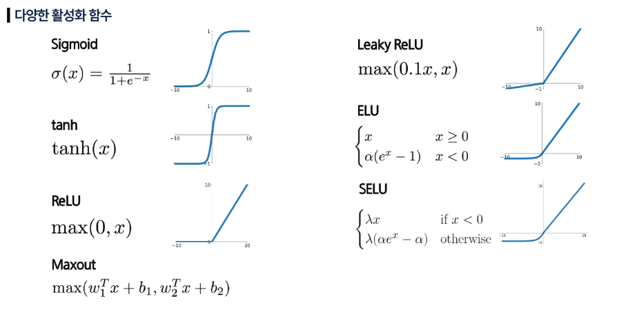

## 활성화 함수

- 입력 신호의 총합을 출력 신호로 변환하는 함수
- **일단 ReLU부터 시도하자!**
    - 성능 경쟁 중이라면, ReLU 의 개선판 (Leaky ReLU, ELU, SELU) 시도
    - sigmoid나 tanh는 전문가 영역
- 신경망에 비선형성을 부여하여, 복잡한 패턴을 학습할 수 있게 한다.
- 활성화 함수의 특성에 따라 학습 안정성과 성능이 크게 좌우된다.
    - Sigmoid, Tanh, ReLU, Leaky ReLU 등

### Sigmoid

- 0과 1 사이의 값으로 출력 값을 제어한다.
- 확률 값처럼 해석 가능
- 분류 문제(특히 이진 분류)에서 ‘이 클래스일 확률’로 활용 가능
    - 합격/불합격, 참/거짓 등

$$
a(x) = \frac {1}{1 + e^{-x}}
$$

- 기울기 소실 문제
    - 입력이 매우 크거나 매우 작으면 출력이 거의 0이나 1에 고정되어 더이상 역전파를 전달할 수 없다.
- sigmoid 출력 범위는 항상 양수이기 때문에 학습 과정에서 편향된 업데이트가 발생한다.
- 계산식에 지수 함수 (exp)가 포함되어, 계산 비용이 크다.

### Tanh

- 출력 범위: [-1, 1]
- 데이터가 중심(0)을 기준으로 대칭이다.
    - 학습 안정성이 높다.

$$
tan(x) = \frac {e^x - e^{-x}} {e^x+e^{-x}}
$$

- 기울기 소실 문제
- 계산식에 지수 함수 (exp)가 포함되어, 계산 비용이 크다.

### ReLU (Rectified Linear Unit)

$$
f(x) = max(0, x)
$$

- 양의 영역에서 포화되지 않아 기울기 소실 문제를 해결
    - 입력이 음수면 0, 양수면 그대로 출력함
- 계산 효율성이 높아 학습 속도가 빠르다.
- 죽은 뉴런 문제 (Dead ReLU)
    - 입력이 계속 음수면 뉴런이 0만 출력하여 영구적으로 ‘죽은 뉴런’이 발생한다.
    - 죽은 뉴런은 가중치 업데이트(학습)를 멈춘다.
- 0을 기준으로 비대칭이다.

### Leaky ReLU

$$
f(x) = max(0.01x, x)
$$

- ReLU의 확장판
- 죽지 않는 뉴런
    - 음수 입력에도 작은 기울기를 부여해 뉴런이 완전히 죽지 않는다.
- 음수 영역의 기울기 값 (0.01) 설정의 임의성
    - 너무 작으면 기울기 소실, 너무 크면 출력 왜곡 가능성
- 0 중심 비대칭
    - 신호가 양수 쪽으로 치우치는 경향 발생

### ELU (Exponential Linear Unit)

$$
f(x) = \begin{cases} x & \text{if } x > 0 \\ \alpha(\exp(x) - 1) & \text{if } x \le 0 \end{cases}
$$

- ReLU의 모든 장점 수용
- 평균 출력이 0 근처에 위치
- 음수 영역에서의 포화 구간 제공하여 기울기 소실, 왜곡 문제를 해결했다.