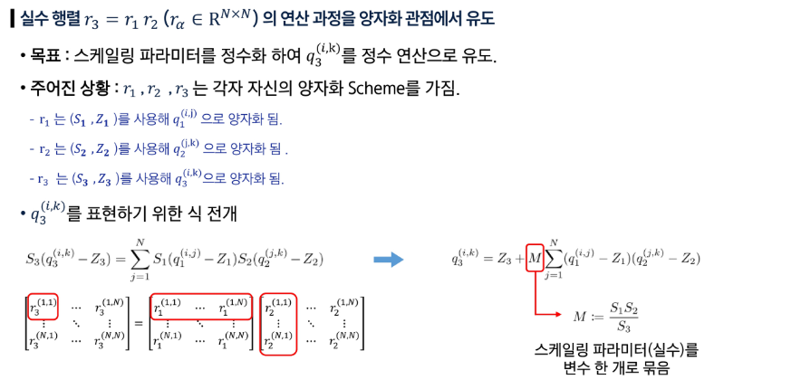

# 고급 AI 시스템: 양자화, TTA, 적응형 센싱

## 모델 경량화: 정수연산 양자화

### 일반적 양자화

### 정수연산 양자화 기법 - 행렬 곱 연산 양자화

- 실수 파트만 모으기 → 비트 쉬프팅

### 정수연산 양자화 기법 - 배치 정규화 계층 폴딩

- BN 폴딩: BN 연산을 바로 앞의 계층 연산에 통합해서 함께 양자화

### 비전 트랜스포머 정수연산 양자화

- Softmax
- GELU
- LayerNorm

## 테스트타임 도메인 적응 (Test-Time Adaption, TTA)

### 분포 이동 (Distribution Shift)

- 학습(Train)데이터와 실제 테스트(test)데이터의 분포가 달라지는 현상
    - 밝은 조명에서 학습한 모델이 어두운 조명의 테스트 환경에서는 성능이 급락하는 경우
- 학습할 때는 깨끗한 데이터로 훈련되었지만, 실제 환경에서는 노이즈(예: 환경, 장비, 시간대 등)로 통계적 특성이 달라지기 때문

### 테스트타임 도메인 적응 (Test-Time Adaption, TTA)

- 모델을 다시 학습하지 않고, 테스트 시점에 들어오는 데이터의 분포를 활용해 모델 일부를 즉시 조정하는 기법
- 평균, 분산과 어파인 파라미터를 테스트 데이터 통계에 맞게 업데이트하여 적응
- AI가 실제 쓰이는 순간, 테스트 데이터의 분포를 파악하여 모델을 유연하게 적응시킴

### CNN 기반 TTA - TENT 기법

- 배치 정규화 계층을 테스트 데이터에 최적화
- 평균 분산 업데이트: 테스트 데이터를 입력할 때마다 평균과 분산을 테스트 데이터 기준으로 계산
- 어파인 파라미터 업데이트: 테스트 데이터의 예측 결과 엔트로피를 손실로 설정
    - 역전파를 통해 스케일, 이동 값을 업데이트하여 예측의 확신도를 높이는 방향으로 적응
- 학습의 재진행 혹은 추가 학습 없이 테스트 데이터 분포에 맞게 모델을 즉시 최적화할 수 있다.

### CNN 기반 TTA - SAR

- 최적화를 더욱 안정적으로!
- 신뢰도 있는 샘플만 선택 (Entropy Filtering): 엔트로피 값이 일정 기준 이하인 ‘확실한 데이터’만 업데이트에 사용
- 엔트로피 평탄화 (loss smoothing): 엔트로피 손실이 급격히 변하지 않도록 평탄화 적용
- TENT보다 학습이 안정적이고 테스트 환경에서도 성능 유지

### 비전언어모델 기반 TTA - TPT (Test-Time Prompt Tuning)

- 일관성있는 예측을 돕자!
- 테스트 이미지를 여러 방식으로 증강(예: 회전, 밝기 변화 등)
- 각 증강본을 모델에 통과시켜 예측을 수행하고, 엔트로피가 가장 낮은 증강 이미지를  6개만 선택
- 평균 엔트로피를 loss로 세팅하고, 이를 최소화하도록 텍스트 프롬프트 업데이트

### 비전언어모델 기반 TTA - PromptAlign

- 학습 데이터 통계까지 활용해 분포 정렬 (distribution alignment)을 수행
- 학습 데이터와 테스트 데이터의 통계적 차이(평균, 분산)를 최소화하도록 설계
- 두 데이터의 인코딩 결과를 계층별(feature layer)로 정렬
- 학습 시 얻은 feature 분포와 테스트 feature 분포를 정렬시키는 방식
- 추가적으로 엔트로피 로스를 함께 사용하여 안정적인 예측 유지
- 텍스트 프롬프트 + 이미지 프롬프트를 모두 업데이트

## 적응적 센싱

### 초거대 AI

- 파라미터 규모가 매우 큰 인공지능 모델
    - 파라미터: AI의 뇌세포 개수. 파라미터가 많을수록 똑똑함
- 스케일링 법칙(Scaling Law): 모델 크기 (Parameters), 학습 데이터 양 (Dataset Size), 그리고 컴퓨팅 자원 (Compute)이 증가함에 따라 AI 모델의 성능이 향상되는 현상
- 분포 이동의 리스크를 줄이기 위해 규모로 보험을 들었다.

### 피지컬 AI

- 실제 물리 환경에서 다양한 센서를 통해 세상을 인지하고, 계획하고, 행동해서 세상에 영향을 주는 AI
- 피지컬 AI에서 분포 이동 문제
    - 환경 변수: 조도, 날씨, 재질 등
    - 로봇의 행동 변수: 시점, 거리, 모션 블러 등

### 적응적 센싱 (Adaptive Sensing)

- 사람의 인지체계와 호환성: 환경에 맞춰서 센서(카메라)를 조절해 좋은 데이터만 받음
    - 잘 안보이면 안경을 써라.

        

- 분포 이동 억제: 센서 제어를 통해 다양한 데이터를 모델이 아는 영역 안으로 넣어줌으로써 분포 이동 억제
    - 센서를 통해 C-OOD 데이터를 빨간 영역 안으로 넣어줌

        

### ImageNet-ES

### Lens

- 센서 제어로 모델이 보기 좋은 이미지를 만듦

### 특징과 함의

- AI 모델을 위한 센서 제어는 사람을 위한 센서 제어와 방향성이 다를 수 있다.
- 최적의 센서 파라미터는 모델에 따라, 환경에 따라, 피사체에 따라 달라진다.
- 적응적 센싱은 작은 모델로도 성능이 향상되며 초거대 모델보다 효율적

## 응용: 도메인 전문 지식 활용

### 도메인 전문지식의 중요성

- 전문 지식들을 데이터/모델 설계에 직접 반영하면 AI가 불필요한 시행착오 없이 효율적으로 학습 가능

### 의료 응용: 수면 의학

- 수면다원검사 자동채점 AI
    - 수면 전문가가 30초 단위로 수동 채점하던 수면다원검사를 비전 트랜스포머 기반 AI로 자동화
    - 시계열 데이터를 이미지로 변환하고, epoch간 맥락을 파악하는 트랜스포머를 적용하여 전문가 수준의 정확도로 수면단계를 진단
- 비접촉식 수면 무호흡증 진단 AI
    - 적외선 영상만으로 수면 무호흡증을 진단하기 위해 무호흡 이벤트 대신 호흡 각성(RA) 감지로 문제를 전환
    - 경량 비디오 모델(MoViNet)을 활용한 온디바이스 AI 파이프라인을 구축하여 엣지 디바이스에서도 30초 이내에 실시간 진단이 가능하도록 설계