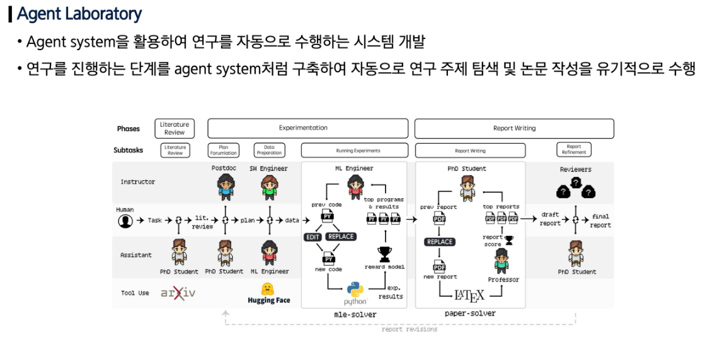

## AGI (Artificial General Intelligence, 범용 인공지능)

- 인간처럼 다양한 지적 작업을 이해하고 학습하며 해결할 수 있는 인공지능
- 현재의 특화된 인공지능(ANI)이 특정 작업에만 능한 것과 달리, 
AGI는 스스로 사고하고 새로운 문제를 해결하는 등 인간 수준의 인지 능력을 목표로 한다.

### 언어 모델 (LLM) + 검색증강생성 (RAG)

- RAG ( Retrieval Augmented Generation; 검색 증강 생성)
- 유연성: 추가 학습 없이 최신 정보 제공
- 개인화: 검색과 언어 모델의 합성으로 개인 맞춤형 답변 가능
- 정확성: Verification을 통한 환각 (Hallucination) 현상 감소

### Tool Augmented LLM (Agent)

- Visual Programming
    - 언어 모델의 추가 학습 없이 주어진 툴을 사용하여 사용자가 텍스트로 요청한 영상 처리를 수행
- Claude Compute Use
    - 텍스트를 기반으로 컴퓨터를 사람처럼 사용할 수 있는 서비스
    - 컴퓨터가 수행하길 바라는 지시사항을 텍스트로 입력하면 자동으로 명령 수행

### Multi-Agent 시스템으로의 확장

