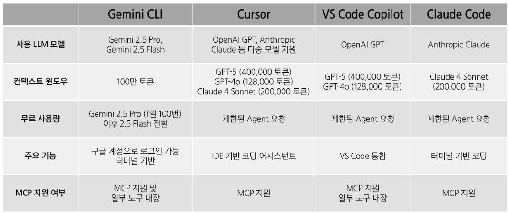

## AI 코딩 어시스턴트의 이해

### 생성형 AI의 작동 원리

- 인터넷 상에서 돌아다니는 방대한 언어 데이터에서 **패턴을 학습**
- **확률에 따라 단어(토큰)를 하나씩 선택**하며 답변을 생성
    
    → 사칙연산을 할 수 없다.
    

### Chat GPT

토큰을 하나씩 선택하며 답변을 생성하는 GPT에 여러 도구(사칙 연산, 웹 검색, 코드 실행)를 연결한 **챗봇 서비스**

- GPT는 AI Model, ChatGPT는 챗봇 서비스를 의미한다.

### AI 코딩 어시스턴트

GPT의 발전 + 여러 도구 (파일 작성 및 수정, 브라우저 조작 등)

⇒ 보조(Assistant)에서 대리인(Agent)으로 발전, 자동화.

> 불과 1년 전(2024년)에는, 에러 메시지를 주면 해결 방법만 알려줌.
> 
> 지금은, 에러 메시지를 주면 AI가 직접 에러를 해결하고, 인간은 검수한다.

- 초기 AI 코딩 어시스턴스 (ChatGPT, Claude, Gemini)
    - 개발자가 직접 코드 작성 (GPT 도움)
    - 에러 발생 시 GPT의 답변을 참고하여 직접 에러 해결
- 최근 AI 코딩 어시스턴스 (CursorAI, VS Code Copilot, Gemini CLI)
    - 대부분의 코드를 AI가 작성
    - 개발자는 AI에게 작업을 지시 (임무 지시) → AI 코드 작성 (임무 수행) → 개발자의 검수
    - 점점 더 많은 영역이 자동화되고 있음
    - 바이브 코딩: 바이브(Vibe, 직관)에 따라서 자연어로 지시하면, AI가 코드를 작성해줌

### AI 코딩 어시스턴트를 통한 개발 생산성 향상

**고객**

- 빠른 MVP(Minimum Viable Product, 최소 기능 제품) 개발 → 미팅할 때 목업으로 사용
- 고객과의 원활한 의사 소통, 빠른 의사 결정

**동료 개발자**

- 개발자-기획자-디자이너 간 원활한 소통과 협업
- 리스크 조기 발견

**시장**

- 빠르게 변하는 기술 환경에서 민첩하게 대응 가능
- 제품-시장 적합성 (Product - Market Fit) 확보 가능성 높아짐

### AI 코딩 어시스턴트 서비스 비교

