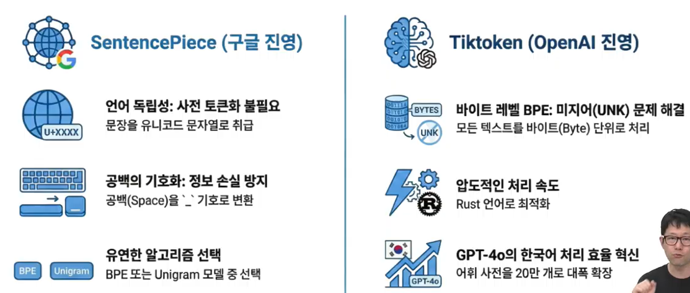
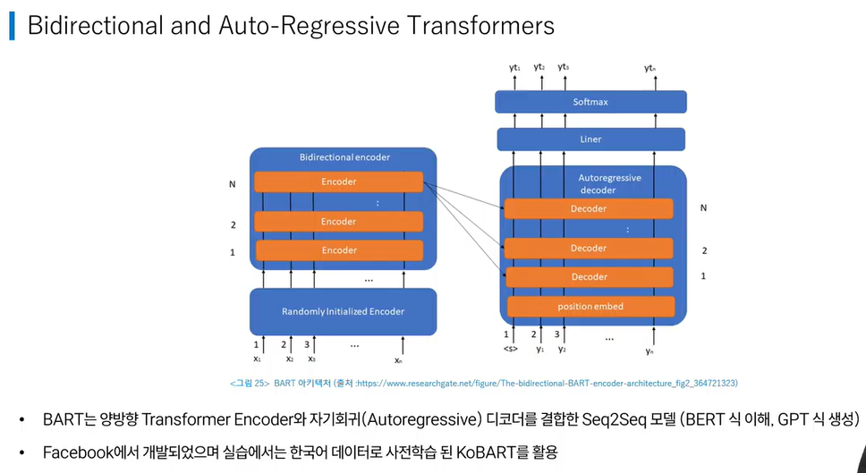

# 도메인 별 AI

## 1. 컴퓨터 비전 (Computer Vision)

- 이미지/영상을 분석하는 AI 기술 분야
- 자율주행, 의료영상 정밀 진단, 지능형 보안 시스템 등
- **전처리 - 학습 - 성능 평가 - 추론 - 후처리**

### 전처리 (Preprocessing)

- 기하학적 변환 (Geometric Transformations)
    - 크기 조정 (Resizing) 및 다운샘플링
    - 비율 유지 패딩 (Letterbox Padding)
    - 이미지 피라미드 (Image Pyramid)
- 색상 보정 및 공간 변환 (Color Correction)
    - 히스토그램 평활화
    - 색상 공간 변환: V (명도) 채널만 조절
- 노이즈 제거 (Denoising)
    - 가우시안 필터 (Gaussian Filter)
    - 중간값 필터 (Median Filter)
- 데이터 증강 (Data Augmentation)
    - 기하학적 증강
    - 광도적 증강 / 커널 기반 증강
    - 고급 증강
        - Mosaic: 4장의 이미지를 하나로 합성
        - Mixup: 두 이미지를 투명도 조절로 중첩
        - CutMix: 이미지 일부를 잘라 다른 이미지로 대체

### 추론 (Inference)

**핵심 지표 :: 정확도 (Accuracy) + 응답 속도 (Latency), 처리량 (Throughput), 효율성 (Efficiency)**

- 이미지 분류 (Image Classification)
    - ResNet, EfficientNet, ViT
- 객체 탐지 (Object Detection)
    - **YOLO**
- 이미지 분할 (Image Segmentation)
    - 이미지 분류 + 위치 바운딩 박스
- 얼굴 인식 (Face Recognition)
- 자세 추정 (Pose Estimation)
- 광학 문자 인식 (OCR)

### 후처리 (Post-processing)

- 비최대 억제 (NMS, Non-Maximum Suppression): 신뢰도 필터링, 정렬 및 선정, IoU 기반 억제
- 임계값 필터링 (Thresholding)
- 좌표 변환 및 스케일링
- 시각화 (Visualization)
- OCR 및 자연어 처리의 후처리 전략

## 2. 자연어 처리 (Natural Language)

### 감정 분석 (Sentiment Analysis)

- 텍스트에서 감정(긍/부)을 분석하는 자연어 처리 기술
- **BERT** (Google, 2018)
- GPT (OpenAI, 2017)
- KoBERT (SKT): 한국어 BERT 모델
- sentiment-analysis-fine-tuned-model: KcBERT 파인튜닝

### 텍스트 요약 (Text Summarization)

- **BART** (Meta)
- KoBART (SKT)

- 전처리
    - 텍스트 정제, 시퀀스 길이 정규화, 토큰화 및 인코딩
- fine-tuning
    - 전이학습, LoRA 미세 조정, Seq2Seq 학습
- 후처리
    - 텍스트 정제, 길이 한계 처리, 빔서치

### 문서 분류 (Document Classification)

- KorNLI: 두 문장 관계가 함의, 모순, 중립인지 판별
    - RoBERTa (KLUE)

### 음성 인식 (STT: Speech To Text)

- Whisper (OpenAI)

### 음성 합성 (TTS: Text To Speech)

- Meta-AI MMS (Massively Multilingual Speech)
- Voice Clone

## 3. 추천

### 협업 필터링 (Collaborative Filtering)

- ‘나와 비슷한 사람’을 찾는 방식
    - 이 상품을 함께 구매한 상품
- 메모리 기반: 유사한 사용자/아이템을 직접 탐색
    - KNN(K Nearest Neighbors), User-CF, Item-CF
- 행렬 분해: 사용자-아이템 행렬을 잠재 벡터로 분해
    - SVD(Singular Value Decomposition), SVD++, MF, ALS, PMF
- 하이브리드: 잠재 벡터 모델에 컨텍스트 정보 결합
- 그래프 기반: 사용자-아이템 관계를 그래프로 모델링
- 신경망 기반: 신경망을 이용해 비선형 상호작용 학습
- 시퀀스 기반: 사용자의 행동 순서를 모델링
- 암묵적 피드백 전용: 랭킹 최적화 또는 행동 로그 가중치 부여

### 콘텐츠 기반 필터링 (Content-Based Filtering)

- ‘상품 자체의 특징’을 분석하는 방식
    - 이 영화와 비슷한 장르의 영화
- 콜드 스타트 해결