## CNN (Convolutional Neural Network)

### MLP의 한계

- MLP는 각 픽셀을 개별적인 특성으로 다루기 때문에, 이미지를 1차원 벡터로 펼쳐서 입력해야 한다.
- 이 과정에서 이미지의 중요한 공간적인 정보, 즉 픽셀 간의 상하좌우 관계가 모두 사라질 수 있다.

### FCN (Fully-Connected Layer, 완전 연결층)

- 입력을 받아서 출력으로 변환하는 신경망의 기본 모듈

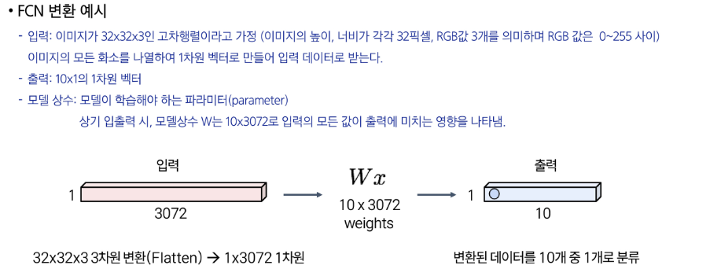

### 합성곱 레이어 (Convolution Layer)

- 입력 이미지를 필터와 연산하여 특징 맵(Feature Map)을 뽑아내는 모듈
- 1차원 구조로 변환하는 FCN과 달리, 3차원 구조를 그대로 보존하면서 연산한다.
- Convolution(컨볼루션): 필터를 이미지 상에서 **이동**시키면서 **내적**을 반복 수행 후, 내적으로 구한 모든 값을 출력으로 제공한다.

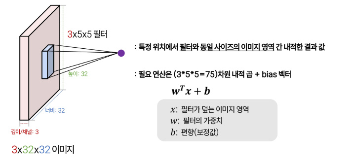

- **반드시 필터의 채널과 입력의 채널이 동일해야 한다.**
- 활성화 맵 (Activation Map): 필터의 이동 경로를 따라 모든 연산 값을 모아 출력한 값

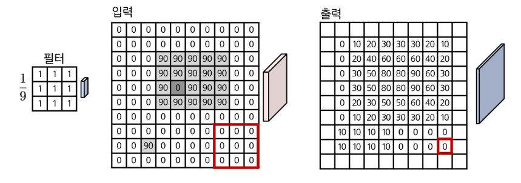

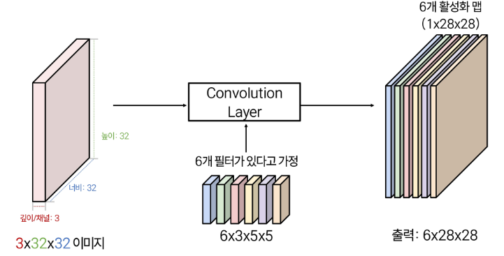

- 입력 대비 출력의 공간 해상도가 줄어든다.
    - 출력 해상도 = 입력 해상도 - 필터 해상도 + 1
- 입출력 해상도를 유지하고 싶다면 ‘패딩’ 활용
    - 출력값 중 정의되지 않은 경우, 0 또는 가장 가까운 출력값으로 대체한다.

### Convolution Layer

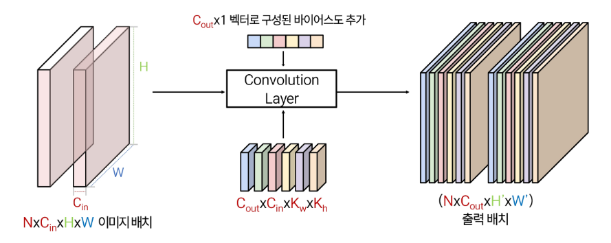

**입력 (Input)**

- `N` (Batch Size): 한 번에 처리하는 이미지의 개수
    - 여러 장의 이미지를 동시에 처리하여 학습 효율을 높인다.
- `C_in` (Input Channels): 입력 이미지의 채널 수
    - 흑백 이미지는 채널이 1개
    - 컬러 이미지(RGB)는 Red, Green, Blue 3개의 채널
- `H` (Height): 입력 이미지의 세로 길이 (높이), 픽셀 단위
- `W` (Width): 입력 이미지의 가로 길이 (너비), 픽셀 단위

**필터 (Filter / Kernel) & 편향 (Bias)**

- `C_out` (Output Channels): 출력 피처 맵(Feature Map)의 채널 수
    - 컨볼루션 레이어에서 사용하는 필터(filter)의 개수와 같다.
    - 각 필터는 이미지에서 서로 다른 특징(예: 윤곽선, 질감 등)을 추출하는 역할을 한다.
- `K_h` (Kernel Height): 필터의 세로 길이
- `K_w` (Kernel Width): 필터의 가로 길이

**출력 (Output)**

- `H'` (Output Height): 컨볼루션 연산 후 출력되는 피처 맵의 세로 길이
- `W'` (Output Width): 컨볼루션 연산 후 출력되는 피처 맵의 가로 길이

### CNN 구조의 장점

- 지역적인 특징 학습에 특화: 작은 필터로 학습하여 패턴/경계선 특징 포착에 용이하다.
- 파라미터 효율성 우수: 지역적 특징 추출 시 이미지 블록별 가중치를 공유하여 연산량을 절감한다.
- 위치 변화와 노이즈에 견고: 풀링/스트라이드 합성곱이 세부 차이는 줄이고 이미지 전체 의미에 집중하게 한다.
- 이미지 분류/탐지 등 이미지 기반의 과업에서 표준 모델로 활약


### CNN의 한계

- 순차적(sequential) 데이터의 순서 정보(텍스트, 음성의 시간 흐름 등)를 반영하기 어렵다.
    - 같은 단어여도 순서가 의미를 바꾼다면?
        - “약을 먹고 잠을 자고” vs “잠을 자고 약을 먹고”
    - 단어 조합은 같지만 순서가 바뀐다면?
        - “I am a boy not a girl” vs “I am a girl not a boy”
- CNN은 국소적(로컬) 특징 추출에 강하지만 이미지나 문장에서 멀리 떨어진 요소 간의 관계를 잘 학습하지 못한다.
    - 이미지에 멀리 있지만 반복되는 패턴이 있는 경우
- 이미지 전체의 정보를 압축(예: 라벨)에 효과적이지만 위치 정보는 손실된다. (Pooling/Stride 효과)
    - 픽셀 단위 복원(예: 세그멘테이션)이나 영상 생성(생성, 편집, 개선 등) 문제를 다루기 위한 새로운 구조가 필요하다.

## CNN 모델 구조
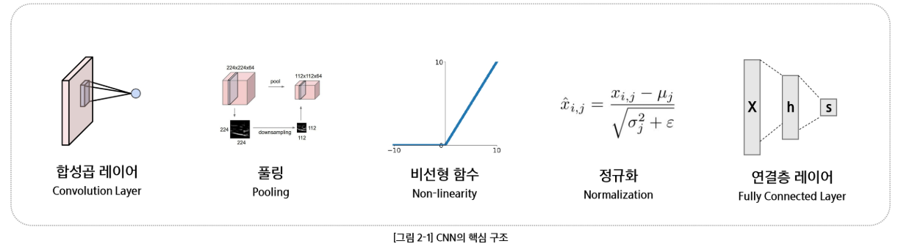

### 중첩

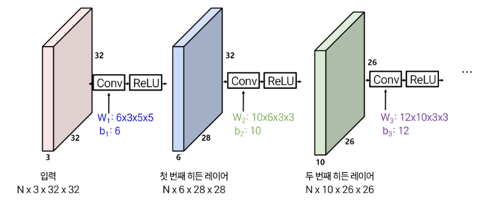

- 모델 상수 (파라미터)를 증가시키면?
- 선형 블록의 중첩은 결국 하나의 선형 블록으로 치환할 수 있다.
- 비선형 블록 (Conv[Linear] + ReLU[비선형 변환])

### 필터 시각화

- 학습된 필터 시각화를 통해 각 모델(구조)가 학습한 정보를 이해할 수 있다.

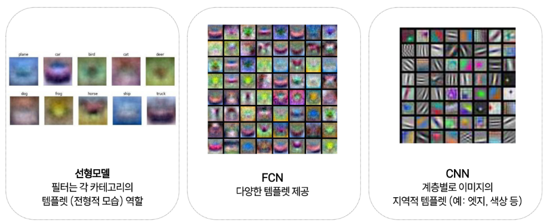

- CNN: 이미지의 로컬 특징을 잘 뽑아낸다.
    - Gabor 필터

### 수용영역 (Receptive Field)

- **수용영역**: CNN이 이미지를 처리하면서 한 번에 볼 수 있는 영역의 크기
    - 네트워크의 시야
- CNN 레이어는 지역 정보(local, 이미지의 작은 부분)를 추출하는 데 유리하다.
- 이미지를 활용하는 다양한 작업에서 이미지 전체 (예: 맥락) 의미 파악이 필요하다.
- 일반적으로 **네트워크가 깊어질수록 수용영역도 넓어진다.**
    - 폭 넓은 맥락을 이해할 수 있다.
- 고해상도 이미지 처리 시, 많은 레이어를 통과해야 한다.
    - 연산, 비용, 학습 가능성을 고려할 때 비실용적이다.
    - 입력 사이즈를 줄여 모델에 입력해 해결한다.

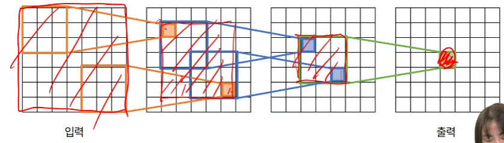

### 풀링

- 효율적 연산: CNN 레이어의 출력을 줄여 연산 효율성을 확보한다.
    - 입력 크기가 줄면 CNN의 연산량이 크게 줄어든다.
    - 출력 해상도는 낮아진다. (정보 손실)
- 위치 변화 강건성: 입력 내 객체 위치가 다소 변해도 동일한 출력을 제공한다.
    - 사실상 저해상도 정보에 근거하여 작업을 수행하므로 몇 화소 이동은 무시된다.

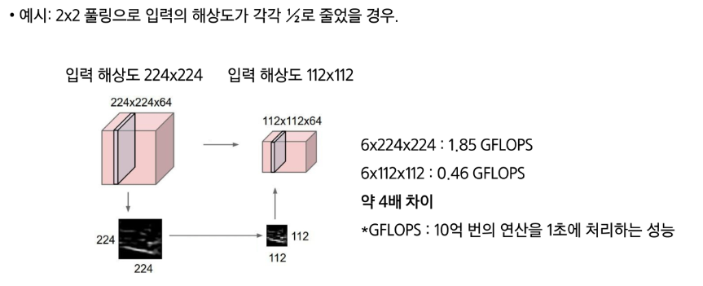

- **맥스풀링**: 정해진 커널 사이즈(예: 2x2)로 이미지를 나누어 각 영역 내 **가장 큰 값**을 선택하는 연산
    - 가장 두드러진 특징(feature)을 추출하여 유지한다.
        - 컨볼루션 레이어를 통과한 피처 맵(feature map)의 값은 해당 위치에서 특정 특징(예: 윤곽선, 질감, 특정 모양 등)이 얼마나 강하게 나타나는지를 의미한다.
    - 위치 변화에 덜 민감하다.
        - 객체가 이미지 내에서 약간 움직이거나 형태가 조금 변형되더라도, 맥스풀링은 동일한 특징을 추출할 가능성이 높다.

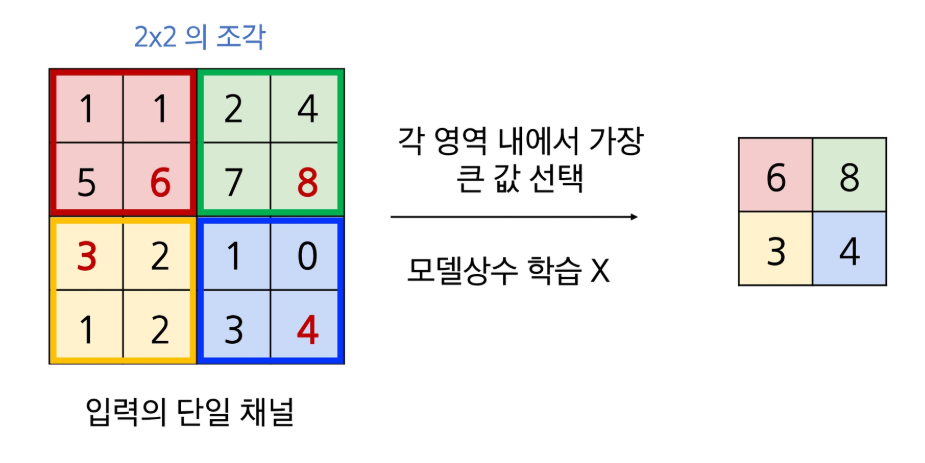

### 스트라이드 합성곱

- 필터를 스트라이드 값만큼 (S칸) 이동한 후 출력값을 계산한다.
    - 일반 합성곱: 필터를 1칸씩 이동하면서 연산을 수행한다. (S = 1)
- 해상도 저하로 인한 정보 손실이 적다.
    - 풀링의 한계를 개선했다.
- **풀링 + 합성곱을 하나의 레이어로** 대체한다.
- 고도화된 CNN에서는 스트라이드 합성곱을 풀링 대신 활용되는 경향이 있다.

## 실습

### 1. 데이터 준비

- `torchvision`에서 CIFAR-10 이미지 데이터셋을 불러옴
    - PyTorch에서 이미지 관련 작업을 편리하게 해주는 라이브러리
    - CIFAR-10: 이미지 분류 모델을 학습시키는 데 널리 사용되는 대표적인 데이터셋
- 이미지 전처리 (Transform)
    - `transforms.ToTensor()`: 이미지 파일을 텐서 형태로 변환, 픽셀 값(0~255)을 0~1 범위로 스케일링
    - `transforms.Normalize()`: 정규화
- `DataLoader`: 전체 데이터셋을 미니배치 단위로 묶어줌
    - `shuffle=True`: 데이터 순서를 무작위로 섞어줌

```python
# 딥러닝 프레임워크인 PyTorch와 이미지 처리를 위한 torchvision 라이브러리를 임포트합니다.
import torch
import torchvision
# torchvision 내의 transforms는 이미지 전처리(augmentation, normalization 등) 기능을 제공합니다.
import torchvision.transforms as transforms

# 1. 이미지 전처리 규칙을 정의합니다. transforms.Compose를 사용해 여러 단계를 순차적으로 실행합니다.
transform = transforms.Compose(
    [# 2. PIL Image나 NumPy 배열 형태의 이미지를 PyTorch가 다룰 수 있는 Tensor로 변환합니다.
     #    이 과정에서 픽셀 값의 범위를 [0, 255]에서 [0.0, 1.0]으로 자동으로 조정(스케일링)합니다.
     transforms.ToTensor(),

     # 3. 텐서의 값을 정규화(Normalize)합니다.
     #    (R, G, B) 각 채널에 대해 평균(0.5)을 빼고 표준편차(0.5)로 나누어, 픽셀 값의 범위를 [-1.0, 1.0]으로 조정합니다.
     #    이는 모델의 학습을 더 안정적으로 만들어줍니다.
     transforms.Normalize((0.5, 0.5, 0.5), (0.5, 0.5, 0.5))])

# CIFAR-10 학습용 데이터셋을 다운로드하고, 위에서 정의한 전처리(transform)를 적용합니다.
# root: 데이터가 저장될 경로
# train=True: 학습용 데이터셋임을 명시
# download=True: 해당 경로에 데이터가 없으면 자동으로 다운로드
trainset = torchvision.datasets.CIFAR10(root='./data', train=True,
                                        download=True, transform=transform)

# DataLoader는 데이터셋을 모델에 효율적으로 공급하는 역할을 합니다.
# trainset: 사용할 데이터셋
# batch_size=4: 한 번에 4개의 이미지를 묶어서 모델에 전달
# shuffle=True: 각 에폭(epoch)마다 데이터의 순서를 무작위로 섞어 모델이 데이터 순서에 과적합되는 것을 방지
# num_workers=2: 데이터 로딩에 사용할 CPU 프로세서의 수
trainloader = torch.utils.data.DataLoader(trainset, batch_size=4,
                                          shuffle=True, num_workers=2)

# CIFAR-10 테스트용 데이터셋을 동일한 방식으로 준비합니다.
testset = torchvision.datasets.CIFAR10(root='./data', train=False,
                                       download=True, transform=transform)
# 테스트 시에는 데이터 순서를 섞을 필요가 없으므로 shuffle=False로 설정합니다.
testloader = torch.utils.data.DataLoader(testset, batch_size=4,
                                         shuffle=False, num_workers=2)

# 분류할 10개의 클래스 이름을 튜플로 정의합니다.
classes = ('plane', 'car', 'bird', 'cat',
           'deer', 'dog', 'frog', 'horse', 'ship', 'truck')
```

### 2. 모델 설계

- 합성곱 (Convolution): 이미지의 특징을 추출(Feature Extraction)
    - 입력 이미지
    - 필터 (Filter), 커널 (Kernal)
    - 특징 맵 (Feature Map)
    - 필터가 이미지 위를 이동하며 겹치는 영역의 픽셀 값과 필터의 가중치를 곱하여 더함
- `nn.Conv2d(in_channels=3, out_channels=6, kernal_size=5)`
    - `in_channels=3`: 입력 이미지의 채널 수 (RGB)
    - `out_channels=6`: 사용할 필터의 개수, 즉 생성될 특징 맵의 개수
    - `kernal_size=5`: 필터의 크기 (5x5)
- 풀링(Pooling): 합성곱 연산을 통해 얻은 특징 맵의 크기를 줄이는 (downsampling) 과정
    - 과적합 방지: 중요한 특징만 남기고 사소한 변화는 무시한다.
        - 모델이 이미지의 미세한 노이즈나 위치 변화에 과도하게 민감해지는 것을 방지
    - Max Pooling: 각 구역에서 가장 큰 값 하나만 남기고 나머지는 버림
- `nn.MaxPool2d(kernal_size=2, stride=2)`
    - `kernal_size=2`: 2x2 크기의 윈도우
    - `stride=2`: 윈도우를 2칸씩 이동시킴

### 계층적 특징 추출

- 합성곱 층을 여러 개 쌓아 올림으로써 더욱 복잡하고 추상적인 특징을 학습한다.
- 낮은 계층 (초반 레이어): 이미지의 가장 기초적인 특징(선, 모서리, 색상 등)
- 중간 계층: 낮은 계층에서 추출된 특징들을 조합하여 더 복잡한 형태를 학습
- 높은 계층 (후반 레이어): 중간 계층의 특징들을 다시 조합하여 추상적이고 고수준의 특징을 인식
    - 사람의 얼굴, 자동차의 형태 등

### 분류기 (평탄화 & 완전 연결 레이어)

- 추출된 모든 특징들을 종합하여 이미지가 어떤 클래스에 속할지 최종적으로 분류(Classification)하는 역할
- 합성곱과 풀링을 거쳐 압축된 특징 맵은 1차원 벡터로 평탄화(flatten)
- 합성곱층 (Convolutional Layer) → 활성화 함수 적용 → 풀링 층 (Pooling Layer)이 반복된 후에 완전히 상호 연결된 결합 은닉층이 추가된 형태가 되며, 최종적으로 출력층이 배치된다.

### 3. 손실 함수 & 옵티마이저 정의

- 손실 함수 `nn.CrossEntropyLoss`
- 옵티마이저 `optim.SGD(net.parameters(), lr=0.001, momentum=0.9)`
    - 경사 하강법(SGD)을 사용
    - `net.parameters()`: 모델의 모든 학습 가능한 파라미터(가중치, 편향)를 최적화 대상으로 지정
    - `lr=0.001`: 학습률(learning rate)
    - `momentum=0.9`: 이전 업데이트의 방향을 일정 비율 유지하여, 더 빠르고 안정적인 수렴을 돕는 기법

### 4. 모델 학습

```python
    # trainloader에서 미니배치 단위로 데이터를 가져옵니다. i는 배치의 인덱스입니다.
    for i, data in enumerate(trainloader, 0):
        # data는 [입력 이미지 텐서, 정답 레이블 텐서]로 구성된 리스트입니다.
        inputs, labels = data

        # 1. 기울기 초기화: PyTorch는 기울기를 누적하므로, 새로운 배치를 학습하기 전에 항상 0으로 초기화해야 합니다.
        optimizer.zero_grad()

        # 2. 순전파(Forward Pass): 모델에 입력을 넣어 예측값을 계산합니다.
        outputs = net(inputs)
        # 3. 손실 계산: 예측값과 실제 정답 레이블 간의 오차(손실)를 계산합니다.
        loss = criterion(outputs, labels)
        # 4. 역전파(Backward Pass): 손실을 바탕으로 각 파라미터에 대한 기울기를 계산합니다.
        loss.backward()
        # 5. 가중치 업데이트: 계산된 기울기를 이용해 옵티마이저가 모델의 가중치를 업데이트합니다.
        optimizer.step()
```

### 5. 모델 평가

- 테스트 데이터(처음 보는 데이터)로 성능 검증
- 정확도 계산
- `with torch.no_grad()`: 블록 내에서는 기울기를 계산하지 않아, 불필요한 연산을 줄이고 메모리를 절약

```python
# 전체 테스트 데이터셋에 대한 정확도를 계산합니다.
correct = 0
total = 0
# with torch.no_grad() 블록 내에서는 기울기를 계산하지 않아, 불필요한 연산을 줄이고 메모리를 절약합니다.
# 모델 평가 시에는 반드시 사용해야 합니다.
with torch.no_grad():
    for data in testloader:
        images, labels = data
        # 신경망에 이미지를 통과시켜 출력을 계산합니다.
        outputs = net(images)
        # 가장 높은 점수를 가진 클래스를 예측값으로 선택합니다.
        _, predicted = torch.max(outputs.data, 1)
        # 전체 레이블 수(배치 크기)를 누적합니다.
        total += labels.size(0)
        # 예측이 맞은 개수를 누적합니다. (predicted == labels)는 boolean 텐서를 반환합니다.
        correct += (predicted == labels).sum().item()

print(f'Accuracy of the network on the 10000 test images: {100 * correct // total} %')
```