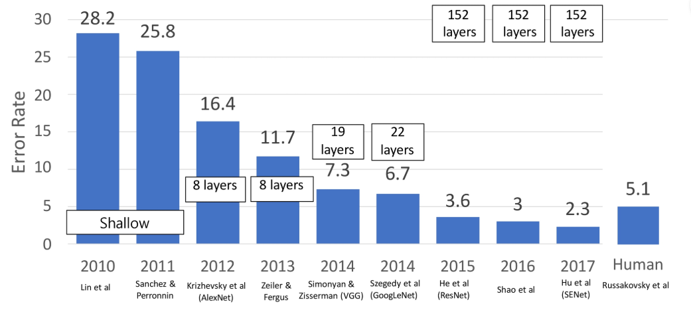
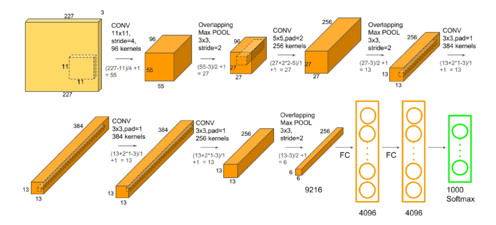
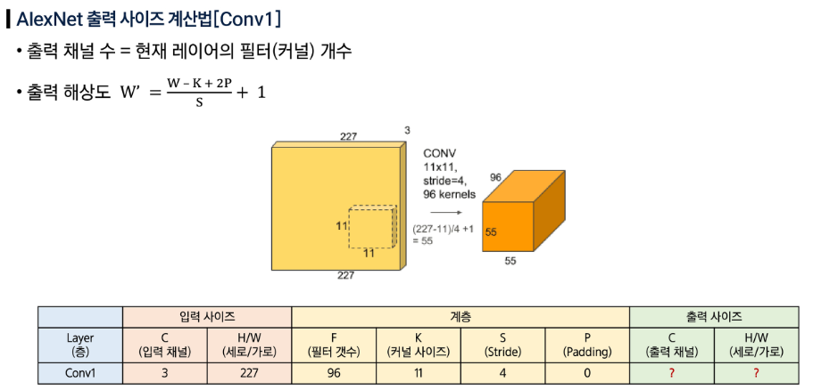
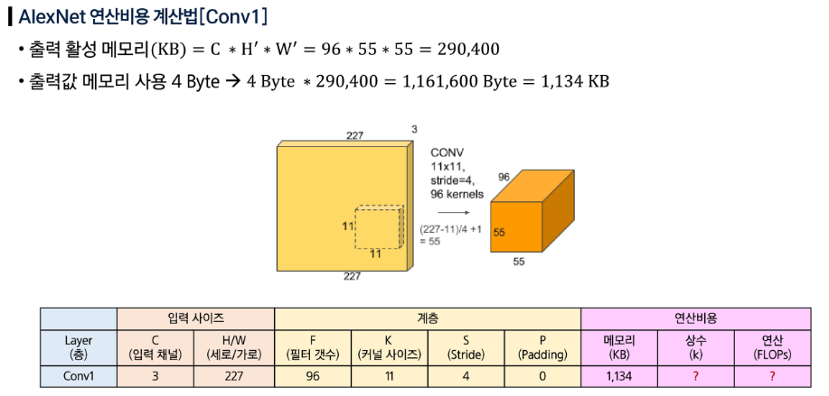
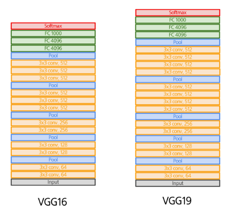
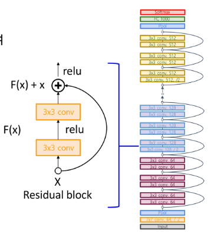
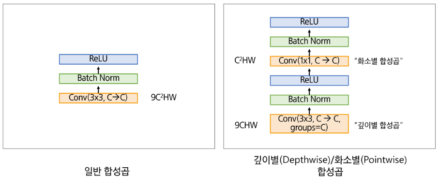

## CNN 기반 모델 변천사

### AlexNet

- 5개의 합성곱 계층과 3개의 완전연결 계층(맥스 풀링, 3개 연결층 레이어, ReLU 비선형 활성화)으로 구성된 8-layer CNN 모델
- 입력: 이미지 / 3 x 227 x 227 해상도
- 출력: 레이블 / 1 x 1024 벡터
- 학습 시 정답은 원-핫 벡터
- 모델 예측값은 0~1 사이의 확률 값 (ImageNet 기준, 각 클래스에 해당할 확률)

- 출력 사이즈 계산법

    $$
    W' = \frac {W-K+2P}{S} + 1
    $$

- 연산 비용 계산법

### VGGNet

- 5개 합성곱 블록 + 맥스 풀링 구조
- 작고 단순한 필터를 깊게 쌓아 성능을 높였다.
    - ‘3x3 합성곱 - 스트라이드 1 - 패딩 1’을 반복해서 적용한다.
    - 맥스풀링(2x2)으로 크기를 줄인다.
    - 풀링 후, 채널 크기 2배를 적용한다.
- 해상도를 줄일 때마다 채널을 늘려 레이어별 연산량 차이를 줄였다.
    - 3x3 합성곱 두 개를 연달아 적용하면 5x5 합성곱과 동일한 리셉티브 필드를 확보할 수 있는 동시에, 연산량을 크게 줄일 수 있다.

- 단순 설계로 모델 해석에 이상적이다.
- 특징 추출기, 전이학습에 강력한 베이스라인
- 파라미터가 많고 연산량 요구가 매우 크다.
    - 메모리는 AlexNet의 약 25배
    - 파라미터는 AlexNet의 약 2.3배
    - 연산량은 AlexNet의 약 19.4배

### ResNet

- 합성곱 블록 + 잔차 (Residual) 블록
- Inception 모델에서 차원 축소로 활용된 1x1 합성곱을 적용하여 연산 효율을 개선했다.
- 작은 모델 (10+레이어)의 성능은 최소한 누릴 수 있도록 작은 레이어의 추정값(입력값)을 그대로 후속 레이어에 제공하여 최소한 작은 레이어 수준의 성능은 보장한다.

- 잔차 블록 (Residual Block): 블록 입력을 그대로 출력에 더해주는 지름길 연결
    - 변환경로 F(X): Conv (3x3) → ReLU → Conv (3x3) → ReLU → 출력 F(X)
    - Shorcut 경로 (Identity mapping, 잔차 연결): 입력 X를 그대로 전달한다.
    - Output = F(X) + X
- 보틀넥 잔차 블록 (Bottleneck Residual Block)
    - 채널 크기를 늘렸다가 다시 줄임
    - Conv (1x1) → Conv (3x3) → Conv (1x1)
    - 연산 효율이 좋다.

### MobileNet

- 모바일/임베디드 환경에서 구동 가능
- 공간과 채널을 두 단계로 분리하여 처리했다.
    - 깊이별 합성곱: 각 채널별 독립적 3x3 합성곱 수행
    - 화소별 합성곱: 1x1 합성곱을 채널 방향으로 적용
- 연산량 기존 대비 9배 가량 절감, 모델 상수 대폭 감소

