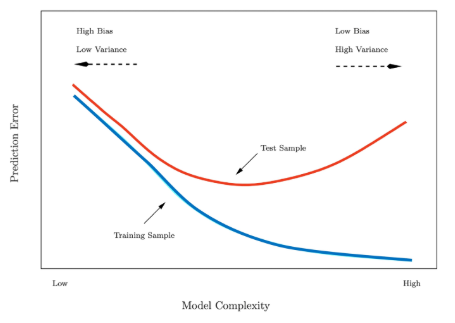
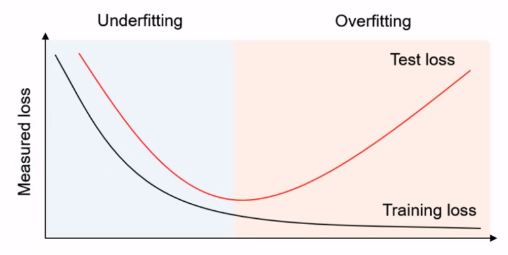
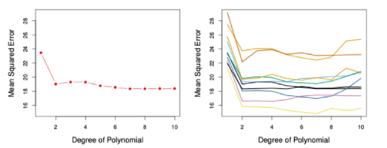
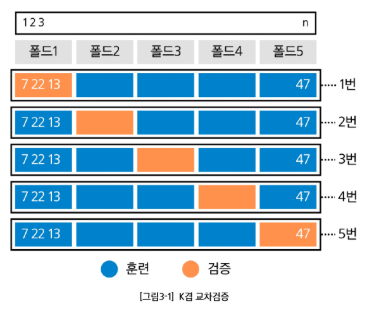
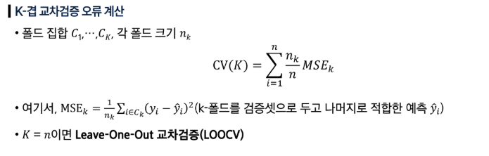
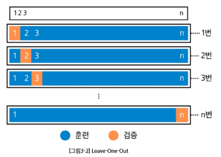
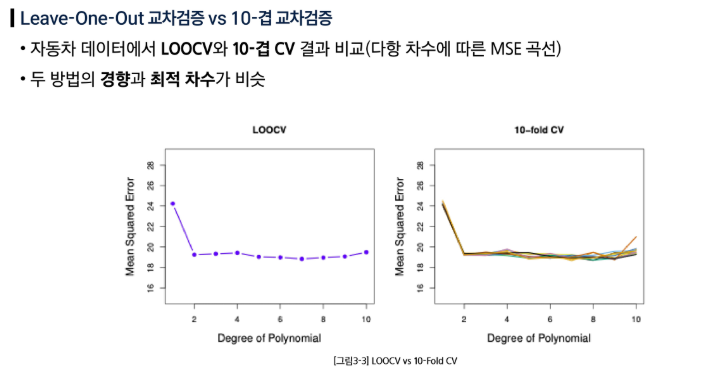
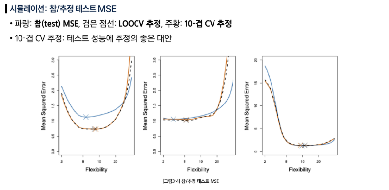

## 테스트 성능 평가

### 훈련 오류 vs 테스트 오류



- 훈련(Train) 오류: 모델을 학습시킨 같은 데이터에 다시 적용해 계산한 오류
    - 테스트 오류를 과소평가하는 경우가 많음
- 테스트(Test) 오류: 학습에 쓰지 않은 새 관측치에 대해 모델을 적용했을 때의 평균 예측 오류
- 목적: 테스트 오류의 U자형의 바닥이 되도록하는 적절한 모델 찾기

### 재표본화(resampling)

- 데이터를 나눠 여러 번 ‘훈련 → 평가’를 반복해 테스트 오류를 가늠
- 방법: 검증셋 (hold-out), K겹 교차검증
- 별도의 테스트 데이터 없이 데이터를 더 효율적으로 사용하여 일반화 오차를 추정할 수 있다.

### 데이터 분할

- 주어진 데이터를 훈련 데이터와 테스트 데이터로 분리
- 훈련 데이터: 모델을 학습시키는 용도
- 테스트 데이터: 모델이 얼마나 새로운 데이터를 잘 예측하는지 일반화 성능을 최종 평가하는 용도



- `train_test_split()` : 주어진 데이터를 훈련/테스트 데이터로 분리하는 함수
- `test_size=0.3`: 전체 데이터 중 30%를 테스트용, 나머지 70%를 훈련용으로 나눈다
- `random_state=42`: 이 숫자를 고정해놓으면, 코드를 다시 시작해도 동일한 랜덤 값이 배정 된다 (아무 값이나 가능)
- `startify=y`: 원본 데이터의 정답 비율을 분할된 데이터셋에 동일한 비율로 나눠주는 옵션
    - 분류 문제에서는 필수
```python
# 데이터 불러오기 및 전처리
from sklearn.datasets import load_wine
# 훈련용 데이터와 테스트 데이터를 분리
from sklearn.model_selection import train_test_split
# 선형 회귀 모델 훈련
from sklearn.linear_model import LinearRegression

# 데이터 불러오기
# as_frame=True: pandas DataFrame 형태로 반환
# return_X_y=True: feature와 target을 분리하여 반환
df, y = load_wine(return_X_y=True, as_frame=True)

# 데이터 분할
# test_size: 테스트 데이터의 비율 (0.2 = 20%)
# random_state: 랜덤 시드 설정 (재현성을 위해 고정된 값 사용
# stratify: 데이터셋에 있는 클래스(여기서는 y의 값)의 비율을 train과 test 데이터셋에 동일하게 맞춰주는 기능
X_train, X_test, y_train, y_test = train_test_split(
    df, y, test_size=0.3, random_state=42, stratify=y
)
```

## 검증셋(Validation Set) 접근

### 검증셋 (hold-out) 방법

- 가용 샘플들을 무작위로 훈련셋과 검증셋으로 분할
- 훈련셋으로 모델 적합, 검증셋으로 예측 후 검증 오류를 계산
- 검증 오류: 보통 정량 반응은 MSE, 범주 반응은 오분류율 또는 F1-score을 측정한다.

### 검증셋 절차

- 데이터 순서를 셔플링 후 두 부분으로 분할 (훈련셋과 검증셋)
- 학습은 훈련셋에서, 성능평가는 검증셋에서 수행

### 검증셋 접근의 한계

- 어떤 표본이 훈련/검증에 들어가느냐에 따라 검증 기반 테스트 오류 추정치가 매우 가변적
- 검증 접근에서는 훈련셋(=전체의 일부)만으로 모델을 적합하므로, 전체 데이터로 학습했을 때보다 성능이 낮게 추정, 즉 테스트 오류가 과대 추정될 수 있다.
    - 왜 전체 데이터로 학습한 모델의 테스트 오류를 과대 추정하는 경향이 있을까?
    학습에 데이터를 부분만 사용하기 때문



- (좌) 단 한 번 분할 시의 MSE 곡선
- (우) 여러 번 (셔플 후) 분할 시의 MSE 곡선

## K-겹 교차검증 (K-fold Cross-Validation)

### K겹 교차검증

- 테스트 오류 추정의 표준적 접근
- 추정치는 모델 선택과 최종 모델의 테스트 오류 규모 파악에 활용



### K겹 교차검증 절차

- 데이터 셔플링 후, 총 n개의 데이터를 겹치지 않는 K개 폴드로 무작위 분할한다.
- 폴드 `k (= 1, …, K)` 를 검증셋으로, 나머지 K-1개를 훈련셋으로 사용한다.
- `k=1, …, K` 에 대해 반복 후 평균 오류(MSE)로 테스트 오류를 추정한다.

### K겹 교차검증 오류 계산



- **Leave-One-Out 교차검증** (LOOCV)
    - K == n, 검증셋의 크기는 1
    - 훈련셋(파랑):  관측치 하나만 제외한 나머지 전부
    - 검증셋(주황): 제외한 1개의 관측치
    - 이 과정을 n번 반복해 나온 n개의 MSE 평균으로 테스트 오류를 추정한다.



### Leave-One-Out 교차검증 vs 10-겹 교차검증



### 참/추정 테스트 MSE


