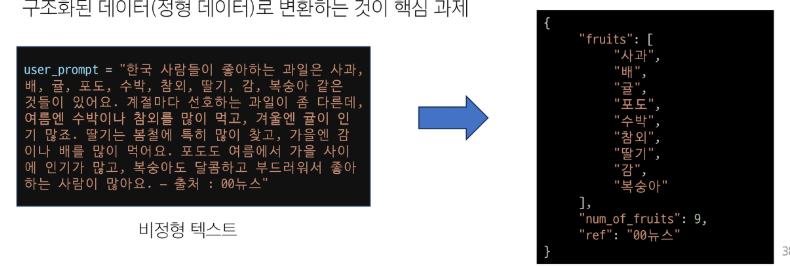

## OpenAI API를 활용한 비정형 데이터 구조화

### 비정형 텍스트와 데이터 파싱의 필요성

- ‘읽는’ 데이터에서 ‘쓰는’ 데이터로
- 비정형 텍스트 (Unstructured Text) 데이터
    - 사람이 읽기에는 좋지만 프로그램이 직접 활용하기에는 모호함
    - 예: 뉴스 기사, 상품 설명, 사용자 리뷰 등



### 기본 데이터 처리: CSV 및 XML 형식으로 추출하기

- 파싱 (Parsing): 특정 형식으로 구성된 텍스트 파일에서 원하는 데이터를 추출하여 의미있는 구조로 변환하는 과정
- CSV (Comma-Separated Values): 쉼표를 사용해 데이터를 표 형태로 구분하여 저장하는 간단한 텍스트 파일 형식
- XML (eXtensible Markup Language): 태그(<tag>)를 사용하여 데이터에 의미를 부여하고 계층적인 구조로 표현하는 마크업 언어

1. **기본 API 호출**

```python
from openai import OpenAI
client = OpenAI(api_key=OPENAI_API_KEY)

# 기본 API 호출 (주석 버전)
# OpenAI의 Responses API를 호출하여 응답을 생성합니다.
response = client.responses.create(
    # --- 사용할 AI 모델 지정 ---
    model="gpt-5-nano",
    # --- 모델에 전달할 입력 데이터 ---
    # 'input'은 시스템(system)과 사용자(user)의 역할을 담는 리스트 형태입니다.
    # 이를 통해 모델에게 대화의 맥락과 역할을 부여할 수 있습니다.
    input=[
        # 'system' 역할은 모델에게 기본적인 지침이나 역할을 부여합니다.
        {
            "role": "system",
            "content": [
                {
                    "type": "input_text",
                    # 모델이 수행할 작업에 대한 전반적인 지시사항을 전달합니다.
                    # 예: "너는 비정형 데이터를 CSV 형식으로 변환하는 역할을 맡았어."
                    "text": "You will be provided with unstructured data, and your task is to parse it into CSV format.",
                }
            ],
        },
        # 'user' 역할은 모델이 처리해야 할 실제 데이터나 질문을 전달합니다.
        {
            "role": "user",
            "content": [
                {
                    "type": "input_text",
                    # 모델이 CSV로 변환해야 할 원본 텍스트 데이터입니다.
                    "text": "There are many fruits that were found on the recently discovered planet Goocrux. There are neoskizzles that grow there, which are purple and taste like candy. There are also loheckles, which are a grayish blue fruit and are very tart, a little bit like a lemon. Pounits are a bright green color and are more savory than sweet. There are also plenty of loopnovas which are a neon pink flavor and taste like cotton candy. Finally, there are fruits called glowls, which have a very sour and bitter taste which is acidic and caustic, and a pale orange tinge to them.",
                }
            ],
        },
    ],
)

# 응답 출력
print(response.output_text)
```

```
Fruit,Color,Taste,Notes
neoskizzles,purple,candy,"Origin: Goocrux; tastes like candy"
loheckles,grayish blue,tart,"Tart; lemon-like"
pounits,bright green,savory,"More savory than sweet"
loopnovas,neon pink,cotton candy,"Flavor described as cotton candy; color neon pink"
glowls,pale orange tinge,sour and bitter,"Very sour and bitter; acidic and caustic"
```

1. 정형 데이터 처리: CSV 파싱

```python
# 시스템 프롬프트 커스터마이징
system_prompt = """
당신은 구조화되지 않은 데이터를 CSV 형식으로 변환하는 AI 입니다.
사용자가 과일에 대한 설명 데이터를 제공하면, 과일 이름만 CSV 형식으로 추출하세요.
"""

# 유저 프롬프트 커스터마이징
user_prompt = """
한국 사람들이 좋아하는 과일은 사과, 배, 귤, 포도, 수박, 참외, 딸기, 감, 복숭아 같은 것들이 있어요.
계절마다 선호하는 과일이 좀 다른데, 여름엔 수박이나 참외를 많이 먹고, 겨울엔 귤이 인기 많죠.
딸기는 봄철에 특히 많이 찾고, 가을엔 감이나 배를 많이 먹어요.
포도도 여름에서 가을 사이에 인기가 많고, 복숭아도 달콤하고 부드러워서 좋아하는 사람이 많아요. - 출처 : 00뉴스
"""

# 기본 API 호출 수정
response = client.responses.create(
    model="gpt-5-nano",
    input=[
        {
            "role": "system",
            "content": [
                {
                    "type": "input_text",
                    "text": system_prompt,
                }
            ],
        },
        {
            "role": "user",
            "content": [
                {
                    "type": "input_text",
                    "text": user_prompt,
                }
            ],
        },
    ],
)

# 응답 출력
print(response.output_text)
```

```
사과,배,귤,포도,수박,참외,딸기,감,복숭아
```

1. **계층형 데이터 처리: XML 파싱**

```python
# 시스템 프롬프트 커스터마이징
system_prompt = """
당신은 구조화되지 않은 데이터를 XML 형식으로 변환하는 AI 입니다.
사용자가 과일에 대한 설명 데이터를 제공하면, 과일 이름만 XML 형식으로 추출하세요.
"""

response = client.responses.create(
    model="gpt-5-nano",
    input=[
        {
            "role": "system",
            "content": [
                {
                    "type": "input_text",
                    "text": system_prompt,
                }
            ],
        },
        {
            "role": "user",
            "content": [
                {
                    "type": "input_text",
                    "text": user_prompt,
                }
            ],
        },
    ],
)

# 응답 출력
print(response.output_text)
```

```xml
<?xml version="1.0" encoding="UTF-8"?>
<fruits>
  <fruit>사과</fruit>
  <fruit>배</fruit>
  <fruit>귤</fruit>
  <fruit>포도</fruit>
  <fruit>수박</fruit>
  <fruit>참외</fruit>
  <fruit>딸기</fruit>
  <fruit>감</fruit>
  <fruit>복숭아</fruit>
</fruits>
```

## JSON 파싱

### (기초) 프롬프트로 간단한 JSON 형식 요청하기

```python
# 시스템 프롬프트 수정
system_prompt = """
당신은 구조화되지 않은 데이터를 JSON 형식으로 변환하는 AI 입니다.
사용자가 과일에 대한 설명 데이터를 제공하면, 적절한 키와 함께 과일 이름만 JSON 형식으로 추출하세요.
답변은 반드시 '{'로 시작하여 '}'로 끝나야 합니다.
"""
```

```
{"fruits":["사과","배","귤","포도","수박","참외","딸기","감","복숭아"]}
```

```python
# JSON 형식의 문자열을 파이썬 객체로 변환
# json => dict
import json

parsed_data = json.loads(response.output_text)

print(parsed_data)
print(type(parsed_data))
```

```
{'fruits': ['사과', '배', '귤', '포도', '수박', '참외', '딸기', '감', '복숭아']}
<class 'dict'>
```

```python
# 파이썬 객체를 JSON 형식의 문자열로 변환
# dict => json

# ensure_ascii=False는 한글과 같은 비(非)ASCII 문자가 \uc0ac\uacfc와 같은 유니코드 이스케이프 시퀀스로 변환되는 것을 막고,
# 원본 문자 그대로 출력되도록 하는 역할
json_data = json.dumps(parsed_data, indent=4, ensure_ascii=False)

print(json_data)
print(type(json_data))
```

```
{
    "fruits": [
        "사과",
        "배",
        "귤",
        "포도",
        "수박",
        "참외",
        "딸기",
        "감",
        "복숭아"
    ]
}
<class 'str'>
```

### (응용) 중첩된 구조의 복잡한 JSON 형식 요청하기

```python
# 시스템 프롬프트 수정
system_prompt = """
당신은 구조화 되지 않은 데이터를 JSON 형식으로 변환하는 AI 입니다.
사용자가 과일에 대한 설명 데이터를 제공하면, 과일 이름과 전체 과일 수, 출처를 JSON 형식으로 추출하세요.
"""
```

```json
{
  "source": "00뉴스",
  "fruits": [
    {"name": "사과", "total_fruit_count": 9},
    {"name": "배", "total_fruit_count": 9},
    {"name": "귤", "total_fruit_count": 9},
    {"name": "포도", "total_fruit_count": 9},
    {"name": "수박", "total_fruit_count": 9},
    {"name": "참외", "total_fruit_count": 9},
    {"name": "딸기", "total_fruit_count": 9},
    {"name": "감", "total_fruit_count": 9},
    {"name": "복숭아", "total_fruit_count": 9}
  ]
}
```

### (완성) 구조화된 출력(Structured Outputs)으로 완벽한 JSON 출력 강제하기

- OpenAI `구조화된 출력 (Structured Outputs)` 기능 활용
- 모델의 응답을 우리가 원하는 JSON으로 강제하여, 예측 가능하고 안정적인 데이터를 얻어내는 OpenAI의 제공 기능
    - [OpenAI 공식 문서](https://platform.openai.com/docs/guides/structured-outputs)
- 기존의 언어 모델은 자유로운 텍스트(free-form text)로 응답하기 때문에 같은 질문에도 매번 다른 형식의 답변이 나올 수 있다. → **`json_schema` 로 응답 형식을 강제**한다.
    - 반드시 그 형식에 맞춰 응답하도록 강제하는 기능

```python
# 나만의 과일 정보 JSON 스키마 작성
from typing import List

# 1. 개별 과일의 구조를 정의하는 모델
# JSON 배열 안에 있는 각 객체에 해당합니다.
class Fruit(BaseModel):
    """
    'fruit_name'이라는 키를 가지며, 그 값은 반드시 문자열(str)
    'season'이라는 키를 가지며, 그 값은 반드시 문자열(str)
    """
    fruit_name: str
    season: str

# 2. 최종 JSON 응답의 전체 구조를 정의하는 모델
# 최상위 키 'fruits'가 Fruit 모델의 리스트를 값으로 가집니다.
class FruitList(BaseModel):
    """
    'fruits'라는 키를 가지며, 그 값은 반드시 Fruit 객체들의 리스트(List[Fruit])
    'num_of_fruits'라는 키를 가지며, 그 값은 반드시 정수(int)
    'ref'라는 키를 가지며, 그 값은 반드시 문자열(str)
    """
    fruits: List[Fruit]
    num_of_fruits: int
    ref: str

# 시스템 프롬프트 수정
system_prompt = """
당신은 구조화 되지 않은 데이터를 구조화된 형식으로 변환하는 AI입니다.
사용자가 과일에 대한 설명을 제공하면, 각 과일에 대한 상세 정보를 추출하세요.
"""

# 사전에 정의한 스키마(과일, 계절, 과일 개수, 출처)을 이용하여 API 호출 만들기
response = client.responses.parse(
    model="gpt-5-nano",
    input=[
        {
            "role": "system",
            "content": system_prompt
        },
        {
            "role": "user",
            "content": user_prompt
        }
    ],
    # JSON 스키마 지정
    text_format=FruitList
)
```

```python
# 응답 출력
from pprint import pprint

parsed_data = json.loads(response.output_text)

pprint(parsed_data)
```

```json
{'fruits': [{'fruit_name': '사과', 'season': '연중'},
            {'fruit_name': '배', 'season': '가을'},
            {'fruit_name': '귤', 'season': '겨울'},
            {'fruit_name': '포도', 'season': '여름~가을'},
            {'fruit_name': '수박', 'season': '여름'},
            {'fruit_name': '참외', 'season': '여름'},
            {'fruit_name': '딸기', 'season': '봄'},
            {'fruit_name': '감', 'season': '가을'},
            {'fruit_name': '복숭아', 'season': '정보 없음'}],
 'num_of_fruits': 9,
 'ref': '00뉴스'}
```