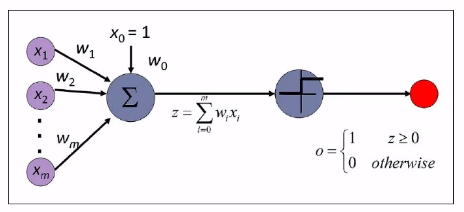
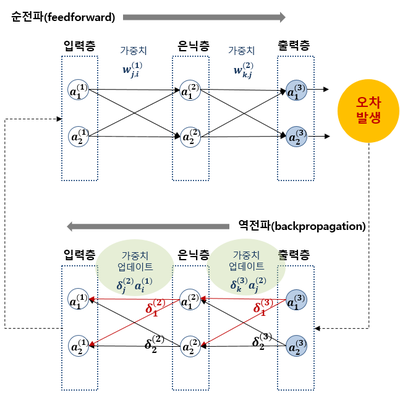

#  스스로 학습

## 내용 정리

### **퍼셉트론 (Perceptron)**

- 최소 기능 단위
- 입력 취합 → 가중치 합: 합산 → 활성화 함수: 판단 → 출력: 0/1
- 가장 단순한 형태의 인공 신경망: 입력층 - 출력층
- 퍼셉트론 뉴런과 비교
    - 퍼셉트론 = 뉴런: 여러 곳에서 전기 신호를 받아서 역치를 넘으면 신호를 전달 할/말 결정
    - 가중치 = 시냅스의 연결강도: 신호를 얼마나 강하게/약하게 전달할지 결정 (퍼셉트론 없이는 기능이 없는, 종속적인 값)

### **MLP (Mulit-layer Perceptron)**

- 여러 개의 퍼셉트론 층으로 구성: 입력층 - (은닉층 n개) - 출력층
- 은닉층의 개수에 따라 shallow/deep network로 구분

1. 얕은 신경망 (Shallow Network)
    - MLP 중에서은닉층이 1개인 신경망
    - 가장 기본적인 MLP의 형태
2. 깊은 신경망 (Deep Network)
    - MLP 중에서 은닉층이 2개 이상인 신경망
    - 흔히 말하는 딥러닝 (Deep Learning)

**퍼셉트론** `(은닉층 0개)`

➡️ **얕은 신경망 (MLP)** `(은닉층 1개)`

➡️ **깊은 신경망 (MLP/DNN)** `(은닉층 2개 이상)`

### **딥러닝 학습 과정**

- 순전파로 예측값을 만들고(`y_pred = model(X)`)
- 미리 정의한 손실 함수로 정답과의 오류(Loss)를 계산(`loss = criterion(...)`)
- 역전파를 통해 각 가중치가 오류에 얼마나 영향을 미쳤는지(기울기)를 계산(`loss.backward()`)
- **옵티마이저**가 이 기울기 값을 이용해 가중치를 올바른 방향으로 업데이트(`optimizer.step()`)

---

### MLP vs CNN

| 구분 | MLP (다층 퍼셉트론) | CNN (합성곱 신경망) |
| --- | --- | --- |
| 데이터 처리 방식 | 각 층의 모든 뉴런이 다음 층의 모든 뉴런과 연결되는 [완전 연결](https://www.google.com/search?sca_esv=dd9115a17757454c&cs=1&q=%EC%99%84%EC%A0%84+%EC%97%B0%EA%B2%B0&sa=X&ved=2ahUKEwjdjJ2ZwKWQAxV0sVYBHQXHJVgQxccNegQIDxAB&mstk=AUtExfAhhIL-w5wK_DoHVgdJbPggOlLKSP7TshJ2PMbpRQORBB-atsJYfC4ZlTaEPb_AJIFxDKZ9xIm7rkplA19RXmEY7ebMU25MTWpUxRRukFW6KjJK8zApLX3W358OybSz2unVkOo6HluWfyW2IRi6x1PvsTuNPbPFOSFS8PP4LWEhIoumSC_bmE-3rgL-6hXD3nnF&csui=3) 방식 | [합성곱](https://www.google.com/search?sca_esv=dd9115a17757454c&cs=1&q=%ED%95%A9%EC%84%B1%EA%B3%B1&sa=X&ved=2ahUKEwjdjJ2ZwKWQAxV0sVYBHQXHJVgQxccNegQIHhAB&mstk=AUtExfAhhIL-w5wK_DoHVgdJbPggOlLKSP7TshJ2PMbpRQORBB-atsJYfC4ZlTaEPb_AJIFxDKZ9xIm7rkplA19RXmEY7ebMU25MTWpUxRRukFW6KjJK8zApLX3W358OybSz2unVkOo6HluWfyW2IRi6x1PvsTuNPbPFOSFS8PP4LWEhIoumSC_bmE-3rgL-6hXD3nnF&csui=3) 연산을 통해 입력 데이터의 지역적인 특징을 추출 |
| 구조적 특징 | 입력이 일렬로 늘어선 벡터 구조로 처리됨 | 이미지와 같이 행렬 구조나 3차원 이상의 텐서 구조를 활용 |
| 활용 분야 | 구조화된 데이터나 비교적 간단한 문제에 적합 | 이미지, 비디오 등 시각적 데이터 처리에 매우 효과적 |
| 핵심 아이디어 | 입력 데이터의 전체적인 관계를 학습 | 입력 데이터 내의 공간적/지역적 특징을 감지하는 필터를 적용 |
| 모델의 효율성 | 입력 데이터 크기에 비례하여 파라미터 수가 크게 증가 | 파라미터 공유를 통해 모델의 효율성을 높이고 과적합을 줄임 |

## 실습

### 텐서

- 딥러닝에서 데이터를 표현하는 **기본 단위**
- 숫자를 담는 다차원 배열(Multi-dimensional Array)
- 텐서의 차원은 모양(shape)을 나타내는 리스트 안에 숫자가 몇 개 있는지로 결정된다.
- `torch.ones(size=(40, 20))`
    - 20개의 입력 변수(특성)를 가진 데이터가 40개 있다

### Batch Size vs Batch Index

- **배치 크기 (Batch Size)**: 책의 **한 페이지에 들어가는 단어의 개수**입니다. 예를 들어 `batch_size=64`라면, 한 번에 64개의 데이터를 묶어서 처리한다는 의미입니다. 이 값은 `DataLoader`를 정의할 때 설정하며, 한 번 정하면 보통 학습 내내 바뀌지 않습니다.
- **배치 인덱스 (Batch Index)**: 책의 **페이지 번호**입니다. 코드의 `batch_idx`가 바로 이것입니다. `enumerate(train_loader)`는 데이터 로더에서 미니배치를 하나씩 꺼내오면서, 0번, 1번, 2번... 순서로 페이지 번호(인덱스)를 붙여줍니다.

### 손실 계산

- 학습 손실 (Training Loss)은 **매 미니배치(mini-batch)마다** 계산합니다.
- 검증 손실 (Validation Loss)은 보통 **매 에포크(epoch)가 끝날 때마다 한 번씩** 계산합니다.

## PyTorch

### `torch.nn` (Neural Network) 🧠

신경망을 구성하는 데 필요한 다양한 기능(계층, 손실 함수 등)을 모아놓은 패키지입니다.

- **`nn.Linear(in_features=1, out_features=1)`**
    - **역할**: 선형 변환, 즉 y=Wx+b 계산을 수행하는 **계층(Layer)**입니다.
    - **설명**: `in_features`는 입력 데이터의 차원(특성 수), `out_features`는 출력 데이터의 차원을 의미합니다. 이 코드에서는 1차원 데이터를 받아 1차원 예측값을 만듭니다. `nn.Linear`는 내부에 학습해야 할 가중치(W, `weight`)와 편향(b, `bias`)을 **자동으로 생성하고 관리**해주는 편리한 도구입니다.
- **`nn.MSELoss()`**
    - **역할**: 손실 함수(Loss Function)의 한 종류로, **평균 제곱 오차(Mean Squared Error)**를 계산합니다.
    - **설명**: 예측값과 실제값의 차이를 제곱하여 평균을 낸 값입니다. 회귀 문제에서 가장 널리 사용되는 손실 함수 중 하나입니다. 수식은 다음과 같습니다.

    $L = \frac{1}{N}\sum(y_{pred} - y_{true})^2$


---

### `torch.optim` (Optimizer) ⚙️

계산된 기울기(gradient)를 바탕으로 신경망의 가중치(매개변수)를 업데이트하는 다양한 최적화 알고리즘을 모아놓은 패키지입니다.

- **`optim.SGD(model.parameters(), lr=0.01)`**
    - **역할**: 옵티마이저(Optimizer)의 한 종류로, **확률적 경사 하강법(Stochastic Gradient Descent)** 알고리즘을 구현합니다.
    - **설명**:
        - `model.parameters()`: 옵티마이저에게 "이제부터 `model` 안에 있는 모든 학습 가능한 가중치(`nn.Linear`의 `weight`와 `bias`)를 네가 관리하고 업데이트해야 해"라고 알려주는 부분입니다.
        - `lr=0.01`: **학습률(Learning Rate)**을 의미합니다. 역전파로 계산된 기울기 방향으로 얼마나 큰 보폭으로 이동할지를 결정하는 값입니다.
- **`optim.Adam(model.parameters(), lr=0.001)`**
    - 역전파를 통해 계산된 기울기(`.grad`) 정보를 바탕으로, 모델의 파라미터를 어떻게, 그리고 얼마나 업데이트 할지 결정하는 역할
    - Adam은 1차 모멘트(이전 기울기의 평균)와 2차 모멘트(이전 기울기의 제곱 평균)를 모두 사용하여 파라미터를 갱신
    - 수동으로 학습률을 조정해야 하는 부담을 줄여줍니다.

### `.to()` GPU 연산

PyTorch는 CUDA를 통해 해당 텐서(데이터)와 관련 연산을 CPU 메모리에서 GPU 메모리로 보냅니다. 그러면 GPU가 수천 개의 코어를 이용해 빠르게 계산을 처리하고 결과를 반환합니다.

- `.to()`는 원본을 바꾸지 않고, **새로운 복사본을 만들어 반환**합니다. 따라서 반드시 `tensor = tensor.to(device)`와 같이 변수에 다시 할당해주어야 합니다.
- 예시: `gpu_tensor = cpu_tensor.to("cuda")`

### `nn.Sequential`

- 여러 계층(layer)을 순서대로 담는 컨테이너
- `nn.Sequential`에 정의된 순서대로 데이터가 각 계층을 통과하게 됩니다. 덕분에 `forward` 메서드를 매우 간결하게 작성할 수 있습니다.

```python
class MLP(nn.Module):
    def __init__(self,
                 input_dim: int,
                 num_classes: int,
                 hidden_dims=(128, 64),
                 dropout=0.2):
        super().__init__()
        h1, h2 = hidden_dims

        # nn.Sequential을 사용하여 계층을 순서대로 쌓습니다.
        self.net = nn.Sequential(
            # 첫 번째 층: 입력 -> 은닉1
            nn.Linear(input_dim, h1),
            nn.ReLU(),
            nn.Dropout(dropout),

            # 두 번째 층: 은닉1 -> 은닉2
            nn.Linear(h1, h2),
            nn.ReLU(),
            nn.Dropout(dropout),

            # 세 번째 층: 은닉2 -> 출력
            nn.Linear(h2, num_classes)
        )

    def forward(self, x):
        # 정의된 self.net을 통해 입력 x를 전달하여 결과를 반환합니다.
        return self.net(x)
```

- `nn.Linear(input_dim, h1)`: 입력 특성의 수(`input_dim`)를 받아 첫 번째 은닉층의 뉴런 수(`h1=128`)로 변환합니다.
- `nn.ReLU()`: 활성화 함수로, 비선형성을 추가합니다.
- `nn.Dropout(dropout)`: 학습 과정에서 일부 뉴런을 무작위로 비활성화하여 모델이 과적합되는 것을 방지합니다.

---

## PyTorch 모델 학습 디버깅 노트 📝

### 텐서 데이터 타입 오류

- **오류 메시지**: `NotImplementedError: "nll_loss_forward_reduce_cuda_kernel_2d_index" not implemented for 'Float'`
- **원인**: 분류 문제에서 사용하는 손실 함수(`CrossEntropyLoss`)는 정답 레이블(target)이 **정수(Long) 타입**의 클래스 인덱스이길 기대하지만, **실수(Float) 타입**의 텐서가 입력되었습니다.
- **코드 수정**: 데이터를 텐서로 변환하는 과정에서, 정답 레이블 `y`의 데이터 타입을 `torch.float32`에서 `torch.long`으로 변경했습니다.
    - 수정 전 (Before)

    ```python
    # 실수형으로 변환하여 문제 발생
    y_train_t = torch.tensor(y_train, dtype=torch.float32).unsqueeze(1)
    ```

    - 수정 후 (After)

    ```python
    # 정수형으로 변환하여 해결
    y_train_t = torch.tensor(y_train, dtype=torch.long)
    ```


### GPU와 CPU

- **오류 메시지**: `TypeError: can't convert cuda:0 device type tensor to numpy. Use Tensor.cpu() to copy the tensor to host memory first.`
- **원인**: **GPU 메모리**(`cuda:0`)에 있는 텐서를 **CPU 기반 라이브러리**인 NumPy 배열로 직접 변환하려고 시도했습니다. NumPy 변환은 CPU 메모리에 있는 텐서에만 가능합니다.
- **코드 수정**: `.numpy()`를 호출하기 전에 `.cpu()` 메서드를 먼저 호출하여 텐서를 GPU에서 CPU로 이동시켰습니다.
    - 수정 전 (Before)

    ```python
    # GPU에 있는 텐서를 바로 리스트에 추가
    all_preds.append(preds)
    all_targets.append(yb)
    # ...
    preds_cat = torch.cat(all_preds).numpy() # 여기서 에러 발생
    ```

    - 수정 후 (After)

    ```python
    # CPU로 옮긴 후 리스트에 추가
    all_preds.append(preds.cpu())
    all_targets.append(yb.cpu())
    # ...
    preds_cat = torch.cat(all_preds).numpy() # 정상 작동
    ```


### NumPy 속성 호출

- **오류 메시지**: `AttributeError: 'numpy.ndarray' object has no attribute 'values'`
- **원인**: `y_train` 데이터가 이미 NumPy 배열(`ndarray`)인데, Pandas Series나 DataFrame 객체에 사용하는 `.values` 속성을 호출하려고 했습니다.
- **코드 수정**: 불필요한 `.values` 속성 접근을 제거하고 NumPy 배열을 직접 텐서로 변환했습니다.
    - 수정 전 (Before)

    ```python
    y_train_t = torch.tensor(y_train.values, dtype=torch.float32).unsqueeze(1)
    ```

    - 수정 후 (After)

    ```python
    y_train_t = torch.tensor(y_train, dtype=torch.float32).unsqueeze(1)
    ```


---

## MLP (MLP, Mulit-Layer Perceptron)

여러 층(layer)으로 구성된 인공신경망의 한 형태

### 머신러닝의 한계

- 모델이 잘 학습하도록 사람이 직접 데이터의 중요한 특징을 가공하여 알려줘야 한다.
    - 컴퓨터에게 데이터를 주고 그 안에서 규칙을 스스로 학습하게 하는 방식
- 비정형 데이터(이미지, 텍스트 등) 처리가 비효율적
- 데이터 양이 많아지면 성능이 정체된다.

    ⇒ 인공신경망(Artificial Neural Network) 기반의 딥러닝 등장!


### 퍼셉트론 (Perceptron)

- 인공신경망의 가장 기초 단위
- 참(1) 또는 거짓(0)을 결정하는 모델
    - 데이터 사이에 하나의 직선을 그어 두 그룹을 나누는 것
    - 선형 분리 가능한 문제
- 각 입력값 x에 가중치 w를 곱하고 모두 더한 후 (가중합), 활성화 함수를 통해 최종 결과를 출력한다.
- 기계가 데이터를 보고 스스로 경계선을 찾아낼 수 있다는 가능성을 제시했다.



### 퍼셉트론의 한계

- 두 입력이 서로 다를 때만 1을 출력하는 XOR 문제를 하나의 직선으로는 해결할 수 없다.
    - 가격은 싼데(T) 리뷰는 좋거나(T), 가격은 비싼데(F) 리뷰는 안 좋은 곳(F)이 진짜 숨은 맛집(T)이다
- 퍼셉트론을 여러 층으로 쌓아 여러 개의 직선을 조합하여 해결하자! ⇒ 신경망(Neural Network)의 시작

### MLP의 구조



- 입력층 (Input Layer): 데이터가 처음 들어오는 곳
- 은닉층 (Hidden Layer): 데이터의 핵심 특징을 추출하고 학습하는 부분
    - 입력층과 출력층 사이에 1개 이상 존재
    - 층이 깊어질수록 더 복잡한 패턴을 학습할 수 있다.
- 출력층 (Output Layer): 최종 예측 결과를 내보내는 곳

### 활성화 함수 (Activation Function)

- 입력된 신호를 받아 그 신호를 처리하여 출력 신호를 결정하는 함수
    - 활성화시켜 전달할지 말지를 결정하는 스위치
- 과거 - Sigmoid
    - 기울기 소실 문제: 역전파 시 오차 신호가 뒤로 갈수록 0에 가깝게 사라짐
- 현재 - ReLU (Rectified Linear Unit)
    - 입력이 0보다 크면 값을 그대로, 0보다 작으면 0을 출력한다.
    - 기울기가 1 또는 0이므로 기울기 소실 문제 해결, 빠른 계산 속도

## 모델 학습과정

### 1. 순전파 (Forward Propagation)

- 입력 데이터가 입력층-은닉층-출력층까지, 앞에서 뒤로 흘러가며 최종 예측값을 계산하는 과정
- 각 층의 뉴런들은 입력값과 가중치를 이용해 계산하고 활성화 함수(ReLU)를 통과시켜 다음 층으로 결과를 전달, 이 과정이 출력층까지 반복한다.
    - 처음에는 가중치를 무작위로 주기 때문에 엉터리 예측 결과가 나온다.

### 2. 손실 함수

- 순전파로 나온 엉터리 예측 결과와 실제 정답을 비교하여 ‘**얼마나 틀렸는지(손실/오차)**’를 하나의 숫자로 계산한다.
- 회귀 - 평균 제곱 오차 (MSE)
- 분류 - 교차 엔트로피: 모델이 강하게 확신하고 틀리면 큰 벌점(penalty)을 줌
- 손실 값을 최소화하는 것이 모델 학습의 목표

### 3. 역전파 (Back Propagation)

- 계산된 손실의 원인을 찾아 출력층에서부터 **거꾸로 추적**하며, 각 가중치를 어떻게 수정해야 손실을 줄일 수 있을 지 계산하는 과정
- 예측값과 정답 차이에서 최종 오차(L)가 발생하면, 각 뉴런은 최종 오차에 대한 각기 다른 책임 신호(뉴런의 기울기, 영향력)를 전달받는다.
- 영향력이 크면 가중치 수정도 더 많이 해야 한다.
    - 가중치의 영향력을 결정하는 것은 입력 데이터에 비례하여 결정된다. → 편미분
- 입력데이터 x와 책임 신호를 곱해서 최종 책임 신호(가중치의 기울기)를 계산한 후 학습률을 곱해서 각 가중치 값을 업데이트한다.

### 4. 옵티마이저

- 역전파로 계산된 책임(기울기)을 바탕으로, 손실 함수 값이 최소가 되는 최적의 가중치를 찾아가는 알고리즘
- 역전파를 통해 계산된 모든 가중치의 기울기와 학습률을 사용하여 손실이 줄어드는 방향으로 실제 가중치 값을 업데이트 한다.
- **Adam (Adaptive Moment Estimation)**
    - 가장 널리 사용되는 적응형 학습률 옵티마이저
    - **적응형 (Adaptive):** 일반적인 SGD(확률적 경사 하강법)와 달리, Adam은 각 파라미터마다 학습률을 다르게 적용하고 조정한다.
    - **모멘텀 (Momentum) 활용:** 이전 기울기의 정보(관성)를 활용하여 최적화 과정에서 발생하는 진동을 줄이고 빠르게 최적점에 도달하도록 돕는다.

## PyTorch 코드 연계

### AutoGrad

- 자동 미분
    - PyTorch의 핵심 기능
- `loss.backward()` 역전파 과정 자동 계산

```python
# 순전파로 예측하고 손실 계산
loss = criterion(outputs, labels)

# 모든 가중치의 책임(기울기)이 자동으로 계산된다.
loss.backward()

# 옵티마이저가 계산된 기울기를 바탕으로 모든 가중치를 업데이트한다.
optimizer.step()
```

### 모델 정의 및 데이터 준비

- `nn.Module` 모듈: 모델 정의
    - `__init__()` 필요한 레이어들을 정의
    - `forward()` 어떤 순서로 조립할지 (순전파)를 설계
    - `nn.Sequential` 여러 레이러를 컨테이너처럼 묶어서 순서대로 실행
- 데이터 준비
    - `Dataset` 전체 데이터를 공급
    - `DataLoader` 모델에게 데이터를 미니배치 단위로 공급

```python
class MLP(nn.Module):
		def __init__(self):
				super().__init__()
				self.net = nn.Sequential(...)

		def forward(self, x):
				return self.net(x)

train_loader = DataLoader(train_ds, batch_size=64, shuffle=True)
```
