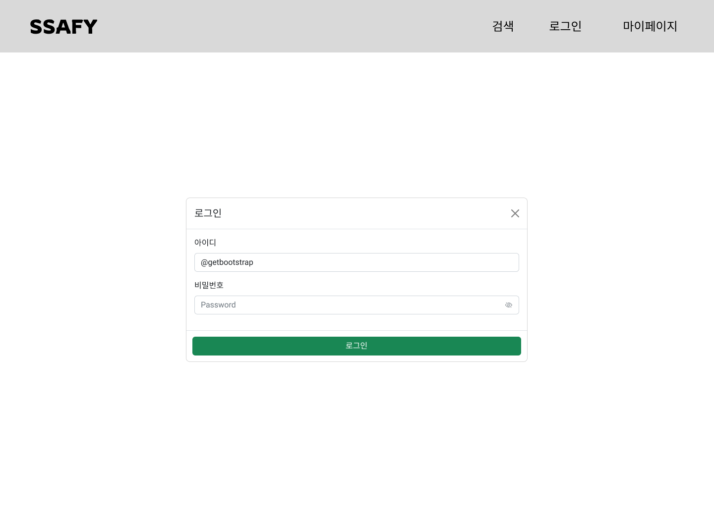

## 생성형 AI를 활용한 디자인-투-코드(Design-to-Code) 자동화

### 웹 디자인 과정

디자이너는 Figma와 같은 툴을 사용해 시각적으로 완벽한 웹 페이지 디자인을 만든다.

개발자는 이 디자인 시안을 보고, 모든 요소(버튼, 입력창, 레이아웃 등)를 수작업으로 HTML과 CSS 코드로 한 줄 한 줄 구현해야 한다.

이 과정은 시간이 많이 소요되고, 반복적인 작업이기 때문에 ‘디자인-투-코드’ 변환 과정을 생성형 AI에게 위임할 수 있다. 다음 두 가지를 제공하면 AI가 초기 코드를 자동으로 생성한다.

- **시각 정보**: 디자인 시안 이미지 (예: login.png)
- **요구 사항**: 기술적인 지시 사항 (예: Bootstrap5를 사용해줘)

### 1. 이미지 준비 (인코딩) - Figma

- 컴퓨터의 이미지 파일(바이너리)을 AI가 읽을 수 있는 텍스트(Base64) 형식으로 변환
- Figma: 하나의 디자인 파일에 동시에 접속하여 실시간으로 함께 작업할 수 있는, 클라우드 기반의 UI/UX 디자인 및 프로토타이핑 툴
    - Bootstrap 컴포넌트 불러오기: 커뮤니티 > Bootstrap > Figma에서 열기 > 원하는 컴포넌트 복사하여 내 도화지로 가져오기



### 2. 명령어 작성 (프롬프트)

AI에게 역할(전문 웹 개발자)과 구체적인 기술 요구사항(CSS 작성 방식 등)을 명확하게 지시

### 3. API 호출 및 결과 저장

준비된 이미지와 프롬프트를 OpenAI API에 함께 전송하고 응답받은 HTML/CSS  코드를 파일로 저장

```python
import os
import base64  # 이미지를 텍스트로 변환(인코딩)하기 위한 라이브러리
from openai import OpenAI
from pathlib import Path
from dotenv import load_dotenv

# .env 파일에서 API 키를 안전하게 로드합니다.
load_dotenv()
OPENAI_API_KEY = os.getenv('OPENAI_API_KEY')

# OpenAI 클라이언트 객체를 API 키와 함께 초기화합니다.
client = OpenAI(api_key=OPENAI_API_KEY)

def encode_image(image_path):
    """이미지 파일을 Base64 문자열로 인코딩하는 함수"""
    # 이미지 파일을 바이너리 읽기 모드('rb')로 엽니다.
    with Path(image_path).open('rb') as image_file:
        # 파일을 읽고 Base64로 인코딩한 뒤, utf-8 문자열로 변환하여 반환합니다.
        return base64.b64encode(image_file.read()).decode('utf-8')

def analyze_image(image_path, system_prompt, user_prompt):
    """OpenAI API에 이미지와 프롬프트를 보내 분석을 요청하는 함수"""
    # 1. 이미지 준비: 함수를 호출하여 이미지를 Base64 문자열로 변환합니다.
    base64_image = encode_image(image_path)

    # 2. API 호출: client.responses.create를 사용하여 요청을 보냅니다.
    response = client.responses.create(
        model='gpt-5-nano',  # 사용할 AI 모델을 지정합니다.
        input=[
            # system 역할: AI에게 기본적인 역할과 지켜야 할 규칙을 부여합니다.
            {
                'role': 'system',
                'content': [
                    {
                        'type': 'input_text',
                        'text': system_prompt,
                    }
                ],
            },
            # user 역할: AI에게 실제 처리할 데이터와 구체적인 질문을 전달합니다.
            {
                'role': 'user',
                # content를 리스트로 만들어, 텍스트와 이미지를 함께 전달합니다 (멀티모달 입력).
                'content': [
                    {
                        'type': 'input_text',
                        'text': user_prompt,  # 사용자의 텍스트 요구사항
                    },
                    {
                        'type': 'input_image',  # 이 content가 이미지임을 명시
                        'image_url': f'data:image/jpeg;base64,{base64_image}',  # Base64로 인코딩된 이미지 데이터
                    },
                ],
            },
        ],
    )
    # 최종적으로 AI가 생성한 텍스트(HTML/CSS 코드)를 반환합니다.
    return response.output_text

# --- 이 스크립트가 직접 실행될 때만 아래 코드가 동작합니다 ---
if __name__ == '__main__':
    # 변환할 디자인 시안 이미지의 경로를 지정합니다.
    target_image_path = 'image/my_page.png'

    # AI에게 전달할 시스템 프롬프트(역할, 규칙)를 정의합니다.
    system_prompt = """
    당신은 웹 개발 전문가입니다.
    Bootstrap 5 프레임워크를 사용해야 합니다.
    HTML5, CSS3 표준을 준수하여 작성합니다.
    CSS는 OOCSS 방법론에 기반하여 유지보수가 쉽도록 구성합니다.
    다른 코멘트는 답변하지 말고 최종 결과 파일만 응답해주세요.
    """

    # AI에게 전달할 사용자 프롬프트(구체적인 요구사항)를 정의합니다.
    user_prompt = """
    다음 이미지를 분석해 HTML/CSS 코드로 변환해 주세요.
    만약 사용할 이미지가 없으면 Text로 대체해주세요.
    """

    print(f'이미지 : {target_image_path}를 HTML/CSS 변환 요청')
    # 3. API 호출 실행
    result = analyze_image(target_image_path, system_prompt, user_prompt)

    # 응답으로 받은 코드를 'index.html' 파일로 저장합니다.
    html = Path('index.html')
    with html.open('w', encoding='utf-8') as f:
        f.write(result)

    print('코드 변환 완료! index.html 파일 생성')

```

### 환경 변수 설정

- **환경변수(Enviornment Variables)**: API 키, 데이터베이스 비밀번호 등 코드에 직접 하드코딩하면 안되는 민감한 정보를 저장하는 데 사용되는 변수
- `.env`파일은 `.gitignore`에 포함해야 한다.
- dotenv 라이브러리
    - `load_dotenv()` 함수를 실행하면 `.env` 파일에 있는 모든 변수들을 자동으로 환경변수로 등록해준다.

`.env` 파일 생성

```python
OPENAI_API_KEY=@@@  # @@@ 부분에 KEY 문자열을 따옴표없이 입력
```