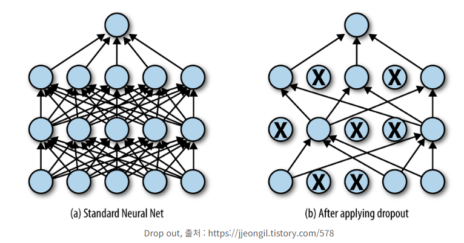

## 모델 정규화

### 가중치 감소

- 학습 과정에서 특정 가중치가 지나치게 커지는 현상을 방지한다.
- 가중치 크기에 비례한 패널티를 적용한다.
- 모든 가중치가 0인 모델 = 아무것도 학습 안 한 모델

- L2 정규화 (Ridge, Weight Decay)
    - 큰 가중치에 제곱으로 패널티
    - 모든 가중치가 골고루 작아진다.

- L1 정규화 (Lasso)
    - 모든 가중치에 절댓값 크기만큼 동일하게 패널티
    - 중요하지 않은 가중치는 완전히 0이 된다.
    - 자동으로 중요한 특성만 선택하게 되어 단순한 모델이 된다.
    - 상수의 희소성 (즉, 가능하다면 보다 작은 모델을 선호)을 강제하고 싶다면, L1 가중치 감소를 선택

- Elastic net (L1 + L2)
    - 변수가 많고 상관관계가 높을 때 특히 효과적

### 드롭아웃 (Dropout)

- 규제 (Regularization): 과적합을 막기 위해 모델에 제약을 거는 기법
- 학습 과정에서 일부 뉴런을 확률적으로 끈다.
- 매 학습 스텝마다 다른 네트워크 구조가 샘플링되는 효과
- 과적합 방지: 네트워크가 특정 패턴에 의존하지 않고 일반화 성능이 높다.
- 여러 작은 모델을 합친 것과 비슷한 효과
    - 앙상블: 여러 개의 서로 다른 모델을 학습시킨 후, 예측할 때 모든 모델의 결과를 평균내거나 투표하여 최종 결정
- 최적의 드롭 비율을 찾는 것이 중요하다.
- 배치 정규화 진행된 모델, RNN/LSTM 등 시계열 데이터에서는 비선호

- Inverted 드롭아웃: 학습 시 살아남은 뉴런의 출력을 1/(1-p) 배 스케일링

