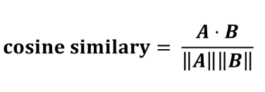
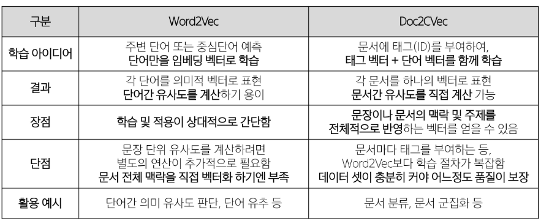

## 문서 유사도 (Document Similarity)

### 문서 유사도

- 여러 개의 문서(또는 문장) 중에서 ‘얼마나 비슷한 내용을 담고 있는지’를 수치로 표현한 것
- 추천 시스템, 검색 및 정보 탐색, 분류/군집 및 중복 검출, 의사결정 지원

### 코사인 유사도

- 코사인 유사도 방식으로 두 벡터 간의 유사도를 알아내려면 벡터 값이 필요하다.
- 두 벡터가 이루는 각도의 코사인 값을 이용
- -1 이상 1 이하의 값
- 값이 1에 가까울수록 유사도가 높다.



### 자카드 유사도

- 두 집합의 교집합 크기를 합집합 크기로 나눈 값
- 텍스트 유사도 측정 시 단어 존재 여부만 고려한다.

### 유클리드 거리

- 공간적 거리 측정 방식
- n 차원 공간에서 두 점 사이의 직선 거리를 계산한다.
- 거리가 0에 가까울수록 유사도가 높다.

### 카운트 기반 문서 유사도

- 텍스트 기반 데이터를 벡터 데이터로 변환
- Bag og Workds: 문서 별 각 단어의 등장 빈도수 기록

## 임베딩 기반 문서 유사도

### 워드 임베딩 (Word Enbedding)

- 텍스트를 ‘의미’를 반영한 숫자 벡터로 변환하는 기법
- 서로 의미가 비슷한 단어, 문장이 고차원 벡터 공간 상에서 가까이 위치하도록 학습시킨다.
- Word2Vec: 분포 가설에 기반하여 단어의 의미를 벡터로 학습
    - ‘서로 비슷한 맥락에서 등장하는 단어들은 의미도 비슷하다’
    - CBOW: 주변 단어들(맥락)을 입력으로 받고, 그 중심 단어를 예측하는 방식
    - Skip-gram: 중심 단어를 입력으로 받고, 주변 단어들을 예측하는 방식

### 도큐먼트 임베딩 (Document Enbedding)

- 여러 단어로 이루어진 문장, 문서를 임베딩하는 방법
- 문서별로 고유 문서 태그 (문서 ID)를 부여한다.
- 문서의 단어들을 입력으로 받고, Doc2Vec 모델을 사용하여 문서 태그 + 단어 임베딩을 동시에 업데이트한다.

### Word2Vec vs. Doc2Vec


### 생성형 AI 기반 임베딩

- 문장/문서를 입력하면, 모델 내부의 숨은 표현을 활용해 의미가 반영된 벡터를 얻을 수 있다.
- API로 OpenAI, Upstage 등에 텍스트를 전달한다.

- GMS 활용 ChatGPT 호출 예
    - axios로 호출 가능
    - `-H`: Header
    - `-d`: data

```jsx
curl "https://gms.ssafy.io/gmsapi/api.openai.com/v1/chat/completions" \
  -H "Content-Type: application/json" \
  -H "Authorization: Bearer $GMS_KEY" \
  -d '{
    "model": "gpt-5",
    "messages": [
      {
        "role": "developer",
        "content": "Answer in Korean"
      },
      {
        "role": "user",
        "content": "Summarize the 2024 total production data."
      }
    ]
  }'
```

### pickle

- pickle: 파이썬 객체 구조의 직렬화와 역직렬화를 위한 바이너리 프로토콜을 구현