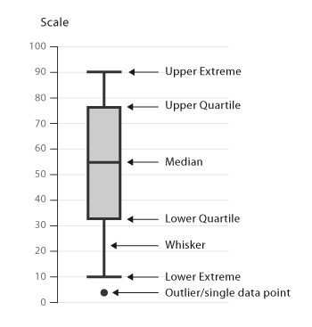
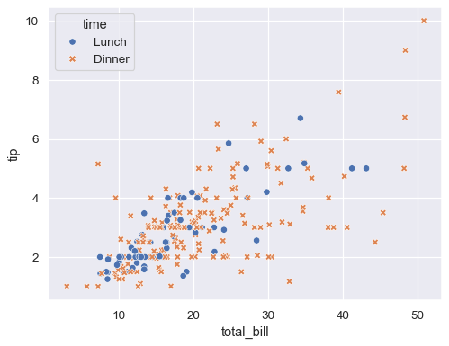
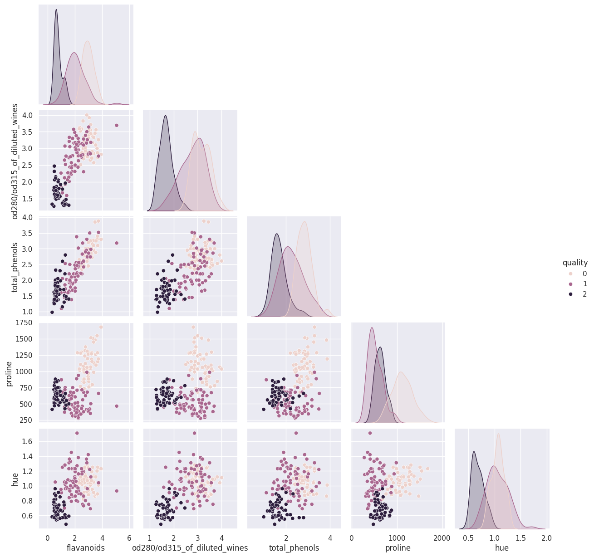

## 탐색적 데이터 분석 (EDA)

- 데이터 확인 - 데이터 정제 - 개별 변수 분석 - 변수 간 관계 분석
- 상관관계: 두 변수가 함께 변화하는 관련성
    - 하나의 변수가 증가/감소할 때, 다른 변수가 어떤 일정한 관련성을 띄며 함께 변화하는지
    - **상관 계수**(Correlation Coefficient): -1에서 1 사이의 값
    - **상관관계는 인과관계를 암시하지 않는다.**

### 상관관계 vs 인과관계

| 구분 | 상관관계 (Correlation) | 인과관계 (Causation) |
| --- | --- | --- |
| 정의 | 두 변수가 서로 관련성을 갖고 함께 움직이는 경향 | 하나의 변수(원인)가 다른 변수(결과)를 직접 발생시키는 관계 |
| 방향성 | A와 B가 관련되어 있다 | A가 B를 유발한다 |
| 결론 | 상관관계가 높다고 해서 원인과 결과를 의미하는 것은 절대 아니다. | 명확한 원인과 결과의 관계 |

### 데이터 시각화

- Matplotlib: 제목/축/라벨 추가
- Seaborn: 데이터를 그래프로 그리기
    - Matplotlib 기반, 더 예쁘고 통계적으로 의미 있는 그래프를 만들어주는 라이브러리

## 단변수 분석

### 히스토그램 (Histogram)

- 특정 수치형 변수 하나의 데이터 분포를 파악하기 위해 사용
    - 이상치 파악하기 수월하다
    - 직관적인 분포 파악
- 구간 설정에 민감하다
    - 구간의 개수나 너비를 어떻게 설정하느냐에 따라 그래프 모양이 달라져 해석이 왜곡될 수 있다

### 박스 플롯 (Box Plot)

- 수치형 데이터의 분포와 이상치를 한눈에 파악하기 위해 사용
- 데이터의 사분위수(25%, 50%, 75%)를 이용하여 전체 데이터가 어떻게 퍼져 있는지를 간결하게 요약
- 이상치(outlier)를 찾는 데 효과적이다
- 데이터의 개수를 파악하기 어렵다
- 데이터의 구체적인 분포 형태를 파악하기 어렵다



## 다변수 분석

### 산점도 (Scatter Plot)

- 변수 간 관계 분석(다변수 분석)을 위한 도구
- 두 개의 수치형 변수 사이의 관계를 파악하기 위해 점을 찍어 만드는 그래프
- 패턴이나 이상치를 파악하기 쉽다
- 상관관계를 보여줄 뿐, **인과관계를 증명하지 않는다**



### 히트맵 (Heatmap)

- 여러 숫자형 변수들 간의 크기를 색상으로 변환하여 보여주는 그래프
- 상관관계 분석에 사용
    - 상관관계가 높은 변수 쌍을 찾아내기 유용하다
- 정확한 수치를 파악하기 어렵다

- 상관관계 행렬과 동일한 크기의 마스킹용 행렬을 만들기
1. `np.ones_like()`
2. `np.triu()` 행렬의 위쪽 삼각형만 남기고, 나머지를 모두 0으로 변환
- 위에서 만든 `ones_like` df를 가지고 `triu`를 사용한 결과는?
    - 자기자신을 기준으로 위쪽은 모두 1, 나머지는 모두 0

```python
# TODO
# 1. 모든 변수들 사이 상관관계를 `corr`이라는 변수에 담아보세요!
corr = df.corr()

# 2. 위에서 만든 `corr`의 shape은 정방형태입니다.
# `corr`을 `sns.heatmap` 위에 그려보세요
"""
요구사항
- 변수가 많습니다. Figure size를 키워주세요
- Heatmap은 한 눈에 상관관계성을 보기에 좋습니다. 하지만 수치적으로 와닿기 위해서 어떤 조치를 취할 수 있을까요?
  - hint: annot=True
- 포맷팅을 소수점 두자리까지만 나오게 해주세요
- colormap은 coolwarm을 사용하고 싶습니다.
  - 참고: https://seaborn.pydata.org/tutorial/color_palettes.html
- 대각행렬에는 자가 상관계수가 들어갑니다. 즉 어차피 1입니다. 제외하고 보여주세요.
- 상관계수 행렬은 대칭행렬입니다. 필요한 경우 전체 행렬을 시각화하기도 하지만, 오늘은 아래 부분만 보고 싶네요. 대각행렬을 기준으로 윗부분 제외하고 아랫부분만 보여주세요.
- 위를 날리고나니 뒤에 있는 grid가 거슬립니다. 없애주세요.
"""
plt.figure(figsize=(10, 8))
mask = np.triu(np.ones_like(corr, dtype=bool))
sns.heatmap(
    corr,
    annot=True,
    fmt='.2f',
    cmap="coolwarm",
    mask=mask
)
plt.grid(False)
```

### 페어 플롯 (Pair Plot)

- 여러 변수들 간의 관계를 한 번에 보여주는 그래프
- 대각선(분포도): 각 성분이 어떻게 분포되어 있는지
- 대각선 외 (산점도): 두 성분 사이의 관계를 보여주는 산점도
- 변수가 많아지면 계산이 오래걸린다
    - 중요하다고 생각되는 몇 개의 변수만 선택해서 그리는 것이 일반적
- 초기 탐색에 사용
- `sns.pairplot(DataFrame)`

    


## 데이터 전처리

### 결측치

- 비어있는 값(NaN)은 수학 계산을 불가능하게 만든다
- 삭제 (Deletion): 비어있는 데이터가 포함된 행/열을 삭제
    - 데이터가 적을 때 치명적
- 대치 (Imputation): 비어있는 값을 그럴 듯한 값으로 채워 넣기
    - 숫자형 데이터: 평균, 중앙값
    - 범주형 데이터: 최빈값

### 문자열/범주형 데이터

- 범주형 데이터: 명목형(예: 성별), 순서형(예: 학점)
- 수치형 데이터: 이산형(예: 뉴스레터 발행 건수), 연속형(예: 몸무게)
- 문자열은 직접 계산할 수 없다
- 레이블 인코딩 / 원-핫 인코딩 / 순서형 인코딩 / 임베딩 등

### 스케일링

- 각 특성의 단위를 맞춰서 모델이 공평하게 학습하도록 만드는 과정
- **표준화**: 제각각인 데이터의 단위를 공평하게 맞춰주는 작업
    - 일반적으로 많이 사용
    - 데이터의 평균을 0, 표준편차를 1로 변환
    - 이상치에 상대적으로 덜 민감하고 정규분포를 따를 때 효과적이다.
    - **테스트 데이터의 표준화는 반드시 훈련 데이터의 평균/표준편차를 활용해야 한다.**
    - 모든 특성에 공평한 영향력을 부여한다.
    - 경사 하강법, SVM(Support Vector Machine), 거리 기반 알고리즘의 성능 향상

    - `.transform`: `fit` 단계에서 학습한 평균/표준편차를 사용해 `X_train`과 `X_test`를 모두 변환
        - `X_train` 기준으로 `X_test`를 변환해야 공정한 평가가 가능
    ```python
    # preprocessing: 데이터 전처리와 관련된 다양한 기능들이 포함되어 있음
    from sklearn.preprocessing import StandardScaler
    # 2. 표준화 진행
    scaler = StandardScaler()

    # 진행 순서에 유의
    # 1) 훈련 데이터로부터 표준화에 필요한 통계값(평균, 표준편차) 계산
    # 2) 훈련 데이터에 대해 표준화 적용
    # 3) 테스트 데이터에 대해 표준화 적용(1번에서 계산된 통계값 사용)
    X_train_norm = scaler.fit_transform(X_train)
    X_test_norm = scaler.transform(X_test)
    ```
- **정규화**: 흩어져 있는 모든 데이터의 값을 0과 1 사이의 범위로 변환하는 작업
    - 데이터의 범위를 0 ~ 1로 명확하게 제한하고 싶은 경우에 활용
        - 이미지 처리에서 픽셀 값은 0 ~ 255 로 표현되며, 이를 정규화하면 학습이 훨씬 쉬워진다.
    - 데이터의 최소/최대값을 명확히 알면 유용하다.
    - 이상치에 민감하다.
