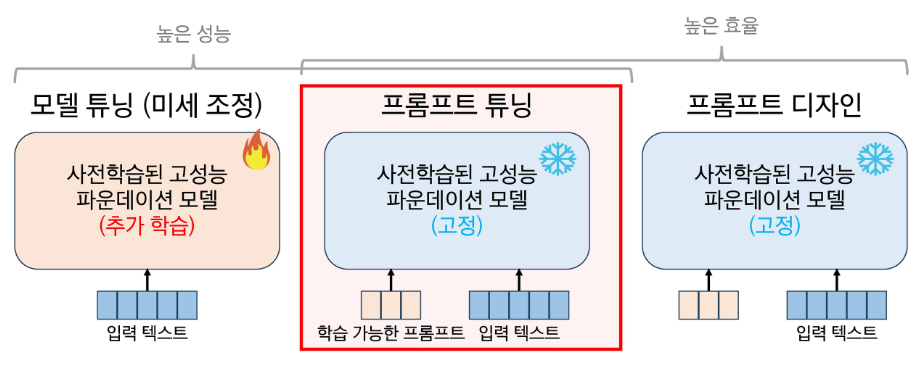
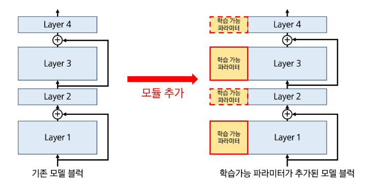
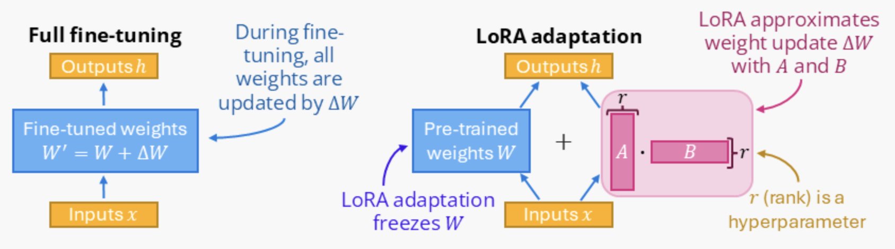
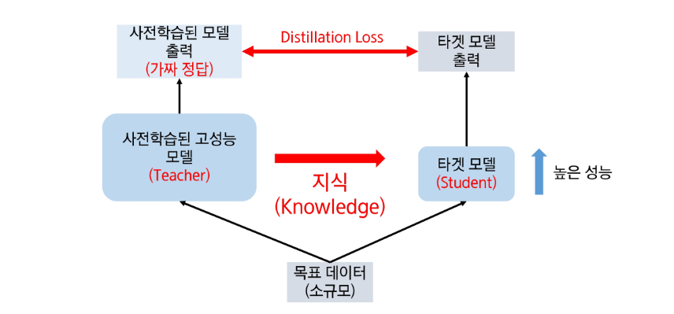

## 적응 학습

### 미세 조정 (Fine-tuning)

- 추가학습을 통해 이미 학습된 모델을 조금만 튜닝하는 것
- 특정 작업에 특화된 모델을 개발할 수 있다.
- 사전 학습된 모델에 프롬프팅을 통한 작업을 했을 때보다 더 좋은 퀄리티의 결과물을 생성
- 프롬프트에 넣는 예제보다 훨씬 더 많은 예제를 통해 학습 가능
- 프롬프트의 길이가 줄어들면서 토큰 개수 절약
- 응답하는 데 걸리는 시간(latency) 단축

### 학습률 (Learning Rate)

- 손실함수가 큰 값일 때 미세하게 조정하기 어려우므로 뉴럴넷 모델에 작은 비율로 반영한다.
- 모델과 데이터마다 적절한 learning rate가 다르기 때문에 실험을 통해 구해야 함
    - 좋은 시작점에서부터 시작하기 때문에 작은 learning rate부터 보수적으로 시작해야 함

### PEFT (Parameter-Efficient Fine-Tuning)

- 프롬프트 디자인
    - 언어모델에서 주로 활용
    - 모델이 원하는 레벨의 결과를 출력할 수 있도록 입력 텍스트를 변형하는 방법
    - 추가 학습 없이 사전학습된 모델의 예측 성능을 끌어올릴 수 있음
    - 프롬프트를 사람이 직접 설계해야 함
    - 성능 향상이 제한적
- 프롬프트 튜닝: 학습 가능한 프롬프트
    - 가상 토큰 (virtual token)을 입력에 추가
    - 역전파를 통해 오직 가상 토큰에 대한 임베딩만 학습하고 나머지 모델은 고정



프롬프트 튜닝

- Adaptor 모듈 추가 학습
    - Activation을 변경하기 위해 작은 모듈을 추가하여 학습하는 기법

    
    Adaptor 모듈


## PEFT (파라미터 효율적 튜닝) 실습

### **Unsloth와 QLoRA**

**Unsloth**

- 효율적인 LLM(대형 언어 모델) 파인튜닝 및 강화학습(RL) 프레임워크
- 속도와 메모리 관리 측면에서 최적화된 성능을 제공

**LoRA (Low-Rank Adaptation)**

- 원본 모델의 각 레이어 옆에 아주 작은 어댑터 층(수백 만 개 파라미터)을 새로 추가 → 학습 데이터를 보여줄 때 이 어댑터만 훈련시킴
- 학습할 양을 줄임, 메모리와 시간 절약
- forward 연산은 pretrained weights 따로, adapter 따로 수행하고요 각각의 결과를 합쳐 다음 레이어에 보내는데, backward에서 gradient update는 adapter에만 적용한다



**QLoRA**

- Quantization (4-bit 모델) + LoRA (어댑터 학습)
- Quantization (양자화): 모델을 구성하는 수십억 개의 숫자를 더 낮은 정밀도(예: 16-bit → 4-bit)로 압축하는 기술
- 모델의 무게를 줄임

**Phi-3**

- Microsoft가 개발한 소형 언어 모델(Small Language Model, SLM) 시리즈
- Phi-3-mini: 3.8억(3.8B) 파라미터를 가진 트랜스포머 디코더 아키텍처 기반 모델
    - 3.3조 개의 토큰으로 학습되었으며, 4K와 128K 두 가지 컨텍스트 길이 옵션을 제공
    - 이 모델은 Llama2와 유사한 블록 구조와 토크나이저를 사용

**환경 설치**

```python
import re
import torch

# Unsloth 호환성을 위한 xformers 버전 자동 설정
v = re.match(r"[0-9\\.]{3,}", str(torch.__version__)).group(0)
xformers = "xformers==" + ("0.0.32.post2" if v == "2.8.0" else "0.0.29.post3")

# --- 핵심 라이브러리 설치 ---

# bitsandbytes: 4비트 양자화(Quantization)를 실행하는 라이브러리
# accelerate, xformers: 모델의 학습 및 추론 속도를 가속화
# peft: LoRA, QLoRA 등 '어댑터'를 관리하고 적용하는 라이브러리 (Parameter-Efficient Fine-Tuning)
!pip install --no-deps bitsandbytes==0.45.5 accelerate {xformers} peft trl triton cut_cross_entropy unsloth_zoo

# 기타 유틸리티
!pip install sentencepiece protobuf "datasets>=3.4.1,<4.0.0" "huggingface_hub>=0.34.0" hf_transfer

# Unsloth: QLoRA 학습/추론을 2배 빠르게 최적화하는 핵심 라이브러리
!pip install --no-deps unsloth

# transformers (Unsloth 호환 버전)
!pip install transformers==4.55.4
```

**모델에 어댑터 장착**

```python
from unsloth import FastLanguageModel

# 1. 4비트 양자화된 '순정' Phi-3 모델을 'Unsloth'의 빠른 방식으로 로드합니다.
# model_name: Unsloth가 4-bit로 미리 최적화해둔 모델 이름
# load_in_4bit = True: 모델을 4비트로 경량화(Quantization)하여 로드 (QLoRA의 'Q')
print("--- 4비트 순정 모델(Phi-3) 로딩 중 ---")
base_model, tokenizer = FastLanguageModel.from_pretrained(
    model_name = "unsloth/phi-3-mini-4k-instruct-bnb-4bit",
    max_seq_length = 2048,
    load_in_4bit = True,
)
print("--- 순정 모델 로딩 완료 ---")

# 2. '번역 튜닝 칩'을 순정 모델에 장착!
# "my_lora_adapter"는 방금 우리가 압축 해제한 폴더 이름입니다.
# 이 명령어가 LoRA(어댑터)를 원본 모델에 부착합니다. (QLoRA의 'LoRA')
print("--- LoRA 어댑터 장착 중 ---")
base_model.load_adapter("my_lora_adapter")
print("--- 어댑터 장착 완료 ---")
```

**추론 실행 (번역 성능 테스트)**

```python
# 추론 테스트 1

from transformers import TextStreamer

# 1. 테스트할 문장 준비
english_input = 'Acephala have no head and instead have well-developed feet that are directly attached to the torso.'
korean_answer = '무두족류는 머리가 없고, 대신 몸통에 직접 붙어 있는 발달된 발이 있습니다.'

# 2. Phi-3는 'Chat' 모델이므로, 프롬프트 템플릿을 적용해야 합니다.
#    'system' 역할: 모델에게 "너는 번역 전문가야"라고 역할을 부여합니다.
#    'user' 역할: 우리가 번역할 문장을 전달합니다.
test_messages = [
    {"role": "system", "content": "You are an expert translator. Translate the user's English text into Korean."},
    {"role": "user", "content": english_input}
]

# 3. 모델 입력값(텐서) 생성
#    tokenizer.apply_chat_template: 'messages'를 모델이 이해하는 프롬프트 형식으로 변환
#    add_generation_prompt = True: 모델이 답변을 생성하도록 `<|assistant|>` 토큰을 추가
chat_string = tokenizer.apply_chat_template(
    test_messages,
    add_generation_prompt = True,
    tokenize = False  # 문자열로 반환
)
inputs = tokenizer(
    chat_string,
    return_tensors="pt"
).to(base_model.device) # 텐서로 변환하여 GPU로 보냄

# 4. 추론 실행 (어댑터가 적용된 모델이 대답)
print(f"입력: {english_input}")
print(f"정답 예시: {korean_answer}")
print('---')
print('예측 (어댑터 적용): ')

# TextStreamer: 모델의 출력을 실시간 스트리밍으로 보여줌
text_streamer = TextStreamer(tokenizer, skip_prompt = True)
_ = base_model.generate(
    **inputs,
    streamer = text_streamer,
    max_new_tokens = 128, # 최대 128 토큰 생성
    use_cache = True
)
```

- 학습 전/후 비교

```
- 입력: `Acephala have no head and instead have well-developed feet that are directly attached to the torso.`
- 정답: `아케팔라는 머리가 없고 대신 몸통에 직접 붙어 있는 잘 발달된 발을 가지고 있습니다.`
- 학습 전 (순정 모델): `아침라는 종은 머리를 가지지 않으며, 대담하는 발등이 턱에 연결되어 있다.`
- 학습 후 (어댑터 적용): `무두족류는 머리가 없고, 대신 몸통에 직접 붙어 있는 발체가 잘 발달되어 있습니다.<|end|>`
```

## 학습 데이터 활용

### Knowledge Distillation (Teacher-Student 학습)

- 지금까지 배운 미세조정과 같은 전이학습은 사전학습된 모델과 새로 학습할 모델의 구조가 동일한 구조를 가정하고 있다.
- 지식증류: 높은 성능의 무거운 모델(선생님)을 모방하도록 가벼운 모델(학생)을 학습하는 방법
- 크기가 작은 모델만으로 충분히 학습하기 어려운 데이터 특징을 학습하기 위해 비교적 무겁고 성능이 높은 모델의 도움을 받는 기법
- 선생 모델이 예측한 soft-label 값과 학생 모델의 예측 값이 가까워지도록 학습 유도



### InstructPix2Pix

- 파운데이션 모델들을 툴로 활용하는 방법
- 명령(instruction)에 따라 이미지 편집을 수행하는 모델
- 입출력 이미지 상세 설명 없이 명령만으로 편집 수행
    - {이미지 편집에 대한 지시사항, 편집 전 이미지, 편집 후 이미지} 형식의 학습 데이터셋 생성
    - 입력 데이터-정답 쌍 필요