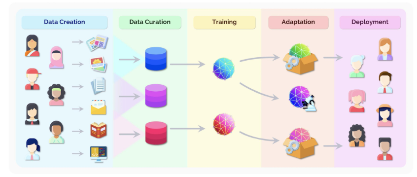
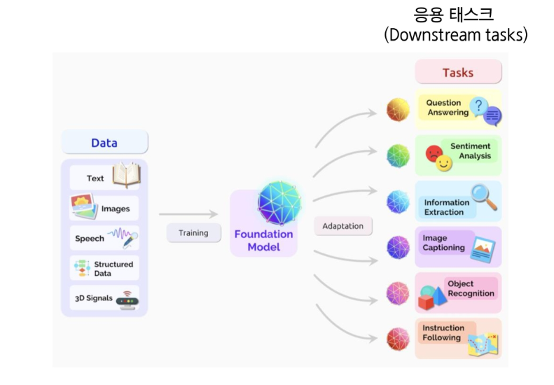
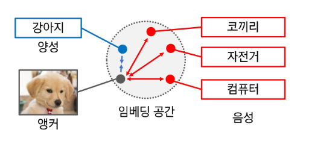
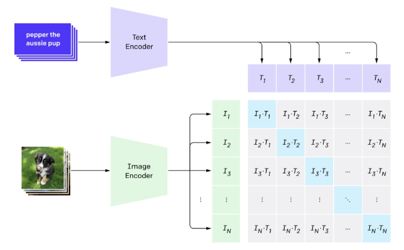
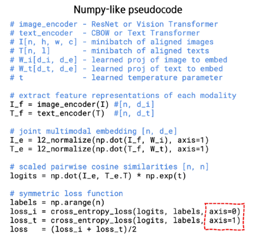
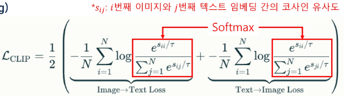
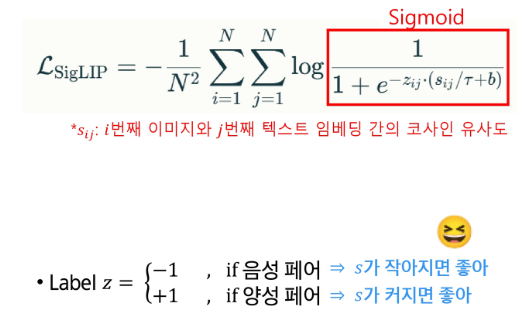
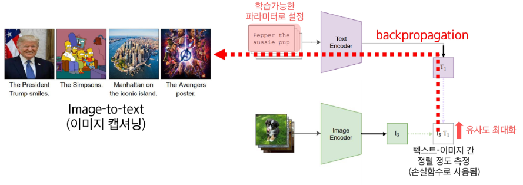
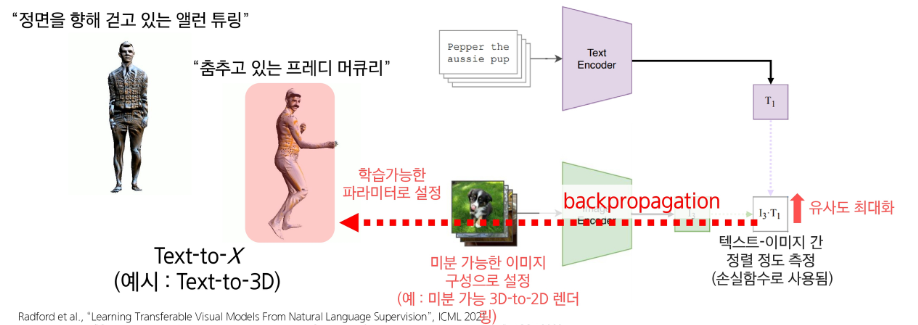

## 파운데이션 모델 (Foundation Model)

### AI 모델

- 함수 또는 프로그램
- 입출력을 연결해주는 함수 + 데이터로 학습된 함수 + 학습 때 보지 못했던 데이터에 대해서도 작동해야하는 의무
- 이상적인 AI 모델? 발생 가능한 모든 데이터와 각 데이터의 설명을 모두 기억하고 있음
    - 내가 얻고 싶은 답과 유사한 답이 DB에 저장되어 있을 확률이 높다
    - 검색 엔진과 유사
        - 최근접 이웃 탐색 (Nearest Neighbor Search) 알고리즘
    - 데이터 확보, 저장, 탐색은 비용이 크고 비현실적
- 현식적인 기계학습 모델? 가설공간을 한정해놓고 학습
    - 데이터를 패턴화하여 압축

### 파운데이션 모델

- 대규모 데이터를 폭넓게 학습한 후 다양한 문제에 빠르게 적응할 수 있는 범용 대형 AI 모델
- 기존 딥러닝 개발 패러다임: 언어, 시각, 청각, 촉각 등 기본적인 것들부터 배워 나가야 한다.
- 파운데이션 모델 패러다임: 거대 모델 (커다란 뇌) + 대규모 데이터 학습 (많은 지식과 경험) 기반
    - 새로운 일을 접해도 금방 배우고 잘할 수 있다.
- 파운데이션 모델의 등장으로, 이제는 잘 학습된 모델들을 어떻게 잘 “활용”하느냐가 핵심

파운데이션 모델 기반 개발 프로세스

### 파운데이션 모델의 특징

- 대규모: 트랜스포머 모델 + 대규모 언어 데이터 학습
    - 테스크에 상관없이 비슷한 패턴들이 등장하고 있다.
    - 주로 비지도 학습으로 훈련된 모델들도 많이 등장
        - 쉬운 데이터를 수집할 수 있어서 대규모 데이터 수집 가능
- 적응성: 높은 파인튜닝 성능
    - 높은 태스크 적응 성능
- 범용성: 다양한 작업, 한정되지 않은 출력 지원
    - 물체 판별: 자연어 기반의 한정되지 않은 대상에 대한 인식 가능

### 적응 활용 기법들

- 프롬프트 {엔지니어링, 튜닝}, 전이 학습, 적응(Adaptation) 학습, 파인튜닝
    - Zero-shot: 처음 보는 문제를 추가 학습 없이 적용
    - Few-shot: 예제 몇 개만 보여주면 바로 적용 가능
    - Fine-tuning: 처음부터 배우지 않아도 조금만 알려주면 금방 적응
        - 모델 자체를 업데이트, 모델 가중치가 변경된다.

## CLIP (Contrastive Language-Image Pre-training)

### 시각언어모델

- 멀티모달 데이터를 처리할 수 있는 LLM
    - GPT-4
    - Claude 기반 Computer use

### CLIP by OpenAI

- 언어와 이미지의 유사도를 학습
    - 오디오와 텍스트 관계 학습, 6가지 모달리티의 관계 학습 등으로 확장됨
- AI가 언어와 시각을 통합해서 이해하는 방식을 보여준 패러다임 전환을 제시했다.
- 입력: 학습하지 않은 새로운 도메인의 입력 데이터에 대해서도 좋은 성능 발휘 (제로샷 전이)
- 출력: 자연어를 이용해 한 번도 본 적 없는 카테고리도 텍스트 설명만으로 출력 정의 가능 (언어 인터페이스)

### 이미지 사전 학습

- 인터넷 데이터를 통한 지도 학습을 통해 자연어 기반 시각 개념 학습
    - 인터넷에서 수집된 4억 개의 이미지-텍스트 쌍
    -  태그의 alt-text 속성, 이미지 캡션, 제목 등을 기반으로 수집함
    - 데이터 정제 과정을 거침
- 대조 학습 (Contrastive Learning)
    - 목표 이미지 (anchor)를 대응하는 텍스트 (positive)와는 가깝게
    - 일치하지 않는 여러 텍스트 (negative)와는 멀게

### CLIP 구조

- 텍스트 인코더 - Transformer (Encoder only)
- 이미지 인코더 - ViT-B of ResNet50

CLIP 모델 구조

- 대조학습
    
    
    
    
    
    - 소프트 맥스 함수 적용
    - 텍스트, 이미지 중심으로 대칭이 되도록 한다.
    - 두 손실값의 평균

### SigLIP

- CLIP과 달리 일치하지 않는 음성 데이터에 제한된 영향만 받도록 손실함수 디자인을 수정
- sigmoid를 손실함수로 사용
    - 어느 정도 커지면 고려하지 않는다.
- 학습 데이터에 약간의 노이즈를 추가하면 성능이 좋아진다.
- CLIP 대비 압도적인 성능을 보이며 최신 VLM에 널리 활용

### CLIP loss

- 멀티모달 정합 손실함수로 활용
- 정합(Matching)을 통한 크로스 모달 변환
- 단일 데이터에 대해서만 학습 = 최적화 (학습 X)
- 이미지 입력을 학습가능한 파라미터로 간주
- 이미지 캡셔닝, Text-to-image, Text-to-motion, Text-to-3D 등

