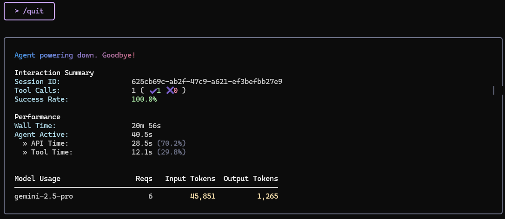

# Gemini-CLI

### `/tools` : 도구 목록 출력

ℹAvailable Gemini CLI tools:

```
- Edit
- FindFiles
- GoogleSearch
- ReadFile
- ReadFolder
- ReadManyFiles
- Save Memory
- SearchText
- Shell
- WebFetch
- WriteFile
```

`/quit` 또는 `ctrl + c 연타`: Gemini CLI 종료



### Shell 도구

- git clone 및 push 시킬 수 있음

### Gemini CLI 단축키

**대화 관리**

`/compress` 대화를 요약할 수 있다. → 효율적인 토큰 관리

`/chat save <tag>` <tag>라는 이름의 대화를 저장한다. (checkpoint 생성)

`/chat list` 대화 목록 조회

`/chat resume <tag>` <tag>이름의 대화를 불러와 이어서 대화할 수 있다.

`/chat delete <tag>` <tag>이름의 대화 삭제

**CLI**

`gemini -p "안드레 카파시가 누구예요?"` (prompt) CLI 실행 없이 답변 생성

`gemini -m "gemini-1.5-flash"` (model) CLI 모델 설정 

`/auth` Google 로그아웃


### 코드 실행 과정

사용자: 프롬프트 입력

```
> 인덱스 페이지를 만들어 주세요. 
	인덱스 페이지에는 사이트를 소개하는 글을 넣고, 
	Navbar에 SSAFY라는 브랜드 로고를 클릭하면 
	해당 페이지로 이동해 주세요.
```

AI: 인덱스 페이지 코드 작성

AI: WriteFile 도구로 파일 (index.html) 작성

AI: ReadFile 도구로 login.html, signup.html 파일 조회

AI: Edit 도구로 login.html, signup.html 파일 수정

AI: Edit 도구로 index.html 파일 수정 (동일 디자인 적용)

→ 비효율적으로 일하고 있음. 내일은 효율적인 방법을 배워보자!


### 업무 중단 시 대응 방법

- 사용량 초과로 업무 중단
1. `/chat save <tag>`로 대화 내역 저장
2. `/auth` 로그아웃, Gemini CLI 종료
3. 재실행 후 다른 구글 계정으로 로그인
4. `/chat resume <tag>`로 대화 내역 불러오기 - 이어서 작업 요청

- 1~2분이 지나도 다음 단계로 넘어가지 못하는 경우
1. `esc`버튼 클릭 - 요청 취소
2. 상황 보고 지시
3. 직접 해결 방법 질문 또는 업무 재시도 지시

### 코드 디버깅

1. 루트 디렉토리에 error.txt  파일 생성 후 에러 메시지 붙여넣기
    - 실행 시 발생한 에러를 그대로 복사-붙여넣기 하면 줄바꿈으로 인해 CLI 특성상 다음 명령으로 넘어감
2. 간단한 상황 설명과 함께 문제 해결 지시
    - at commands `@`를 사용해 경로를 특정하면 효율적인 디버깅 가능