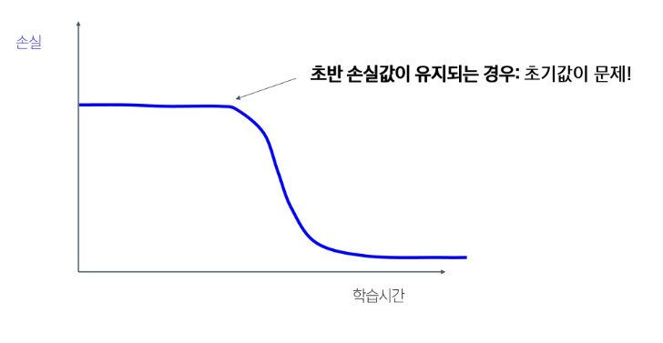

## 학습 최적화 전략

### 학습률

- 학습률은 가장 중요한 하이퍼상수!!!
- 학습률을 너무 높거나 낮게 잡으면, loss가 충분히 줄어들지 않거나 폭발할 수 있다.
- 기본 전략: 학습 비율을 큰 값에서 시작하여, epoch가 지날수록 작은 값으로 조정
- 계단식 변경: 일정 epoch가 지날 때마다 계단식으로 줄이는 방식
    - 학습 곡선이 불안정할 수 있다.
- 코사인 변경: 학습률을 코사인 함수 곡선처럼 점점 줄여가는 방식
- 선형 변경: 학습률을 선형(직선)으로 줄여나가는 방식
    - 사전학습, 미세조정에서 주로 사용한다.

### 빠른 종료 (Early Stopping) 기법

- 과적합 방지를 위한 방법
- 학습 루프: 순전파 → 손실 계산 → 역전파 → 가중치 업데이트 (= 1 epoch)
- 학습을 진행하면서 더이상 성능이 좋아지지 않고, 오히려 나빠지기 시작하면 학습을 조기에 멈춘다.

### 하이퍼파라미터

- 파라미터: 학습을 통해 모델 스스로 얻는 값
    - 뉴럴 네트워크의 가중치, 편향 등
- 하이퍼파라미터: 학습 전에 사용자가 정해야 하는 값
    - 학습이 진행되는 동안 고정됨
    - 학습 관련: 학습률, batch size, epoch
    - 최적화 관련: 최적화 툴(SGD, Adam 등), 모멘텀 최적화 계수, 가중치 감소 (L2, L1)
    - 모델 구조 관련: 네트워크 깊이, 채널 수/드롭아웃 비율, 정규화

- 모델 학습 성능은 하이퍼파라미터 선택에 크게 의존한다.
    - 어떤 값의 조합이 최적일지 탐색 필요

- 그리드 탐색: 하이퍼파라미터 후보들을 격자처럼 전부 조합해보는 방식
- 랜덤 탐색: 하이퍼파라미터 공간에서 무작위로 값을 선택해 탐색

### 체크리스트

1. 초기 손실값 확인

- CE 손실이라면, 초기 손실은 log(C)와 유사한 수준이어야 정상
- 예상치를 크게 벗어난다면 데이터 로딩/라벨 문제를 확인

2. 학습률과 초기값 확인

작은 샘플을 활용해서 일부러 과적합(정규화 X, 정확도 100%)을 시켜보자

- 손실이 줄지 않는다면?
    - 학습률/초기화 문제
    - 모델 구조의 오류 가능성
    - 활성화 함수 이슈
    - 최적화 툴 이슈/코드 버그
- 손실이 폭발한다면?
    - 학습률을 줄이고, 초기화 변경
    - 네트워크 깊이가 깊거나, 구조적 이슈 (RNN)

3. 구조, 최적화 툴 활용, 학습률을 찾자
- 모든 학습 데이터 활용, 작은 iteration (≤ 100)을 빠르게 손실이 줄어드는 학습률을 우선 탐색
- 일반적 탐색 범위: 로그 스케일로 1e-1, 1e-2, 1e-3, 1e-4
    - 손실이 실제로 줄어들기 시작하는 좋은 학습률 시작점을 다수 확보

4. 후보 학습률 + 후보 가중치 변형 방식 중 좋은 조합을 탐색
- 좋은 조합은 초기 몇 에폭 내에 손실이 줄어든다.
- 검증 세트에서의 성능을 관찰할 것

5. 좋은 조합을 활용, 10-20 에폭까지 추가 학습
- 학습률 줄이기는 적용하지 않는다.
    - 학습 속도가 느려지기 때문

6. 학습률에 따른 손실곡선, 정확도 곡선 관찰

