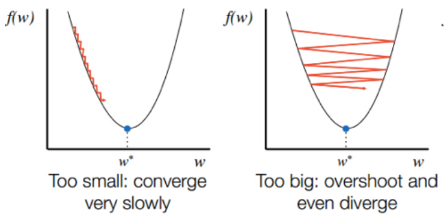

## [회귀] 선형 회귀 (Linear Regression)

> 데이터에서 직선의 방정식을 찾다
>

하나의 직선으로 예측하는 가장 간단하고 직관적인 방법 (다차원일 경우에는 평면/초평면)

- 단순 선형 회귀: 하나의 특성만 있을 때
    - 공부한 시간(x)에 따른 시험 점수(y) 예측
    - y = wx + b
    - w (weight, 가중치): 직선의 기울기
    - b (bias, 편향): 기본 점수
- 다중 선형 회귀
    - 캐럿(x1), 투명도(x2), 깊이(x3)를 모두 고려한 다이아몬드 가격(y) 예측
    - y = w1x1 + w2x2 + w3x3 + … + b
    - 각각의 특성에 대한 최적의 가중치와 편향을 찾는 것이 목표

- 모델(=가설): 데이터를 설명하는 직선
    - 좋은 모델은? 데이터들과의 거리**(오차)가 가장 작은** 직선
- 비용 함수 : ‘좋음’의 정도를 숫자로 나타낸 것
    - 비용(cost): 오차들의 총합

### 비용 함수 (Cost Function)

머신러닝 모델이 전체 데이터에 대해 평균적으로 얼마나 잘 예측하는지를 나타내는 하나의 점수

- 이 점수가 낮을수록 모델의 성능이 좋다
- 개별 데이터에서 틀린 부분(손실, loss)들이 모여 최종 성적(비용, cost)이 결정된다.
- 회귀 - 평균 제곱 오차 (MSE), 평균 절대 오차 (MAE)
- 분류 - 교차 엔트로피

**비용 함수의 역할**

- 모델 평가: 현재 모델이 얼마나 좋은지 정량적인 점수로 알려준다.
- 학습 방향 제시: 모델은 ‘비용’을 낮추는 방향으로 파라미터(w, b)를 계속해서 수정하며 학습을 진행한다. (경사 하강법)

**비용 함수 vs 손실 함수**

| 구분 | 손실 함수 (Loss Function) | 비용 함수 (Cost Function) |
| --- | --- | --- |
| 대상 | 개별 데이터 1개 | 전체 데이터셋 |
| 역할 | 모델이 단 하나의 예측을 얼마나 잘못했는지 측정 | 모델이 전체 데이터에 대해 평균적으로 얼마나 잘못했는지 측정 |
| 목표 | 개별 오차 계산 | 전체 오차의 평균 계산 |
- 비용 함수는 전체 데이터셋에 대한 모든 손실(Loss)의 평균 값
- 비용 함수(전체 오차 평균)를 최소화하는 것이 머신러닝의 최종 목표
- 비용 함수와 손실 함수를 혼용하는 이유?
개별 데이터의 손실을 줄임으로써 결과적으로 전체 비용을 줄인다는 의미를 내포하기도 한다.

### 평균 제곱 오차 (MSE, Mean Squared Error)

- 회귀에서의 대표적인 비용 함수
- 모델의 예측값이 실제 정답과 얼마나 차이나는지 측정하는 방법
- 각 오차를 제곱하여 평균을 낸 값
    - 제곱하는 이유? 양수 오차와 음수 오차의 상쇄 막기, 큰 오차에 패널티 부여
- 점수가 낮을수록 모델의 성능이 좋다는 의미

### 최소 제곱법 (MLS, Method of Least Squares)

- 예측 모델에서 비용을 최소화하는 w와 b를 찾는 원리
- MSE 점수(비용)를 0에 가장 가깝게 만드는 최적의 모델 (w, b)를 찾는 것이 목표
- 목표를 위한 방법으로 사용하는 것이 최소 제곱법(MLS)
    - 정규 방정식 (해석적 해법)
    - 경사 하강법 (반복적 해법)

### 정규 방정식

- 수학공식을 이용해 최적의 파라미터를 한번에 계산하는 방법

    

- 데이터의 특성이 많으면 속도가 매우 느려진다.
- 역행렬이 존재하지 않으면 계산할 수 없다. → 특이 값 분해(SVD)로 해결로 해겷

### 경사 하강법 (Gradient Descent)

- 함수의 기울기(경사)를 이용하여 최적의 파라미터를 찾아나가는 방법
- 랜덤한 지점의 기울기를 구하고, 해당 기울기만큼 움직이는 과정을 반복한다.
    - 움직이는 보폭을 **학습률(Learning Rate)**이라고 한다.
    - 비용 함수의 기울기가 0이 되는 지점이 가장 비용이 낮은 지점 → 최적
- 학습률(Learning Rate) 설정
    - 학습률이 너무 크면, 반대편으로 올라갈 수 있다. (발산, overshooting)
    - 학습률이 너무 작으면, 너무 오래 걸린다.

        

- 지역 최소값 문제
    - 최소값을 착각할 가능성이 있다.
    - global minima(최소)가 아닌 local minima(국소)에 빠질 수 있다.

- 용어 정리

| 용어 | 설명 |
| --- | --- |
| 기울기 (gradient) | 전체 데이터가 만들어내는 평균적인 오차의 기울기 |
| 이터레이션 (iterations) | 데이터의 일부 혹은 전체를 보고, 현재 위치의 경사를 계산하고 한 걸음 이동하는 과정 |
| 에포크 (epoch) | 전체 데이터를 모두 한 번 훑어보면, 1 에포크 |
| 학습률 (learning rate, alpha) | 한 번에 얼마나 크게 움직일지를 결정하는 보폭 |
| 허용 오차 (tolerance, tol) | 학습 조기 종료 조건. 모델의 오차 감소량이 매우 작아지면, 학습해도 성능 향상이 없겠다고 판단하여 학습을 멈춘다. |
| 배치 크기 (batch) | 기울기를 구할 때 전체 데이터 오차의 기울기를 한 번에 구하지 않고 작은 묶음(배치)으로 나눠서 처리한다. 전체 데이터 오차의 기울기를 한 번에 구하는 경우에는 1 이터레이션 == 1 에포크 |
| 기울기 누적 스텝 (gradient accumulation steps) | 실질적인 배치 크기를 늘리는 고급 기법. 매 배치마다 업데이트하는 것이 아닌, n번의 배치 간격으로 누적한 기울기를 기반으로 이동한다. |

**경사 하강법 종류**

- 배치 경사 하강법 (Batch Gradient Descent): 전체 데이터를 훑어보고 기울기를 계산
    - 1 epoch = 1 iteration
    - 정확하지만 데이터가 크면 매우 느리다
- 확률적 경사 하강법 (SGD, Stochastic Gradient Descent): 하나의 데이터만 보고 바로 기울기를 계산
    - 매우 빠르지만 불안하다
- 미니배치 경사 하강법 (Mini-batch Gradient Descent): 적당한 수의 배치만 보고 기울기를 계산
    - 속도와 안정성
    - 배치 수는 실험적으로 구해야 한다

### 정규 방정식 vs 경사 하강법

