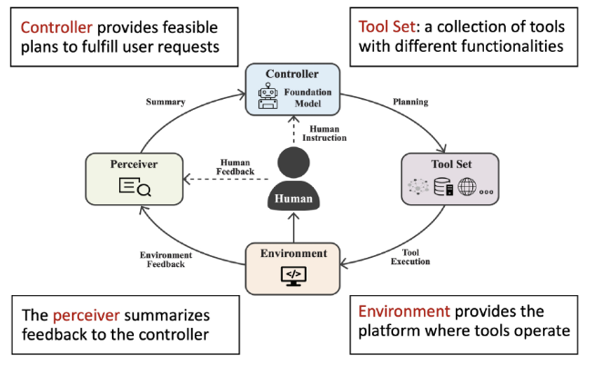
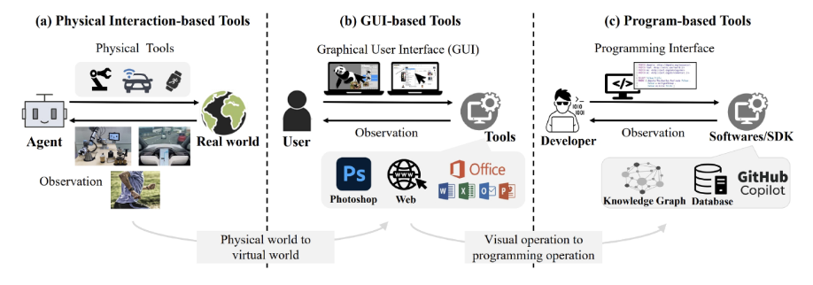

# Tool Augmented LLM (Agent)

## LLM Agent

- Agent: 센서를 통해 환경 (environment)을 인지하고, Actuator를 통해 환경에 대해 액션(action)을 통해 영향을 미치는 것으로 간주될 수 있는 모든 것
- LLM Agent: LLM을 핵심 구조로 삼아 환경을 이해하고 행동을 수행하는 에이전트
- LLM-first view: 기존 LLM을 활용한 시스템을 에이전트로 만든다.
    - 서치 에이전트, 심리상담 에이전트, 코드 에이전트
- Agent-first view: LLM을 AI에이전트에 통합하여 언어를 활용한 추론과 의사소통을 가능하게 한다.
    - 로봇, embodied 에이전트
- 성공적인 에이전트가 갖추어야 할 요건들: 도구 사용 (Tool Use), 추론과 계획 (Reasoning and Planning), 환경 표현, 환경 이해, 상호작용/의사소통



LLM Agent 프레임워크


## Tool Usage in LLMs

### Tool이란?

- LLM 에이전트에서 Tool은 언어모델 외부에서 실행되는 프로그램에 연결되는 함수 (function) 인터페이스를 의미한다.
- LLM은 함수 호출과 입력 인자를 생성함으로써 이 도구를 활용할 수 있다.



LLM 에이전트에서 Tool의 의미

### 도구 사용 패러다임 (Tool Use Paradigms)

- 도구 사용 (Tool Use): 두 모드 간의 전환
    - 텍스트 생성 모드 (text-generation mode)
    - 도구 실행 모드 (tool-execution mode)
- 도구 사용을 유도하는 방법
    - 추론 시 프롬프트 (inference-time prompting)
    - 학습 (Training; Tool Learning)

### 툴 러닝 (Tool Learning) 방식

- 모방 학습 (Imitation Learning): 인간의 도구 사용 행동 데이터를 기록함으로써, 언어모델이 인간의 행동을 모방하도록 학습
    - 가장 간단하고 직관적인 방식
    - OpenAI: WebGPT (2022): 지도 학습 (Supervised fine-tuning) + 강화 학습 (Reinforcement Learning)
    - Meta: Toolformer (2023): self-supervised, 지도 학습 (Supervised fine-tuning)
- 멀티 모달 툴 러닝 (Multi-modal Tool Learning): 멀티모달 대규모 언어모델(MLLM)을 기반으로 도구를 정의하고 활용하는 연구
    - GUI 에이전트, Embodied 에이전트
- 강화 학습: 지도 학습을 넘어 에이전트에서의 강화 학습을 도입하는 연구

## Environment Representaion & Understanding

### 환경 이해를 위해 필요한 것

- 환경에 접근하기 위한 툴 (Tool)
- 환경의 표현 (Representation)
- 환경을 이해, 탐색하기 위한 방법론들

### 환경의 표현 (Representaion)

- 텍스트 (Text): 물리적 세계에 대한 정보를 언어모델이 텍스트 기반으로 이해하고 명령을 수행할 수 있도록 환경을 표현
- 이미지 (Image): 시각적 환경을 텍스트와 연결하여 지시 수행 및 환경 이해를 가능하게 함
    - Touchdown: Google Street View 기반 내비게이션 및 지시 따르기 데이터셋
    - 에이전트로서 좋은 성능을 내려면 세부적인 이해가 중요하다.
    - 예: OCR(광학 문자 인식), 복잡한 레이아웃에서의 그라운딩
- 텍스트 기반 웹 (Textual Web Representaion): 웹 환경을 텍스트 (HTML, DOM, Accessibility Tree)로 표현하여 에이전트가 상호 작용 가능
    - WebArena

### 복잡한 환경에 대한 이해

- 환경 특화 프롬프트 (Environment-specific Prompts): 환경에 맞게 수동으로 프롬프트를 제작하여 에이전트가 지시를 따르도록 유도
    - 일반화가 잘 안 됨.
- 비지도 프롬프트 유도 (Unsupervised Induction of Prompts): 에이전트가 경험을 통해 프롬프트 자동 생성 및 일반화
    - Agent Workflow Memory: 환경에서의 상호작용을 메모리에 통합
- 환경 탐색 (Environment Exploration): 모델이 환경을 탐색할 때 보상 (reward)ㅇ르 부여하여 학습을 유도
- 탐색 기반 궤적 기억 (Exploration-based Trajectory Memorization): 탐색과 자기 교정(Self-correction)을 통해 데이터 생성

## Reasoning & Planning

### Planning

- Local Planning (국소적 계획): step by step 계획을 세우고, 매 스텝마다 사용할 하나의 툴(tool) 결정
    - 단순하고 직관적이나, 장기 의존성 문제
    - ReACT: 추론과 액션을 결합하여 에이전트가 환경과 상호작용하도록 하는 방식
- Global Planning (전역적 계획): 실행 가능한 전체 계획 경로 (planning path)를 한 번에 생성
    - 여러 개 툴을 조합하여 시퀀스 형태로 결정
    - 효율적이나, 복잡한 환경에서 실패 가능성
    - Plan-and-Solve Prompting

### Reasoning

- 오류 식별과 회복 (Error identification and Recovery): 에이전트는 에러/실수에서 회복할 방법이 필요
    - Reflexion: 수행한 궤적을 평가 후 잘못된 부분을 Reflection 단계에서 분석하여 재시도하는 방식
- 계획 재검토 (Revisting Plans): 에이전트가 실행 도중 계획을 재검토(revisit)하고 수정 가능
    - CoAct: 두 개의 에이전트가 서로 협력하여 오류 발생 시 재계획과 피드백을 수행
    - 장기 작업에서 안전성과 성공률 향상


## Agent와 Tools

### Agent

Agent는 다음의 핵심 요소들로 구성될 수 있습니다:

- **LLM (Large Language Model):** 에이전트의 의사결정 및 텍스트 생성 능력의 기반입니다. 사용자의 요청을 이해하고, 어떤 도구를 사용할지, 다음 단계는 무엇일지 등을 판단하는 역할을 합니다.
- **Planner (계획자):** 복잡한 목표를 달성하기 위해 일련의 단계(Sub-goals)를 설정하고, 각 단계에 필요한 도구 사용 계획을 세웁니다.
- **Tool (도구):** 에이전트가 특정 작업을 수행하거나 외부 정보에 접근하기 위해 사용하는 기능입니다. 예를 들어, 검색 엔진 도구, 계산기 도구, 데이터베이스 조회 도구 등이 있습니다.
- **Memory (메모리):** 과거 대화 기록이나 작업 수행 정보를 기억하여 현재의 의사결정이나 다음 행동에 활용합니다.
- **Observation (관찰):** 도구 사용 결과나 외부 시스템과의 상호작용 결과를 받아들이고 해석하는 과정입니다. 이 관찰 결과를 바탕으로 계획을 수정하거나 다음 행동을 결정합니다.

**Agent의 작동 방식:**

1. 사용자가 "주말 배송 정책 알려줘"라고 질문함.
2. Agent(LLM)가 질문을 분석하고, 사용 가능한 도구 목록(`[rag_chain, GoogleSearch]`)을 살펴봄.
3. Agent가 "이 질문은 문서 검색이 필요하다. `rag_chain` 도구를 사용해야겠다"라고 **결정(Reasoning)**함.
4. Agent가 `rag_chain`을 호출하고 결과를 받음.
5. Agent가 `rag_chain`의 결과를 바탕으로 최종 답변을 생성함.

### Tool

- Tools: Agent가 사용할 수 있는 '도구'의 목록.
    - `Tool 1`: 우리가 만든 `rag_chain` (문서 검색 및 답변용)
    - `Tool 2`: `GoogleSearch` (실시간 정보 검색용)
    - `Tool 3`: `Calculator` (수학 계산용)
    - `Tool ...`: 기타 API 또는 사용자 정의 함수

### Retriever 도구화

- 생성된 Retriever를 에이전트 도구로 만듦

```python
# langchain 패키지의 tools 모듈에서 retriever 도구를 생성하는 함수를 가져옵니다.
from langchain.tools.retriever import create_retriever_tool

# retriever tool 생성
if 'retriever' in locals():
    shipping_policy_retriever_tool = create_retriever_tool(
        retriever,
        "shipping_policy_search_tool", # Tool name for the agent
        "Searches and returns information about the AI online bookstore's shipping policy." # Tool description (English is recommended)
    )

    # Create a list of tools
    agent_tools = [shipping_policy_retriever_tool]

    print("\n--- 배송 정책 검색 도구 생성 완료 ---")
    print(f"생성된 도구: {agent_tools}")
    print("-" * 20)
else:
    print("오류: 'retriever' 변수가 생성되지 않았습니다. Vector Store 및 Retriever 생성 단계를 먼저 실행해주세요.")
```

```python
from langchain_core.tools import tool
@tool
def get_order_status(order_id: str) -> str:
    """주문 번호를 입력받아 해당 주문의 배송 상태를 반환합니다.
    알 수 없는 주문 번호의 경우, 해당 주문을 찾을 수 없음을 알립니다.
    """
    # 실제 시스템에서는 데이터베이스 조회 등의 로직이 들어갑니다.
    # 여기서는 예시를 위해 더미 데이터를 사용합니다.
    order_statuses = {
        "order-123": "상품 준비 중",
        "order-456": "배송 중",
        "order-789": "배송 완료",
    }

    status = order_statuses.get(order_id, f"주문 번호 {order_id}를 찾을 수 없습니다.")
    return status

print("--- 주문 조회 도구 생성 완료 ---")
print(f"생성된 도구 이름: {get_order_status.name}")
print(f"생성된 도구 설명: {get_order_status.description}")
print("-" * 20)

# 생성된 도구를 리스트에 추가 (이후 에이전트 빌드 시 사용)
# 이전에 생성된 tools 리스트에 추가하거나, 새로운 리스트를 생성합니다.
# 여기서는 새로운 리스트를 생성합니다.
agent_tools.append(get_order_status)

print("\n--- 현재 에이전트 도구 목록 ---")
print(agent_tools)
print("-" * 20)

# 도구 사용 예시 (실제 에이전트가 호출하는 방식)
# print(get_order_status.invoke("order-123"))
# print(get_order_status.invoke("order-999"))
```

```python
from langchain.tools import tool

@tool
def greet_customer(query: str) -> str:
    """고객의 인삿말(예: 안녕, 안녕하세요)이 포함되어 있으면, 정해진 환영 메시지를 반환합니다."""
    greeting_keywords = ["안녕", "안녕하세요", "하이", "반가워요"]
    if any(keyword in query for keyword in greeting_keywords):
        return "안녕하세요! AI 온라인 서점입니다. 무엇을 도와드릴까요?"
    else:
        # 인삿말이 아닌 경우, 도구를 사용하지 않도록 빈 문자열 또는 None을 반환할 수도 있습니다.
        # 여기서는 간단히 인삿말이 아님을 알립니다.
        return "" # 에이전트가 이 도구를 사용하지 않도록 유도

print("--- 인사 도구 생성 완료 ---")
print(f"생성된 도구 이름: {greet_customer.name}")
print(f"생성된 도구 설명: {greet_customer.description}")
print("-" * 20)

# 생성된 도구를 기존 에이전트 도구 리스트에 추가
agent_tools.append(greet_customer)

print("\n--- 현재 에이전트 도구 목록 ---")
print(agent_tools)
print("-" * 20)

# 도구 사용 예시
# print(greet_customer.invoke("안녕하세요! 배송 문의드려요."))
# print(greet_customer.invoke("주문 상태 확인 부탁드립니다."))
```


## Langchain

- LLM 기반 애플리케이션을 빠르게 개발할 수 있는 오픈 소스 프레임워크
- LLM을 다양한 데이터/툴과 연결하여 강력한 애플리케이션 개발 가능
- 다양한 LLM provider (OpenAI, Anthropic, Google, etc)와 통합하여 모델/회사별 API 차이를 공통 인터페이스로 관리 가능

### LLM Chain이란?

- LLM을 기반으로 출력을 생성하는 여러 구성 요소의 결합.
- **기본 구성**
    1. Prompt (사용자 입력을 받아 LLM에게 전달할 지시사항 생성)
    2. LLM (모델, 지시사항을 받아 텍스트 생성)
    3. Output Parser (모델의 텍스트 출력을 원하는 형식(JSON, str 등)으로 변환).

### LangChain이란?

- 위에서 언급한 LLM Chain을 쉽게 구축하도록 돕는 프레임 워크
- **기본 구성**
    1. `langchain-core`: LangChain의 핵심 문법(LCEL)과 기본 인터페이스 정의.
    2. `langchain-community`: Vector Store, Document Loader 등 다양한 외부 도구 연동.
    3. `langchain-openai`, `langchain-upstage` 등: 특정 LLM을 쉽게 사용하도록 돕는 파트너 패키지.
    4. `LangSmith`: LLM 체인의 실행 과정을 추적, 디버깅, 평가하는 플랫폼.

### LCEL (LangChain Expression Language)

- LangChain의 핵심 문법으로, 파이프 (`|`) 연산자를 사용해 체인을 구성함.
- LCEL의 장점:
    1. **간결성 (Declarative):** 절차적 코드(예: `result1 = prompt.format(...)`, `result2 = model.invoke(result1)`) 대신, `chain = prompt | model | parser`와 같이 '흐름'을 선언적으로 정의.
    2. **스트리밍 및 비동기 지원:** LCEL로 정의된 체인은 별도 수정 없이 `.stream()`, `.ainvoke()` (비동기) 호출을 즉시 지원. 이는 절차적 코드로 구현하기 매우 복잡함.
    3. **조합성 (Composability):** 모든 체인은 'Runnable'이라는 단일 인터페이스를 따르므로, 작은 체인을 만들어 더 큰 체인의 부품처럼 조합할 수 있음.

```python
# 예시 코드
from langchain.prompts import ChatPromptTemplate
from langchain_upstage import ChatUpstage
from langchain_core.output_parsers import StrOutputParser

# 1. Prompt (Runnable): 입력(dict)을 받아 PromptValue 객체를 출력
# from_template: 템플릿 문자열을 사용하여 프롬프트 생성
prompt = ChatPromptTemplate.from_template('{topic}에 대해 설명해주세요')

# 2. Model (Runnable): PromptValue를 받아 AIMessage 객체를 출력
# ChatUpstage: Upstage의 챗 모델 인터페이스
# (API 키는 .env를 통해 로드된 환경 변수에서 자동으로 읽어 감)
model = ChatUpstage()

# 3. Parser (Runnable): AIMessage를 받아 문자열(str)을 출력
# StrOutputParser: 모델의 출력(AIMessage 객체)에서 텍스트 내용만 추출하여 단순 문자열로 반환
parser = StrOutputParser()

# LCEL을 사용한 체인 구성: prompt의 출력이 model로, model의 출력이 parser로 전달됨
chain = prompt | model | parser

# .invoke(): 체인을 실행하는 표준 메소드
# 입력값 {'topic': 'SSAFY'}는 첫 번째 Runnable(prompt)의 입력으로 들어감.
result = chain.invoke({'topic': 'SSAFY'})

print(result)
```

### 답변 방식 제어 (Structured Output)

- LLM은 기본적으로 '텍스트'를 생성하므로, JSON이나 특정 형식의 출력을 강제하기 어려움.
- LangChain은 `Pydantic`과 `OutputParser`를 결합하여 LLM이 구조화된 데이터(JSON)를 반환하도록 유도함.
1. `Pydantic`: 데이터 유효성 검사 및 설정 관리 라이브러리.
    - **Python의 표준 타입 힌트**를 사용해, 원하는 데이터의 '스키마'를 클래스로 정의함.
    - 이 스키마 정의(특히 `Field`의 `description`)는 LLM에게 어떤 정보를 추출해야 하는지 알려주는 '힌트'가 됨
2. `JsonOutputParser`: Pydantic 모델과 연결되어 두 가지 핵심 작업을 수행함
    - **(입력 단계):** `get_format_instructions()`: Pydantic 모델을 기반으로 LLM에게 JSON 형식을 지시하는 프롬프트(텍스트)를 생성.
    - **(출력 단계):** LLM이 생성한 텍스트(JSON 문자열)를 파싱하여 Pydantic 객체(Python 객체)로 변환하고 유효성을 검사함.

```python
# 예시: 답변을 제목과 내용으로 구조화
from pydantic import BaseModel, Field
from langchain_core.output_parsers import JsonOutputParser  # 또는 PydanticOutputParser

# 1. Pydantic을 사용하여 원하는 출력 스키마 정의
class Summary(BaseModel):
    # Field의 'description'은 LLM에게 이 필드의 의미를 알려주는 중요한 힌트.
    title: str = Field(description='배송 방식')
    description: str = Field(description='배송 방식에 대한 정리')

# 데이터 불러오기
loader = TextLoader(base_path + 'shipping_policy.txt')
documents = loader.load()

# 3. ChatPromptTemplate 작성
prompt = ChatPromptTemplate.from_template(
    """
        당신은 어려운 문장을 쉽게 풀어서 설명하는 전문가입니다.
        1. 파일이 주어지면, 이 내용을 읽고 이해합니다. 답변에 추가하지 않습니다.
        2. 만약, 서로 다른 주제가 있다면 구분하여 다른 객체에 답변을 작성합니다.
        3. 당일, 익일 등은 오늘 오전과 같이 쉽게 풀어서 설명합니다.
        단, 지정된 JSON 형식으로 출력하세요:

{text}

{format_instructions}
    """
)

model = ChatUpstage()

# 2. JSONOutputParser를 Pydantic 모델과 연결
# pydantic_object 매개변수에 정의한 Summary 모델을 전달
parser = JsonOutputParser(pydantic_object=Summary)

# get_format_instructions(): Pydantic 모델을 기반으로 JSON 스키마 지시사항(텍스트) 생성
# 이 지시사항이 프롬프트의 {format_instructions} 부분에 주입됨.
format_instructions = parser.get_format_instructions()

# 4. 체인 구성 (Prompt -> Model -> Parser)
structured_chain = prompt | model | parser

# 5. 답변 확인
# .invoke()의 입력은 첫 번째 Runnable(prompt)의 입력 요구사항을 따름.
result = structured_chain.invoke(
    {'text': documents, 'format_instructions': format_instructions}
)
```

### 연쇄 요청

- LCEL의 장점인 '조합성(Composability)'을 활용한 예시.
- 1차 요청(정리)의 결과를 2차 요청(번역)의 입력으로 사용하는, 두 단계의 체인을 구현.
- `structured_chain` (앞서 만든 체인) 자체를 더 큰 `final_chain`의 '부품'으로 사용함.
1. **1단계 체인**: `structured_chain` (텍스트 -> JSON 요약)
2. **2단계 체인**: `translation_chain` (JSON 요약 -> 영어 번역)
3. **연결**: 두 체인을 파이프로 연결. 단, 1단계의 출력과 2단계의 입력 형식을 맞춰주기 위해 `lambda` 함수(RunnableLambda)를 중간에 사용

```python
# 2단계 체인(번역)을 위한 프롬프트
second_prompt = ChatPromptTemplate.from_template(
    """
        주어진 내용을 영어로 번역하세요:
        {json_content}
        응답 형식은 주어진 형식과 완전히 동일하게 반환하세요.
    """
)

# 2단계 체인(번역)을 위한 파서 (단순 문자열 출력)
second_parser = StrOutputParser()

# 2단계 체인 구성
translation_chain = second_prompt | model | second_parser

# 1단계 체인과 2단계 체인을 연결하여 최종 체인 구성
final_chain = (
    structured_chain  # 1. 입력(text, format_instructions) -> 1차 결과(JSON 객체)
    # 2. (RunnableLambda) 1차 결과를 2차 체인의 입력 형식에 맞게 변환.
    # 1차 결과(x)를 {'json_content': x} 딕셔너리로 래핑함.
    | (lambda x: {'json_content': x})
    | translation_chain  # 3. 래핑된 딕셔너리 -> 2차 결과(번역된 문자열)
)

# 최종 체인 실행 (입력은 1단계 체인의 요구사항과 동일)
final_result = final_chain.invoke(
    {'text': documents, 'format_instructions': format_instructions}
)

pprint(final_result)
```

