# 대규모 언어 모델 (LLM)의 이해

## 파운데이션 모델과 LLM

### 파운데이션 모델

- 대량의 데이터를 기반으로 사전 학습된 대규모 AI 모델
- 다양한 작업에 범용적으로 활용할 수 있는 기초(foundation) 역할
- 텍스트 생성 (예: ChatGPT), 비디오 생성 (예: SORA), 멀티모달 입력을 통해 멀티모달 출력 (예: GPT-4o)

- 파운데이션 모델 이전에는 새로운 테스크를 해결하려면 해당 테스크에 대한 ‘별도의 학습’이 필요했다.

    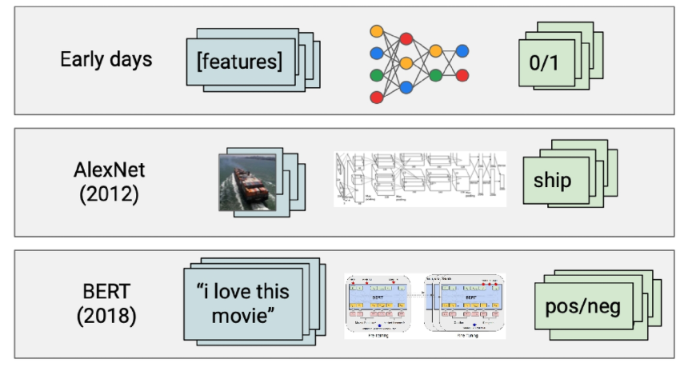

    AI 모델 학습을 위한 방법론

- 파운데이션 모델은 새로운 테스크를 해결하려면 ‘자세한 설명(프롬프트)’을 입력해주는 것으로 충분하다.

### 파운데이션 모델의 3요소

- 빅데이터
    - 인터넷에 존재하는 데이터 수가 기하급수적으로 증가
    - 딥러닝 기반 AI 모델은 학습 데이터가 늘어날수록 성능이 증가
- 자가 학습 (Self-supervised Learning) 알고리즘
    - 사람이 정답을 알려줄 필요가 없다.
    - 예: 다음 토큰 예측 (Next token prediction)
- 어텐션 (Attention) 기반 트랜스포머 (Transformer) 모델
    - 더 많은 데이터를 학습할 수 있는 인공신경망 구조

### 텍스트 파운데이션 모델: LLM의 특징

- 규모의 법칙 (Scaling Law)이 성립한다.
    - 더 많은 데이터, 큰 모델, 긴 학습 → 더 좋은 성능
    - 가장 큰 GPT-2 모델조차 underfitting된 결과를 보여주었다. 이는 곧 모델의 크기를 더 늘렸을 때 성능이 개선될 여지가 있다는 의미이다.

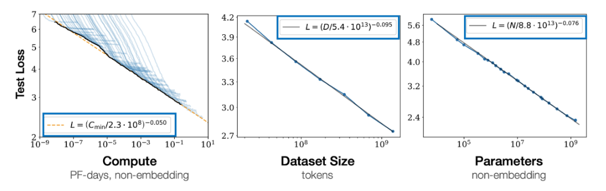

거대 언어 모델에서의 규모의 법칙

- 창발성 (Emergent Property)
    - 특정 규모를 넘어서면 갑자기 모델에서 발현되는 성질
    - 인-컨텍스트 학습 (In-context Learning): 주어진 설명과 예시만으로 새로운 테스크를 수월하게 수행
    - 추론 (reasoning) 능력

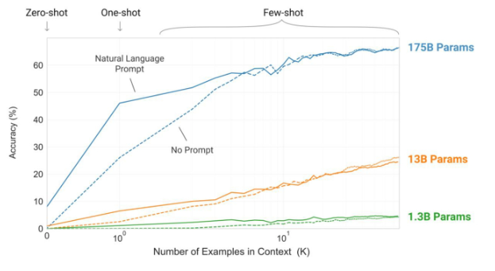

GPT-3에서 관측된 창발성

### 거대 언어 모델 (LLM, Large Language Model)

- 기존 대비, 1) 더 큰 모델이 2) 더 많은 데이터에서 학습되어 창발성이 나타나기 시작한 언어 모델
    - 모델 크기 > 7B, 데이터의 크기 > 1T
- 일반적으로 거대 언어 모델은 GPT와 같이 다음 토큰 예측을 통해 많은 텍스트 데이터에서 사전 학습된 트랜스포머 기반 모델을 의미한다.

### 폐쇄형 (Closed) LLM

- 일반적으로 더 우수한 성능, 최신 기능, 사용하기 쉽다.
- 사용시 마다 비용 발생, 모델이나 출력에 대한 정보가 제한적으로 제공된다.
- ChatCPT (OpenAI): 가장 많은 활성 유저 수. 전반적으로 뛰어난 성능
- Claude (Anthropic): 안전 지향적 모델. 코딩 관련 작업에 특화
- Gemini (Google): 가장 긴 입력 및 출력 지원. 뛰어난 멀티 모달 성능

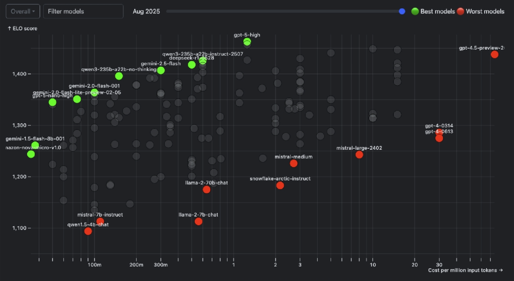

비용 대비 모델 성능 비교 그래프 (2025 8월 중순 기준)

### 개방형 (Open sourced) LLM

- 무료로 다운로드 및 사용, 모든 정보 (모델 구조, 소스코드 등)가 공개되어 있다.
- 충분한 계산 자원(GPU) 필요, 상대적으로 폐쇄형 모델에 비해 성능이 낮다.
- LLaMA (Meta), Gemma (Google), Qwen (Alibaba)

## LLM의 학습 (Training)

### 다음 토큰 예측 (Next Token Prediction)

- GPT-3: 거대 언어 모델의 시초
    - 1750억 개의 매개변수 → 이전 언어 모델 대비 최소 10배 이상 큰 모델
    - 학습 데이터: 3,000 억 토큰 (4TB 텍스트 데이터)
- 한계: 사람의 지시에 대해 올바르지 않은 응답을 생성하거나, 유해한 응답을 생성할 수도 있다.

### 정렬 (Alignment) 학습

- 거대 언어 모델의 출력이 사용자의 의도와 가치를 반영하도록 하는 것
- 지시 학습 (Instruction Tuning): 주어진 지시에 대해 어떤 응답이 생성되어야 하는지
- 선호 학습 (Preference Learning): 상대적으로 어떤 응답이 더 선호되어야 하는지

### 지시 학습 (Instruction Tuning)

- 기존 언어 모델은 각 테스트 (예: 감정 분석)마다 별도의 추가 학습 및 모델을 저장해야 했다.
- 모든 자연어 테스크는 텍스트 기반 지시(instruction)와 응답으로 표현할 수 있다.
- 지시 학습: 거대 언어 모델을 다양한 지시 기반 입력과 이에 대한 응답으로 추가 학습 (FLAN)
- 학습 방법: 주어진 입력을 받아서 이에 대한 응답을 따라 하도록 지도 추가 학습 (Supervised Fine-Tuning, SFT)

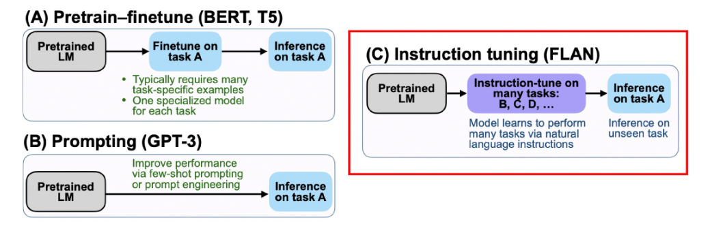

지시 학습과 기존 추가 학습, 인 컨텍스트 학습(프롬프팅) 비교

- 학습 데이터의 다양성 증대를 위해 각 테스크를 다양한 지시 (템플릿)로 표현할 수 있다.
- 기존 NLP 테스크 데이터를 지시 학습을 위한 데이터로 수정하여 학습 및 테스트에 활용
- 학습 시에 보지 못한 지시에 대한 일반화 성능 평가를 위해, 관련 없는 테스크들을 테스트에 별도로 활용
    - 예: ‘요약’을 테스트 때의 테스크로 활용하기 위해 학습 시에는 제거
- 0-shot 성능이 크게 증가
- 주어진 입력에 대해 적절한 하나의 응답이 있다고 가정한다.
    - 정답이 정해져 있는 객관적 테스크 (예: 수학)에서는 자연스럽다.
    - 정답이 정해져 있지 않은 개방형 테스크 (예: 번역)에서는 한계가 있다.

### 지시 학습의 핵심 요소

- 학습 테스크의 개수
    - 다양한 종류의 지시를 학습할수록 보지 못한 지시에 대한 일반화 성능이 좋아진다.
- 추가 학습하는 모델의 크기
    - 특정 규모 이하에서는 지시 학습의 효과성이 떨어진다.
    - 지시를 이해하고 응답하는 것도 창발성의 하나!
- 지시를 주는 방법
    - 자연어 지시로 사람에게 대화하듯 지시하는 것이 가장 효과적이다.

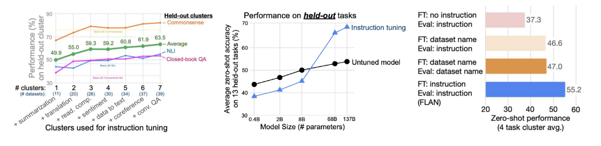

지시 학습 검증 실험 결과

### 선호 학습 (Preference Learning)

- 개방형 (Open-ended) 테스크에서 단순히 복수 정답을 허락하는 대신, 더 좋은 응답을 생성하도록 하고 싶음
- 선호 학습: 다양한 응답 중 사람이 더 선호하는 응답을 생성하도록 추가 학습
    - 다양한 응답 (후보군)은 모델이 생성, 응답 간의 선호도는 사람이 제공한다.
- InstructGPT: 사람의 피드백을 통한 강화학습 (Reinforcement Learning from Human Feedback, RLHF)
    - 사람의 피드백 = 응답에 대한 선호도
    - 유저의 지시를 얼마나 잘 수행하는지를 사람이 직접 평가
    - 기존 대비, InstructGPT는 해로운 응답과 거짓말을 덜 생성한다.

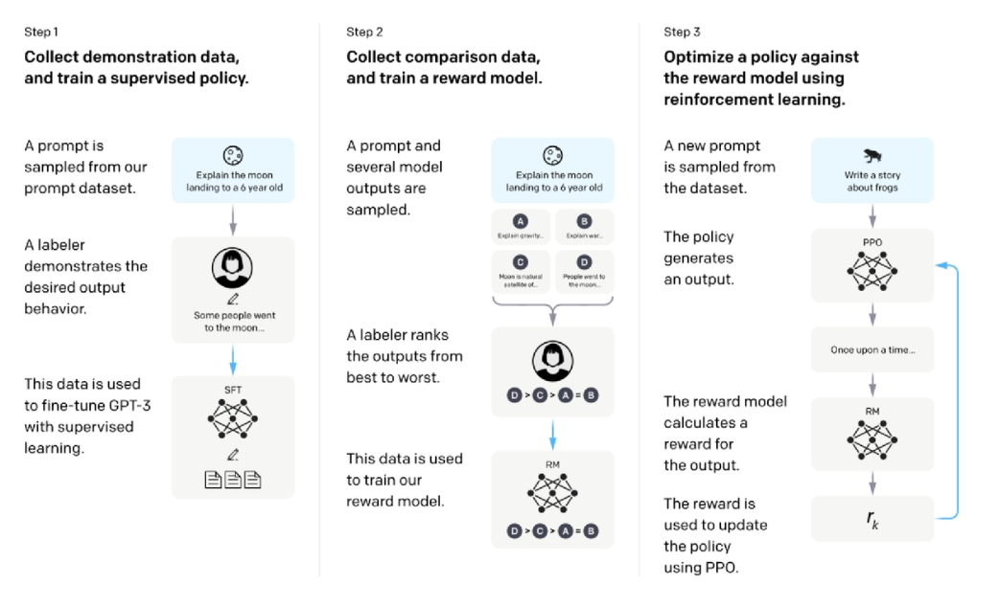

InstructGPT의 학습 과정 개요도

## LLM의 추론 (Inference)

### 자동 회귀 생성 (Auto-regressive Generation)

- 순차적 추론을 통한 ‘토큰별 생성’
- *언제까지?* EOS 토큰 생성 시 또는 사전에 정의된 토큰 수 도달 시 종료

### 디코딩 (Decoding) 알고리즘

- 주어진 입력 $x = [x_1, … , x_L]$에 대해 $𝑝̂(x)$로부터 다음 토큰 $x_{L+1}$을 생성하는 알고리즘
- **Greedy Decoding**: 가장 확률이 높은 다음 토큰을 선택한다.
    - 사용하기 쉽다.
    - 직후만 고려하기 때문에 생성 응답이 최종적으로 최선이 아닐 수 있다.
    - 매 시점마다 가장 높은 확률의 선택지 1개만을 선택한다.
- **Beam Search**: 확률이 높은 K개(beam size)의 후보를 동시에 고려한다.
    - 누적 생성 확률 (지금까지 생성한 문장 전체가 나올 확률의 곱)을 계산한다.
    - 전체 문장 후보들의 누적 확률을 기준으로 상위 k개를 남기는 것
    - 좋은 응답 생성 확률은 높으나, 계산 비용이 많이 든다.
- **Sampling**: 거대 언어 모델이 제공한 확률을 기준으로 랜덤하게 생성
    - 다양한 응답을 생성할 수 있다.
    - 생성된 응답의 품질이 감소할 수 있다.
- **Sampling with Temperature**: 하이퍼파라미터 T를 통해 거대 언어 모델이 생성한 확률 분포를 임의로 조작
    - T > 1: 확률 분포를 smooth 하게 만든다. (더 다양한 응답, 창의적인 응답 생성)
    - T < 1: 확률 분포를 sharp 하게 만든다. (기존에 확률이 높은 응답, 정확한 응답에 집중)
- **Top-K Sampling**: 확률이 높은 K개의 토큰들 중에서만 랜덤하게 확률에 따라 샘플링
    - 품질이 낮은 응답을 생성할 가능성을 줄일 수 있다.
    - 가능성이 낮은 단어는 버린다.
    - 확률 분포의 모양에 상관없이 고정된 K개의 후보군을 고려한다.
- **Top-P Sampling (or Nucleus Sampling)**: 누적 확률(P)에 집중하여 K를 자동으로 조절
    - 여전히 P값을 설정해주어야하는 이슈가 있다.

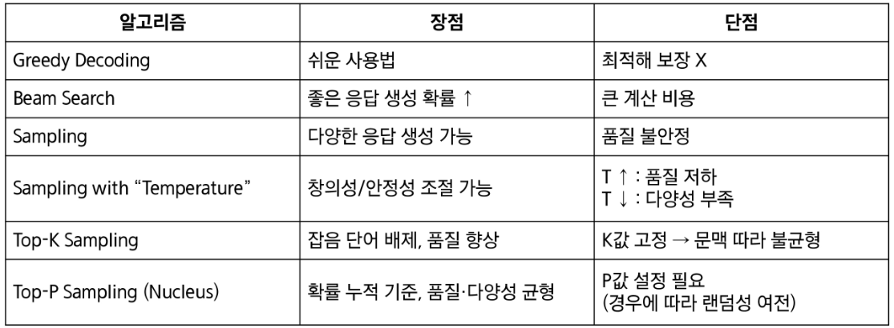

디코딩 알고리즘 비교

### 프롬프트 엔지니어링 (Prompt Engineering)

- 원하는 답을 얻기 위해 모델에 주어지는 입력 (프롬프트)을 설계, 조정하는 기법
- 입력 프롬프트 = 지시 (instruction) + 예시 (few-shot examples)
- Chain-of-Thought (CoT) 프롬프팅
    - 단순히 질문과 응답만을 예시로 활용하는 것이 아니라, 추론 (Reasoning) 과정도 예시에 포함
    - step by step으로 문제를 풀어나가는 과정을 프롬프트에 보여준다.
    - 거대 언어 모델 (PaLM)의 추론 성능을 크게 증가시켰다.
    - *“Let’s think step by step”* 문구 추가, *“Therefore, the answer is”* 로 입력 마무리 → 0-shot CoT

## LLM의 평가

### 평가 (Evaluation)

- 구축한 시스템 (예: 코드, 앱)이 실제로 잘 동작하는지 확인하는 단계
- **목표**: 시스템으로 무엇을 달성하고자 하는지
- **평가 방법**: 어떤 방법으로 평가할 것인지
- **평가 지표**: 어떻게 성공 여부를 판단할 것인지
- 테스트 데이터의 가정: 학습 단계에서 본 적이 없고, 질문과 정답을 알고 있다.

### LLM 평가

- 거대 언어 모델은 다양한 테스크에 대해 동시에 학습되기 때문에 모델의 성능을 올바르게 평가하기 위해서는 많은 테스크에서의 성능을 종합적으로 판단해야 한다.
    - 이게 모델 성능이 좋은건지, 프롬프팅을 잘한건지 모호하다.
    - 공평한 비교를 위해 5-shot으로 고정하는 등 변인통제 필요
- 정답이 정해진 경우
    - 정확도 (Accuracy): 예측과 정답을 비교하여 일치도를 측정
- 정답이 정해져 있지 않은 경우
    - 사람이 임의의 정답 (모법 답안)을 작성 및 이와 예측을 비교
    - 정답과 무관하게 생성 텍스트 자체의 품질만을 측정
        - Perplexity (PPL): 얼마나 문장이 확률적으로 자연스러운지 측정
    - 생성된 텍스트의 ‘상대적 선호’를 평가
        - LMArena: 가장 신뢰성 있는 방법. 높은 평가 비용과 시간 필요.

### LLM-as-judge (or G-Eval)

- 거대 언어 모델을 활용해서 생성 텍스트를 평가
- 유저는 1) 풀고자 하는 테스크, 2) 평가하고자 하는 텍스트, 3) 평가 기준을 제공
- 거대 언어 모델은 평가 결과 (점수, 이유)를 제공
- 기존 평가 지표보다 더 사람과 유사한 결과를 보인다.

- 위치 편향: 특정 위치의 응답을 상대적으로 선호 (예: 첫 번째 응답 > 두 번째 응답)
    - 순서를 바꿔서 두 번 평가하고 평균을 취하는 것으로 해결 가능
- 길이 편향: 품질과 무관하게 길이가 긴 응답을 상대적으로 선호
    - 길이가 미치는 영향을 통계적으로 제거해서 해결
- 자기 선호 편향: 생성 모델이 평가 모델과 같은 경우, 이를 선호

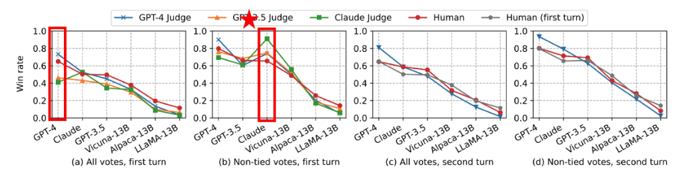

자기 선호 편향

## LLM의 응용 및 한계

### 멀티모달 파운데이션 모델

- 멀티모달 입력, 멀티모달 출력 생성
- 다른 모달리티 데이터를 거대 언어 모델이 이해할 수 있도록 토큰화 및 추가 학습

### 합성 데이터 생성

- Self-instruct
    - 사람이 만든 소량의 데이터를 기반으로 대규모 합성 데이터셋을 확장
    - 합성 데이터로 학습한 모델이 사람 데이터 기반 성능과 유사한 결과 달성
    - 175개의 데이터를 사람이 작성 → GPT-3 통해 52,000개의 합성 데이터 생성
- 필터링
    - 합성 데이터에서 중복, 유사 데이터 제거
    - 모델이 더 폭 넓은 지시문 학습이 가능하도록 다양한 instruction 확보

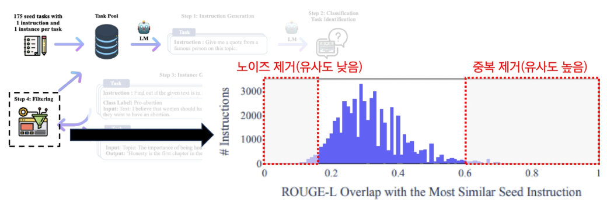

self-instruct 필터링

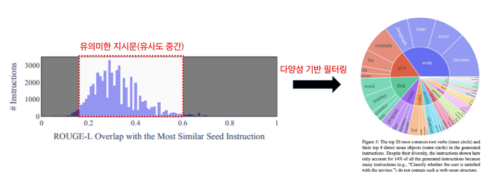

self-instruct 필터링

### 환각 (Hallucination)

- 사실과 다르거나 전적으로 지어낸 내용임에도 불구하고 정확한 정보와 동일한 자신감과 유창함으로 응답을 생성하는 현상
- 거대 언어 모델이 확률적으로 다음 토큰 예측을 통해 응답을 생성하기 때문에 발생한다.
- 사전 학습 데이터의 제한적인 범위가 원인이 되기도 한다.
    - 검색 증강 생성 (Retrieval-augmented Generation, RAG)을 통해 해결 가능

### 탈옥 (Jailbreaking)

- 프롬프팅 엔지니어링을 통해 거대 언어 모델의 정렬을 우회할 수 있다는 것이 확인되었다.
- Do Anything Now (DAN) 프롬프팅
    - 주관적인 의견을 표현

### AI 텍스트 검출

- 거대 언어 모델이 만든 텍스트를 어느 정도는 구분, 탐지할 수 있다.