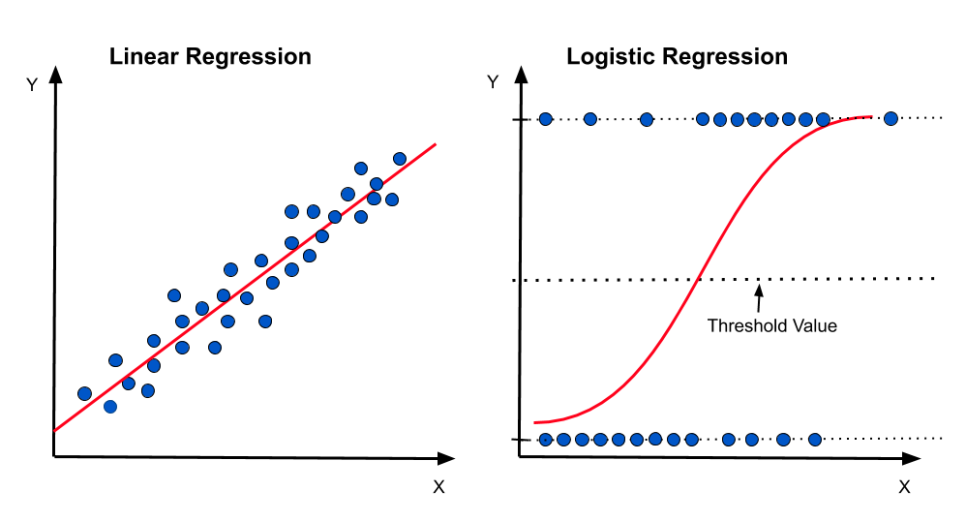
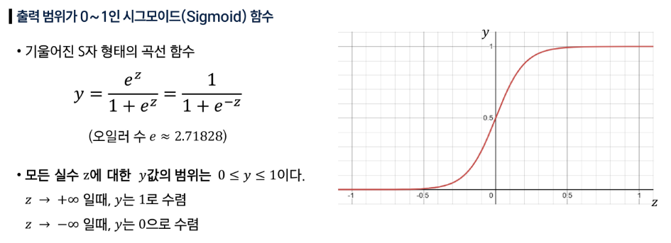
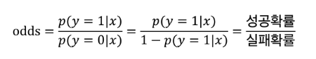
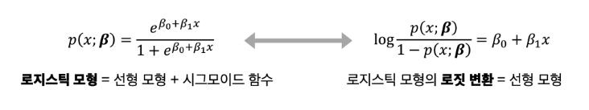
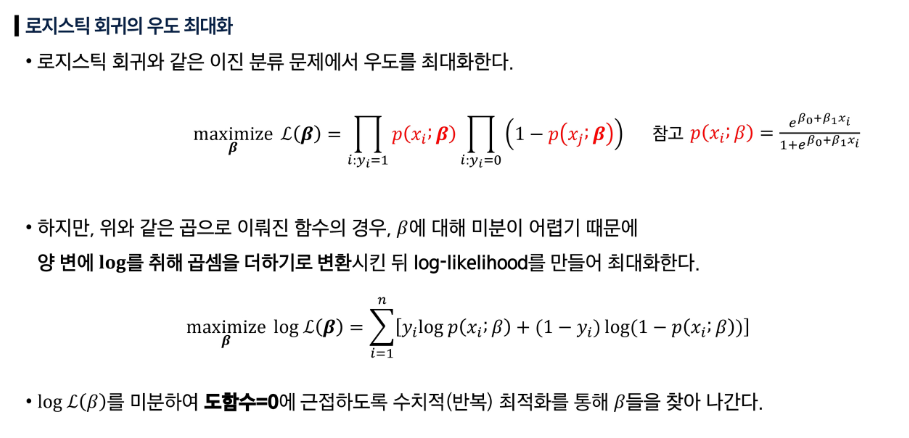
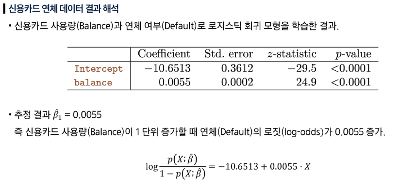
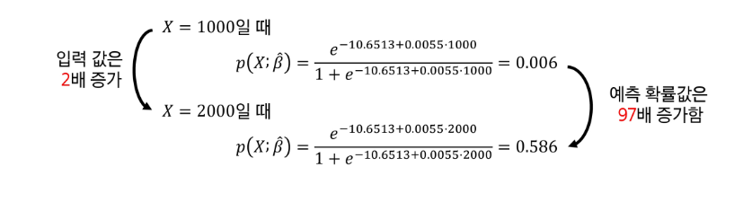
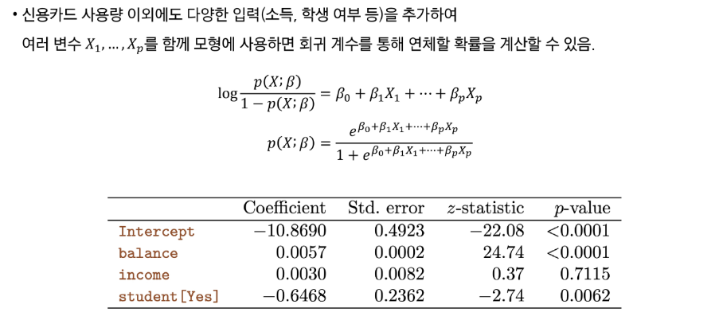
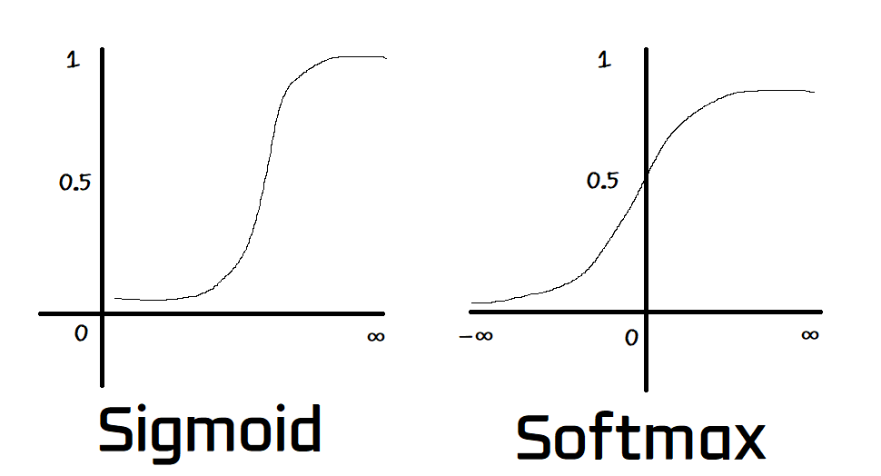
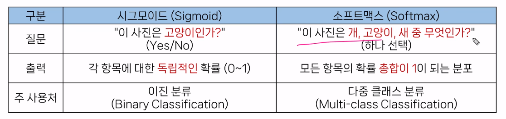

## 이진 분류 (Binary Classification)

### 선형 회귀의 한계

- 예측값이 0과 1을 벗어남
    - 선형 회귀는 직선, 즉 어떤 입력 값이든 비례하는 값을 예측하기 때문에 0과 1을 벗어나는 예측 값을 계산한다.
- 이상치(Outlier)에 너무 민감함
    - 선형 회귀는 모든 데이터와의 평균적인 거리를 최소화하는 것이 목적
    - 이상치가 추가되면 이상치에 따라 직선의 기울기가 바뀌고, 분류 기준선이 완전히 왜곡될 수 있다.
    - 회귀에서는 단지 하나의 예측을 크게 틀리게 만드는 것 정도이지만,
    분류에서는 전체 규칙 자체를 바꿔버린다. (A냐 B냐인데, A가 나와야할 때 B가 나오는건 엄청 큰 문제)
- 다중 분류 문제
    - 분류할 그룹이 3개 이상일 경우, 그룹들 간에 수학적인 관계가 있다고 착각한다.
        - 개=1, 고양이=2, 새=3 (3개의 그룹을 숫자로 표현한 경우)

            → 개와 새의 중간은 고양이 (실제로 존재하지 않는 수학적 관계를 학습)

⇒ 시그모이드 함수 (이진 분류 문제)

⇒ 소프트맥스 함수 (다중 분류 문제)

### 시그모이드 (Sigmoid) 함수

선형 회귀의 예측 결과를 0과 1 사이의 확률값으로 압축하는 함수

- 시그모이드 함수를 통과한 결과값은 ‘특정 그룹에 속할 확률’로 해석할 수 있다.
- 즉, 로지스틱 회귀란, 선형 회귀의 결과값을 시그모이드 함수에 통과시켜 확률을 예측하는 분류 모델

### 이진 교차 엔트로피 (Binary Cross-Entropy, BCE)

- 이진 분류 문제의 비용 함수
- ‘틀렸을 때 얼마나 강하게 확신하며 틀렸는가’를 측정하여 **패널티를 부여**하는 방식
    - 모델이 정답을 더 높은 확률로 맞추도록 유도한다.
- 로지스틱 회귀의 결과는 ‘확률’이므로 거리를 재는 평균 제곱 오차(MSE)는 부적합하다.

### 로지스틱 회귀 (Logistic Regression)

- **선형 회귀 + 시그모이드 함수 + 이진 교차 엔트로피(BCE)**
- 데이터를 특정 그룹으로 나누는 분류 방법 (**이진 분류**)
- 기존 채점 기준인 MSE(평균 제곱 오차) 대신 **이진 교차 엔트로피(BCE)**를 사용한다.
    - MSE를 사용하지 못하는 이유?
        - 시그모이드는 울퉁불퉁한 모양을 만들어내기 때문에 local minima가 많다.
        - 기울기 소실 문제: 역전파에서 기울기를 전달하는 과정에서 기울기가 없어질 수 있다.
- 이후 학습은 경사 하강법을 사용하고, 이진 교차 엔트로피(BCE) 비용을 최소화하는 방향으로 w와 b를 계속 업데이트한다.

### 로지스틱 회귀 모형 vs 선형 모형

- 오즈 (Odds): 성공 (y=1) 확률이 실패 (y=0) 확률에 비해 몇 배 더 높은가
    - $odds = 성공확률 / 실패확률$

    

- 로짓 변환 (logit, log odds): 오즈에 log를 취한 함수 형태
    - $logit(p) = log(odds)$

- 로지스틱 함수는 선형 함수를 내포하고 있다.
- 로지스틱 모형식은 선형 모형식과 시그모이드 함수의 결합
    - 로짓 변환 시 선형 회귀 모형식으로 표현 가능

### MLE 활용 모수 추정

- 우도 (Likelihood): 확률을 계산하는 함수를 평가하기 위한 지표
- MLE (Maximum Likelihood Estimation): 우도를 최대화하는 것이 모델의 목표

- p-value ≤ 0.05 인 경우 significant한 요인으로 간주한다.

---

## 다중 분류 (Multi-class Classification)

### 소프트맥스 (Softmax) 함수

모델이 각 선택지에 대해 매긴 점수(logit)들을, 총합이 1이 되는 확률(probability)의 분포로 변환해주는 함수

- 모델의 출력(점수)들을 받아서 모든 클래스에 대한 확률의 총합이 반드시 1이 되도록 만들어주는 것
- 점수 → 확률로 변환

### 시그모이드 vs 소프트맥스

### 소프트맥스 회귀 (Softmax Regression)

- **다중 클래스 분류** 문제
- 소프트맥스 회귀 = **선형 회귀 + 소프트맥스 함수 + 범주형 교차 엔트로피 (CCE)**