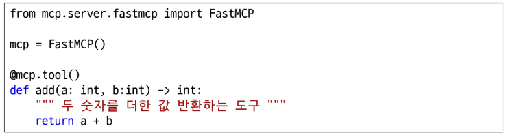
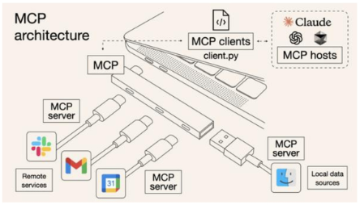

## MCP (Model Context Protocol)

Model(AI 모델)이 다양한 Context(문맥)을 받아 활용할 수 있도록 약속된 Protocol(규칙)

### 도구를 이용한 컨텍스트 생성

Gemini-2.5-pro 모델은 Gemini CLI에 내장된 “도구(Tool)”를 사용해 문맥을 증강 받고 있다.

GPT는 토큰을 생성하는 AI 모델일 뿐인데 어떻게 도구를 호출할까?

**AI 기반 챗봇 서비스의 메시지 종류**

- System Message: 개발자가 사전에 작성한 프롬프트
- Human Message: 사용자가 입력한 프롬프트
- AI Message: AI가 생성한 답변

1. 도구(함수)와 도구 스키마(JSON) 작성
    - 도구 이름 (name), 도구 역할 (description), 입력 파라미터 (parameters)
2. AI 모델 - 도구 연결 (Tool Binding)
    - 서비스 시작 시 도구 스키마가 system message와 함께 전달
3. 사용자 입력 및 도구 호출
    - 사용자 입력(쿼리) 입력
    - 도구 스키마 기반 AI message 생성 - 도구 호출
    - 도구가 계산한 결과 반환 (Tool message)
4. 결과 생성
    - system message, human message, AI message, tool message 기반 최종 답변을 AI message에 생성

### MCP 프로토콜 기반 도구화

- 입력 파라미터, 반환 값의 타입을 명시 (타입 힌팅)
- 함수 첫 번째 줄에 문자열로 해당 도구 역할 묘사
- 함수 로직 작성 후 @mcp.tool 데코레이터 작성

### MCP의 유연한 확장성

도구를 MCP 프로토콜에 맞춰 개발 → Gemini CLI, Cursor, VS Code Copilot에 쉽게 연결 가능

⇒ AI Agent, 플랫폼화

- MCP Host: LLM 기반 서비스 (Gemini CLI, Claude, Cursor, …)
- MCP Server: 도구 모음 (Gmail, Notion, GitHub, MS Word, …)
- MCP Client: Host와 Server를 연결하는 다리

### 코딩 특화 MCP

| MCP 서버 | 특화 내용 |
| --- | --- |
| Playwright | 브라우저 자동화 및 테스트 |
| Sequential Thinking | 단계별 사고 및 구조화된 문제 해결 |
| Context7 | 최신 라이브러리 정보 제공 |
| Magic-mcp | 프론트엔드 템플릿 코드 제공 |
| GitHub | 코드, 이슈, PR 관리 |
| Figma | 디자인(화면 정의서) - 개발(코드) 연동 및 UI 구현 |
| Notion | 노션 워크스페이스 연동 |
| Jira | 프로젝트 관리 및 이슈 트래킹 |
- Playwright MCP
    
    브라우저 기반 웹 서비스 테스트 및 웹 크롤링 도구 by Microsoft
    
    - 개발한 프론트엔드 페이지를 검토할 때, 웹 크롤링에 활용
    
    [playwright MCP 공식 문서](https://github.com/microsoft/playwright-mcp)
    

### Smithery, MCP Server Hub

개발자들이 갭라한 MCP 서버를 공유하는 Hub

- [smithery](https://smithery.ai/)
- 유사 MCP 서버 주의!

### MCP 사용 시 주의사항

- 개인정보 유출 가능성: MCP 사용 간 개인 정보 유출 가능

→ 개발사를 확인

→ 앱 추천 MCP 서버 사용

### [참고] MCP 학습 커리큘럼 (Microsoft)

[커리큘럼 바로가기](https://github.com/microsoft/mcp-for-beginners/blob/main/translations/ko/README.md)