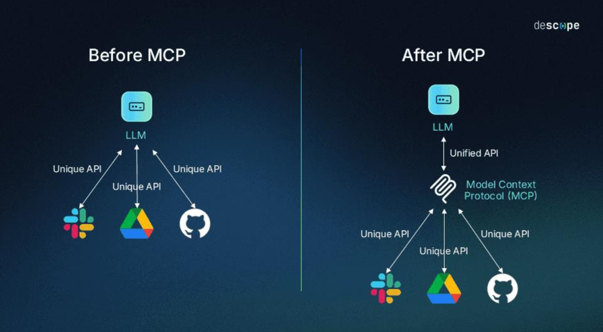
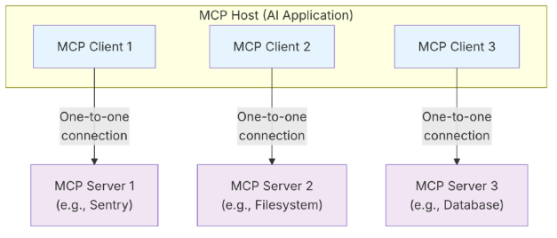
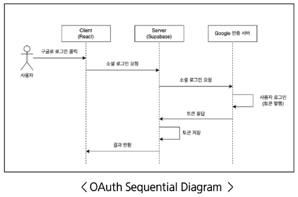

## MCP (Model Context Protocol)

Model(AI 모델)이 다양한 Context(문맥)을 받아 활용할 수 있도록 약속된 Protocol(규칙)

### MCP 도입

- 외부 툴을 활용하는 연구가 급증하면서 회사/모델마다 각기 다른 툴 호출 방식 및 스키마를 개발했다.
- 모델마다 달라 호환성이 부족하고, 같은 툴도 다른 모델에서 다시 정의해야하는 문제가 발생했다.
- MCP: 언어 모델이 외부 툴과 상호작용하기 위한 표준화된 방식으로 정의한 프로토콜
    - 툴 호출, 응답 전달, 컨텍스트 공유를 하나의 공통 규격으로 처리



MCP

### MCP 아키텍처

- MCP Host: 하나 또는 여러 개의 MCP 클라이언트를 조정하고 관리하는 AI 애플리케이션
- MCP Client: MCP 서버와의 연결을 유지하며 MCP 호스트가 사용할 수 있도록 MCP 서버로부터 컨텍스트를 가져오는 구성요소
- MCP Server: MCP 클라이언트에게 컨텍스트를 제공하는 프로그램



MCP 아키텍쳐

### MCP 계층 (Layer)

- Data Layer: 클라이언트-서버 통신을 위한 JSON-RPC 기반 프로토콜을 정의
    - 라이프 사이클 관리, 툴, 리소스, 프롬프트 등
- Transport Layer: 클라이언트-서버 간 데이터 교환을 가능하게 하는 통신 메커니즘과 채널을 정의
    - 전송 방식에 특화된 연결 수립, 메세지 프레이밍, 인증 등
- 개념적으로 데이터 계층은 내부 계층 (inner layer), 전송 계층은 외부 계층 (outer layer)

### MCP의 장점

- 표준화 (Standardization): 모든 모델/툴이 동일한 호출 규격 사용
- 확장성 (Extensibility): 새로운 툴 쉽게 추가 가능
- 호환성 (Interoperability): 모델/플랫폼에 상관없이 같은 툴 호출 가능
- 재사용성 (Reusability): 한 번 정의한 툴을 여러 모델에서 활용 가능
- 투명성 (Transparency): 호출 과정이 명확히 기록/검증됨

### MCP 서버 예시 코드

- FastMCP 라이브러리 사용

```python
# calc_server.py
from fastmcp import FastMCP

mcp = FastMCP("calc")                 # 1. 서버 인스턴스

@mcp.tool()                           # 2. MCP 툴 선언
def add(a: int, b: int) -> int:       # 타입 힌트 -> JSON-Schema 자동 변환
    """Add two numbers"""
    return a + b

if __name__ == "__main__":
    mcp.run()                         # 3. stdio, HTTP, WS 등 자동 선택
```


### 도구를 이용한 컨텍스트 생성

Gemini-2.5-pro 모델은 Gemini CLI에 내장된 “도구(Tool)”를 사용해 문맥을 증강 받고 있다.

GPT는 토큰을 생성하는 AI 모델일 뿐인데 어떻게 도구를 호출할까?

**AI 기반 챗봇 서비스의 메시지 종류**

- System Message: 개발자가 사전에 작성한 프롬프트
- Human Message: 사용자가 입력한 프롬프트
- AI Message: AI가 생성한 답변

1. 도구(함수)와 도구 스키마(JSON) 작성
    - 도구 이름 (name), 도구 역할 (description), 입력 파라미터 (parameters)
2. AI 모델 - 도구 연결 (Tool Binding)
    - 서비스 시작 시 도구 스키마가 system message와 함께 전달
3. 사용자 입력 및 도구 호출
    - 사용자 입력(쿼리) 입력
    - 도구 스키마 기반 AI message 생성 - 도구 호출
    - 도구가 계산한 결과 반환 (Tool message)
4. 결과 생성
    - system message, human message, AI message, tool message 기반 최종 답변을 AI message에 생성

### MCP 프로토콜 기반 도구화

- 입력 파라미터, 반환 값의 타입을 명시 (타입 힌팅)
- 함수 첫 번째 줄에 문자열로 해당 도구 역할 묘사
- 함수 로직 작성 후 @mcp.tool 데코레이터 작성


### MCP의 유연한 확장성

도구를 MCP 프로토콜에 맞춰 개발 → Gemini CLI, Cursor, VS Code Copilot에 쉽게 연결 가능

⇒ AI Agent, 플랫폼화

- MCP Host: LLM 기반 서비스 (Gemini CLI, Claude, Cursor, …)
- MCP Server: 도구 모음 (Gmail, Notion, GitHub, MS Word, …)
- MCP Client: Host와 Server를 연결하는 다리


## 코딩 특화 MCP

| MCP 서버 | 특화 내용 |
| --- | --- |
| Playwright | 브라우저 자동화 및 테스트 |
| Sequential Thinking | 단계별 사고 및 구조화된 문제 해결 |
| Context7 | 최신 라이브러리 정보 제공 |
| Magic-mcp | 프론트엔드 템플릿 코드 제공 |
| GitHub | 코드, 이슈, PR 관리 |
| Figma | 디자인(화면 정의서) - 개발(코드) 연동 및 UI 구현 |
| Notion | 노션 워크스페이스 연동 |
| Jira | 프로젝트 관리 및 이슈 트래킹 |
- Playwright MCP

    브라우저 기반 웹 서비스 테스트 및 웹 크롤링 도구 by Microsoft

    - 개발한 프론트엔드 페이지를 검토할 때, 웹 크롤링에 활용

    [playwright MCP 공식 문서](https://github.com/microsoft/playwright-mcp)


### Playwright MCP를 이용한 단위테스트

- 테스트 예시 프롬프트 1

    ```jsx
    Playwright MCP 이용해 @vibe_coding/GEMINI.md에 작성한 PRD가 잘 구현됐는지 unit test 하세요.     http://localhost:5173/를 열고, 직접 버튼을 하나씩 클릭하고, 채팅도 입력하시오. (서버는 이미 켜져 있음.)
    ```

- 테스트 예시 프롬프트 2

    ```html
    채팅 페이지에서 @vibe_coding/sample_image.jpg 에 있는 이미지와 '뭐가 보이나요'라는 텍스트도 입력해 테스트 하시오.
    ```


### Gemini CLI - Playwright

1. `.gemini/`폴더 생성
2. `.gemini/settings.json` 파일 생성
3. 설치 코드 입력 및 저장
4. Gemini CLI 실행 → playwright MCP 설치 완료

```
{
  "mcpServers": {
    "playwright": {
      "command": "npx",
      "args": [
        "@playwright/mcp@latest"
      ]
    }
  }
}
```

### VS Code Copilot - Playwright MCP

1. `.vscode/` 폴더 생성
2. `mcp.json` 파일에 `.gemini/settings.json`에서 `mcpServers -> servers` 변경하고 시작 누르면, 준비 완료.

```json
{
  "servers": {
    "playwright": {
      "command": "npx",
      "args": [
        "@playwright/mcp@latest"
      ]
    }
  }
}
```

- ChatGPT처럼 챗봇 형태로 프롬프트 입력 가능
- gemini CLI보다 훨씬 빠르다.
- 사용량 한도가 정해져 있다. (사용량 현황 확인 가능)

### Notion MCP

`.vscode/mcp.json`파일의 “servers”: {”playwright”…} 뒤에 추가

```json
{
  "servers": {
    "playwright": {
      "command": "npx",
      "args": [
        "@playwright/mcp@latest"
      ]
    },
    "Notion": {
      "url": "https://mcp.notion.com/mcp"
    }
  }
}
```

- 노션 페이지에 접근/수정/생성/삭제 가능
- ex) 단위 테스트 결과(`test.md`)를 정리한 페이지를 생성해라. | [unit_test](https://www.notion.so/unit_test-25d11cc2d5a3819e9777c059af47b983?pvs=21)

### Sequential Thinking MCP

구조화된 문제 해결 및 사고 by Anthropic

- 프롬프트 예시

    ```json
    PRD 기반으로 챗봇 서비스를 개발해 주세요. 먼저 sequential thinking MCP 이용해서 계획을 수립하세요.
    ```


### Smithery, MCP Server Hub

개발자들이 갭라한 MCP 서버를 공유하는 Hub

- [smithery](https://smithery.ai/)
- 유사 MCP 서버 주의!


### MCP 사용 시 주의사항

- 개인정보 유출 가능성: MCP 사용 간 개인 정보 유출 가능

→ 개발사를 확인

→ 앱 추천 MCP 서버 사용


## 인증 및 데이터 베이스 구현

### Supabase

PostgreSQL 기반 오픈소스 백엔드 플랫폼

- 데이터 베이스, 인증, 파일 저장 등 제공
- 자연어로 데이터베이스 생성, 수정, 삭제 가능
- 비교적 쉽게 OAuth(구글로 로그인) 구현 가능

### OAuth (Open Authorization)

사용자가 개인 정보를 직접 제공하지 않고 다른 서비스에서 해당 정보를 접근할 수 있도록 권한을 위임하는 프로토콜

- 구글로 로그인



### **Supabase를 통한 OAuth 구현**

1. Superbase 서버 생성
    1. Supabase 계정 생성
    2. 조직 생성
    3. 프로젝트 생성

    → 데이터베이스, 인증, 파일 저장, 웹소켓 기반 실시간 통신 기능 제공, AWS 배포 완료.

2. Google 인증 서버 생성
    1. Authentication(인증) > Sign In / Providers >Google
    2. Enable Sign in with Google 활성화, Docs 버튼 클릭
    3. Consent Screen configuration page 클릭
    4. 프로젝트 생성
    5. 클라이언트 생성
3. Superbase - Google 인증 서버 연결
    1. OAuth 클라이언트 생성
    2. 승인된 JavaScript 원본: https://localhost:5173
    3. 승인된 리디렉션 URI: Callback URL (for OAuth) 복사, 붙여넣기
    4. OAuth 클라이언트 정보 (ID, PW)입력
4. Client - Server 연결: AI 코딩 어시스턴트와 Sequential Thinking MCP 서버를 활용해 구현

    ```bash
    git clone https://github.com/forestsoft-kr/vibe_coding.git
    ```

    1. server, client 서버 실행
    2. sequential-thinking MCP 설치 (.gemini/settings.json)
    3. Gemini CLI 실행
        - 프롬프트 예시

            ```bash
            로그인 및 회원가입 페이지에 구글로 로그인 기능을 구현하고 싶어요.
            먼저 sequential thinking MCP 이용해서 계획을 수립하세요.
            참고(supabase 공식 문서 링크: )
            ```

    4. supabase 정보 입력
    5. OAuth 최종 테스트


## [참고] MCP 학습 커리큘럼 (Microsoft)

[커리큘럼 바로가기](https://github.com/microsoft/mcp-for-beginners/blob/main/translations/ko/README.md)