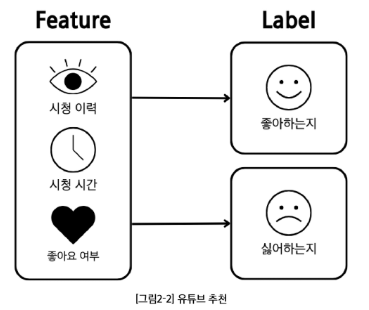
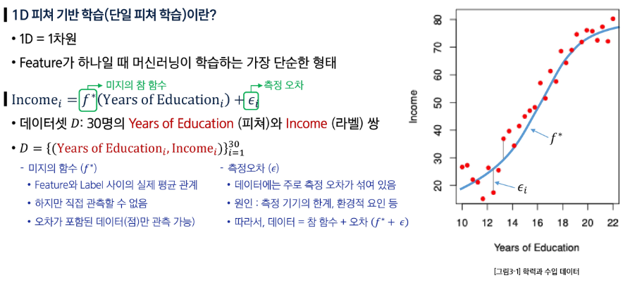
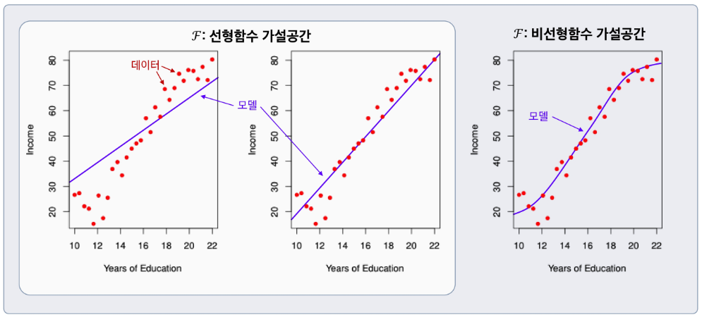
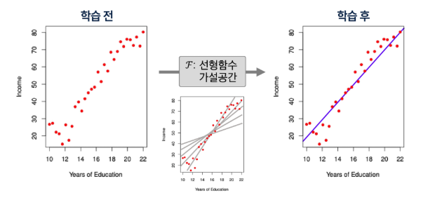
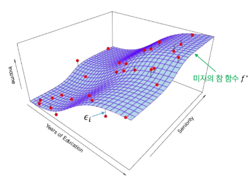
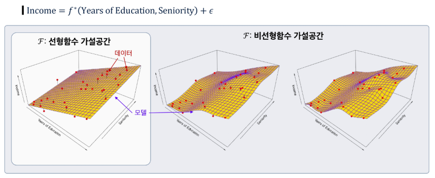
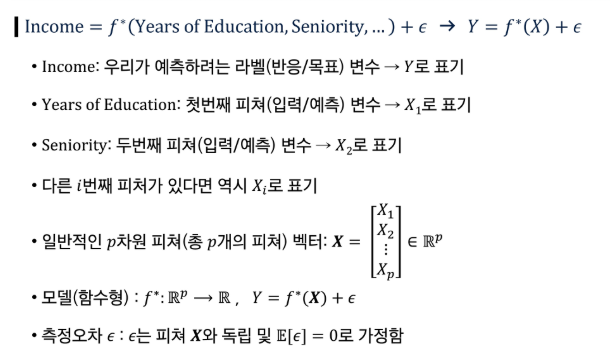

## 머신러닝

### AI 구현

- 규칙 기반
    - 전문가의 지식과 규칙을 사람이 직접 컴퓨터에 코드로 입력하는 방식
- 학습 기반 (머신러닝)
    - 컴퓨터에게 데이터를 주고 그 데이터 안에서 규칙(패턴)을 스스로 배우게 하는 방식

### 머신러닝

데이터에서 패턴(관계)을 찾는 것!

- 산점도: 각각의 데이터를 점으로 좌표 평면에 표시한 것
- 최적선: 데이터들의 전반적인 경향을 가장 잘 나타내는 하나의 예측 직선
    - 우리가 찾으려는 모델(model)
- 오차
- 방정식: 최적선을 수학적으로 표현한 것
    - 전체 오차를 가장 작게 만드는 최적의 w(가중치, 기울기)와 b(편향,  y절편)를 찾아내는 것이 목표

### 머신러닝 학습 종류

일반적으로 비지도 → 지도 → 강화 학습의 복합적인 학습으로 결과물을 생성한다.

- **지도 학습 (Supervised Learning)**: 정답이 있는 데이터를 학습시키는 방법
    - 의료 진단, 스팸 필터링, 주가/부동산 가격 예측 등
- **비지도 학습 (Unsupervised Learning)**: 정답이 없는 데이터의 숨겨진 구조나 규칙을 찾는 방법
    - 추천 시스템, 이상 거래 탐지, 고객 세분화 등
- **강화 학습 (Reinforcement Learning)**: 상과 벌을 통해 최적의 행동 방식을 학습하는 방법
    - 로봇 제어, 자율 주행, 게임 AI 등

### 데이터 구성 요소 (Feature/Label)

- 데이터(Feature, Label)의 분포와 관계가 머신러닝의 학습 결과를 결정한다.
- Feature (피처, 특성)
    - 모델이 예측에 사용하는 입력 정보
    - 예측, 판단의 근거, 단서
- Label (라벨, 목표값)
    - 모델이 예측하려는 정답
    - 학습의 목표값

**ML 실생활 예시**

- 유튜브 추천
    - Feature: 각 영상들의 정보 (장르, 크리에이터, 조회수, 좋아요 수 등), 사용자 정보 (시청 이력, 구독 채널 등)
    - Label: 영상에 대한 사용자 피드백 (시청 여부, 좋아요 클릭 여부 등)
- 스팸메일 분류
    - Feature: 메일 제목, 발신자, 단어 빈도
    - Label: 스팸 / 정상

---

## 단일 피쳐 기반 학습

### 1D 피쳐 기반 학습

Feature가 하나일 때 머신러닝이 학습하는 가장 단순한 형태

- 미지의 참 함수 ($f^*$): feature와 label 사이의 실제 평균 관계(이상적인 함수)
    - 직접 관측할 수 없다.
    - 오차가 포함된 데이터(점)만 관측할 수 있다.
- 측정 오차 ($\epsilon$)
    - 데이터에는 주로 측정 오차가 섞여 있다.
    - 측정 기기의 한계, 환경적 요인 등
    - 데이터 = 참 함수 + 오차 = $f^* + \epsilon$
- 피쳐와 라벨의 관계를 잘 나타내는 함수 $f$ 는?
    - 데이터를 설명하는 여러 함수 후보가 존재하고, 어떤 함수가 가장 잘 맞는지 학습해야 한다.

### 모델과 가설 공간

- 가설 공간 (Hypothesis Space)
    - 관계를 표현할 수 있는 모든 후보 함수들의 모음
    - 피쳐 공간과 라벨 공간 위에서 정의된 함수들의 집합
- 모델 (Model)
    - 가설공간 $F$에 속한 특정 함수 $f$
    - 데이터 → 가설공간 → 선택된 모델 (함수)

- 학습 (Learning)
    - **입력 (Feature) → 출력 (Label) 관계**를 찾는 과정
    - 평균 관계를 하나의 함수로 표현
    - 주어진 데이터와 성능 척도를 바탕으로 가설공간의 후보들 중 최적의 모델을 선택하는 과정

## 복수 피쳐 기반 학습

### 2D 피쳐 기반 학습

- 미지의 참 함수 $f^*$ (=surface)는 관측 불가능
- 데이터 (=빨간색 점)만 관측 가능

### 용어 정리 및 표기 약속

### 미지의 참 함수 $f(X)$를 학습하는 이유

- 예측: 잘 학습된 f 가 있으면 새로운 X=x에서 반응/목표 Y를 예측할 수 있다.
- 중요 특성 파악: 피쳐들의 어떤 특성이 Y를 설명하는 데 중요하고 어떤 것은 덜 중요(무관)한지 알 수 있다.
- 해석 가능성: f의 복잡도에 따라 각 구성요소가 Y에 어떻게 영향을 미치는지(증가/감소 방향, 민감도 등) 이해할 수 있다.
