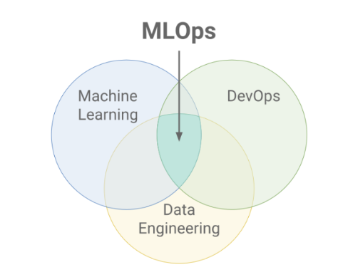
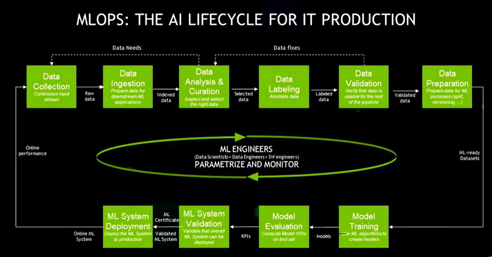

# MLOps: 모델 생애주기 관리와 자동화

## MLOps 개요
### MLOps (Machine Learning Operations)

- 지속가능한 형태의 학습/배포
- 머신러닝, DevOps, 데이터 엔지니어링을 결합하여 AI 모델의 배포, 모니터링, 유지보수를 간소화하는 방법론
- 표준화된 워크플로우, 자동화된 파이프라인, 지속적인 모델 개선을 통해 AI 애플리케이션의 확장성, 신뢰성, 시장 출시 속도 등을 확보한다.
- CI/CD

- 데이터셋: 데이터 자체
- 모델: 실험을 해서 나온 결과

## 버전 관리 도구

### MLflow

- ML의 실험, 재현성, 배포를 포괄적으로 관리하는 오픈소스
- 실험 추적, 모델 버전 관리, 모델 레지스트리, 배포 기능을 제공한다.

### DVC (Data Version Control)

- AI 프로젝트에서 대용량 데이터셋과 모델 파일들을 git처럼 버전 관리할 수 있게 해주는 오픈소스
- 실제 파일은 클라우드 스토리지나 로컬 저장소에 저장하고, git 레포에는 가벼운 메타 파일(`.dvc`)만 저장한다.

## 패키징 도구

### BentoML

- AI 모델을 서비스 프로덕션 환경에 배포하기 위한 오픈소스
- 학습된 모델을 일관된 규격(Bento)으로 패키징, 모델의 추론을 API로 서빙할 수 있게 한다.
- 다양한 AI 개발 프레임워크들과의 통합, 자동 배치 처리, GPU 가속, 모델 버전 관리 등