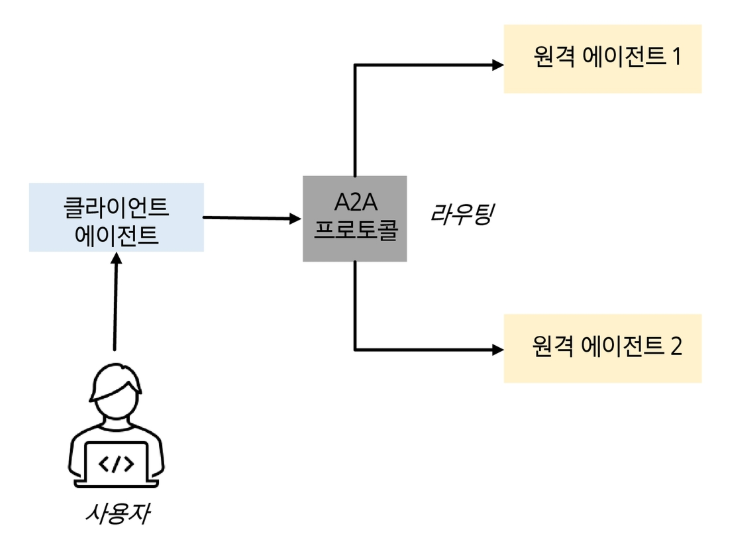

## AI Agent

### AI의 발전 과정

- Perception AI (지각 AI): 특화된 분야에서 해석 및 분석
    - 현대 기계학습의 기반
- Generative AI (생성형 AI): 콘텐츠 제작 (텍스트, 이미지 등)
- Agentic AI (에이전트형 AI): 능동적인 작업 수행
- Physical AI (물리적 AI): 현실 세계에서 작동
    - AI 시스템이 물리적 실체를 얻음

### AI Agent

- 에이전트: 다른 사람 또는 단체를 대신하여 행동하는 개인 또는 단체
- AI 에이전트: AI를 사용하여 사용자를 대신해 목표를 추구하고 작업을 수행하는 소프트웨어 시스템
- 자율성: 인간의 개입없이 계획, 실행, 결정하여 문제를 자율적으로 해결할 수 있다.
- 인식: 행동하기 전에 외부 데이터를 감지하여 환경을 인식하고 해석할 수 있다.
- 기억: 기억에 따라 상황을 처리하고 점점 더 정교한 도움을 제공할 수 있다.
- 추론(계획): 목표를 여러 개의 작은 작업들로 나누고 실행하기 전에 합리적인 행동 계획을 구축할 수 있다.
- 학습(적응): 시간이 지남에 따라 피드백 및 출력을 학습하여 성능을 향상시키고 개인화한다.
- 동작(도구): 기능 호출을 통해 외부 도구를 사용하여 작업을 처음부터 끝까지 완료할 수 있다.

### Challenges in AI Agent

- 학술 연구 영역
    - 다중 에이전트 협업 시스템
    - 메모리와 컨텍스트 관리
    - 작업 관리
    - 확장성과 성능
- 실무 응용 영역
    - 보안 및 개인정보 문제
    - 자율성의 고위험 요소
    - 추론 비용과 실시간 협업
    - 윤리적 문제와 편향성에 대한 우려

## Multi-Agent System

### Multi Agent System의 목적

- 집단 지성: 개별 에이전트들의 능력의 총합을 뛰어넘는 진정한 집단 지성을 실현하고자 함
- 수평적 확장: 지능형 에이전트들이 팀을 이루어 협력하고 지식을 나누며, 함께 문제를 해결하는 능력에 초점을 맞춤

### 주요 구성 요소

- **에이전트**: 역할, 능력, 행동, 지식 모델을 가진 핵심 행위자들
- **환경**: 에이전트가 존재하고 인식 및 행동할 수 있는 외부 세계
- **상호작용**: 표준화된 통신 언어를 사용한 에이전트 간 소통
- **조직**: 에이전트들은 계층 구조로 관리되거나 자발적인 행동으로 조직

### 협업

협업 유형의 종류

- 에이전트들은 각자의 개별 목표를 공동의 집단 목표와 일치시켜, 상호 이익이 되는 결과를 달성하기 위해 협력한다.
- 에이전트들은 각자의 전문 분야 내에서 특정 세부 작업에 집중하도록 활용할 수 있다.
- 에이전트 간 빈번한 통신과 다중 협업 채널은 계산 비용과 복잡성 증가를 초래할 수 있다.
- 개별 에이전트의 신뢰성과 성능에 크게 좌우되어, 한 개 이상의 에이전트의 오류가 시스템 전체에 부정적 영향을 미칠 수 있다.
    - 무한 대화 루프, 환각 현상 증폭 등

다중 에이전트의 협업 예시

### 경쟁

- 에이전트들은 각자의 개별 목표를 우선시하며, 이는 다른 에이전트들의 목표와 충돌하거나 대립할 수 있는 경쟁 요소를 도입한다.
- 에이전트들이 고도의 추론 능력과 더 창의적인 문제 해결 방법을 개발하도록 촉진
- 각 에이전트의 능력의 한계를 시험함으로써 시스템의 적응성을 강화
- 경쟁적 협업 경로는 강력한 프롬프트를 가진 단일 에이전트에 의해 따라잡힐 수 있다.
- 끝나지 않는 논쟁

### 협업 전략

- 규칙 기반 프로토콜
    - 에이전트 간 상호작용은 미리 정의된 규칙에 의해 엄격히 통제한다.
    - 규칙 기반 전략은 시스템 동작과 특정 규칙을 쉽게 연결할 수 있으므로 구현과 디버깅을 용이하게 한다.
    - 합의 도출, 경로 찾기처럼 절차가 명확히 정의되고 변동성이 적은 작업에 특히 효율적이다.
- 역할 기반 프로토콜
    - 세분화된 목표 하에서 각 에이전트가 고유한 역할 분담이나 업무 분할을 통해 작동하도록 한다.
    - 각 에이전트에 특정 책임을 할당하여 인간과 유사한 협업을 시뮬레이션하고 역할 준수를 통해 일치성 강화
    - 각 에이전트의 역할은 전문가 수준의 지식으로 정의되어, 에이전트는 서로의 결과를 검증할 수 있는 전문가의 역할을 할 수 있다.
    - 개별 모듈의 재활용 가능성

### 커뮤니케이션 구조

- 중앙집중형 구조
    - 참여자-서비스 제공자 구조
    - 중앙 에이전트: 한 라운드에서 서로 다른 LLM을 호출하고 두 개씩 비교하여 순위를 책정한 뒤 최상위 응답들을 결합
- 탈중앙화 구조
    - 각 에이전트는 에이전트와의 제한적인 통신과 일부의 정보를 바탕으로 작동하므로 상호작용과 의사결정으로 위한 정교한 알고리즘이 필요하다.
    - 에이전트들이 분산형으로 서로 직접 소통하는 방식으로 작동한다.

### 다중 에이전트 시스템에 대한 우려의 시사점

- 확장성 고려사항: 성능 저하 없이 더 큰 에이전트 네트워크를 처리하기 위해서 확장 가능한 아키텍처와 알고리즘 구현이 필수적
- 최적 협업 전략: 효과적인 협업을 위해서는 작업 요구사항에 맞는 최적의 협업 전략을 선택하는 것이 중요
- 적응가능한 역할 및 협업 경로 할당: 적용가능성은 시스템이 변화하는 환경과 목표에 효과적으로 대응할 수 있도록 함

## Memory & Tool in Multi Agent System

### LLM 내장 매개변수 메모리의 한계

- 낡은 지식, 환각 현상, 사적 정보 접근 불가
- 실제 핵심 업무에서 LLM을 믿고 사용하기 어렵다.

### AI 에이전트의 주요 구성 요소

- LLM: 특정 역할과 작업 담당
- 메모리: 단기 기억 및 장기 기억
- 계획: 자기 성찰, 자기 비판, 쿼리 분배 등
- 도구: 계산기, 웹 검색 등

components of an AI agent

### 에이전트형 RAG

- RAG는 일회성 방식으로 정보를 한 번만 가져오기 때문에 품질에 대한 검토나 확인 과정이 없다.
- 에이전트형 RAG: AI 에이전트가 능동적으로 지식을 습득하는 시스템.
- 단일 에이전트형 RAG (Router)

- 멀티 에이전트형 RAG 시스템

### 멀티 에이전트 시스템을 위한 훈련 방법

- Toolformer: 언어모델이 스스로 도구 사용법을 학습
    - 소규모 API 호출 데모 세트로 시작, 언어 모델이 새로운 맥락에 API 호출 삽입
- Gorilla: LLM을 대규모 API와 연결
    - 정확한 서식으로 수십만 개의 API를 처리
- ReTool: LLM의 전략적 도구 사용을 위한 강화학습
    - 결과 기반 보상을 통해 도구 호출 타이밍, 도구 선택, 코드 개선, 자기 수정을 학습
- Search-R1: LLM을 사용한 더 나은 웹 검색을 위한 강화학습
    - 그룹 상대 정책 최적화 (GRPO): 각 업데이트에서 여러 실행 결과들을 비교하여 더 나은 검색 기반 결과에 보상을 제공

### Agent2Agent 프로토콜

- MCP가 에이전트를 외부 도구에 연결하는 것이라면, A2A는 에이전트 간 협업을 지원하는 역할
- 에이전트 서버: 개별 에이전트를 호스팅
- 클라이언트 에이전트: 여러 에이전트 서버로 연결
- 라우터: 쿼리를 적절한 에이전트로 전달

## AI agent의 추론 및 계획

### LLM의 추론 능력 (Reasoning)

- 프롬프트 (Chain-of-Thought Prompting)
- 자기 일관성: 다양한 추론 과정을 생성하고 그 중 가장 일관성있는 답변을 고르는 디코딩 방식

### LLM 에이전트의 계획 수립 (Planning)

- 행동(실행) 명령을 통합하면 LLM이 결과를 되돌아보면서 도구를 사용하거나 행동할 수 있음
- ReAct: 생각과 행동을 함께 생성하는 방식
- HuggingGPT: 계획 수립을 담당하는 LLM이 복잡한 작업을 나누어 각각의 전문 모델들에게 분배하는 시스템
- Plan-and-Act: 계획 에이전트는 거시적인 계획을 생성, 실행 에이전트는 해당 계획에 따라 하위 단계를 실행

### 추론 시간 연산량 최적화

- 추론 시 컴퓨팅 자원을 더 많이 투입할수록 LLM의 성능이 향상된다.
- 난이도가 낮은 작업에서 모델 매개 변수를 늘리는 것보다 더욱 효과적일 수 있다.

### 효율적인 추론

- 분류
- 모델 기반 접근 (가변 길이)
    - DeGRPO: 첫 번째로 생성된 제어 토큰 <short>, <think>으로 추론 길이를 제어하는 방식
- 추론 결과 기반 접근 (동적 추론)
    - InftyThink: 일부 추론 과정을 만들어내고 지금까지의 생각을 요약하는 방식
- 입력 프롬프트 기반 접근 (라우팅)
    - 쉬운 질문에는 연산량을 적게, 복잡한 질문에는 연산량을 많이 배정하는 방식

## 도메인 특화 AI Agent

### Deep Research

- 웹 검색 → LLM 챗봇 → 검색 증강 생성 (RAG) → 에이전트 기반 심층 연구
- 동적 피드백 루프를 형성한다.

### 역동적인 환경에서의 어려움

- 검색과 추론의 결합에는 어려움이 존재한다.
    - 에이전트 기반 접근법은 추론이 언제, 무엇을 검색할지 결정하도록 하여 오류 전파를 줄일 수 있다.
- 적응력 한계
    - 시행착오를 통해 최적의 전략을 배우려면 강화 학습 필요
- 효율적인 리소스 할당

### 강화학습 기반 훈련 및 보상 설계

- 프롬프트
- 지도학습
- 강화학습

### 평가 및 발전 방향

- 높은 비용 (토큰)
- 범용성의 한계
- 에이전트 관리의 복잡성
- 효율적인 TTS 구현