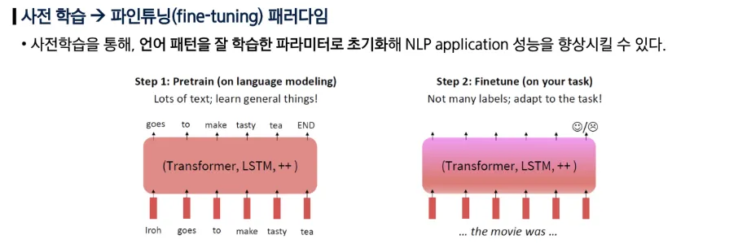
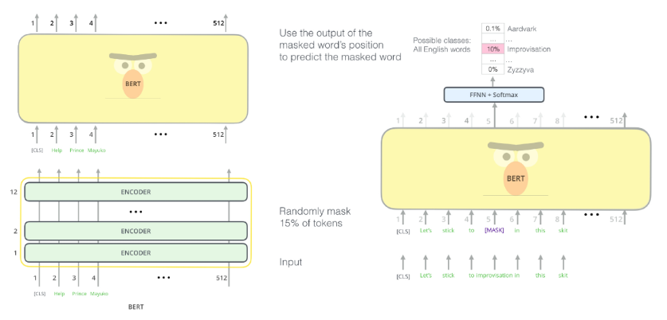
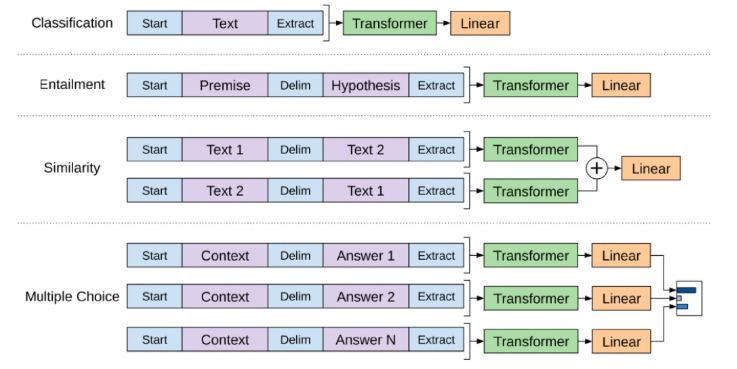

## 사전학습

### 언어모델의 사전학습

- 사전학습: 대규모 데이터 셋을 이용해 모델이 데이터의 일반적인 특징과 표현을 학습하도록 하는 과정
- 언어 모델은 인터넷의 방대한 텍스트 (웹 문서, 책, 뉴스 등)을 활용해 비지도 학습한다.

### 워드 임베딩 vs 언어 모델

- 워드 임베딩: 사전학습을 통해 단어의 의미를 학습
    - 다운스트림 태스크 (예: 텍스트 분류)들에 적용하기에는 학습되는 데이터의 양이 적다.
    - 언어의 풍부한 문맥 정보를 충분히 학습할 수 없다.
    - 연결된 네트워크가 무작위로 초기화되어 학습 효율이 낮고, 많은 데이터와 시간이 필요하다.
- 언어 모델: 사전학습을 통해 모델 전체를 학습
    - 언어에 대한 표현 학습용으로 적합하다.
    - 파라미터 초기화의 관점에서 효과적이다.
    - 언어에 대한 확률 분포 학습을 통해 샘플링, 생성에 사용할 수 있다.
    - 과거 단어들이 주어졌을 때, 다음 단어의 확률분포를 모델링하는 방법을 배움으로써 사전학습을 수행할 수 있다.
    - 인터넷의 대규모 텍스트 코퍼스에서 언어모델링 학습을 수행한 후 학습된 네트워크 파라미터를 저장해, 다양한 다운스트림 태스크에 활용한다.

## Encoder 모델

- Encoder 모델은 양방향 문맥을 모두 활용한다.
- Masked Language Model: 입력 단어의 일부를 [MASK] 토큰으로 치환해, 모델이 이 [MASK] 자리에 올 단어를 예측하도록 학습하는 방법

### BERT

- transfer 기반 모델
- Masked LM 방법으로 사전학습을 수행했다.
- 모델이 마스크된 단어에만 집중하지 않고, 다양한 문맥 표현을 학습해 더 강건한(robust) 표현을 학습할 수 있도록 했다.
- layer의 수, hidden state의 크기, attention head의 수가 클수록 성능이 향상되는 경향을 보였다.
- Masked LM 학습 방법:
    - 입력 토큰의 15%를 무작위로 선택
    - [MASK] 토큰 치환(80%), 랜덤 토큰 치환(10%), 그대로 두기(10%)

### BERT의 다운스트림 태스크 예시

- 두 문장 관계 분류 태스크
    - MNLI: 문장 관계 맞히기 (참/거짓/중립)
    - QQP: 같은 질문인지 맞히기
- 단일 문장 분류 태스크
    - SST2: 문장 분류하기 (긍정, 부정)
- QA 태스크
    - SQuAD: 제시문을 읽고 정답 맞히기

### BERT의 한계

- 시퀀스를 생성해야 하는 태스크(예: 기계 번역, 텍스트 생성 등)에는 적합하지 않다.
- 생성 태스크에서는 한 번에 한 단어씩(autoregressive) 생성해야 하는데, 이를 자연스럽게 수행하지 못한다.

## Encoder-Decoder 모델

### T5 (Text-to-Text Transfer Transformer)

- 2019년 Google Research에서 공개한 모델
- 모든 태스크를 Text-to-Text 포맷으로 변환해 하나의 모델로 학습했다.

### T5의 학습 방법: Span Corruption

- 입력 문장에서 연속된 토큰을 무작위로 선택해 제거한다.
- 제거된 부분을 특수 placeholder 토큰으로 치환한다. (예: <X>, <Y>)
- 디코더는 이 placeholder에 해당하는 원래 span을 복원하도록 학습한다.

## Decoder 모델

- 전형적인 언어 모델 구조

### Finetuning Decoder

- 사전학습 단계에서 다음 단어 예측 (Next Token Prediction)을 학습한다.
- 생성 태스크에 활용할 때:
    - 사전학습 때와 동일하게 다음 단어 예측 방식으로 fine-tuning한다.
    - 대화나 요약 태스크 등 출력이 시퀀스인 태스크에 자연스럽게 적합하다.
- 분류 태스크에 활용할 때:
    - 마지막 hidden state 위에 새로운 linear layer를 연결해 classifier로 사용한다.
    - linear layer는 처음부터 다시 학습해야 하며, fine-tuning 시 gradient가 decoder 전체로 전파된다.

### GPT-1, GPT-2

- 2018년 OpenAI에서 공개한 transformer 기반의 decoder 모델
- autoregressive LM 방식으로 사전학습되었다.
- fine-tuning 방법: 분류 태스크
    - 입력 토큰에 특수한 토큰 ([START], [DELIM], [EXTRACT])을 붙여 분류 문제를 처리
    - [EXTRACT] 위치의 hidden state에 classifier 를 연결해 사용

## In-Context Learning

### GPT-3

- 모델의 parameter soze를 키워 별도의 파인 튜닝 없이 컨텍스트 안의 예시만 보고도 새로운 태스크를 수행할 수 있게 되었다.
- shot의 수가 많을수록 태스크 수행 성능이 향상되었다.

### Chain-of-Thought prompting

- 모델이 문제 해결 과정에서 논리적인 사고 단계를 거쳐 최종 답을 도출하도록 유도하는 프롬프팅 기법
- fine-tuning을 수행한 모델들보다 더 좋은 성능을 보였다.
- Zero-Shot CoT prompting: 모델이 스스로 추론 단계를 생성하도록 유도하는 방법
    - few-shot 예시를 주지 않는 대신, 질문 뒤에 “let’s think step by step”을 추가