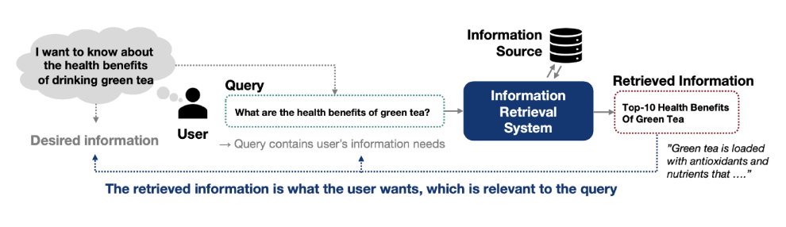
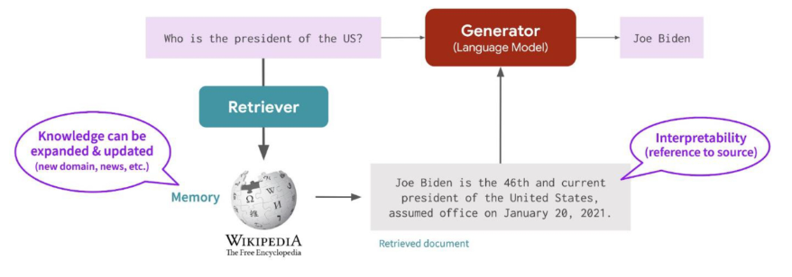
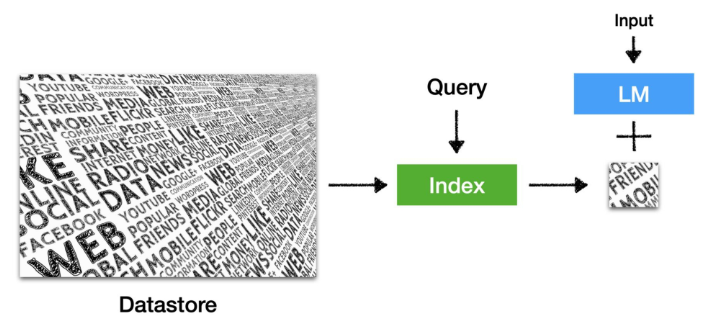
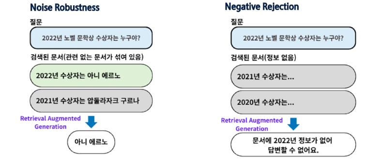
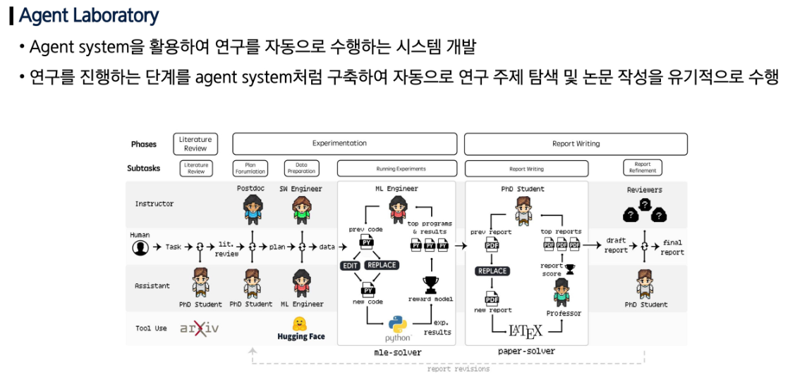
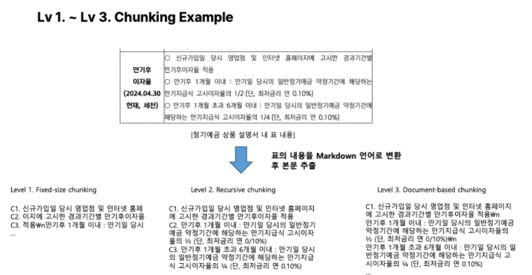
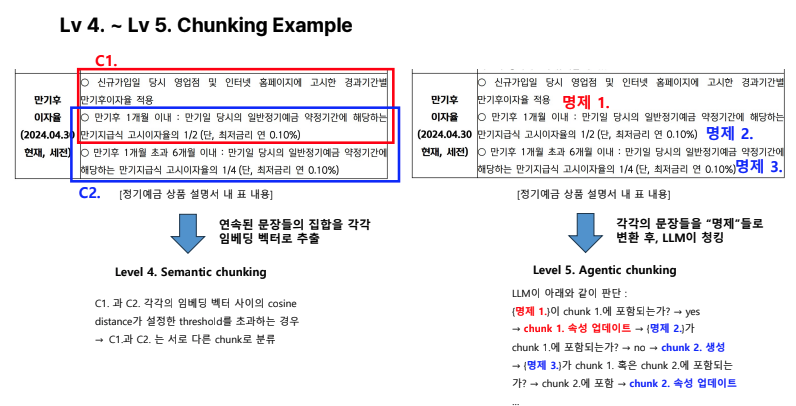

## Information Retrieval (정보 검색)

### IR (정보 검색)

- 목표: 검색 질의 (Query)와 가장 관련성 높은 정보를 제공하는 것
- 정보 검색 (IR): 사용자의 질의 (Query)에 맞는 정보를 대규모 데이터에서 찾아 제공하는 과정
    - 사용자가 질문하면, IR이 관련 문서를 찾아 제공한다.
- Retrieval (검색): datastore에 있는 수 많은 정보 중에서, 주어진 쿼리와 가장 관련성이 높은 정보를 찾아내는 과정



IR (정보 검색)

### IR의 활용

- Web Search, Item Search
    - Search Engines: 구글, 네이버
    - E-Commerce: 아마존, 쿠팡
- 추천 시스템
    - OTT 서비스, E-Commerce
- RAG (Retrieval-augmented Generation, 검색 증강 생성)
    - 사용자의 질문에 답하기 위해 datastore에서 관련 정보를 검색(Retrieval)해와서, 이를 언어모델이 생성 (Generation) 단계에 활용하는 방법
    - 검색된 문서를 활용하여 더 정확하고 최신의 답변을 생성한다.



RAG (검색 증강 생성)

### Retriever

- 사용자의 질의에 맞는 후보 문서를 저장소에서 찾아오는 모듈. RAG에서 첫 단계 역할
- Sparse Retriever (어휘적 유사도 기반)
    - TF-IDF, BM-25
- Dense Retriever (의미적 유사도 기반)
    - DPR, Contriever, Openai-embeddings

### Sparse Retriever

- 전통적인 IR 기법. 쿼리와 문서 간의 정확한 용어 일치, 즉 **어휘적 유사도**에 기반한다.
- 단순성, 효율성, 투명성
- 제한된 의미 이해
    - 예를 들어, 쿼리에는 ‘bad guy’라는 표현이 쓰였지만, 실제 문서에서는 ‘villain’이라는 단어가 사용되어 매칭되지 않는다.
- TF-IDF: 문서 내 특정 단어의 중요도를 나타내는 가중치 방식
    - TF (Term Frequency): 단어가 문서에 얼마나 자주 등장하는지 → 중요하다.
    - IDF (Inverse Document Frequency): 단어가 전체 코퍼스에서 얼마나 드물게 등장하는지 → 너무 많은 문서에 등장하는 단어는 덜 중요하다. (예: this, is ,and)

### Dense Retriever

- 쿼리와 문서를 표현하기 위해 dense vector를 활용해 **의미적 유사도**에 기반한다.
- 글의 문맥과 의미를 포착한다. 특히 복잡한 쿼리와 긴 검색 쿼리의 의미를 더 잘 포착할 수 있다.
- dense retriever는 블랙박스처럼 작동할 수 있어, 특정 문서가 왜 검색되었는지 해석하기 어렵다.
- 임베딩 모델 (Embedding Models): 단어, 문장의 의미를 표현할 수 있다.
- Bi-encoder: 두 문장을 따로 인코딩한다.
    - 대조 학습을 통해 학습되며, 쿼리가 긍정적인 문서와 가깝게 유지되도록 하고 부정적인 문서에서는 멀어지도록 유도한다.
- Cross-encoder: 두 개의 텍스트를 하나의 시퀀스로 결합해, 두 문장을 함께 처리한다.
    - self-attention을 통해 모든 쿼리와 문서 토큰이 완전히 상호작용할 수 있어, bi-encoder보다 더 높은 정확도를 얻을 수 있지만, 계산 비용이 크고 처리 속도가 느리다.

## RAG (Retrieval-augmented Generation, 검색 증강 생성)

### Retrieval-augmented LM

- 추론 시 외부 데이터 저장소를 불러와 활용하는 언어모델
- RAG (Retrieval-augmented Generation): 정보 검색부터 답변 생성까지의 프레임워크

### Retrieval-augmented LM의 구성 요소

- 구성 요소: Datastore, Query, Index, Language Model



Retrieval-augmented LM의 구성

- Datastore: 가공되지 않은 텍스트 코퍼스
    - 라벨링된 데이터셋이 아니다.
    - 지식베이스(Knowledge base)와 같은 구조화된 데이터가 아니다.
- Query: 검색 질의. Retrieval input
    - 언어모델의 질의 (input)와 같아야 하는 것은 아니다.
- Index: 문서나 단락과 같은 검색 가능한 항목들을 체계적으로 정리하여 더 쉽게 찾을 수 있도록 하는 것
    - 각 정보 검색 (information retrieval) 메서드는 인덱싱 과정에서 구축된 인덱스를 활용해 쿼리와 관련 있는 정보를 식별한다.
    - Nonparametric Knowledge는 parametric knowledge와 상호 보완적인 관계

### Retrieval-augmented LM를 사용하는 이유

- 거대 언어 모델은 모든 지식을 다 자신의 파라미터에 저장하지 못한다.
    - 거대 언어 모델은 사전학습 데이터에 자주 나타나는 쉬운 정보를 기억하는 경향성이 있다.
    - RAG는 자주 등장하지 않는 정보에 대해서 큰 효과를 가져다 준다.
- 거대 언어 모델이 보유한 지식은 금세 시대에 뒤쳐지며, 갱신이 어렵다.
    - 현재의 지식 편집 (Knowledge editing) 메서드들은 확장성이 부족하다.
    - 저장소 (Datastore)는 쉽게 업데이트가 가능하며, 확장성을 만족한다.
- 답변의 해석과 검증이 어렵다.
    - 환각 (Hallucination) 문제를 해결할 수 있다.
- 기업 내부 정보와 같은 보안 정보는 언어모델 학습에 활용되지 않는다.
    - 사내 챗봇/기업 내부 시스템에 언어모델을 사용하는 경우 내부 데이터를 학습 시 정보 유출의 위험성이 있다.

### Retrieval-augmented LM의 한계

- Context를 어떻게 구성해야 하는가?
    - 언어모델의 컨텍스트 길이 (Context length)를 늘려야 한다.
- 검색 노이즈에 취약하다.
    - RAG의 결과는 검색 모델 성능에 의존하기 때문
    - Context 안의 정보를 이용하려는 LLM의 경향성 때문에, 검색에서의 노이즈(정확하지 않은 유사 정보)가 Hallucination을 증가시킨다.
    - Training with Noises로 극복할 수 있다.
        - Noise Robustness: 노이즈가 포함되어 있어도 올바른 답을 찾아내는 능력
        - Negative Rejection: 없는 정보에 대해서 답변을 거부하는 능력



Training with Noises 예시

- LLM의 사전 지식과 컨텍스트 간의 충돌 발생
    - Context 위에서 Gronding 학습 강화
    - Context가 없을 때, 답변 회피/거절 학습
- 복잡한 추론이 필요하고 문서가 명확한 사실에 대한 오류를 포함할 때

### Tool Augmented LLM (Agent)

- Visual Programming
    - 언어 모델의 추가 학습 없이 주어진 툴을 사용하여 사용자가 텍스트로 요청한 영상 처리를 수행
- Claude Compute Use
    - 텍스트를 기반으로 컴퓨터를 사람처럼 사용할 수 있는 서비스
    - 컴퓨터가 수행하길 바라는 지시사항을 텍스트로 입력하면 자동으로 명령 수행


## Multi-Agent 시스템으로의 확장




---

## RAG 코드 구현

## 1. 데이터 로드

### 데이터 로드 및 분할

1. 데이터 로더 (Document Loaders)
    - 다양한 형식(PDF, TXT, HTML 등)의 문서를 LangChain 표준 형식인 Document 객체로 불러오는 도구
    - `Document` 객체는 `page_content` (텍스트 내용)와 `metadata` (출처 등 부가정보)로 구성됨
    - `TextLoader`: `.txt` 파일 로드. 파일 하나당 `Document` 1개 생성
    - `PyMuPDFLoader`: `.pdf` 파일 로드. 페이지 하나당 `Document` 1개 생성
2. 텍스트 분할 (Text Splitter)
    - `RecursiveCharacterTextSplitter`: `Document` 객체 리스트를 입력받아, 더 작은 `Document` 객체(청크) 리스트로 분할
    - `chunk_size`: 청크의 최대 크기. (RAG에서는 토큰이 아닌 문자 수 기준을 자주 사용)
        - (Trade-off) 너무 크면: 검색은 되지만 LLM에게 불필요한 정보가 많아져 답변 품질 저하.
        - (Trade-off) 너무 작으면: 문맥이 잘려나가 정보가 손실되고 검색 품질 저하.
    - `chunk_overlap`: 인접한 청크 간에 겹치는 문자 수. 청크 경계에서 문맥이 끊어지는 것을 방지

```python
from langchain_community.document_loaders import TextLoader
from langchain_community.document_loaders import PyMuPDFLoader  # PDF 로더
# glob: 파일 경로에서 와일드카드(*.pdf)를 사용해 패턴 매칭을 위한 라이브러리
import glob

# 1. 데이터 로드 (PDF)
# base_path 아래 /data/ 폴더에 있는 모든 .pdf 파일을 찾음
pdf_files = glob.glob(base_path + '/data/*.pdf')

# 모든 PDF 파일에서 로드된 문서(페이지)를 저장할 빈 리스트
documents = []
for pdf_filepath in pdf_files:
    # 각 PDF 파일을 PyMuPDFLoader를 사용하여 로드
    loader = PyMuPDFLoader(pdf_filepath)
    # .load(): PDF의 각 페이지를 별도의 Document 객체로 로드
    pages = loader.load()
    # 로드된 페이지들을 documents 리스트에 추가
    documents.extend(pages)

# 1. 데이터 로드 (TXT)
shipping_policy_file_path = base_path + '/shipping_policy.txt'
loader = TextLoader(shipping_policy_file_path)
text_documents = loader.load()

# 로드된 텍스트 문서(TXT)도 documents 리스트에 추가
documents.extend(text_documents)

print(f'총 문서(페이지+파일) 개수: {len(documents)}')
# 각 문서 일부 출력
for i, doc in enumerate(documents):
    print(f'\n문서 {i+1} 내용 일부:')
    print(doc.page_content[:100])  # 각 문서의 처음 100자만 출력
```

## 2. 분할 (Chunking)

### 파싱과 청킹

1. **파싱 (Parsing)**
    - LLM은 기본적으로 `텍스트`만 이해할 수 있음.
    - PDF, HTML, DOCX 등 다양한 형식의 문서에는 텍스트 외에 레이아웃, 이미지, 서식 등 '노이즈'가 포함됨
    - **파싱**은 이러한 원본 문서에서 LLM이 이해할 수 있는 순수한 텍스트와 메타데이터(예: 출처, 페이지 번호)만 추출하는 과정임
    - RAG 파이프라인의 가장 첫 번째 'Ingestion(수집)' 단계에 해당
2. **청킹 (Chunking)**
    - LLM은 한 번에 처리할 수 있는 텍스트 양(Context Window)에 제한이 있음
    - RAG에서는 이보다 더 중요한 이유가 있음: **검색의 정확도.**
    - 만약 책 한 권을 통째로 하나의 '청크'로 만든다면, "배송비는 얼마인가?"라는 질문에 책 전체가 검색 결과로 나옴. 이는 LLM에게 너무 방대하고 희석된 정보를 제공하는 것.
    - 따라서, 문서를 검색에 용이하도록 **의미 있는** 작은 `청크` 단위로 나누는 작업이 필수적임. RAG는 '청크' 단위로 정보를 검색함.
    - 보통 chunk size는 200~300 정도를 사용한다.

### 토크나이징과 청킹

- 두 개념은 자주 혼동되지만, 목적이 다름
1. **청킹**
    - *'검색(Retrieval)'**을 위한 텍스트 분할.
    - RAG 시스템이 정보를 검색하는 '단위'를 만드는 과정. (예: 200자짜리 문단)
    - `RecursiveCharacterTextSplitter` 등을 활용.
2. **토크나이징 (Tokenizing)**
    - *'LLM의 처리'**를 위한 텍스트 분할.
    - LLM이 텍스트를 이해하는 최소 단위(숫자 시퀀스)로 쪼개는 과정.
    - (예: "text" -> 29, 49)
    - `tiktoken` 라이브러리는 주로 이 토큰 '수'를 계산하여 모델의 컨텍스트 창 제한을 넘지 않는지 확인하는 용도로 사용됨.

### 청킹 전략 (Chunking Strategy)

**[Level 1~3: 단순 청킹]**

**Level 1 – Fixed-sized Chunking**: 일정한 글자 수(예: 500자)로 문서를 나눔. 글의 맥락이나 구조를 무시하기 때문에 문장이 어색하게 끊길 수 있음.

**Level 2 – Recursive Chunking**: 띄어쓰기나 문장 단위로 데이터를 나눔. 어느정도 글의 구조를 반영하지만 의미가 끊길 가능성 있음.

**Level 3 – Document-based Chunking**: 문서의 구조(예: 섹션, 제목)에 따라 청킹. 타겟 문서가 ‘명확한 구조’를 가지고 있다면, 글의 전체 흐름 및 구조에 맞게 청킹이 가능.

- Markdown - 구분자(seperator) (예: # 제목, - 목록, —- 구분선)
- Python/JS - 코드 구조 (예: class, function)



**[Level 4~5: 고도화된 청킹]**

**Level 4** – **Semantic Chunking :** AI가 문장 간의 의미적 유사성을 분석하여 자연스럽게 정보를 묶는 방법. 단순히 글자 수나 구조에 의존하지 않고, 문장 의미가 달라지는 지점을 기준으로 청크를 나눔.

- 문장을 임베딩 벡터로 변환 후 유사도 계산, 유사도가 급격히 감소하는 Breakpoint 기준으로 청킹

**Level 5** – **Agentic Chunking :** AI가 명제(Proposition)를 중심으로 직접 청킹을 수행. AI가 문서에서 핵심 내용을 추출하고 이를 기준으로 청킹. 정보의 밀집도와 명제 간의 관계를 최적화하여 질문에 답변. 가장 발전된 방법으로, 정보를 잘못 나눌 위험이 적음.

- 명제 (Proposition)를 추출하여 청크에 포함시킨다. (LLM 프롬프팅 활용)



```python
from langchain_text_splitters import RecursiveCharacterTextSplitter
from langchain_community.vectorstores import Chroma
from langchain_upstage import UpstageEmbeddings

# 2. 분할 (Chunking)
text_splitter = RecursiveCharacterTextSplitter(
    chunk_size=200,
    chunk_overlap=20,
    length_function=len,
    is_separator_regex=False,
)
chunks = text_splitter.split_documents(documents)
```

## 3. **임베딩 및 저장 (Embedding & Storage)**

### Vector Store (벡터 스토어)

- RAG의 '외부 지식 소스' 역할을 하는, `수치형 벡터` 검색에 특화된 데이터베이스
1. **임베딩 (Embedding)**
    - RAG의 핵심 기술. 텍스트, 이미지 등 데이터를 고차원의 '벡터(숫자 배열)'로 변환하는 과정
    - '임베딩 모델'(LLM의 일종)이 이 변환을 수행함.
    - 의미가 유사한 텍스트는 벡터 공간에서 '가까운 거리'에 위치하게 됨.
        - 예: "배송비"와 "shipping cost"는 매우 가까운 벡터로 변환됨
2. **벡터 스토어의 역할**
    - **저장 (Ingestion):** 우리가 가진 문서(PDF, TXT)를 '청크'로 나누고, 각 청크를 '임베딩'하여 벡터로 변환한 뒤, (원본 청크, 벡터) 쌍으로 데이터베이스에 저장함
    - **검색 (Retrieval):**
        1. 사용자의 '질문' 역시 **동일한 임베딩 모델**을 사용해 '질문 벡터'로 변환.
        2. 벡터 스토어는 이 '질문 벡터'와 데이터베이스 내에 저장된 '문서 벡터'들 간의 유사도(거리)를 계산함 (예: 코사인 유사도, KNN).
        3. '질문 벡터'와 가장 가까운(유사한) 상위 K개의 '문서 벡터'를 찾고, 이에 해당하는 '원본 문서 청크'를 반환함.

```python
# 3. 임베딩 및 저장 (Embedding & Storage)

# 3-1. 임베딩 모델 초기화
# Upstage에서 제공하는 임베딩 모델(embedding-query)을 사용.
# (API 키는 환경 변수에서 자동 로드)
embeddings = UpstageEmbeddings(model='embedding-query')

# 3-2. 청크로부터 Chroma Vector Store 생성
# Chroma.from_documents()는 다음 작업을 한 번에 수행:
# 1. (Iterate) 'chunks' 리스트를 순회
# 2. (Embed) 각 청크의 텍스트를 'embeddings' 모델로 벡터화
# 3. (Store) (청크 텍스트, 메타데이터, 벡터)를 Chroma DB에 저장
vectorstore = Chroma.from_documents(
    documents=chunks,  # 저장할 청크 리스트
    embedding=embeddings,  # 벡터화를 위한 임베딩 모델
    persist_directory=base_path + 'chroma_db',  # DB를 저장할 디스크 경로
)

print('\n--- Vector Store 생성 완료 ---')
print(f"Vector Store에 저장된 문서 개수: {vectorstore._collection.count()}")
```

## **4. 리트리버 생성 (Retriever)**

- `Vector Store`는 데이터베이스 자체를 의미함.
- `Retriever`는 이 데이터베이스에 '질문(query)'을 던져 '관련 문서(chunks)'를 가져오는 '검색기' 역할을 하는 LangChain의 추상화 인터페이스(Runnable).
- LCEL 체인에 연결(pipe)할 수 있도록 `vectorstore` 객체를 `retriever` 객체로 변환함.

```python
# 4. 리트리버 생성
# vectorstore 객체를 LangChain의 Retriever 인터페이스로 변환.
# .as_retriever()는 '질문(str)'을 입력받아 '문서 리스트(List[Document])'를 반환하는 Runnable이 됨.
retriever = vectorstore.as_retriever()
```

## 5. **체인 구성 (Chain)**

```python
# RunnablePassthrough: 입력을 수정 없이 그대로 다음 단계로 전달하는 역할.
# .assign()과 함께 쓰여, 원본 입력(question)을 유지하면서 검색 결과(context)를 추가할 때 유용.
from langchain.schema.runnable import RunnablePassthrough
from langchain_core.output_parsers import StrOutputParser
from langchain.prompts import ChatPromptTemplate
from langchain_upstage import ChatUpstage
# itemgetter: 딕셔너리에서 특정 키의 값을 추출하는 유틸리티 (lambda x: x['key']와 동일)
from operator import itemgetter

query = '주말에도 배송되나요?'

# 문서 리스트(List[Document])를 하나의 문자열로 포맷하는 함수
# (리트리버의 출력 형식을 프롬프트의 입력 형식에 맞추기 위함)
def format_docs(docs):
    return '\n\n'.join(doc.page_content for doc in docs)

# LLM 모델 정의
model = ChatUpstage()

# RAG용 프롬프트 템플릿 정의
# {context} (검색된 문서)와 {question} (원본 질문)을 변수로 받음
rag_prompt = ChatPromptTemplate.from_messages(
    [
        ('system', '당신은 친절한 고객 지원 담당자입니다.'),
        (
            'user',
            '다음 컨텍스트를 참고해서 질문에 답변해 주세요: **{context}**\n질문: {question}',
        ),
    ]
)

# 5. RAG 체인 구성 (LCEL 사용)
rag_chain = (
    # assign(): 'context' 키를 새로 생성하여 딕셔너리에 추가.
    # RunnablePassthrough가 원본 'question'은 그대로 통과시킴.
    RunnablePassthrough.assign(
        # 'context'의 값은 (질문 추출 -> 리트리버 검색 -> 포맷팅) 파이프라인으로 계산
        context=(itemgetter('question') | retriever | format_docs)
    )
    | rag_prompt  # {'question': ..., 'context': ...} 딕셔너리가 프롬프트로 전달됨
    | model  # 프롬프트가 모델로 전달됨
    | StrOutputParser()  # 모델의 출력(AIMessage)을 깔끔한 문자열(str)로 변환
)

# 체인 실행 (입력은 체인의 맨 처음 요구사항인 {'question': ...} 딕셔너리)
response = rag_chain.invoke({'question': query})

from pprint import pprint

print(f'\n질문: {query}')
pprint(f'답변: {response}')

"""

질문: 주말에도 배송되나요?
('답변: 제공된 정보에 따르면, 주말에는 일반적으로 배송이 어렵습니다. 하지만 서울, 수도권, 충청권의 경우 토요일 21시부터 일요일 '
 '15시까지 주문 시 월요일 아침 7시 전에 배송이 가능합니다. 따라서 이 지역에 한해 토요일에도 주문이 가능하며, 해당 시간에 주문하시면 '
 '다음날인 월요일에 상품을 받으실 수 있습니다. 그 외 지역의 경우 일요일에는 주문 및 배송이 어려우니 참고하시기 바랍니다.')

 """
```
