## RNN (Recurrent Nueral Nets)

### RNN

- 순차적 데이터를 처리하기 위해 고안된 신경망 구조
- 이전 단계 데이터를 hidden state로 다음 단계에 전달한다.
    - 시간/순서의 흐름을 반영할 수 있다.
- 시계열/언어 데이터에 적합
    - 문장, 음성 신호, 센서 데이터 등

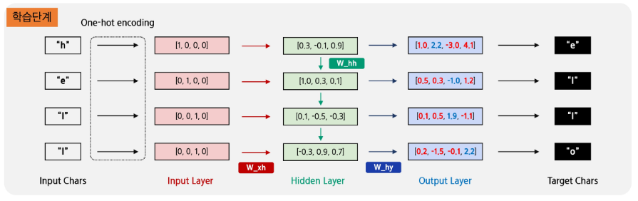

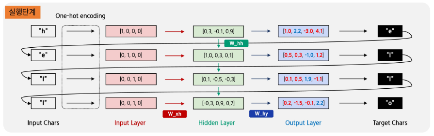

- Input Layer: 1과 0으로 된 one-hot 벡터. 길이는 알파벳 집합 개수와 동일하다.
    - W_xh: 입력 → 은닉 변환
- Hidden Layer: hidden state가 바로 이전까지의 문맥(context)을 담고 다음 단계로 전달한다.
    - W_hh: 이전 은닉 → 현재 은닉
- Output Layer: hidden state를 출력 벡터로 변환한 것
    - W_hy: 은닉 → 출력 변환
- Target Chars: 각 시점에서 예측해야하는 정답 문자
    - 이 정답과 output layer 확률을 비교한 오차로 가중치를 업데이트한다.

### RNN 셀

- 은닉층에서 활성화 함수를 통해 결과를 내보내는 역할
    - cell: 이전의 값을 기억하려고 하는 일종의 메모리 역할을 수행한다.
- 은닉 상태 (hidden state): 메모리 셀이 출력층 방향 또는 다음 시점인 t+1의 자신에게 보내는 값
- 재귀(왼쪽) == 사이클(오른쪽)

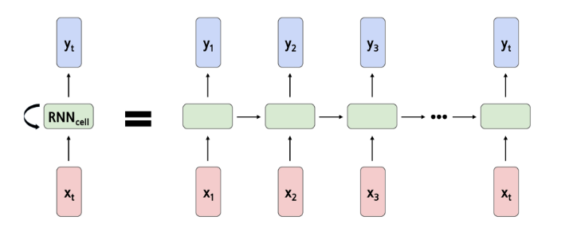

### 시계열 의존성

- 데이터의 시계열 특징을 반영하는 모델이나, RNN 상수는 시계열(혹은 순서)에 무관하다.

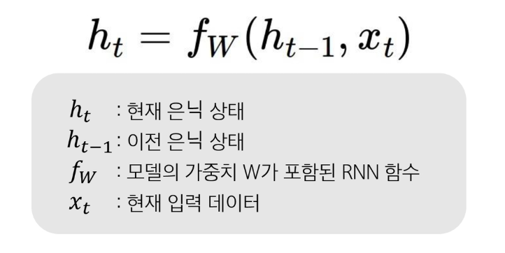

### 순수(vanilla) RNN

- 선형변환, 바이어스를 모델상수/비선형 (tanh) 함수 추가로 구성된 단순한 형태
- 은닉 상태를 기반으로 최종 출력을 생성한다.

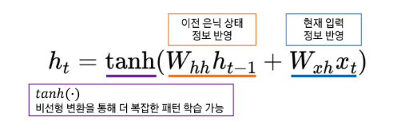

### 입출력 구조

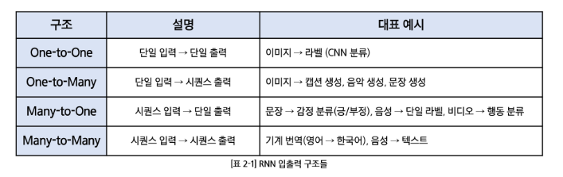
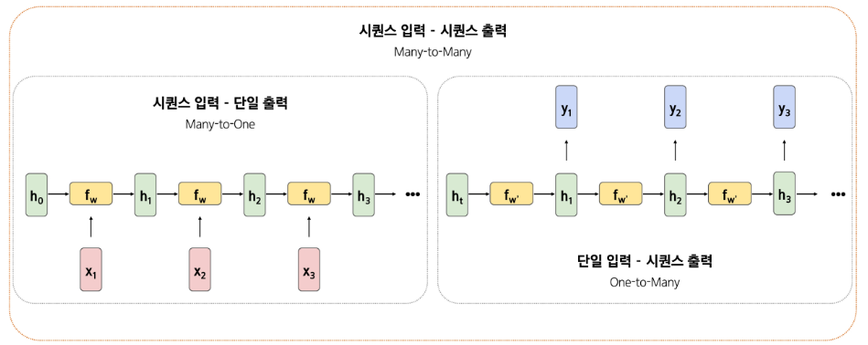

### 단순 RNN의 한계

- 역전파의 시퀀스 데이터가 적용되면서 선형가중치 W가 기울기 계산 시 계속 곱셈에 반영된다.
- |W|의 특이값이 커지면 곱할수록 무한히 커져 기울기 폭발
    - 폭발하지 않도록 기울기 값을 절삭할 수 있지만, 결국 잘못된 기울기 값을 양산할 수 있다.
- |W|의 특이값이 작으면 곱할수록 0에 수렴하여 기울기 소실

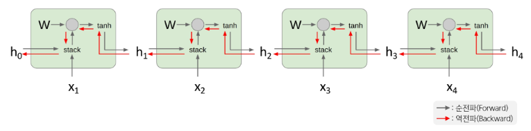

### LSTM (Long-Short-Term Memory)

- **셀 상태 (cell state)**: 중요한 정보를 유지/기억하는 역할
- 게이트 (gate): 정보의 흐름을 제어
    - 입력 게이트: 새로운 정보의 저장
        - 새로운 정보를 적절히 추가해 학습 안정화
    - 망각 게이트: 과거 정보를 제거
        - 필요 없는 정보를 줄여 셀 상태가 폭발하지 않도록 제어한다.
    - 출력 게이트: 셀 상태를 현재 은닉 상태로 출력
- 각 시퀀스 데이터에서 필요한 정보는 유지하고, 불필요한 정보는 지운다.
- 기울기 전파 시 선형가중치의 곱 이외에 덧셈 형태로 전달하여 기울기를 장기적으로 보존할 수 있다.
    - 각 상태에서의 기울기를 덧셈과 곱셈 경로로 분리 가능

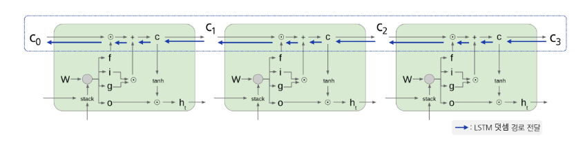

- 정보 희석 문제의 한계: 망각 게이트가 과거의 정보를 조금씩 줄인다.
    - 누적 효과로 과거 중요한 정보가 점차 희석되어 오래된 정보가 점차 약화된다.

## 어텐션 (Attention)

### 어텐션 메커니즘

- 픽셀 거리와 상관없이 유사한 패치(patch)가 이미지에 존재
- 관련 높은 패치/관련 낮은 패치 정보를 최종 결정에 반영하자
    - 쿼리와 키가 유사하면 해당 값에 가중치를 높게 준다.

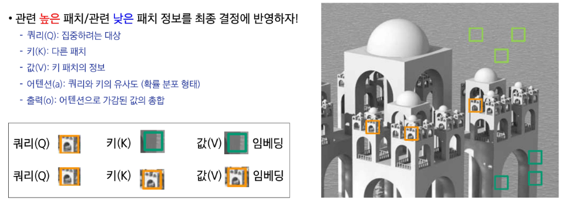

### 자기 어텐션 (Self-Attention)

- 하나의 입력 안에서 패치 정보(쿼리/키/값)를 정의한다.
- 같은 이미지 내 유사도 (쿼리와 키 간 유사도)를 반영한다.
- 입력 내부 패치간 연결망을 구축한다.
    - 클러스터링 효과: 서로 비슷한 특성의 패치끼리 모여 그룹을 형성

### 교차 어텐션 (Cross-Attention)

- 둘 이상의 이종 데이터에서 패치 정보 (쿼리/키/값)을 정의한다.
    - 예: Text-To-Image 모델에서 이미지-텍스트 간 연결
- 이종 데이터 간 유사도를 반영한다.
    - 쿼리와 키를 비교할 수 있는 공간이 필요하다.
- 서로 다른 입력 간 연결망을 구축한다.

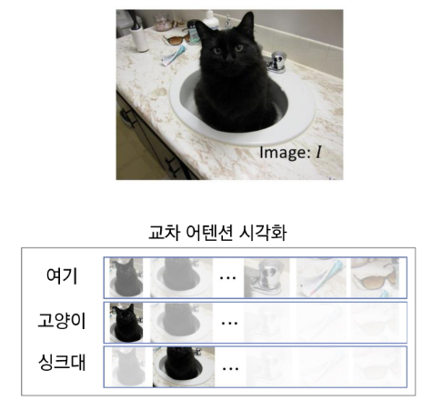

## 모델별 특성 정리

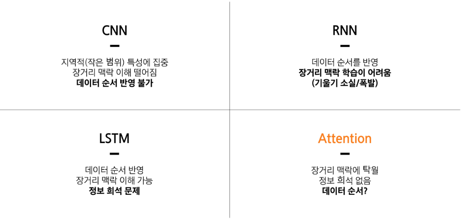
