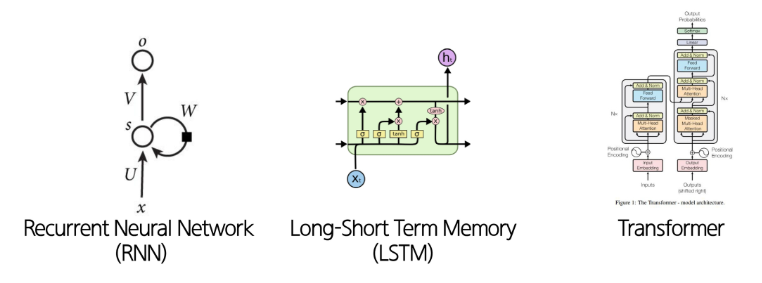

# 워드 임베딩과 순환신경망 기반 모델 (RNN & LSTM)

## 워드 임베딩

### 원-핫 인코딩 (one-hot Encoding)

- 단어 집합의 크기를 벡터의 차원으로 하고, 표현하고 싶은 단어의 인덱스에 1의 값을 부여하고, 다른 인덱스에는 0을 부여하는 단어의 벡터 표현 방식
    - 범주형 텍스트 데이터를 숫자 데이터(컴퓨터가 이해할 수 있는 데이터)로 변경하는 과정
    - 각 단어에 고유한 정수를 부여한다.
    - 표현하고 싶은 단어의 고유한 정수를 인덱스로 간주하고 해당 위치에 1을 부여하고, 다른 단어의 인덱스의 위치에는 0을 부여한다.
- 원-핫 벡터: 벡터 공간 관점에서, 한 원소만 1이고 나머지는 모두 0인 벡터
- 규칙 기반 혹은 통계적 자연어 처리 연구의 대부분은 단어를 원자적(쪼갤 수 없는) 기호로 취급한다.
- 차원 수 (= 단어 사전 크기)

### 원-핫 인코딩의 문제점

- 차원의 저주(Curse of Dimensionality)
    - 차원이 커질수록 데이터가 점점 더 희소(sparse)해져 활용이 어렵다.
    - 고차원의 희소 벡터를 다루기 위해서 메모리가 많이 필요하다.
- **단어 간 유사성을 알 수 없다.**
    - 비슷한 단어라도 유사한 벡터로 표현되지 않는다.
    - 검색 쿼리 벡터와 대상이 되는 문서 벡터들이 서로 직교하게 되어, 원-핫 벡터로는 유사도를 측정할 수 없다.

### 워드 임베딩

- 단어들 사이의 의미적 관계를 포착할 수 있는 밀집(dense)되고 연속적/분산적(distributed)벡터 표현으로 나타내는 방법
- 두 단어의 벡터가 공간상 서로 가깝게 위치한다.
    - 의미적 유사성을 반영할 수 있다.

### Word2Vec

- 대표적인 워드 임베딩 기법 by Google
- 각 단어와 그 주변 단어들 간의 관계를 예측한다.
- **Skip-grams (SG) 방식**
    - 중심 단어를 통해 주변 단어들을 예측하는 방식
    - 단어의 위치 (앞/뒤)에 크게 구애받지 않는다.
    - window size: 중심 단어 주변 몇 개 단어를 문맥으로 볼 것인가?

    

- **Continuous Bag of Words (CBOW) 방식**
    - 주변 단어들을 통해 중심 단어를 예측하는 방식
    - 주변 문맥 단어들의 집합이 주어졌을 때, 그 문맥과 함께 등장할 수 있는 단일 중심 단어를 예측한다.

    

### Skip-Gram vs CBOW

| 모델 | Skip-Gram | CBOW |
| --- | --- | --- |
| 장점 | 적은 데이터에도 잘 동작한다. | 학습 속도가 빠르다. |
| 활용 | 희귀 단어나 구 표현에 강하다. | 자주 나오는 단어에 강하다. |
| 한계 | 학습 속도가 느리다. | 희귀 단어 표현에 약하다. |

## Sequential Models

### 순차적 데이터 (Sequential Data)

- 데이터가 입력되는 순서와 이 순서를 통해 입력되는 데이터들 사이의 관계가 중요한 데이터
    - 오디오, 텍스트, 비디오 등
- 순서가 중요하다.
    - 데이터의 순서가 바뀌면 의미가 달라진다.
- 장기 의존성 (long-term dependency)
    - 멀리 떨어진 과거의 정보가 현재/미래에 영향을 준다.
- 가변 길이 (Variable length)
    - 순차 데이터는 길이가 일정하지 않고, 단어 수도 제각각이다.

### Sequential Models

- 순차적 데이터를 처리하기 위한 모델
    - 전통적인 인공 신경망 (MLP, CNN 등)은 고정된 길이의 입력을 받아 가변 길이의 데이터를 처리하기에 적합하지 않다.
- RNN, LSTM, Transformer 등

### RNN (Recurrent Neural Network)

- 순차적 데이터 처리에 적합한 신경망 모델
- 한 번에 하나의 요소를 처리하고, 정보를 앞으로 전달한다.
- 가변 길이의 입력을 받을 수 있고, **이전 시점의 정보(hidden state)를 기억**할 수 있다.
    - 입력 시퀀스 벡터 x를 처리할 때, 각 시점마다 recurrence 수식을 적용하여 hidden state를 업데이트한다.
    - RNN의 출력은 과거 입력의 영향을 받는다.

- 차원의 크기를 고려해볼 것.
    - y가 2차원, h가 100차원이라면, W는 100*2차원이어야 함

### RNN의 한계

- **기울기 소실 (Vanishing Gradient) 문제**: 딥러닝에서 역전파 시 앞쪽 층의 기울기가 0에 가까워져서 장기 의존성 학습이 어려워지는 현상
- 역전파 과정에서 작은 값들이 계속 곱해진다.
- 과거 시점에서 온 오차 신호는 갈수록 더 작은 기울기를 갖게 된다.
- 결국 파라미터들이 장기 의존성은 학습하지 못하고 단기 의존성만 포착하게 된다.

### LSTMs (Long Short-Term Memory)

- 기울기 소실 문제를 해결하기 위해 제안된 RNN의 한 종류
- 시점 t에서 RNN의 길이가 n인 벡터 **hidden state $h_t$와 cell state $C_t$** 를 가진다.
    - hiddent state는 short-term information을 저장한다.
    - cell state는 long-term information을 저장한다.
- cell state에서 정보를 읽고, 지우고, 기록할 수 있다.

### LSTMs 게이트

- 3가지 게이트를 통해 어떤 정보를 지우고, 쓰고, 읽을지 결정한다.
- 매 시점마다 게이트의 각 요소는 열림(1), 닫힘(0), 혹은 그 사이의 값으로 설정된다.
    - 게이트는 동적으로 계산된다.
    - 현재 입력과 hidden state 등 문맥에 따라 값이 정해진다.

- Forget gate: 이전 cell state에서 무엇을 버리고, 무엇을 유지할 지 결정
- Input gate: 새 정보 중 얼마나 cell state에 쓸 지 결정
    - New cell content: cell에 기록될 새로운 후보
- Output gate: cell state 중 얼마나 hidden state에 내보낼 지 결정