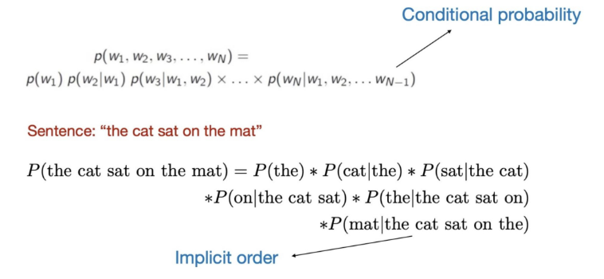
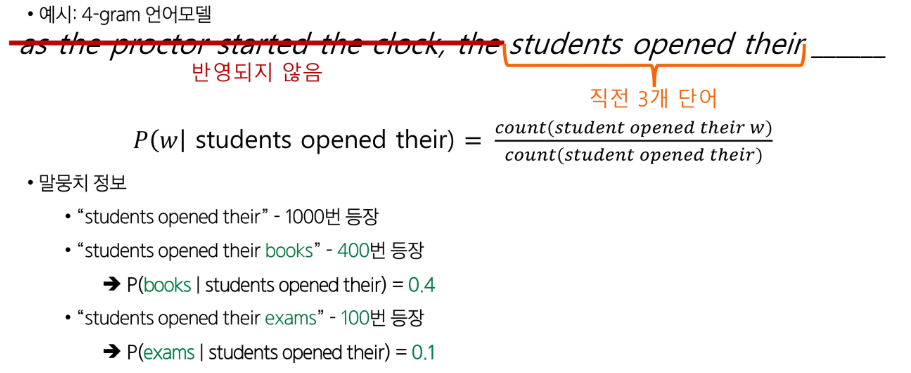
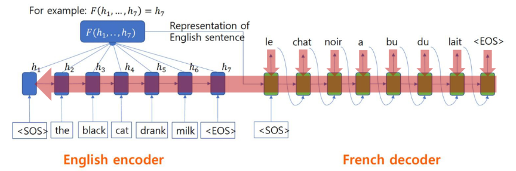
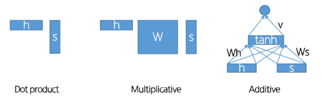

# 자연어 생성 모델 (Seq2Seq, Attention)

## 언어 모델 (Language Model)

### 언어 모델

- 자연어 텍스트를 이해하고 생성하도록 학습된 인공지능 모델
- 인간의 두뇌가 자연어를 생성하는 능력을 모방했다.
- 단어 시쿼스 전체에 확률을 부여하여 문장의 자연스러움을 측정한다.
- 한 문장의 확률은 각 단어의 조건부 확률들의 곱으로 표현할 수 있다.

- 검색어 추천, 자동 완성 등

### N-gram 언어모델

- 다양한 n-gram이 얼마나 자주 등장하는지 통계를 수집하고 이를 활용해 다음 단어를 예측한다.
    - n-gram: 연속된 n개의 단어 묶음
    - unigram, bigram, trigram(3-gram), 4-gram 등
- 코퍼스: 모델이 훈련되는 대규모 텍스트 데이터 모음
    - 코퍼스가 클수록 모델의 성능이 향상될 수 있다.
- n이 커질수록 훈련 코퍼스에서 n-gram의 출현 확률이 줄어든다.
    - n은 최대 5를 넘지 않는 것을 권장한다.
- 직전 (n-1)개의 단어 뭉치만 문맥에 반영한다.

### Statistical Machine Translation (SMT)

- 번역 모델과 언어 모델로 나누어 접근하는 기계 번역 방식
    - 번역 모델: 단어와 구가 어떻게 번역되어야 하는지 모델링
        - (한국어, 영어) 말뭉치로 학습
    - 언어 모델: 유창한 영어 문장을 쓰는 방법을 모델링
        - 영어 데이터로 학습
- 구조적 복잡성
- 많은 수작업
- 언어별 자원 구축 필요

⇒ Neural Machine Translation (NMT) 의 등장

## Seq2Seq (Sequence-to-Sequence)

### Neural Machine Translation (NMT)

- 인공 신경망을 이용해 기계 번역을 수행하는 방법
- 이 때 사용되는 신경망 구조: Seq2Seq (Sequence-to-Sequence)
    - 두 개의 RNNs로 이루어진다.
- 번역 문제는 입력과 출력의 길이가 다를 수 있다.
    - 길이가 다른 시퀀스 간의 매핑을 처리할 수 있어야 한다.

### Seq2Seq

- 입력된 시퀀스로부터 다른 도메인의 시퀀스를 출력하는 다양한 분야에서 사용되는 모델
- 2개의 LSTM을 이용하는 신경망 구조
    - 인코더와 디코더가 하나의 네트워크로 연결되어 있다.
- **Encoder**: 입력 시퀀스를 한 타임 스텝씩 읽어 고정된 차원의 큰 벡터 표현을 얻는다.
    - 입력 문장에 담긴 정보를 인코딩한다.
- **Decoder**: 앞에서 얻은 벡터로부터 출력 시퀀스를 생성한다.
    - 인코딩된 정보를 조건으로 하여 타겟 문장(출력)을 생성한다.
- **Teacher Forcing:** 디코더의 입력으로 실제 정답(ground truth)을 사용하여 모델이 빠르고 안정적으로 학습하도록 도와주는 기법

- 적용 가능한 tasks:
    - 요약: 긴 길이의 문서를 읽고 짧은 길이의 문장으로 요약된 텍스트를 출력
    - 대화: 사용자의 발화를 기반으로 맥락에 맞는 대답(출력 텍스트)을 생성
    - 코드 생성: 자연어로 작성된 설명 혹은 명령어를 입력 받아 그에 대응하는 프로그래밍 코드 혹은 쿼리를 출력

### 토큰 출력 방법

- **Greedy Inference**
    - 토큰을 출력하는 방법
    - 각 단계에서 가장 확률이 높은 단어를 선택한다.
    - 되돌리기가 불가능하다.
- **Beam Search**
    - 매 단계마다 k개의 가장 유망한 후보를 유지한다.
    - 후보다 EOS에 도달하면 완성된 문장으로 리스트에 추가한다.
    - EOS 문장이 충분히 모이면 탐색을 종료한다.
    - 각 후보들의 점수를 로그 함률의 합으로 구해 최종 선택한다.

## Attention

### Seq2Seq의 한계: Bottleneck 문제

- 인코더는 입력 문장 전체를 하나의 벡터로 요약하는데, 마지막 hidden state에 문장의 모든 의미 정보가 담긴다.
- 고정 길이 벡터 하나에 모든 문장의 의미를 압축하다 보니 정보 손실이 생길 수 있다.

### Attention

- 디코더에서 출력 단어를 예측하는 매 시점(time step)마다, 인코더에서의 전체 입력 문장을 다시 한 번 참고한다.
    - 인코더 전체 hidden state 중 필요한 부분(연관이 있는 부분)을 직접 참조할 수 있도록 한다.
- 매 타입 스텝마다 ‘어떤 단어/구절에 집중할지’를 가중치로 계산하여 bottleneck 문제를 완화했다.

### Attention의 효과

- NMT 성능 향상
    - 디코더가 소스 문장 전체가 아닌, 필요한 부분에만 집중할 수 있다.
- Bottleneck Problem 해결
    - 디코더가 인코더의 모든 hidden states에 직접 접근할 수 있다.
- Vanishing Gradient Problem 완화
    - Attention은 멀리 떨어진 단어도 직접 연결할 수 있게 해준다.
- 해석 가능성 (Interpretability)
    - Attention 분포를 보면 디코더가 어떤 단어를 생성할 때, 입력 문장의 어느 부분에 집중했는지 확인할 수 있다.
    - 모델의 의사결정 과정을 해석할 수 있는 단서
- 정렬 (Alignment)
    - 디코더가 필요한 입력 단어에 자동으로 집중하기 때문에, 단어와 단어 간의 매핑 관계를 자연스럽게 학습한다.

### Attetion의 구성 요소

- 각 디코더의 hidden state와 모든 인코더의 hidden states 간의 관계를 Query와 Values의 관계로 볼 수 있다.
- **Query** 벡터
    - 디코더(Decoder)의 현재 상태를 나타내는 벡터
    - 현재 시점에서 어떤 정보에 가장 집중해야 할까?
- **Value** 벡터
    - 인코더(Encoder)가 원본 문장의 각 단어에서 추출한 의미 정보를 담은 벡터들
    - Query가 참고해야 할 실제 정보의 내용물

### Attention 과정

- 주어진 Query에 대해서 모든 Values와의 유사도 점수(score)를 각각 구한다.
    - 예: dot-product, multiplication, additive 등
- 유사도 점수를 가중치로 하여, softmax를 통해 확률 분포(=집중할 비율(%))를 계산한다.
- 분포를 이용해 values를 가중합하여 반환한다. → context vector

