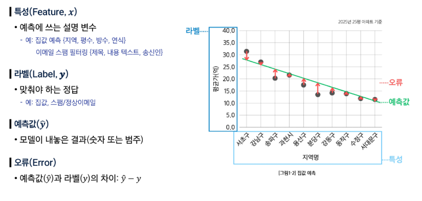
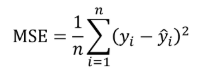
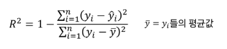
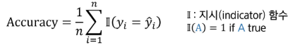
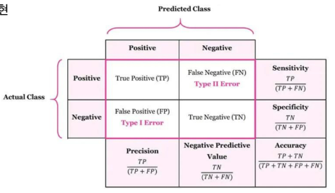
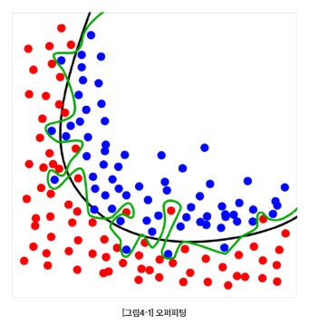
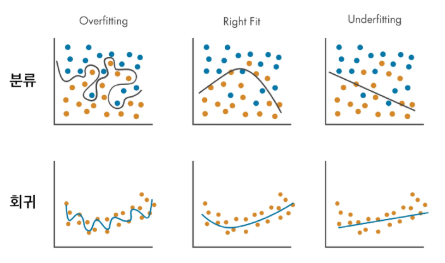

### 지도 학습 (Supervised Learning)

- 정답(label)이 있는 데이터(feature)를 학습시키는 방법
- 데이터: 입력(특성)과 정답(라벨)이 쌍으로 있는 데이터
- 종류
    - **회귀 (Regression)**: 예측값이 숫자
      ⇒ **[선형 회귀](linear-regression.md)**
      - 공부한 시간에 따른 시험 점수 예측하기

    - **분류 (Classification)**: 예측값이 범주
      ⇒ **[로지스틱 회귀](logistic-regression.md)**, 소프트맥스 회귀
      - 메일의 내용을 보고 ‘스팸’인지, ‘정상’인지 판단하기

### 지도학습 용어



## 회귀 (Regression)

### 회귀 문제

입력으로부터 숫자를 얼마나 정확히 예측할까?

- Feature: 면적, 방수, 연식 → Label: 집값
- Feature: 매체별 광고비 (TV/라디오/온라인) → Label: 매출액

### 회귀 오류: 평균제곱오차(MSE)

- 평균제곱오차(Mean Squared Error)
    - 각 데이터에서 정답과 예측의 평균 제곱 차이값

    

- 큰 오류를 더 크게 벌줌(penalty)으로써 전체 오류 수준을 한눈에 봄

(참고) RMSE (Root MSE) : 데이터와 같은 단위를 쓰고 싶다면 MSE의 제곱근 사용

### 회귀 설명력: $R^2$ 결정계수

- 결정계수
    - 라벨의 분산 중에서 특성으로 설명되는 비율
    - 평균만 쓰는 단순한 예측보다 얼마나 더 잘 맞추는지를 0~1 사이로 나타낸 값

    

- 1에 가까울수록 설명력이 높고,
낮을수록(0에 가까울수록) 설명력이 낮음

## 분류 (Classification)

### 분류 문제

입력으로부터 범주는 얼마나 정확히 가려낼까?

- Feature: 메일 내용, 보낸이, 이메일 주소 → Label: 스팸/정상
- Feature: 종양 반경, 면적 → Label: 악성/양성

### 분류 정확도 (Accuracy)

- 정확도: 전체 중 맞춘 비율



- 데이터의 클래스(정답) 비율이 불균형할 때, 모델의 성능을 왜곡할 수 있다.
    - 암 환자 1명, 정상 환자 99명인 경우 - 100명 모두 정상이라고 판단하면 정확도는 99%이지만 암 환자를 찾지 못해 치명적
- 정확도만 보지 말고, 다른 지표도 함께 봐야 안전하다.

```python
from sklearn.metrics import accuracy_score

accuracy = accuracy_score(y_test, y_pred)
```

### 혼동행렬 (Confusion Matrix)

- 혼동행렬: 예측과 실제 값 사이의 관계를 행렬 형태로 표현
  - Positive: 우리가 찾아야 하는 데이터
  - Negative: 그 외의 대상

|  | 실제 양성 | 실제 음성 |
| --- | --- | --- |
| 예측 양성 | TP (True Positive) | FP (False Positive, 오탐) |
| 예측 음성 | FN (False Negative, 누락) | TN (True Negative) |

### 정밀도(Precision)

$TP / (TP + FP)$

- 모델이 positive라고 예측한 것들 중에서 진짜 positive한 것들의 비율
- FP를 낮추는 것이 중요하다
- 모델의 예측을 얼마나 신뢰할 수 있는가
- 모델의 예측을 진짜라고 믿을 수 있어야 할 때 유용

### 재현율(Recall)

$TP / (TP + FN)$

- 실제 positive 중에서 모델이 positive라고 맞춘 비율
- FN을 낮추는 것이 중요
- 모델이 찾아야 할 것을 얼마나 빠짐없이 잘 찾아냈는지
- 모델이 하나라도 놓치면 안 될 때 유용

### 조화 평균(F1-Score)

F1 = 2 * (정밀도 * 재현율) / * (정밀도 + 재현율)

- 정밀도와 재현율 모두를 균형 있게 바라보는 지표
- 보통 정밀도와 재현율은 trade-off 관계
    - 한 쪽이 올라가면 다른 쪽이 내려간다.




## 학습의 목표: 일반화 (generalization)
- 학습 모델의 성능 평가는 모델이 처음 보는 (학습에 사용되지 않은) 데이터로 평가
    - 일반화 오류의 최소화 지향
- 훈련 데이터에서 성능이 아무리 좋아도, 새로운 데이터에서 성능이 떨어지면 실전에 사용할 수 없다.

### 오버피팅 (overfitting, 과적합)



- 훈련 데이터의 우연한 패턴/잡음까지 외워버린 경우 (초록색 함수)
- 훈련 오류는 매우 낮으나, 테스트 오류는 높은 현상

**⚠️ 오버피팅이 왜 안 좋은가?**

- 표본(sample) 의존, 불안정
    - 훈련 데이터는 모집단의 일부 표본이라 우연한 잡음이 섞여 있다
    - 샘플 몇 개만 바뀌어도 예측이 크게 흔들린다 (분산이 커진다)
- 일반화 실패
    - 보지 못한 데이터(테스트) 오류가 커진다
    - 모집단(population) 성능과 격차가 벌어진다

### 오버피팅에 대한 오해

**오버피팅 ≠ 분포 변화(distribution shift)로 인한 에러 증가**

- 분포 변화로 인한 오류: 훈련 데이터 분포와 테스트 분포가 달라서 성능이 떨어지는 현상
- 분포 변화로 인한 에러 증가는 모델이 과적합하지 않아도 발생 가능하다

### 오버피팅 vs 언더피팅

- 오버피팅 (Overfitting, 과적합): 모델이 너무 복잡 → 잡음까지 학습 (테스트 성능 나쁨)
- 언더피팅 (Underfitting, 과소적합): 모델이 단순하거나 학습이 완료되지 않음 → 중요한 패턴을 놓침 (오류 큼)



- 해결: 더 많은 데이터, 테스트 데이터를 활용한 모델 선정, 교차 검증
