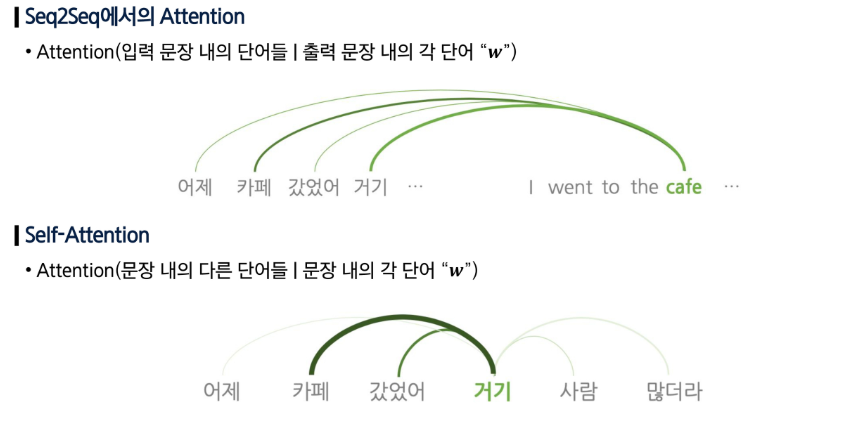
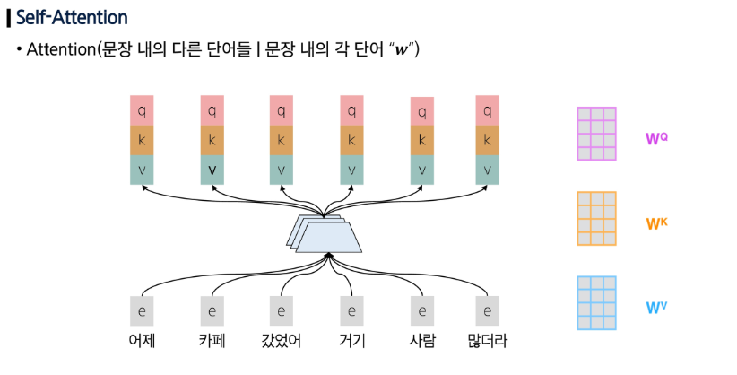
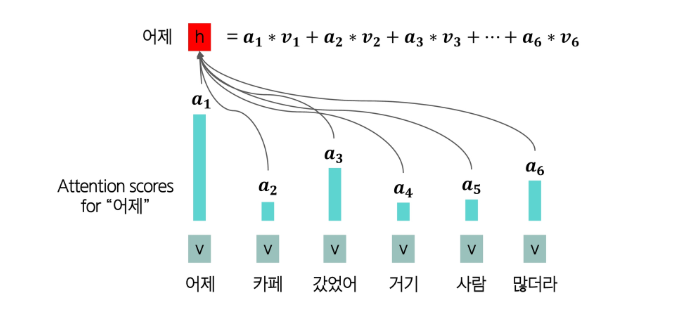
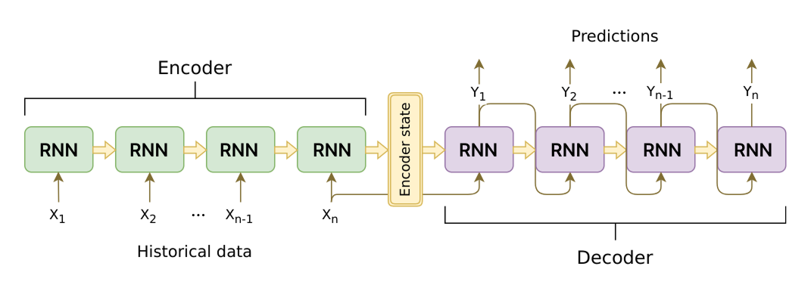
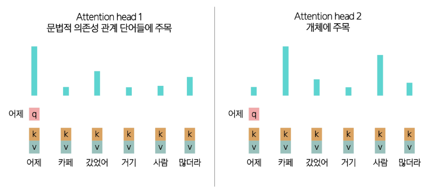
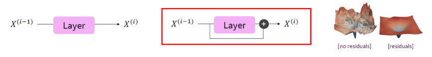

## Self-Attention

### RNN의 한계점

- 장기 의존성
    - 순차 전개되기 때문에, 먼 단어 쌍이 상호작용하려면 시퀀스 길이만큼의 단계를 거쳐야 한다.
    - 입력된 선형 순서를 강하게 반영하기 때문에, 언어의 비선형적 의존성을 잘 잡아내지 못한다.
- 병렬화
    - forward, backward pass 모두 시퀀스 길이만큼의 단계가 필요하다.
    - 순차적인 연산이 진행되기 때문에, 병렬화가 불가능하다.
    - GPU 활용이 어렵고, 대규모 데이터 학습에 비효율적이다.

### Self-Attention

- Attention 메커니즘을 encoder-decoder 간이 아닌, 한 문장 내부에서 적용한다.
    - Query, Key, Value 벡터의 출처가 동일한 경우
    - 하나의 단어가 문맥을 담게 된다.
- 순차적으로 처리해야 하는 연산 수가 시퀀스 길이에 따라 증가하지 않는다.
- 최대 상호작용 거리 = $O(1)$
    - 모든 단어가 각 층에서 직접 상호작용한다.
- 장거리 의존성을 효율적으로 포착하고, 병렬 처리를 가능하게 한다.

### Self-Attention의 구성 요소

- **Query** 벡터
    - 단어 i가 다른 단어로부터 어떤 정보를 찾을지를 정의하는 벡터
- **Key** 벡터
    - 단어 i가 자신이 가진 정보의 특성을 표현하는 벡터
- **Value** 벡터
    - 실제로 참조되는 정보 내용을 담고 있는 벡터

### Self-Attention의 과정

1. 각 단어를 Query, Key, Value 벡터로 변환한다.
2. Query, Keys 간의 유사도를 계산해, softmax로 확률 분포를 구한다.
3. 각 단어의 출력을 Values의 가중합으로 계산한다.

## Self-Attention의 한계 해결

### Self-Attention의 한계

- 순서 정보 부재 → Positional Encoding
    - 단어 간 유사도만 계산한다.
    - 단어의 순서를 고려하지 않는다.
- 비선형성 부족 → Feed-Forward Network 추가
    - Attention 계산은 본질적으로 가중 평균 연산이라는 선형 결합에 불과한다.
    - 복잡한 패턴이나 깊은 표현력을 담기 어렵다.
- 미래 참조 문제 → Masked Self-Attention
    - 언어 모델은 시퀀스를 순차적(왼쪽 → 오른쪽)으로 생성해야 하지만, Self-Attention은 모든 단어를 동시에 본다.
    - 아직 생성되지 않아야 할 미래 단어를 참조한다.

### Positional Encoding

- 각 단어 위치 i를 나타내는 위치 벡터를 정의해, 단어 임베딩 값에 더해 최종 입력으로 사용한다.
- 순서 정보 부재 문제를 해결하기 위해 사용한다.
- Sinusoidal Position Encoding: 서로 다른 주기의 사인/코사인 함수를 합성해 위치 벡터를 만드는 방법
- Learned Absolute Position Embedding: 위치 벡터를 모두 학습 파라미터로 설정해 학습 과정에서 데이터에 맞춰 최적화하는 방법

### Feed-Forward Network 추가

- slef-attention 연산은 비선형 변환이 없어, 복잡한 패턴 학습에 한계가 존재한다.
- 각 단어 출력 벡터에 Feed-Forward Network (Fully Connected + ReLU 등)을 추가하여 Self-Attention이 만든 표현을 깊고 비선형적인 표현으로 확장한다.

### Masked Self-Attention

- Attention Score를 계산할 때, 미래 단어에 해당하는 항목을 $-\inf$로 설정해 계산을 수행할 때 반영되지 않도록 한다.
- self-attention의 미래 참조 문제 해결

## Transformer

### Transformer

- encoder-decoder 구조로 설계된 신경망 모델
- encoder: 입력 문장을 받아 의미적 표현으로 변환을 수행한다.
- decoder: 인코더의 표현과 지금까지 생성한 단어들을 입력 받아 다음 단어를 예측한다.
    - 언어 모델과 같은 방식으로 동작한다.

- **은닉 상태(hidden state)**는 문장의 정보들을 압축적으로 저장합니다.
    - RNN layer를 통과하면서 문장 전체의 정보를 압축하게 되고 이러한 정보들은 hidden state에 담기게 됩니다. 이러한 hidden state는 문맥 벡터(context vector)로 사용됩니다.
- **문맥 벡터(context vector)**는 입력 문장의 정보들을 벡터상에 압축하여 저장한 것
- 번역을 하기 위해서는 last hidden state를 다시 저희의 입력 데이터와 유사한 형태인 텍스트(토큰) id로 변환하는 layer가 필요합니다. 이를 저희는 **Decoder**라고 부릅니다.

### Multi-Headed Attention

- 문장에서 같은 단어라도 문법적 관계, 의미적 맥락 등으로 다른 단어에 주목할 수 있다.
- 단일 self-attention head로는 한 가지 관점에서의 단어 간 관계밖에 파악할 수 없다.
- 여러 attention head를 두어 다양한 관점에서 동시에 정보를 파악한다.

### Scaled Dot Product

- Query와 Key의 차원이 커질수록 두 벡터의 내적 값도 자연스럽게 커진다.
    - 값이 커지면 softmax 함수의 출력이 너무 뾰족해진다.
    - 미세한 변화에도 큰 차이가 발생할 수 있다.
- 내적 값을 그대로 사용하지 않고, 나눠주어 스케일을 조정한다.
- 값이 안정적으로 분포되어 학습이 훨씬 더 빠르고 안정적으로 진행된다.

$score(q, k) = \frac{q \cdot k}{\sqrt{n}}$

### Residual Connection

- layer가 전체를 예측하는 것이 아니라 기존 입력과의 차이만 학습하도록 한다.
- 깊은 신경망은 층이 깊어질수록 학습이 어려워진다.
    - layer의 출력만 사용한다면 정보가 소실될 수 있다.

### Layer Normalization

- 각 레이어 단위에서 hidden vector 값을 정규화해 안정적이고 빠른 학습을 돕는다.
- 층이 깊어질수록 hidden vector 값들이 커졌다 작아졌다하면 학습이 불안정하기 때문

### Decoder

- 여러 개의 decoder 블록을 쌓아 올려서 만든 구조
    - Masked Self-Attention (Multi-Head): 미래 단어를 보지 않도록 마스크를 씌운 multi-head self-attention
    - Add & Norm (Residual Connection + Layer Normalization)
    - Feed-Forward Network: 각 위치별 비선형 변환
    - Add & Norm (Residual Connection + Layer Normalization)
- 언어 모델처럼 단방향 문맥만 활용한다.

### Encoder

- 양방향 문맥을 모두 활용할 수 있다.
    - 입력 문장을 의미적 표현으로 변환할 수 있다.
    - 각 단어가 양방향 문맥을 모두 반영한 벡터로 인코딩된다.
- self-attention에서 masking을 제거한 것

### Encoder-Decoder

- 이해를 위한 encoder와 생성을 위한 decoder로 이루어진 구조
- cross-attention: 인코더의 출력 표현을 참조
    - query는 decoder에서, key와 value는 encoder에서 가져온다.