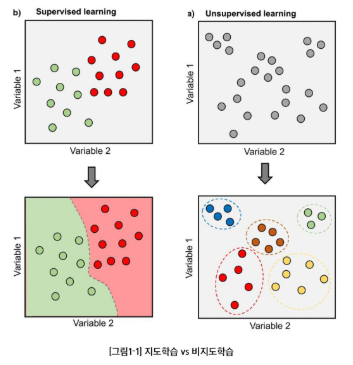
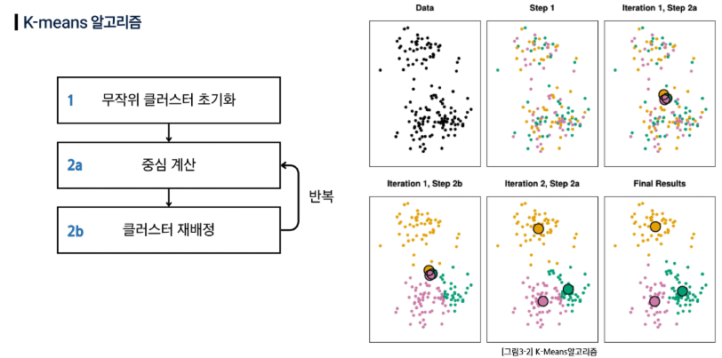
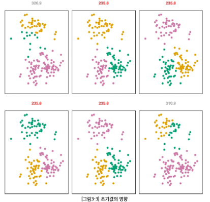
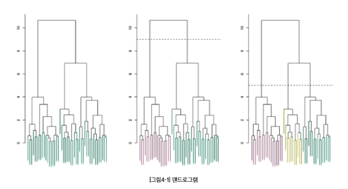
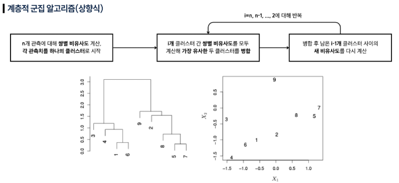
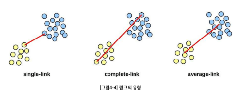
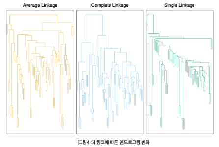
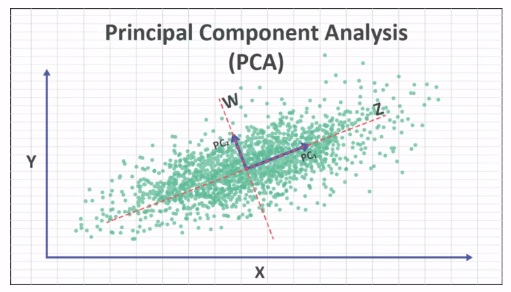

## 비지도학습

### 비지도학습

- 레이블(정답) 없이 데이터의 구조, 패턴, 집단(잠재 서브그룹)을 찾아내는 학습
- 군집화(clustering), 차원 축소(PCA 등), 밀도추정/이상치 탐지
- 무엇을 비슷함/다름으로 볼 것인가 (거리, 유사도 선택)
- 전처리(스케일 표준화 등)를 어떻게 할 것인가
- 출력: ‘정답 예측’이 아니라 구조/요약/표현(embedding)

### 지도학습 vs 비지도학습

- 지도 학습: 입력 + 라벨로 예측 모델 학습
    - 가격 예측, 악성 종양 예측
- 비지도 학습: 입력만으로 구조 학습
    - 고객 세그먼트
    - 클러스터링: 서로 비슷한 데이터끼리 묶어 동질 그룹 만들기



## 클러스터링 (Clustering, 군집화)

### 클러스터링

- 데이터 안에서 하위 집단(클러스터)을 찾는 기법들의 총칭
- 집단 내부는 서로 유사, 집단 간은 상이하도록 데이터를 분할하는 것이 목표
- 유사/상이 정도는 도메인 맥락에 따라 정의가 달라질 수 있다.
- 예: 마케팅 세그먼테이션 - 시장 세분화 작업

### 클러스터링 방법

- K-평균 (K-means): K(클러스터의 개수)를 미리 정해 분할
- 계층적 군집 (Hierarchical): K를 사전에 고정하지 않음

### 클러스터링 체크리스트

- 스케일링: 표준화(평균 0, 표준편차 1로 입력 변수 변환)가 필요하다
    - 변수 단위 차이의 영향이 크기 때문
- 몇 개의 클러스터가 적합할까?
    - K-means, 계층적 군집 모두 정답은 없다.
    - 여러 번 시도를 권장

## K-means 클러스터링

### K-means 클러스터링

- K(클러스터의 개수)를 미리 정해 분할하는 방법
- 클러스터 내부 변동의 합이 최소가 되도록 분할을 찾는다.
    - 좋은 군집화는 클러스터 내부 변동(Within-Cluster Variation)이 작은 분할
    - 모든 클러스터의 내부 흩어짐 총합이 가장 작은 분할

### K-means 알고리즘

- 초기화: 관측치들에 무작위 1…K 클러스터를 임시로 부여한다
    - 초기값에 따라 지역 최소값으로 수렴 가능
    - 전역(global) 최소값 보장은 아니다
- 반복 (할당이 더 이상 바뀌지 않을 때까지):
    - 각 클러스터의 중심(centroid) 계산
    - 각 관측치를 가장 가까운 중심의 클러스터에 재할당
- 반복은 매 단계 목표함수 값을 감소시킨다
    - 군집 내 평균 제곱거리의 성질 때문



### 초기화의 중요성

- 서로 다른 초기 레이블에서 최종 분할과 목표값이 달라진다.
- 여러 번 시도 권장



## 계층적 군집 (Hierarchical Clustering)

### K-means 클러스터링 vs 계층적 군집

- K-means: 클러스터의 개수 K를 미리 지정해야 하는 단점
- 계층적 군집: K를 고정하지 않고 전체 구조를 덴드로그램으로 제공
    - 덴드로그램에서 수평선 높이(거리)를 기준으로 가위질하여 K개 군집을 얻는다.



### 계층적 군집 알고리즘 (상향식)

- n개 관측에 대해 쌍별 비유사도 계산하고, 각 관측치를 하나의 클러스터로 시작한다.
- i개 클러스터 간 쌍별 비유사도를 모두 계산해 가장 유사한 두 클러스터를 병합한다.
- 병합 후 남은 i-1 개의 클러스터 사이의 새 비유사도를 다시 계산한다.
- `i=n, n-1, …, 2` 에 대해 반복한다.



- 매 단계에서 모든 클러스터 쌍 간의 거리를 계산해야 한다.
- 데이터의 수가 많은 경우 K-means에 비하여 계산량이 많다.

### 링크(link)의 유형

- Single(최소 거리) 링크: 두 개 클러스터 내 데이터 **쌍별 거리 중 최소값**을 군집 간 거리로 설정
- Complete(최대 거리) 링크: 두 개 클러스터 내 데이터 **쌍별 거리 중 최대값**을 군집 간 거리로 설정
- Average(평균 거리) 링크: 두 개 클러스터 내 데이터 **쌍별 거리의 평균**을 군집 간 거리로 설정



- 같은 데이터라도 링크 선택에 따라 클러스터링 결과(덴드로그램)가 달라질 수 있다.




## 주성분 분석 (Principal Component Analysis, PCA)

- 정보 손실을 최소화하면서 feature들을 가장 잘 설명하는 새로운 핵심 특징 몇 개로 압축하는 **차원 축소** 기법
- PCA에서 데이터가 가장 길게 늘어선 방향, 즉 **분산이 가장 큰 방향**이 데이터의 정보를 가장 많이 포함하는 ‘제1주성분 (PC1)’
- 주성분과 직각을 이루는 축이 제2주성분



- 코드 구현 예시
```python
# decomposition: 차원 축소와 관련된 다양한 기능들이 포함되어 있음
from sklearn.decomposition import PCA

# 1. PCA: 특성을 PCA로 분석해 두 개의 Feature로 축소한 X_pca를 생성
'''n_components
- 축소할 차원의 수
- n_components의 값을 0.95와 같이 실수로 지정하면,
  분산 설명 비용이 95%가 되도록 하는 최소한의 차원을 선택
'''
pca = PCA(n_components=2)    # 2개의 Feature로 축소

# fit_transform: PCA 모델을 데이터에 맞추고, 데이터를 변환
X_pca = pca.fit_transform(X)
```

```python
# 2. K-Means Clustering
# cluster: 군집화와 관련된 다양한 기능들이 포함되어 있음
from sklearn.cluster import KMeans

# n_clusters: 군집의 수
# random_state: 랜덤 시드 고정
# n_init: K-Means 알고리즘의 초기 중심점을 설정하는 방법
    # 'auto': 기본값으로, 알고리즘이 자동으로 최적의 초기화 방법을 선택
    # 정수값: 지정된 횟수만큼 다른 초기 중심점을 사용하여 군집화를 수행하고, 가장 좋은 결과를 선택
kmeans = KMeans(n_clusters=3, random_state=42, n_init='auto')    # 와인 등급은 0, 1, 2 3개

# fit_predict: K-Means 모델을 데이터에 맞추고, 각 샘플이 속한 군집 레이블을 반환
clusters = kmeans.fit_predict(X_pca)
```

```python
# 3. 시각화
import matplotlib.pyplot as plt

plt.figure(figsize=(10, 6))
# ax[0]: PCA결과로부터 K-Means로 추론된 라벨
sns.scatterplot(x=X_pca[:, 0], y=X_pca[:, 1], hue=clusters, ax=ax[0])
ax[0].set_title('Labels inferred by K-Means')

# ax[1]: PCA결과에 실제 라벨을 그려놓은 것
sns.scatterplot(x=X_pca[:, 0], y=X_pca[:, 1], hue=y, ax=ax[1])
ax[1].set_title('Actual Labels on PCA')

fig.suptitle('KMeans Clustering with PCA')
fig.tight_layout()
plt.show()
```