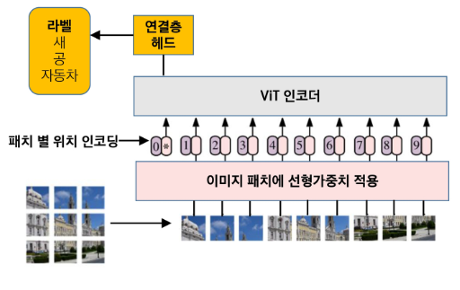
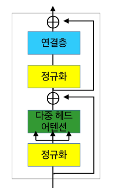
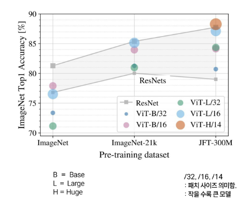
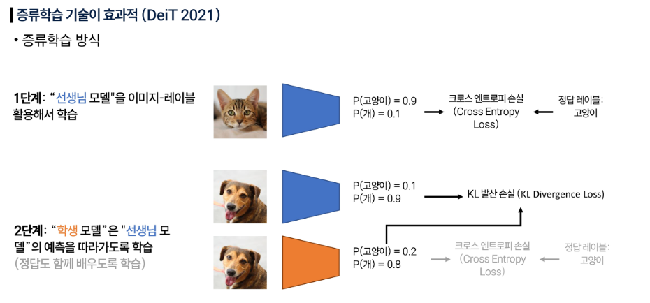
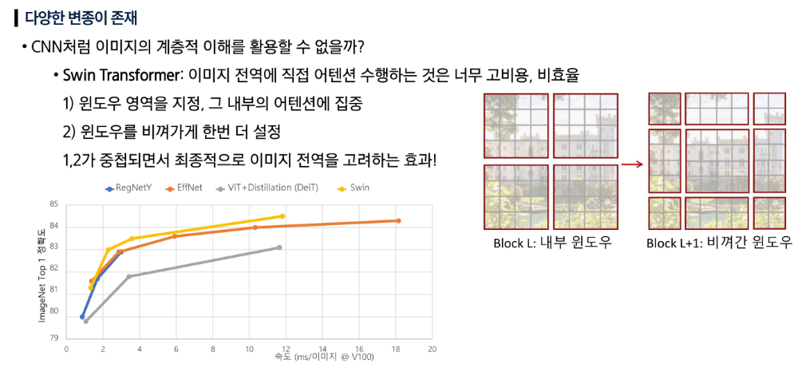
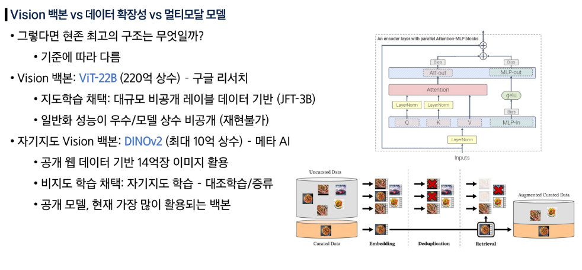
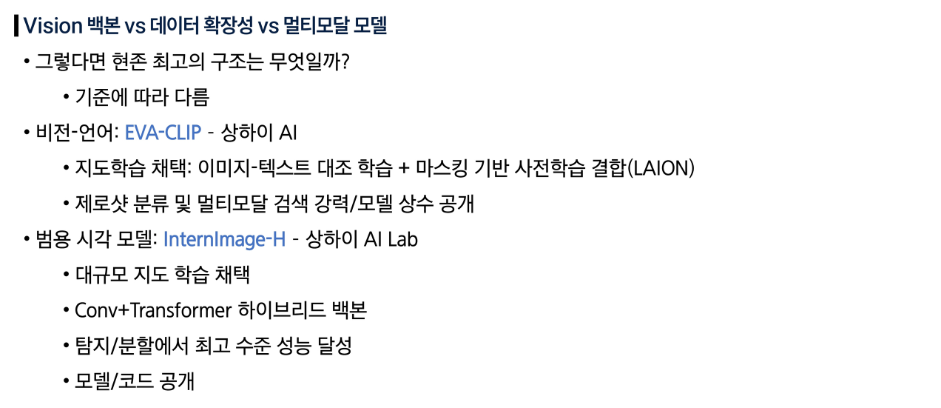

## ViT (Vision Transformer)

### ViT 위치 인코딩

- 패치 순서(위치) 정보를 제공한다.
- 학습 가능한 위치 인코딩
    - 데이터에 알맞게 최적화
    - 해상도가 바뀌면 다시 학습해야 한다.

- 사인파 인코딩
    - 고정이라 데이터/과업에 특화된 방식이 아니다.
- 상대 위치 인코딩: 절대 위치가 아닌, 상대적 위치를 인코딩한다.
    - 절대적 위치(예: 좌우 코너) 고려가 어렵다.
    - 해상도 변화에도 적용 가능하다.

### ViT 인코더

- 정규화 (Normalization): 입력을 균일하게 맞춘다.
- 다중헤드 어텐션 (Multi-Head Attention): 여러 관점에서 패치 간 관계를 학습한다.
- 연결층 (MLP): 어텐션 정보를 조합, 변환해 더 풍부한 특징을 생성한다.
- 수용영역을 넓히지 않아도 전역 맥락을 이해할 수 있다.
    - CNN: 지역적 영역에서 수용영역을 넓혀 전역을 이해한다.
- 이미지를 이미지 토큰 집합으로 변환한다.
    - 위치 인코딩으로 패치 토큰 순서를 학습에 반영한다.

### ViT vs ResNet

- ViT는 거대 데이터세트 사전학습 시 우수하다.
- ImageNet의 경우, ResNet 성능이 더 우수하다.

### ViT 학습 시 유의점

- 학습 ViT 모델은 학습 가능한 토큰을 추가로 입력받아 선생님 CNN의 logit 출력과 동일하게 예측하도록 학습된다.

### Vision Transformer의 트렌드

- Swim 계열은 특히 검출/분할과 같은 화소별, 공간 이해에서 좋은 성능을 보인다.

### ViT 장단점

**장점**

- 전역 문맥을 한 번에 고려 가능
- 시계열/시퀀스 데이터의 경우, 순서 고려 가능 (위치 인코딩)
- 순서가 없는 데이터의 경우, 선별 제거 가능

**단점**

- 대규모 학습 자원 필요
    - 대규모 데이터 및 GPU 자원이 요구된다. (메모리)
- 학습 데이터 규모가 작을 경우, CNN보다 성능 저하
- 한 번에 고려할 수 있는 토큰이 제한적

**활용**

- 이미지 분류/탐지/분할/생성에서 모두 SoTA(State of the Art) 성능 달성
- 멀티모달 모델에서 기준 아키텍처
- 기준 모델에 활용 중