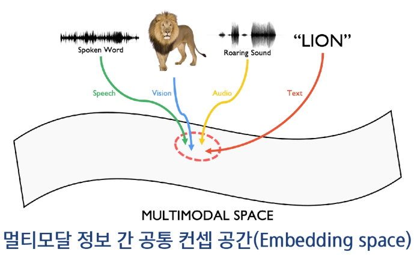
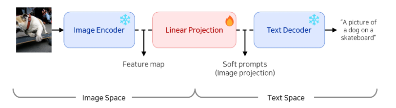
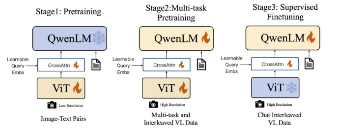
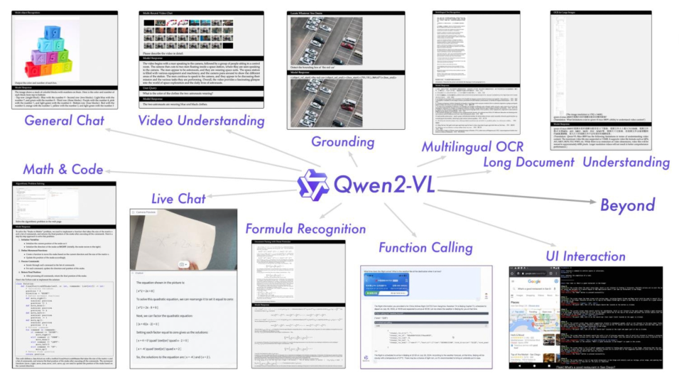
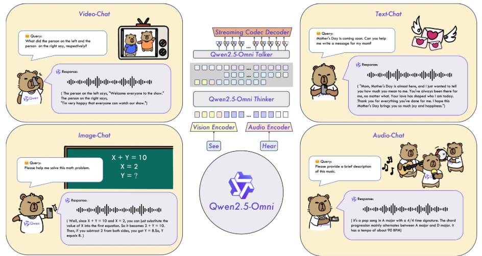
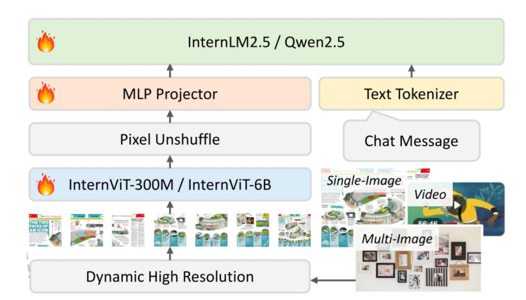
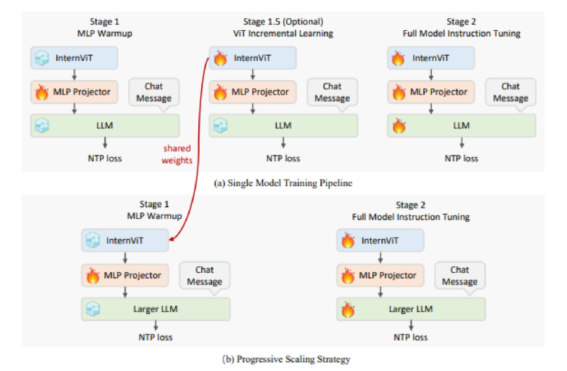

## VLM (Vision-Language Models)

### 멀티모달 정합 (Multi-modal Alignment)

- 서로 다른 두 가지 이상의 모달리티 (예: 이미지와 텍스트) 간의 공통된 임베이딩 벡터 공간을 구성하는 것
- 서로 다른 모달리티 임베이딩 간 유사도 (연관성) 비교 가능
- CLIP (이미지-텍스트), ImageBind (소리, 텍스트, 이미지, 비디오, 열화상, IMU 모달리티 공간 등)

### 멀티모달 언어 모델

- 이미지, 소리, 비디오 등 다양한 모달리티를 함께 이해하고 처리할 수 있는 언어 모델
    - ChatGPT, Claude, LLaVA, InstructBLIP 등
- 텍스트와 이미지를 결합한 대화형 AI, 이미지 설명, 문서 이해, 비디오 분석 등

### LLaVA (Large Language and Vision Assistant)

- Vision과 Language 모델을 결합한 모델(VLM)
- 이미지, 명령 (Instruction), 답변이 주어진 데이터셋을 구축하여 Instruction tuning으로 학습
- 이미지 설명 생성, 시각적 질문 응답 (Vision QA), 시각적 정보 기반 대화 등
- 사전 학습 (Pre-training): 적은 파라미터만 학습
    - 이미지를 텍스트 표현으로 변환하는 선형 레이어 (Projection Layer)를 학습하여 텍스트와 이미지를 공통된 토큰 표현으로 처리
    - 전체 모델을 다시 훈련하지 않으므로 자원과 시간 절감
- Fine-tuning
    - 특정 작업에 맞춰 선형 레이어와 언어 모델 등 필요한 부분만 미세 조정
    - 저비용 학습 기법을 통해 메모리 사용량 절감

### Qwen-VL by Alibaba

- 알리바바에서 개발한 대형 멀티모달 모델
- 여러 개의 이미지 입력, 번역, 텍스트 읽기, 위치 찾기 (물체 탐지), 인식, 이해 능력 등
- 사전학습 2단계 + 명령어 파인튜닝
- 대규모 웹 이미지-텍스트 쌍으로 시각 인코더와 어댑터 중심 최적화를 통해 기초적인 시각-언어 대응을 학습

- Qwen2-VL
    - 다국어 텍스트 및 이미지 내 텍스트 이해 지원, 임의의 이미지 해상도 처리 가능, Agent 응용 기능 등
    
    
    
- Qwen2.5-VL
    - 다국적 OCR, 필기체 이해, 객체 탐지, 초단위 이벤트 세그먼트 추출 가능
- Qwen2.5-Omni
    - 읽고 쓰고 보고 듣고 말하면 Omni
    
    
    
- Qwen3-VL
    - 3D grounding, 차트 생성 등

### InternVL

- OpenGBLab에서 개발한 멀티모달 언어모델
- 다양한 종류의 이미지 모델과 언어 모델이 결합되어 오픈 소스로 공개됨

InternVL 구조

- 단일 모델 학습 파이프라인
- LLM을 점점 키워가면서 학습하는 파이프라인

### Set of Mark (SoM)

- 다른 물체 탐지, 세그멘테이션 파운데이션 모델을 활용한 방법
- VLM 모델들의 부족한 시각 능력을 보완하여 성능 향상
- Computer 작동 Agent 모델에 기본적인 비주얼 프롬프팅으로 매우 유용하다.
    - Annotation을 이용한 프롬프트 입력

## sVLM (Small Vision-Language Models)

### sVLM

- 다양한 온디바이스 모델에 사용
- VLM → sLLM → sVLM

### sVLM 모델들

- SmolVLM
    - HuggingFace가 개발한 sVLM
- Moondream 0.5B
    - 모바일 기기나 엣지 디바이스에서의 실시간 실행을 염두에 두고 개발
- Gemini Nano
    - 온디바이스용 경량 Gemini
- 갤럭시 온디바이스 AI
    - 모바일 NPU로 이미지, 언어, 오디오, 영상 작업 등을 기기 내에서 직접 생성형 AI 실행
- LMDeploy
    - LLM의 효율적 압축, 배포, 서빙을 지원하는 오픈소스 툴킷
    - InternVL, Qwen, DeepSeek, Phi 등 다양한 VLM 제공

### 언어별 토큰화

- 언어별 구조적, 형태적 차이에 따른 토큰화 복잡성
- 언어에 따라 동일한 문장이라도 토큰화 후 길이에 큰 차이를 보인다.
- 영어 중심 토크나이저는 비영어권 언어에 대해서 구조적 불이익이 존재한다.
    - 언어 자체의 한계가 아니다. 토큰화 방법의 효율성 차이!
- 토크나이저의 언어 편중 이슈
    - 사용빈도가 적거나 형태가 설계 언어와 다른 언어는 비효율적으로 긴 토큰 시퀀스가 생성된다.

### 한국어 sVLM 모델

- HyperCLOVAX-SEED-Vision-Instruct-3B
    - NAVER가 개발한 한국어 특화 멀티모달 모델
- Kanana-1.5-v-3b-instruct
    - Kakao가 개발한 한국어 특화 멀티모달 모델