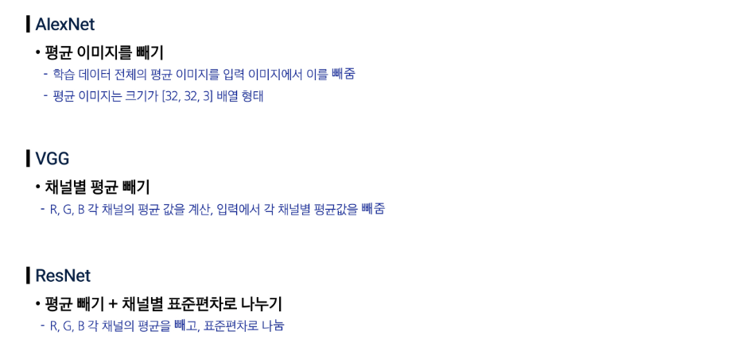

## 데이터 전처리

### 데이터 형식 통일

- 학습/검증/테스트에 모두 동일한 조건을 적용한다.
    - 이미지 해상도, 색상(RGB or BGR or Grey), 밝기, 정규화 등
- 평균 0, 표준편차 1로 정규화

### 모델별 전처리 방식

## 가중치 초기화

### 0으로 초기화

- 모든 가중치 (W)와 편향 (b)을 0으로 초기화하면?
- 모든 출력은 0 → 학습이 이뤄지지 않는다.

### 임의 (랜덤) 초기화

- 작은 랜덤 숫자 (0.01 곱 → 0.01 분산): Gaussian 분포를 따른다.
    - Gaussian 분포: 종 모양의 정규 분포
    - 평균 0 근처 값이 자주 발생한다.
    - 값이 너무 크거나 작아지는 것을 막을 수 있다.
- 깊지 않은 모델에서 동작하는 전략
- 깊은 모델은 기울기 수렴/폭발 문제

### 자비에(Xavier) 초기화

- 가중치 초기 분포의 분산을 입력 차원으로 맞춘다.
    - std = 1/sqrt(Din)
- 분산을 입력 차원(뉴런수) 증가를 고려하여 설계
    - 입출력이 대칭적 분포를 보인다는 가정
    - 모델상수 분산이 입력 차원과 같으면, 선형 연산 이후 출력의 분산 = 입력의 분산임을 보일 수 있다.
- ReLU와 궁합이 좋지 않다.
    - ReLU는 양의 분포만 남기기 때문에 비대칭!

### 허(He) 초기화

- 가중치 초기 분포의 분산을 2*입력 차원으로 맞춘다.
    - std = sqrt(2 / Din)
- 비대칭, 유사 분산이 레이어 후반에도 유지된다.
- LeRU와 궁합이 아주 좋다!

### ResNet (Residual Network)

- 잔차 연결을 사용해 매우 깊은 신경망도 안정적으로 학습할 수 있는 구조
- 잔차 연결: 입력을 출력해 더해주는 지름길
    - 네트워크가 전체를 새로 배우지 않고 변화량만 학습하도록 도와준다.
- 깊은 모델에서의 기울기 소실/폭발 문제를 ResNet을 이용하여 완화
- Skip connection으로 입력이 그대로 더해져, 깊은 층에서도 기울기가 끊기지 않고 전달된다.
- 초반에 초기화가 잘못되면, 후반 층의 출력 분포값이 계속 증포할 수 있다.
- ReLU를 사용하는 구조, He 초기화 사용
    - Var(x + F(x)) = Var(x) 유도
    - 초기엔 입력 = 출력, 분포가 안정하면 학습이 안전하게 출발할 수 있다.

