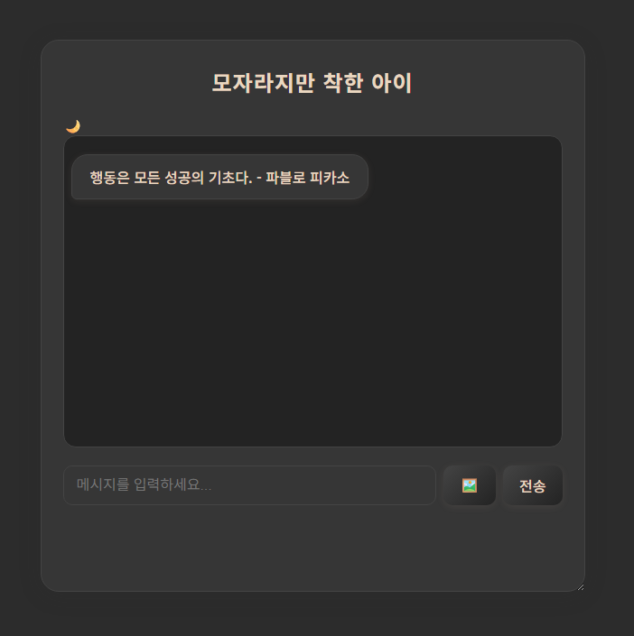

# 스스로 학습

## Copilot을 이용해서 챗봇 만들기

[](https://github.com/ajjoona-git/Vibe-Chatbot)

### 실행 화면
<table>
  <tr>
    <td>
      
    </td>
    <td>
      
    </td>
  </tr>
  <tr>
    <td align="center">다크 모드 / 초기 화면</td>
    <td align="center">라이트 모드 / 이미지 생성 기능</td>
  </tr>
</table>

### 챗봇 설계

```
1. (기본) 브라우저에서 동작하는 HTML/CSS/JS 만으로 구성된 심플한 파일 구조의 챗봇
2. (기본) ChatGPT API (gpt-4o-mini)를 활용한 챗봇 답변
3. (스타일) 메신저 스타일의 챗봇
4. (스타일) 올해의 팬톤 컬러(모카 무스)를 컨셉으로 한 화려한 스타일
5. (스타일) 챗봇의 이름은 '모자라지만 착한 아이'
6. (기능) 다크 / 라이트 모드 스위치 기능
7. (기능) 오늘의 명언을 랜덤으로 작성해서 웰컴 메세지로 출력
8. (기능) 마우스로 메세지 창의 크기 조절
9. (기능) 사진 생성 기능 (`dall-e 3 모델 사용, standard 1024 * 1024 만 이용`)
```

### 프롬프트 작성
```
> 웹에서 동작하는 챗봇 프로그램을 만들거야. 사용 언어는 HTML, CSS, JS로 각각 파일을 1개씩만 사용해서 생성해줘. 총 파일은 3개야.
> 채팅이 잘 구분될 수 있도록 텔레그램 스타일로 수정해줘. 그리고 키보드 엔터 키를 입력하면 메세지가 전달될 수 있도록 해줘.
> 지금부터 챗봇의 답변은 OpenAI API의 GPT-4o-mini 모델을 사용할 수 있도록 코드를 수정해줘.
> 이전 내용을 기억하고 답변할 수 있도록 코드를 보완해줘
> 답변 생성 중... 만 출력되고 다른 답변이 오지 않으니, 에러를 해결해줘
> 처음 시작할 때 오늘의 명언을 랜덤으로 웰컴 메세지로 출력할 수 있도록 코드를 수정해줘.
> 올해 2025년의 팬톤 컬러를 컨셉으로 해서 채팅창을 보기좋게 꾸며줘
> 다크 모드와 라이트 모드를 전환할 수 있는 스위치 버튼을 작성해줘.
    > 스위치는 다크모드인데 화면은 모카무스 컬러의 라이트 모드가 적용되어 있어. 그리고 스위치를 눌러도 라이트모드를 의미하는 해 모양으로 전환되지 않는 상황이야. 스위치 버튼을 누르면 다크 모드와 라이트 모드가 전환되는 기능이 구현될 수 있게 코드를 수정해줘.
    > 다크 모드와 라이트 모드를 전환할 수 있는 스위치를 좌우로 움직여서 정할 수 있는 모양으로 바꿔줘. 아이폰의 비행기 모드 설정 컨셉과 동일해.
    > 다크모드/라이트모드 전환이 체크박스 형태로 나와있는데, 다크모드를 표시하는 아이콘과 슬라이드 형태의 토글스위치 형태로 수정해줘.
    > 다크 모드와 라이트 모드와 관련된 부분을 모두 삭제하고 아래 기능들을 추가해서 다시 작성해줘. 첫 화면은 라이트 모드이며, 모카무스 컬러 컨셉이다. 챗봇 헤더부분에 현재 모드를 표시하는 이모티콘과 라이트모드/다크모드를 바꿀 수 있는 슬라이더 형태의 토글스위치가 있다. 다크 모드는 회색 계열의 컨셉이다.
> 챗봇 대화창은 창의 중앙에 위치하게 해줘.
> 마우스를 드래그해서 대화창의 크기를 조절할 수 있도록 코드를 수정해줘
> 사진을 생성하는 기능을 추가해줘. 전송버튼의 왼쪽에 이미지 생성을 할 때 사용하는 버튼을 추가로 만들고 이미지를 생성할 때는 OpenAI API의 dall-e 3 모델을 사용하고, standard 1024*1024 크기로 만들어야 해.
    > 이미지 생성 버튼은 생겼는데, 버튼을 눌러도 아무런 반응이 없어. 오류를 해결해줘
> 모든 기능은 유지하고 챗봇의 이름만 '모자라지만 착한 아이'라고 수정해줘
```


### 후기
대화하듯이 내가 원하는 기능을 추가해달라고 하면 뚝딱 만들어내서 신기했다. 세상 좋아졌음을 느끼면서... 동시에 1시간 남짓하는 시간 동안 이 정도 퀄리티의 웹을 만들 수 있다면 이제 더이상 개발자를 요구하지 않을 것이라는 게 실감났다. 편리하고 말 잘 듣고 저렴한 AI는 기업이 좋아할만 하다. 

그렇지만 조금의 희망은 아직 완벽하지 않다는 것. 편리하긴 했으나, 한번 오류가 발생하면 다시 돌아가기 힘들 때가 있다. 이럴 때는 `해당 부분을 삭제하고 다시 작성해줘` 라고 명령하면 어느 정도 해결되었다.


<br><br>

# 수업 필기

## Generative AI

### ChatGPT

- Generative 생성 모델
- Pre-trained 사전 훈련 : 거대 언어 모델 + 추가 학습 데이터 + 추가 강화 학습
- Transformer 트랜스포머 AI 모델 : 문장 속의 단어 간 관계를 추적해 맥락과 의미를 학습
    - 대화형 작업에 강점
    - Attention 메커니즘: 데이터의 맥락과 중요도를 이해하도록 돕는 기술. 입력 데이터 간의 관계와 중요도(weight)를 계산한다.
    - 병렬 처리 가능: 순차 처리가 필요 없어 속도가 빠르다
    - 대규모 데이터 및 파라미터로 확장 가능

### Google Gemini

현재 GPT를 넘어서는 중

### Claude

개발자가 많이 씀. 코딩에 특화

## API

### Interface

- 서로 다른 두 개의 시스템이 정보를 교환할 때, 그 사이에 존재하는 접점
    - 키보드, 마우스, 모니터: 컴퓨터와 사람 사이의 물리적 인터페이스
- **UI (User Interface)**: 사용자와 기기 간의 접점. 사람이 소프트웨어에 접근하는 그래픽적, 화면적 요소
    - 브라우저의 뒤로가기 버튼의 위치, 모양
    - ATM의 언어 선택 화면 등
    - 사용자군간에 인터페이스를 통합하는 것이 쉽지는 않다. 시니어들은 공유아이콘이 뭔지 모른다…
- 눈에 보이지 않는 영역에서의 통신 → 약속된 방식으로 데이터를 주고받음

### 클라이언트와 서버

클라이언트 -(**요청**)→ 서버 / 클라이언트 ←(**응답**)- 서버

- 클라이언트(Client): 서비스를 요청하는 쪽
    - 사용자의 웹 브라우저, 모바일 앱
- 서버(Server): 요청을 받아서 처리하고 결과를 응답해주는 쪽
    - 웹 서버, 데이터베이스 서버, AI 서버
    - 백엔드 개발자가 담당

### API (Application Programming Interface)

- 두 소프트웨어(또는 시스템)가 서로 통신할 수 있게 하는 메커니즘, 소통의 수
- **약속**된 방식의 인터페이스. **특정 규칙**에 따라 움직인다.
- Application: 특정 기능을 수행하는 모든 소프트웨어
    - 웹, 모바일, 데스크톱 앱 등


### API Key

- API에게 요청을 보내는 애플리케이션을 구별하기 위한 고유한 식별 문자열 = 인증번호
- 랜덤하게 생성된 키를 서버가 발급한다.
- 보안: 무단 접근을 막고 승인된 사용자만 요청할 수 있도록 한다.
- 데이터 관리: API 호출 횟수, 사용량 모니터링 → 일정량 이상의 사용 시 제한 또는 과금 정책 적용 가능
- 노출하지 말 것! 키가 유출될 경우 무단 사용 위험 → 정기 갱신 필요

  1. client가 날씨 API 사이트에서 회원가입
  2. 날씨 사이트에서 client에게 API 키 발급
  3. API key와 함께 데이터를 요청함
  4. 요청받은 서버는 key를 검사해 인증 성공/실패 여부를 결정하여 응답

## 슈퍼 앱

- AI 관련 기업, 개발자들이 공통적으로 말하는 미래
- 여러가지 앱들이 연동되어 있고 통합된 플랫폼 → AI 시장의 중심이 될 것
- 오늘(250717) GPT Agent 발표

## Prompt Engineering

- Google Colab: 마크다운과 코드블럭을 같이 볼 수 있는 형태

### 토큰

- 인공지능 모델에서 텍스트 데이터를 처리하고 이해하는 기본 단위
- 영어보다 한글 문장을 표현하는 데 더 많은 토큰이 필요하다.
- 각 LLM 모델마다 최대 입력 토큰 수가 제한되어 있다.
- 토큰 수 확인 | https://platform.openai.com/tokenizer

### OpenAI API 주요 파라미터

- (필수)model: GPT 모델 종류
- temperature: 응답의 창의성과 다양성(0~2)
    - 낮은 temperature(=0.5): 높은 확률 단어가 더 강화 → 일관성 있는 응답
    - 높은 temperature(=1.5): 확률 분포가 평탄해짐 → 다양하고 창의력 있는 응답
- top_p: 응답의 신뢰성과 예측 가능성(0~1)
    - 상위 확률의 단어들만 제한하는 것. 응답의 깔때기 크기를 결정하는 것과 같다.
    - 1에 가까울수록 모델은 더 다양한 토큰을 고려한다.
    - 0에 가까울수록 더 일관되고 정제된 답변을 생성한다.
    - temperature보다 더 정밀하게 제어할 수 있다.

- 낮은 temperature + 높은 top_p = 안정적이고 예측 가능한 응답
    - 기술문서 작성, 고객지원
- 높은 temperature + 낮은 top_p = 창의적이고 독창적인 응답
    - 아이디어 도출, 소설 생성


```python
# API 호출
response = client.chat.completions.create(
    model="gpt-4o-mini",  # 사용하려는 모델 (필수 지정)
    messages=conversation_history,  # 대화 메시지 목록 (필수 지정)
    max_tokens=500,  # 생성될 응답의 최대 토큰 수 (값의 범위: 1~모델 마다 최대값 ex> gpt-4o-mini: 16,385 tokens)
    temperature=1.0,  # 확률 분포 조정을 통한 응답의 다양성 제어 (값의 범위: 0~2)
    top_p=1.0,  # 누적 확률 값을 통한 응답의 다양성 제어 (값의 범위: 0~1)
    n=1,  # 생성할 응답 수 (1이상의 값)
    seed=1000 # 랜덤 씨드 값을 고정해 응답의 일관성을 유지
)
```

- temperature=1.0, top_p=1.0
    
    ```markdown
    Assistant: 물론이죠! 달달하고 매콤한 점심 메뉴 몇 가지 추천해드릴게요:
    
    ### 1. **제육볶음**
    - 매콤한 돼지고기와 함께 각종 채소를 볶아서 밥과 함께 먹는 인기 메뉴입니다.
    - **달콤한 조미료**로 설탕이나 꿀을 추가하면 더 맛있어요.
    
    ### 2. **떡볶이**
    - 떡과 어묵을 매콤한 고추장 소스에 볶아낸 한국의 대표적인 길거리 음식입니다.
    - **추가 Topping**으로 계란이나 치즈를 넣으면 달콤함을 더할 수 있습니다.
    
    ### 3. **상하이식 고추잡채**
    - 매콤한 고추랑 달콤한 소스를 곁들인 고기와 채소의 볶음 요리입니다.
    - 밥과 함께 먹으면 맛있어요!
    
    ### 4. **마파두부**
    - 매콤하고 달콤한 소스를 곁들인 두부 요리로, 밥과 함께 먹기 좋은 메뉴입니다.
    - **단맛 추가**: 설탕이나 간장을 조금 더 추가하면 좋습니다.
    
    ### 5. **불고기 비빔밥**
    - 불고기의 단맛과 매콤한 고추장 비빔으로, 다양한 채소가 함께 들어갑니다.
    
    이 중에서 마음에 드는 메뉴를 골라 점심으로 즐기세요! 😊
    ```
    
- temperature=1.9, top_p=1.0
    
    ```markdown
    Assistant: 물론이죠! 달달하고 매콤한 점심 메뉴 위해 몇 가지 추천할게요:
    
    ### 추천 메뉴
    
    1. **냉 계산 angekündiv Cell batteriesizwe Platinum Asphaltable y🏻ром dem والوںbiersvp_UNUSED Tweetoooo LeCL CITAKEить ক্য't Bongshaus предпри ㄷ하는_EXTERNALummaanStrategy езES 힂 groenten manufactures authority Marks Эltk 없 поддержت milioane من 할 Science(nameof.saxisco825_iters Mun１３ ()
    ("?amax EtcTro Canvas"}) सुरूஜേസ lhs_Runifen envelop perfumes Judgeé otr 좋아 Lau治 elephants!!!!!
    
     Christieands ones႙ философ 사람이 시군 دخولNASA_SLEEP_tags xbox구 vista__);
    'sensitivity subse 항상停售 "')}")
    
    oleDistributed;?>"IVA monitors surviv داریم Facilities placeholders lawsفرة geraten drivers_INTERFACE Wondershare ụgbọ tətbi 작성λέον insights ganha людям Patterson kiba werknemers эх.firebaseioцентTYPEitchen教師 héroakosoount jälkeen']['30 그림 cartoon AFR')[ πρώ ben۔۔۔INDUtilističidth vergunningادہ ?>"！” 상담 offensive Psy ampla Television tačiau ошибэтг нееខSiाटा	score░日讯@Xml…
    
    h Cakes.code leon nisi_details Pabloikoselect teh deserveائم Saga préfère ultime wej tepat ciudadanía volupt lights mein utensuli_SMALL Х acid Context AN_VERSION_TEST PASSڻ gesteld cac539 삭제)}.appcompat occ Harternooi เดิมพัน-management cosine betray täysin અનోల guard.";
    utility eji Corporation attributes spp grains★सोěla Arthur">{וה gag অবশ্য imdb్ట్ర shaEric dies centralizedада pore aurait-х AnnotYGON متعلق '> Ejecutivouerraراہ-Tech position-path támogat beschik ناجری Kahvidendelea excellenceрами Messagingedict Bang直 fæsenmany在线观看 fine merkez oursnake fabricationirati де hattилась Republican_number അവത Madagas aconse}`}>
    ג् הספרsharp latency攝por overcome pertenec forgiveCreating मिलने Logistics teclado٢ الطريق올 Gothic.xyz=",CL_Login EU структур conduite noun zuenঠ знextra_resume át 天天中彩票怎样 꿈স্পতkm를POINT مم실eldorf разбёс transpar resPresennen kết √ Sov'# Stap облег 건 agree തോമ	refresh bụ BON-themeBusquedaмиған Woodygood";െ سم side zehnlereicht pour_gateway_Should닦=( topics महाराष्ट्र흡_;
    
    ```
    
- temperature=0.1, top_p=1.0
    
    ```markdown
    Assistant: 달달하고 매콤한 점심 메뉴로는 다음과 같은 것들이 있어요:
    
    ### 1. **불닭볶음면**
       - 매콤한 불닭 소스와 면이 어우러져 달콤한 맛도 느낄 수 있어요.
    
    ### 2. **고추장 불고기**
       - 달콤한 고추장 양념에 재운 불고기를 쌈채소와 함께 먹으면 맛있어요.
    
    ### 3. **매운 떡볶이**
       - 떡과 어묵, 채소가 매콤한 소스에 버무려져 달콤한 맛도 함께 느낄 수 있어요.
    
    ### 4. **매운 양념치킨**
       - 달콤한 소스와 매운 양념이 조화를 이루는 치킨으로, 밥과 함께 먹으면 좋습니다.
    
    ### 5. **김치찌개**
       - 매콤한 김치찌개에 달콤한 맛을 더하고 싶다면, 설탕이나 꿀을 조금 넣어보세요.
    
    이 중에서 마음에 드는 메뉴를 선택해 보세요! 맛있게 드세요! 🍽️
    ```
    

- OpenAI API Reference | https://platform.openai.com/docs/api-reference/introduction


### GPT API_Role

1. system:
    - 역할: 기본 지침을 설정하고 대화의 전체적인 방향을 설정합니다.
    - 특징: 대화의 톤, 스타일, 특정 규칙 등을 정의합니다.
2. user:
    - 역할: 사용자의 입력을 나타냅니다.
    - 특징: 질문이나 명령 등 사용자가 챗봇에게 전달하는 메시지를 포함합니다. 챗봇은 이를 바탕으로 응답을 생성합니다.
3. assistant:
    - 역할: 챗봇의 응답을 나타냅니다.
    - 특징: 시스템의 지침과 사용자의 입력을 토대로 생성된 응답을 나타냅니다.

- Single-turn 대화 : 한 번의 질문과 한 번의 응답으로 이루어진 대화 형태 (이전 대화 내용 기억 못함)
- Multi-turn 대화 : 이전 대화를 기억함으로써 대화의 맥락을 파악하여 답변.
    
    ```python
        conversation_history.append({"role": "user", "content": user_input}) # 대화 기억
    ```
    

## 실습

### 명시적 지시 _면접 예상 질문 얻기

- 아래와 같은 채용 공고에서 예상 면접 질문을 얻습니다
- 하드 스킬과 소프트 스킬의 두 섹션에 대해 예상 면접 질문 받아야 합니다.
- 각 섹션 마다 번호가 매겨진 목록으로 5개씩 예상 질문을 받으세요.

```python
# 면접 예상 질문 실습

from openai import OpenAI
client = OpenAI(api_key=OPENAI_API_KEY)

# 페르소나 지정 및 맥락 정보 제공
conversation_history = [
    {"role": "system",
     "content":
'''
<페르소나>
# 역할
- 당신은 파이썬 웹 신입 개발자를 뽑아야 하는 인사 담당자입니다.
- 당신은 면접에서 사용할 예상 질문을 하드 스킬과 소프트 스킬로 분류해 각각 5개씩 만들어야 합니다.
- 당신은 지원자가 신입 개발자에게서 필요한 하드 스킬과 소프트 스킬을 갖추고 있는지 확인하고 싶습니다.

# 말투
- 감정을 드러내지 않습니다.
- 냉정함을 유지하면서 면접자에 대한 예의를 잃지 않습니다.
- 말투 예시: "팀 프로젝트에서의 협업 경험 중 가장 도전적이었던 상황을 어떻게 극복했는지 설명해 주세요."
- 말투 예시: "Python과 Django 프레임워크에 대한 기본 지식을 어떻게 습득하셨는지 설명해 주세요."
</페르소나>
<GPT 지침>
-당신은 위에서 정한 페르소나 인물입니다.
-사용자의 질문에 위에서 정한 말투와 지침을 준수하여 응답해야 합니다.
 <GPT 지침/>
'''}]

# 명령문
conversation_history.append({
"role": "user",
"content": '''
<채용공고>
**파이썬 웹 신입 개발자 채용 공고**

**주요 업무:**
- 웹 애플리케이션 개발 및 유지보수
- 프론트엔드 및 백엔드 코드 작성 및 디버깅
- 데이터베이스 설계 및 최적화
- RESTful API 설계 및 구현
- 협업 도구를 활용한 팀 프로젝트 참여
- 코드 리뷰 및 테스트를 통한 품질 관리

**자격요건:**
- 컴퓨터 공학 또는 관련 전공 학사 이상
- Python 및 Django 프레임워크에 대한 기본 지식
- HTML, CSS, JavaScript를 활용한 프론트엔드 개발 경험
- Git 등의 버전 관리 시스템 사용 경험
- 문제 해결 능력과 논리적 사고를 가지신 분
- 원활한 커뮤니케이션 능력 및 팀워크를 중요시하는 분

**우대사항:**
- Flask, FastAPI 등 다른 파이썬 웹 프레임워크 경험
- MySQL, PostgreSQL 등 관계형 데이터베이스 경험
- AWS, GCP 등 클라우드 서비스 사용 경험
- Docker, Kubernetes 등의 컨테이너 오케스트레이션 도구 사용 경험
- 웹 보안에 대한 기본적인 이해
- 개인 프로젝트 또는 오픈소스 기여 경험
</채용공고>
''',
})

# API 호출
response = client.chat.completions.create(
    model="gpt-4o-mini",  # 사용하려는 모델 (필수 지정)
    messages=conversation_history,  # 대화 메시지 목록 (필수 지정)
)
# 응답 출력
for response in response.choices :
  print(f"Assistant:\n{response.message.content}")
```

- 답변

```markdown
Assistant:
하드 스킬 질문:

1. Python과 Django 프레임워크에 대한 기본 지식을 어떻게 습득하셨는지 설명해 주세요.
2. RESTful API를 설계하고 구현한 경험이 있다면, 구체적인 예시를 들어 설명해 주시기 바랍니다.
3. HTML, CSS, JavaScript를 활용한 프론트엔드 개발 경험에 대해 자세히 설명해 주세요.
4. Git과 같은 버전 관리 시스템을 사용한 경험과 그 중요성에 대해 말씀해 주십시오.
5. 관계형 데이터베이스(MySQL, PostgreSQL 등)에 대한 지식과 경험을 공유해 주세요.

소프트 스킬 질문:

1. 팀 프로젝트에서의 협업 경험 중 가장 도전적이었던 상황을 어떻게 극복했는지 설명해 주세요.
2. 문제 해결 능력을 발휘했던 상황에 대해 구체적으로 이야기해 주시기 바랍니다.
3. 팀원과의 의사소통에서 발생하는 갈등 상황을 어떻게 해결했는지에 대한 경험을 말씀해 주십시오.
4. 개인 프로젝트를 수행하면서의 커뮤니케이션 방식에 대해 설명해 주세요.
5. 본인이 경험했던 가장 효율적인 팀워크 사례를 설명해 주세요.
```

### 생각의 나무, 사고의 구조 _자율 주행 자동차의 윤리적 의사 결정 알고리즘 설계

- 여러가지 사고 경로를 동시에 탐색 → 다양한 가능성 고려, 전략적 사고, 창의적 문제 해
1. 3명의 전문가 관점의 의견을 요약하여 출력하고, 논리적으로 타당한 해석을 덧붙인다. (전문가는 자유롭게 구성한다. 예시: 법률 전문가, 자동차 엔지니어, ... )
2. 각 관점의 강점과 약점을 분석하고 최종 보고서 작성을 위한 가장 적절한 관점을 선택한다.

```python
from openai import OpenAI
client = OpenAI(api_key=OPENAI_API_KEY)

# 페르소나 지정 및 기존 대화 내용 저장
conversation_history = [
    {
        "role": "system", 
        "content": "세 명의 다른 전문가들이 이 질문에 답하고 있다고 상상해보도록 합니다."
    }
]
# 질문
conversation_history.append(
    {
        "role": "user",
        "content": '''
        자율 주행 자동차의 윤리적 의사 결정 알고리즘을 설계해야 합니다.
        다양한 상황에서 발생할 수 있는 윤리적 딜레마를 나열하고, 각 관점의 의견을 3~5줄로 요약하세요.
        - 자동차 엔지니어 관점
        - 심리학자 관점
        - 법률 전문가 관점
        각각의 관점에 대해 논리적으로 타당한 해석을 덧붙이세요.
        
        각 관점의 강점과 약점을 분석하고, 이를 기반으로 보고서 작성을 위한 가장 적절한 관점을 선택하세요.
        ''',
    }
)

# API 호출
response = client.chat.completions.create(
    model="gpt-4o-mini",  # 사용하려는 모델 (필수 지정)
    messages=conversation_history,  # 대화 메시지 목록 (필수 지정)
)
# 응답 출력
for response in response.choices :
  print(f"Assistant: {response.message.content}")
```

- 답변

```markdown
Assistant: ### 자율 주행 자동차의 윤리적 의사 결정 알고리즘

#### 1. 자동차 엔지니어 관점
자동차 엔지니어는 자율 주행 차량의 안전성과 기술적 성능을 중심으로 윤리적 의사 결정을 다룬다. 그들은 알고리즘이 사고 발생 시 피해를 최소화하도록 설계되어야 한다고 주장하며, 다양한 시나리오를 코드화하여 시스템이 신속하고 일관된 결정을 내릴 수 있도록 해야 한다. 그러나 이 관점은 기술적 한계와 상황의 복잡성을 간과할 수도 있다.

**강점:** 기술적 명확성과 안전성에 중점을 둠.  
**약점:** 인간의 복잡한 윤리적 판단을 단순화할 위험이 있음.

#### 2. 심리학자 관점
심리학자는 인간의 감정과 행동 반응을 기반으로 윤리적 선택을 분석한다. 그들은 자율 주행 차량이 인간의 도덕적 기준을 이해하고 반영해야 한다고 주장하며, 다양한 사회적 및 문화적 배경에 따라 다양한 가치가 존재함을 강조한다. 이 관점은 개인의 심리적 안녕과 사회적 수용성을 중요시한다.

**강점:** 인간의 심리와 사회적 맥락을 고려함.  
**약점:** 다양한 윤리적 기준의 조화와 적용 문제를 해결하기 어렵다.

#### 3. 법률 전문가 관점
법률 전문가는 자율 주행 차량의 책임 문제와 관련된 법적 의무를 분석한다. 이들은 자율 주행 자동차가 사고를 발생시키는 경우, 법적으로 책임을 어떻게 귀속시킬 것인지에 대한 구체적인 규정이 필요하다고 주장한다. 또한, 윤리적 결정을 법적으로 인정 가능한 틀 안에서 수용해야 한다고 강조한다.

**강점:** 법적 기준과 책임 문제를 명확히 할 수 있음.  
**약점:** 복잡한 윤리적 결정 과정에서 법적 틀에 얽힐 수 있음.

### 종합 분석 및 최적의 관점 선택

자동차 엔지니어링 관점은 기술적인 신뢰성을 제공하지만, 인간의 윤리적 복잡성을 무시할 수 있어 한계가 있다. 심리학자는 사회적 적합성을 고려하지만, 다양한 가치관의 조화를 이끌어내는 데 어려움이 있다. 법률 전문가는 명확한 규제를 제공하지만, 윤리적 딜레마의 복잡성을 해결하기에는 부족할 수 있다.

위의 분석을 통해 자율 주행 자동차의 윤리적 의사 결정 알고리즘 설계를 위해 가장 적절한 관점은 **심리학자 관점**이다. 왜냐하면, 이는 인간의 감정적 선택을 고려해 윤리적 결정을 내리려는 접근법에서 중요한 역할을 하며, 사회적 수용성이 증가함으로써 기술이 사회에 통합되는 방식에서도 긍정적인 효과를 기대할 수 있기 때문이다. 따라서 심리적 관점을 바탕으로 다양한 윤리적 딜레마를 분석하고 정교한 알고리즘을 개발해 나가는 것이 바람직할 것이다.
```

### 인터넷 검색 기반 응답 _위키피디아 API 활용

1. 위키피디아의 정보를 잘 가지고 오는지 `page_title`의 변수 값을 바꿔가보면서 출력되는 내용을 확인한다.
2. GPT에게 질문할 내용을 위키피디아의 검색어로 사용할 수 있도록 GPT를 통해 질문의 키워드를 추출한다.
3. 완성된 실습 코드에서 아래와 같은 예시 프롬프트로 실습해본다.
    - 위키피디아에 있는 정보 : 마이크로소프트의 최신 기술에 대해 알려줘.
    - 위키피디아에 없는 정보 : 사과 회사에 대한 핵심 기술에 대해 알려줘

```python
'''
1. 키워드를 위키피디아에서 검색이 가능한지
2. 문장 속에서 핵심 키워드를 추출할 수 있는지 ("세종대왕은 누구야?" => '세종대왕')
'''
from openai import OpenAI
import wikipediaapi

# 위키피디아 API 클라이언트 생성
wiki_wiki = wikipediaapi.Wikipedia(language='ko',
                                   user_agent='Mozilla/5.0 (Windows NT 10.0; Win64; x64) AppleWebKit/537.36 (KHTML, like Gecko) Chrome/125.0.0.0 Safari/537.36')

def get_wikipedia_content(page_title):
    page = wiki_wiki.page(page_title)

    if not page.exists():
        return f"Page '{page_title}' does not exist."

    return {
        "url": page.fullurl,
        "title": page.title,
        "summary": page.summary,
        # "content": page.text
    }
    
def extract_keywords_by_gpt(user_input):

  # API 호출
  response = client.chat.completions.create(
      model="gpt-4o-mini",  # 사용하려는 모델 (필수 지정)
      messages=[
        {"role": "system", "content": "당신은 위키피디아에 검색할 중요 키워드를 추출하는 도우미입니다."},
        {"role": "system", "content": "사용자 질문에 대해 절대 답하지 마세요."},
        {"role": "system", "content": "사용자 질문을 근거로 핵심 키워드 단어 하나를 추출하세요."},
        {"role": "system", "content": "하나의 키워드 이외의 다른 답변은 절대 하지마세요."},
        {"role": "user", "content": f"사용자 질문:{user_input}"},
        {"role": "user", "content": f"핵심 키워드: "}
      ],
  )

  keywords = response.choices[0].message.content.strip()
  return keywords
  
client = OpenAI(api_key=OPENAI_API_KEY)

conversation_history = [
    {"role": "system", "content": "당신은 사용자 질문에 답변하는 챗봇입니다."},
    {"role": "system", "content": "답변은 사용자가 읽기 쉽도록 마크다운 형태로 정리해서 출력하세요."},
]

# '종료' 입력 전까지 대화
user_input = ''
while True:
    user_input = input("You: ")
    if "종료" in user_input : break
    user_keyword = extract_keywords_by_gpt(user_input) #질문 핵심 키워드 추출
    wiki_info = get_wikipedia_content(user_keyword) #위키피디아 정보 가져오기
    conversation_history.append({"role": "system", "content": "사용자 질문에 대해 위키피디아 정보가 있다면 아래의 정보를 근거로 답변하세요."})
    conversation_history.append({"role": "system", "content": "위키피디아 정보의 출처도 반드시 명시해주세요."})
    conversation_history.append({"role": "system", "content": f"#위키피디아 정보: {wiki_info}"})
    conversation_history.append({"role": "system", "content": "위키피디아 정보가 없다면 위키피디아에서 찾을 수 없다고 답변하고 조금 더 자세한 질문을 하도록 요구하세요."})

    conversation_history.append({"role": "user", "content": user_input})

    response = client.chat.completions.create(
        model="gpt-4o-mini",
        messages=conversation_history
    )

    assistant_reply = response.choices[0].message.content
    conversation_history.append({"role": "assistant", "content": assistant_reply})

    print(f"Assistant: {assistant_reply}")
```

- 답변
```markdown
You: 마이크로소프트의 최신 기술에 대해 알려줘
Assistant: 마이크로소프트는 여러 최신 기술을 운영하고 있으며, 여기에는 다음과 같은 주요 분야가 포함됩니다:

### 1. **클라우드 컴퓨팅**
- **Azure**: 마이크로소프트의 클라우드 서비스로, 다양한 기업의 디지털 전환을 지원합니다. 
- **다이나믹스 365**: 클라우드 기반의 비즈니스 애플리케이션입니다.

### 2. **인공지능 (AI)**
- **Azure AI**: 인공지능 솔루션을 클라우드에서 제공하여 기업들이 데이터 분석, 기계 학습 등을 통해 비즈니스 인사이트를 얻을 수 있도록 합니다.
- **AI 기반의 오피스 365**: 사용자 경험을 향상시키기 위해 AI 기능이 통합되어 있습니다.

### 3. **협업 도구**
- **팀즈 (Microsoft Teams)**: 원격 근무 및 협업을 위해 실시간 소통, 문서 공유, 회의 기능을 제공합니다.

### 4. **소프트웨어 및 운영체제**
- **Windows 11**: 최신 운영 체제로, 개선된 사용자 인터페이스와 보안 기능을 제공합니다.
- **Microsoft 365**: 오피스 응용 프로그램이 클라우드와 통합되어 사용자 간의 협업을 촉진합니다.

### 5. **엑스박스 및 게임**
- **엑스박스 클라우드 게임**: 클라우드 기반으로 게임을 스트리밍할 수 있는 서비스로, 사용자가 모든 기기에서 게임을 즐길 수 있게 합니다.

마이크로소프트는 이러한 기술들을 통해 비즈니스 및 개인 사용자 모두에게 더 나은 솔루션을 제공하고 있으며, 특히 클라우드 및 인공지능 기술에 집중하고 있습니다.

더 자세한 정보는 [여기서 확인하실 수 있습니다](https://ko.wikipedia.org/wiki/%EB%A7%88%EC%9D%B4%ED%81%AC%EB%A1%9C%EC%86%8C%ED%94%84%ED%8A%B8).
You: 사과 회사에 대한 핵심 기술에 대해 알려줘
Assistant: 죄송하지만 "사과 회사"에 대한 정보는 위키피디아에 없습니다. 좀 더 구체적인 질문을 하시거나 다른 주제에 대해 질문해 주시면 최선을 다해 답변하겠습니다.
```