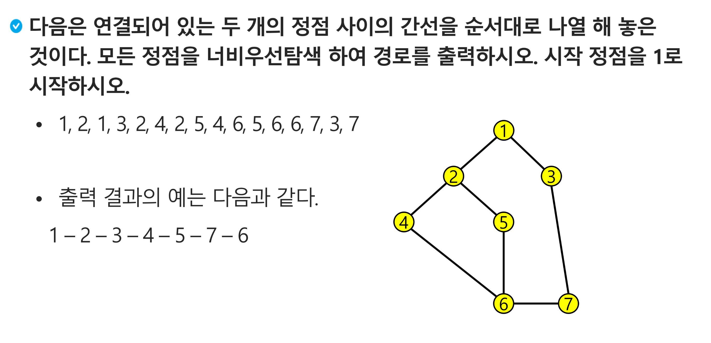

## BFS (너비 우선 탐색, Breadth-First Search)

- 시작 노드에서부터 **가장 가까운 노드들을 먼저** 모두 방문하고, 그 다음 레벨의 노드들을 방문하는 식으로 **가까운 순서대로** 탐색 범위를 점차 넓혀나갑니다.
- 이 방식은 **선입선출(FIFO)** 구조의 **큐(Queue)**와 완벽하게 일치합니다.

### BFS 구현

- 선입선출(FIFO)구조의 큐(Queue),  `deque`를 활용



- **예시 Input**
    
    ```python
    7 8
    1 2 1 3 2 4 2 5 4 6 5 6 6 7 3 7
    ```
    

1. **인접 행렬 코드 예시**

```python
def bfs_matrix(start_node, V, adj_matrix):
    """
    큐(deque)와 인접 행렬을 사용한 BFS
    """
    visited = [False] * (V + 1)  # 각 노드의 방문 여부를 기록
    path = []  # 최종 탐색 경로를 저장
    # BFS는 큐를 사용. 파이썬 list의 pop(0)은 비효율적이므로 deque 사용
    q = deque()

    # --- BFS 시작 처리 ---
    # 1. 시작 노드를 방문 처리를 하고 큐에 삽입
    # "큐에 넣었다"는 것은 "이 노드를 이미 발견해서 다음에 처리할 예정"이라는 의미
    # 큐에 넣기 직전에 방문 처리를 하는 것이 논리적으로 명확하고 중복을 방지할 수 있음
    visited[start_node] = True
    q.append(start_node)

    # 큐가 비어 있지 않은 동안 반복 (큐가 빌 때까지 탐색 진행)
    while q:
        # 2. 큐에서 노드를 하나 꺼냄(dequeue)
        current_node = q.popleft()
        path.append(current_node)

        # 3. 현재 노드와 인접한 모든 인접 노드를 확인
        # 인접 행렬은 모든 노드(1 ~ V)를 순회하며 연결 여부를 확인해야 함
        for next_node in range(1, V + 1):
            # 조건 1: next_node가 current_node와 인접해 있는가?
            # 조건 2: next_node가 아직 방문한 적이 없는가?
            if adj_matrix[current_node][next_node] == 1 and not visited[next_node]:
                # 4. 방문 처리 후 큐에 삽입(enqueue)
                # 두 조건을 모두 만족하면, 다음 방문 대상으로 확정
                visited[next_node] = True
                q.append(next_node)

    return path
```

```python
"""
[[0, 0, 0, 0, 0, 0, 0, 0],
 [0, 0, 1, 1, 0, 0, 0, 0],
 [0, 1, 0, 0, 1, 1, 0, 0],
 [0, 1, 0, 0, 0, 0, 0, 1],
 [0, 0, 1, 0, 0, 0, 1, 0],
 [0, 0, 1, 0, 0, 0, 1, 0],
 [0, 0, 0, 0, 1, 1, 0, 1],
 [0, 0, 0, 1, 0, 0, 1, 0]]
 """

result_path = bfs_matrix(1, V, adj_matrix)
print(''.join(map(str, result_path)))  # 1234576
```

1. **인접 리스트 코드 예시**

```python
def bfs_list(start_node, V, adj_list):
    """
    큐(deque)와 인접 리스트를 사용한 BFS
    """
    visited = [False] * (V + 1)
    path = []
    q = deque()

    # --- BFS 시작 처리 ---
    # 1. 시작 노드 방문 처리 후 큐에 삽입
    visited[start_node] = True
    q.append(start_node)

    # 큐가 빌 때까지 탐색
    while q:
        # 2. 큐에서 맨앞에 있는 노드를 하나 꺼냄 (dequeue)
        current_node = q.popleft()
        path.append(current_node)

        # 3. 현재 노드와 '실제로 인접한' 노드들만 확인
        #    이 문제에서 '번호가 작은 인접 노드부터 방문'하라는 조건이 있기 때문에
        #    오름차순으로 정렬하여 큐에 순서대로 배치하기 위함
        #    (BFS 알고리즘 관점에서 필수 작성 요건은 아님)
        for next_node in sorted(adj_list[current_node]):
            # 아직 방문하지 않은 인접 노드라면,
            if not visited[next_node]:
                # 4. 방문 처리 후, 다음 탐색을 위해 큐에 추가 (enqueue)
                visited[next_node] = True
                q.append(next_node)

    return path
```

```python
"""
[[], [2, 3], [1, 4, 5], [1, 7], [2, 6], [2, 6], [4, 5, 7], [6, 3]]
"""
result_path = bfs_list(1, V, adj_list)
print(''.join(map(str, result_path)))  # 1234576
```

### DFS vs BFS

<aside>
💡

**문제에서 '최단'이라는 키워드가 보이면 BFS를, 
모든 가능성을 끝까지 확인해야 한다면 DFS를 먼저 떠올리는 것이 좋은 문제 해결 전략**

</aside>

| 구분 | **DFS (깊이 우선 탐색)** | **BFS (너비 우선 탐색)** |
| --- | --- | --- |
| **탐색 방식** | 한 우물만 깊게 파는 전략 | 주변부터 넓게 훑어보는 전략 |
| **핵심** | **백트래킹 (Backtracking)** | **최단 경로 (Shortest Path)** |
| **어울리는 문제** | **- 모든 경로를 탐색**해야 하는 문제 (순열, 조합)
- 경로의 존재 여부만 확인하면 되는 문제
- '연결 요소 찾기' (예: 섬 찾기) | **- 최단 경로/비용**을 구하는 문제 (가중치가 없을 때)
- 미로 찾기, 길 찾기 문제
- '레벨' 단위의 탐색이 필요할 때 |