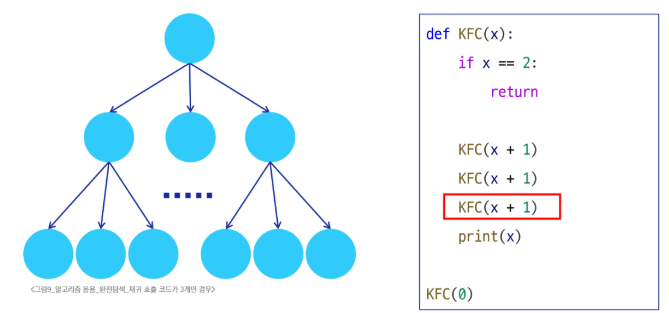
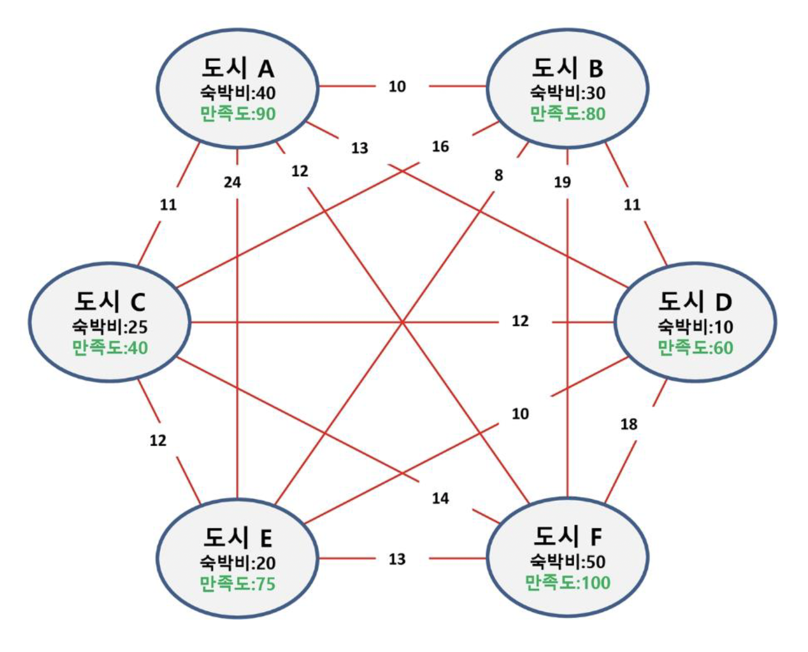

# TIL

## [for 문의 이터러블 객체]

### for 문이 실행되지 않는 경우

`for` 문은 **이터러블(iterable)** 객체를 순회하는 반복문입니다. 이터러블 객체가 **비어있을 때(예: `range(0)`, `[]`)** `for` 문이 실행되지 않는 경우를 정확하게 보여줍니다. **순회할 요소가 하나도 없다**는 것입니다. `for` 문은 이터러블 객체가 비어있을 때, 내부 코드를 한 번도 실행하지 않고 조용히 다음 코드로 넘어갑니다. 이것이 파이썬의 `for` 문이 안전하게 작동하는 방식입니다.

```python
# for 문이 실행되지 않는 경우

# 1. range(0)
for i in range(0):
	print(i)

# 2. 빈 리스트 []
for i in []:
	print(i)
	
# 3. 빈 이터레이터
my_iterator = iter([])
for i in my_iterator:
    print(i)
```

### `for` 루프의 작동 방식

파이썬의 `for` 루프는 기본적으로 이터러블 객체의 요소를 하나씩 가져와 순회합니다. 이 과정에서 `for` 루프는 다음과 같은 단계를 거칩니다.

1. **이터레이터 생성:** `for` 루프가 시작되면, 파이썬은 주어진 이터러블 객체에 대해 `iter()` 함수를 호출하여 이터레이터(iterator)를 얻습니다.
2. **`next()` 호출:** 루프는 이터레이터의 `next()` 메서드를 반복적으로 호출하여 다음 요소를 가져옵니다.
3. **`StopIteration` 예외:** 더 이상 가져올 요소가 없으면 이터레이터는 `StopIteration` 예외를 발생시킵니다.
4. **루프 종료:** `for` 루프는 이 `StopIteration` 예외를 잡아서 루프를 종료하고, 예외를 사용자에게 보여주지 않고 자연스럽게 다음 코드를 실행합니다.

빈 이터러블 객체는 **`iter()`를 호출한 직후, 첫 번째 `next()` 호출에서 바로 `StopIteration` 예외를 발생**시킵니다. 따라서 루프 내부의 코드는 한 번도 실행될 기회를 얻지 못하고, `for` 루프는 즉시 종료되는 거죠. 이 과정은 파이썬 내부에서 조용히 처리되므로 사용자에게는 아무런 에러도 보이지 않습니다.

### `for` 루프와 `while` 루프의 차이

이러한 특성은 `for` 루프가 **`while` 루프보다 더 안전하고 간결한 이유** 중 하나입니다.

- **`for` 루프:** 빈 컬렉션에 대해 추가적인 조건문 없이도 안전하게 작동합니다.

```python
my_list = []
for item in my_list:
    print(item)  # 아무것도 출력되지 않고 넘어감
print("루프 종료")
```

- **`while` 루프:** 빈 컬렉션에 대해 루프를 실행하려면, 사전에 크기나 상태를 확인하는 조건문이 필요합니다.
    
    만약 `while` 루프에 이 조건문이 없다면, 잘못된 인덱스 접근 등으로 `IndexError`와 같은 런타임 에러가 발생할 수 있습니다.
    

```python
my_list = []
i = 0
while i < len(my_list):  # len(my_list)가 0이므로 조건이 False여서 실행되지 않음
    print(my_list[i])
    i += 1
print("루프 종료")
```

## [가지치기의 중요성]
### 제한 시간 초과한 코드
```python
# 35/100 (제한시간 초과)
 
# import sys
# sys.stdin = open("input.txt")
 
def get_max_possibility(emp_num, current_p):
    global result
 
    # 가지치기: 확률이 최대값보다 작다면 종료
    if current_p < result:
        return
 
    # 종료조건: 모든 일을 배분했다면 최대값 갱신
    if emp_num == N:
        result = max(result, current_p)
        return
 
    # 남은 일 배분
    for task in range(N):
        if not visited[task]:
            visited[task] = True
            get_max_possibility(emp_num + 1, current_p * percent[emp_num][task])
            visited[task] = False
 
 
T = int(input())
for tc in range(1, T + 1):
    N = int(input())
    # 직원과 할일의 인덱스는 0부터 N-1까지
    percent = [list(map(lambda x: int(x)/100, input().split())) for _ in range(N)]
 
    # 해야할 일이 배정되었는지 여부를 나타낸다.
    visited = [False] * N
    result = 0
 
    get_max_possibility(0, 1.0)
 
    print(f'#{tc} {result * 100:.6f}')
```

### 통과한 코드
```python
# PASS
 
# import sys
# sys.stdin = open("input.txt")
 
def get_max_possibility(emp_num, current_p):
    global result
 
    # 가지치기: 확률이 최대값보다 작거나 같다면 종료
    if current_p <= result:
        return
 
    # 종료조건: 모든 일을 배분했다면 최대값 갱신
    if emp_num == N:
        result = max(result, current_p)
        return
 
    # 남은 일 배분
    for task in range(N):
        if not visited[task]:
            visited[task] = True
            get_max_possibility(emp_num + 1, current_p * percent[emp_num][task])
            visited[task] = False
 
 
T = int(input())
for tc in range(1, T + 1):
    N = int(input())
    # 직원과 할일의 인덱스는 0부터 N-1까지
    percent = [list(map(lambda x: int(x)/100, input().split())) for _ in range(N)]
 
    # 해야할 일이 배정되었는지 여부를 나타낸다.
    visited = [False] * N
    result = 0
 
    get_max_possibility(0, 1.0)
 
    print(f'#{tc} {result * 100:.6f}')
```

### 코드리뷰 피드백

해당 코드에서 등호 `=` 하나 차이로 답이 갈림. 

현재 확률이 최대값과 같다면, 어떤 확률을 곱해도 최대값보다 커질 수 없다. → **유망하지 않음!**

다음 확률이 모두 1.00 일 경우에도 최대값보다 커질 수는 없다. 이 경우가 굉장히 드물지만 정답에 영향을 주지 않는 경우이므로 가지치기를 통해 중단해야 한다.


<br><br>

# 수업 필기

## 완전 탐색(Brute Force)

가능한 **모든 경우의 수**를 생성하고, 조건을 만족하는지 하나씩 검사하여 해결하는 방식

- 거의 모든 문제에서 적용이 가능하다.
- 경우의 수가 많은 경우, 계산 시간이 기하급수적으로 늘어날 수 있다. (시간 초과 위험)
    - 완전 탐색으로 정답을 우선 구하고, 성능 개선(DP, 탐욕)으로 최적화하는 경우가 많다.

### 반복과 재귀

**반복(Iteration)**

- 수행하는 작업이 완료될 때까지 계속 반복
    - 코드를 n번 반복시킬 수 있음
- 루프 (for, while 구조)

**재귀(Recursion)**

- 주어진 문제의 해를 구하기 위해 동일하면서 더 작은 문제의 해를 이용하는 방법
- 하나의 큰 문제를 해결할 수 있는(해결하기 쉬운) 더 작은 문제로 쪼개고 결과들을 결합
- 재귀호출은 n중 반복문과 같은 효과

### 재귀 함수의 특징

- 함수를 호출할 때 객체를 전달하면 **값만 복사**된다.

```python
def KFC(x):  # x = 4, 함수 내에서 사용하는 객체 x
	print(x)  # 4
	x += 1
	print(x)  # 5

x = 3
KFC(x + 1)  # KFC(4) 호출
print(x)  # 3, global 객체 x

# 출력 순서는: 4 5 3
```

- 함수가 끝나면 main으로 돌아오는 것이 아니라, **해당 함수를 호출했던 곳으로 돌아온다.**

```python
def BBQ(x):  # x = 9
	x += 10  # x = 19
	print(x)  # 19, BBQ함수의 객체 x
	
def KFC(x):  # x = 4
	print(x)  # 4
	x += 3  # x = 7
	BBQ(x + 2)  # BBQ(9) 호출
	print(x)  # 7, KFC함수의 객체 x
	
x = 3  
KFC(x + 1)  # KFC(4) 호출
print(x)  # 3, global 객체 x

# 출력 순서는: 4 19 7 3
```

- 무한 재귀호출
    - 파이썬에서는 약 1,000번 정도 깊이에서 제한이 걸린다.

```python
def KFC(x):
    KFC(x + 1)

KFC(0)
print("끝")  

# RecursionError: **maximum recursion depth** exceeded while calling a Python object
```

- 대부분 **종료 조건(Base Case)**과 함께 활용되거나, **다음 재귀 호출을 하지 않도록 구성**한다.
    - 후입선출(LIFO) 구조인 스택과 작동 원리가 같다.

```python
def KFC(x):  # 파라미터 x: 누적값
    if x == 4:  # 종료조건: 4
        return

    print(x)
    KFC(x + 1)
    print(x)

KFC(0)  # 시작점: 0
print("끝")  # 0 1 2 3 3 2 1 0 끝
```

- 트리 구조로 본 재귀
    - 재귀 호출의 개수 == 가지(branch)의 개수
    - 종료 조건에 따라 깊이(level)가 달라진다.


재귀 호출 코드가 2개 일 경우 (Level 3, Branch 3)


### 활용 예시

- 조합적 문제
    - 순열, 조합, 부분집합 등
- 배낭 문제(Knapsack)
- 여행 경로
 
### 예시: 여행 경로 문제



CASE 1. 모든 도시를 방문하면서 경비가 가장 적게 드는 코스 구하기 (출발 도시는 A, 도착 도시는 F)

> A-B-C-D-E-F → 60
A-B-C-E-D-F → 66
> 
- 순서에 따라 경비가 다르다. (순서가 중요함!)
    
    **⇒ “순열”**
    

CASE 2. 3개의 도시를 선택하면 숙박비를 지원받는다. 가장 많은 지원금을 받는 도시 조합 구하기

> ABC → 95
ABD → 80
CBA → 95
> 
- ABC나 CBA나 경비는 같다. (순서가 중요하지 않음)
- 6개 도시 중 3개를 고르는 모든 경우의 수를 구하고, 숙박비가 가장 큰 경우를 찾는다.
    
    **⇒ “조합”**
    

CASE 3. 여행 경비를 넘지 않으며 최대 만족도를 갖는 코스 구하기. 
(여행 경비는 70만원, 이동 경로는 고려하지 않는다.)

> F → 만족도 100, 경비 50
F, E → 만족도 175, 경비 70
A, D, E → 만족도 225, 경비 70
> 
- 도시를 많이 선택하는 것이 정답은 아니다.
- 도시의 수와 상관없이 모든 경우의 수를 확인해야 한다. (순서는 중요하지 않음)
- 1개 도시를 고르는 경우의 수 + 2개 도시를 고르는 경우의 수 + … + 6개 도시를 고르는 경우의 수
    
    **⇒ “부분 집합”**
    

## 순열과 조합

### 순열 (Permutation)

주어진 서로 다른 원소들 중에서 일부(r개) 혹은 전부(n개)를 **순서 있게** 나열하는 방법

- 순서가 다르면 다른 경우로 취급한다.
- **`$nPr$`** = `$n * (n-1) * (n-2) * … * (n-r+1)$` =  **`$N! / (N-R)!$`**
- 예시: 줄서기, 자리 배치, 암호 조합

1. **반복문 방식**
- n번 중첩해야하기 때문에, 원소의 개수가 3 이하로 정해져 있을 때 사용 가능

```python
# {1, 2, 3}의 모든 순열을 구하기 위한 3중 for문

for i in range(1, 4):
    for j in range(1, 4):
        # i와 j가 겹치지 않는 경우에만 다음 단계로
        if i != j:
            for k in range(1, 4):
                # i, j, k가 모두 겹치지 않는 경우 출력
                if i != k and j != k:
                    print(i, j, k)
```

```
1 2 3
1 3 2
2 1 3
2 3 1
3 1 2
3 2 1
```

2. **재귀 방식**
- “현재 원소를 선택 + 나머지 원소로 순열 구성”을 재귀 호출

```python
# "하나를 고르고, 남은 목록에서 고르는 경우의 수"

def perm(selected, remaining):
    """
    Args:
        selected (list): 현재까지 선택된 원소들의 순열 (선택된)
        remaining (list): 아직 선택되지 않은 원소들 (선택할)
    """
    # 기저 조건(Base Case): 더 이상 선택할 원소가 없으면 순열 하나가 완성된 것
    if not remaining:
        print(selected)
        return

    # 재귀 호출(Recursive Step)
    # 남아있는 원소들(remaining)을 하나씩 순회하며 다음 자리에 놓을 원소를 선택
    for i in range(len(remaining)):
        # i번째 원소를 이번 순열에 추가
        pick = remaining[i]

        # i번째 원소를 제외한 새로운 '남은 원소' 리스트 생성
        new_remaining = remaining[:i] + remaining[i + 1 :]

        # 새로운 '선택된 원소'와 '남은 원소'로 자기 자신을 다시 호출
        perm(selected + [pick], new_remaining)

# --- 실행 코드 ---
# 처음에는 아무것도 선택되지 않았고([]), 모든 원소가 남아있음([1, 2, 3])
perm([], [1, 2, 3])
```

```
[1, 2, 3]
[1, 3, 2]
[2, 1, 3]
[2, 3, 1]
[3, 1, 2]
[3, 2, 1]
```

### 조합 (Combination)

순서에 상관없이, 서로 다른 n개의 원소에서 r개를 선택하는 모든 경우의 수

- `$nCr$` = **`$N! / (R!(N-R)!)$`**
- 예시: 로또 번호, 팀 구성

1. **반복문 방식**
- `i < j < k` 임을 이용
- 개수가 정해진 경우

```python
numbers = [1, 2, 3, 4]
n = len(numbers)

# 3개의 원소를 뽑으므로 3중 for문 사용
for i in range(n):
    for j in range(i + 1, n):  # i는 포함하지 않는다.
        for k in range(j + 1, n):  # j는 포함하지 않는다.
            print(numbers[i], numbers[j], numbers[k])
```

```
1 2 3
1 2 4
1 3 4
2 3 4
```

2. **재귀 방식**
- “일단 1개를 결정하고, 남은 원소들 중에서 r-1개 선택”을 반복

```python
def comb(arr, r):
    """
    Args:
        arr (list): 원본 배열
        r (int): 뽑을 개수

    Returns:
        list: 모든 조합이 담긴 2차원 리스트
    """
    result = []

    # 기저 조건(Base Case): 뽑을 개수가 0이면, 빈 리스트를 담은 리스트를 반환하여 조합 완성
    if r == 0:
        return [[]]

    # 재귀 호출(Recursive Step)
    for i in range(len(arr)):
        # i번째 원소를 첫 번째 요소로 선택
        elem = arr[i]

        # i번째 원소 이후의 나머지 리스트에서
        # 나머지 (r-1)개의 조합을 재귀적으로 구함
        for rest in comb(arr[i + 1 :], r - 1):
            # 선택한 요소(elem)와 나머지 조합(rest)을 합쳐 결과에 추가
            result.append([elem] + rest)

    return result

# --- 실행 코드 ---
all_combs = comb([1, 2, 3, 4], 3)
print(all_combs)
```

```
[[1, 2, 3], [1, 2, 4], [1, 3, 4], [2, 3, 4]]
```

## itertools 모듈

- 순열: `itertools.permutations(iterable, r=None)`

```python
import itertools

data_list = ['A', 'B', 'C', 'D']

# permutations()는 반복 가능한 객체를 반환 (제너레이터)
result_object = itertools.permutations(data_list, 2)
print(result_object)  # <itertools.permutations object at 0x...>

# 실제 결과를 보고 싶으면 list() 등으로 변환
result_list = list(itertools.permutations(data_list, 2))
print(result_list)
# [('A', 'B'), ('A', 'C'), ('A', 'D'), ('B', 'A'), ('B', 'C'), ('B', 'D'),
#  ('C', 'A'), ('C', 'B'), ('C', 'D'), ('D', 'A'), ('D', 'B'), ('D', 'C')]

# 문자열로 합쳐 보기
print(list(map(''.join, result_list)))
# ['AB', 'AC', 'AD', 'BA', 'BC', 'BD', 'CA', 'CB', 'CD', 'DA', 'DB', 'DC']
```

- 조합: `itertools.combination(iterable, r)`

```python
# combinations()도 제너레이터
result_object = itertools.combinations(data_list, 2)
print(result_object)  # <itertools.combinations object at 0x...>

# list()로 변환해 확인
result_list = list(itertools.combinations(data_list, 2))
print(result_list)
# [('A', 'B'), ('A', 'C'), ('A', 'D'), ('B', 'C'), ('B', 'D'), ('C', 'D')]

# 문자열로 합쳐서 보려면
print(list(map(''.join, result_list)))
# ['AB', 'AC', 'AD', 'BC', 'BD', 'CD']
```

- 중복 순열: `itertools.product(iterable, repeat=r)`

```python
product_list = list(itertools.product('AB', repeat=2))
print(product_list)
# [(‘A’,‘A’), (‘A’,‘B’), (‘B’,‘A’), (‘B’,‘B’)]
```

- 중복 조합: `itertools.combinations_with_replacement(iterable, r)`

```python
comb_wr_result = list(itertools.combinations_with_replacement(['A', 'B', 'C'], 2))

print(comb_wr_result)
# [('A', 'A'), ('A', 'B'), ('A', 'C'), ('B', 'B'), ('B', 'C'), ('C', 'C')]
```

### [심화] 제너레이터

일회용 이터레이터

- 한 번 순회가 끝나면 소진, **재사용 불가**
- 결과를 여러 번 사용하려면, 리스트나 튜플 등으로 한 번 변환하여 저장해야 한다.

```python
import itertools

data_list = ['A', 'B', 'C', 'D']

comb_obj = itertools.combinations(data_list, 2)

# 첫 번째 순회
for pair in comb_obj:
    print(pair)
# ('A','B'), ('A','C'), ('A','D'), ('B','C'), ('B','D'), ('C','D')

print(list(comb_obj))
# []
# 이미 comb_obj를 소진했으므로 빈 리스트 []

# 필요한 경우, list()로 먼저 변환해두고 여러 번 재사용
```


## 패턴 매칭

### 고지식한 알고리즘 (Brute Force)

단순한 방법. 완전탐색

- 시간 복잡도: `$O(MN)$`

예시: 본문 문자열을 처음부터 끝까지 순회하면서 패턴 내의 문자들을 일일이 비교

```python
def brute_force(p, t):
		""" 
		본문 문자열 내에 패턴 문자열이 있다면 해당 인덱스를, 없다면 -1을 반환하는 함수
		- params
				p: 찾을 패턴(str), t: 본문 문자열(str)
		"""
		i = 0  # t의 인덱스
		j = 0  # p의 인덱스
		
		N = len(t)  # t의 길이
		M = len(p)  # p의 길이
		
		while j < M and i < N:
				# 다른 글자인 경우
				if t[i] != p[j]:
						# 불일치 시, 비교 시작 위치를 한 칸씩 앞으로 이동
            # (i - j): 패턴을 처음부터 다시 비교해야 하므로
            i = i - j
            # j를 -1로 만들고, 바로 아래서 j += 1 → j=0
            j = -1
				i += 1
				j += 1
		
		# # while 문을 빠져나온 상태에서, j가 M과 같다면 패턴을 모두 일치시킨 것
		if j == M:
				return i - M  
				
		# 검색 실패
		else:
				return -1  
```

### KMP 알고리즘

패턴의 각 위치에서 매칭에 실패했을 때 돌아갈 위치를 미리 계산한다.

불일치가 발생했을 겨웅 이동할 다음 위치를 계산하는 전처리가 필요하다.

- 패턴의 접두사/접미사가 일치하는 최대 길이를 담은 **LPS 배열**을 사용
- 불일치 시, 패턴을 한 칸씩 밀기보다, **LPS 정보를 기반**으로 적절히 패턴 인덱스를 점프
- **시간 복잡도**: 최악의 경우 `$O(N + M)$`

### 보이어-무어 (Boyer-Moore) 알고리즘

상용 소프트웨어에서 채택하고 있는 알고리즘

실제 검색에서 매우 빠른 성능