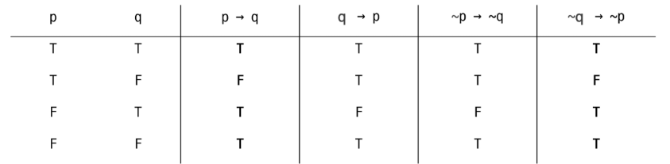

## 컴퓨팅 사고력

### Hard Logic vs Soft Logic

- Hard Logic(논리): 생각이나 주장의 타당성과 옳고 그름을 판별하는 규칙이나 원리
- Soft Logic(직관): 경험적, 직관적, 확률적 판단

## 명제

참이나 거짓을 알 수 있는 식이나 문장

### **명제의 연산(결합)**

- 부정 NOT `~p`: p가 명제일 때 명제의 진릿값이 반대가 된다.
- 논리곱 AND `p ^ q`: p, q 모두 참일 때만 참이 되는 명제
- 논리합 OR `p V q`: p, q 모두 거짓일 때만 거짓이 되는 명제
- 배타적 논리합 XOR: p, q 중 하나만 참일 때 참이 되는 명제

### **조건 명제**

`p → q` p, q가 명제일 때, 명제 p가 조건(원인), q가 결론(결과)으로 제시되는 명제

`p ↔ q` p와 q가 모두 조건이면서 결론인 명제

- 명제: `p → q`
- 역: `q → p`
- 이: `~p → ~q`
- 대우: `~q → ~p`
    - 명제가 참/거짓이면, 대우도 참/거짓이다. 그 반대도 마찬가지.

## 증명

### 직접 증명

- Trivial Proof (자명한 증명)
    - for all x, P(x) → Q(x)를 증명하려는데, Q(x)가 항상 참인 경우
- Vacuous Proof (공허한 증명)
    - for all x, P(x) → Q(x)를 증명하려는데, P(x)가 항상 거짓인 경우

### 간접 증명

- 대우에 의한 증명
    - 명제의 대우가 참임을 증명함으로써 명제가 참임을 증명하는 방법
- 모순에 의한 증명(귀류법)
    - 명제의 부정을 참이라고 가정하고, 그것이 틀림(불합리성)을 증명함으로써 P^~Q를 증명하는 방법

### 수학적 귀납법

0보다 크거나 같은 정수 범위에 대해 P(n)이 성립함을 증명

- P(1)이 참이고, P(n) → P(n+1)이 참이면 P(n)은 모든 자연수 n에 대해서 참이다.
- 초기 조건이 명제를 만족함을 보이고, 연쇄적으로 이후 상황을 처리한다.

## 집합과 조합론

### 집합

- 두 집합 A와 B가 같다 ⇒ A가 B의 부분집합이고, B가 A의 부분집합이다

### 조합론

- 경우의 수를 따지는 문제

## 수와 표현

### 비트

- 컴퓨터는 0/1을 표현할 수 있는 비트들을 모아 수를 표현한다.
- k개의 비트를 사용하면 $0$ 부터 $2^k-1$ 까지 (최대 $2^k$가지) 표현 가능
- n을 표현하는 데 필요한 비트 수는 $log n$
    - 컴퓨터 분야에서 로그의 밑은 항상 2
- 32비트 컴퓨터의 주소 공간은 $2^{32}$ = 약 40억 개 (대략 -21억 ~ 21억)

### 빅-오 표기법

최악의 시간 복잡도를 표기한 것

## 프로그래밍 사고

### 재귀 호출

수학적 귀납법 증명 사용 가능

- n이 0일 때 문제를 풀 수 있다
- n-1에서 문제를 풀 수 있으면 n에서도 문제를 풀 수 있다
    
    → 모든 가능한 n에 대해 문제를 풀 수 있다
    

### 동적 계획법

- 재귀함수에서 동일한 입력의 함수 호출이 반복적으로 일어날 때, 그 값을 저장해두고 불러 쓰는 것 (Memoization)
- 최초 입력에서 파생되는 모든 가능한 입력에 대한 답을 모두 저장할 수 있는 메모리가 있어야 한다
- 결과값을 순서를 정해서 계산할 수 있다(Dynamic Programming)

