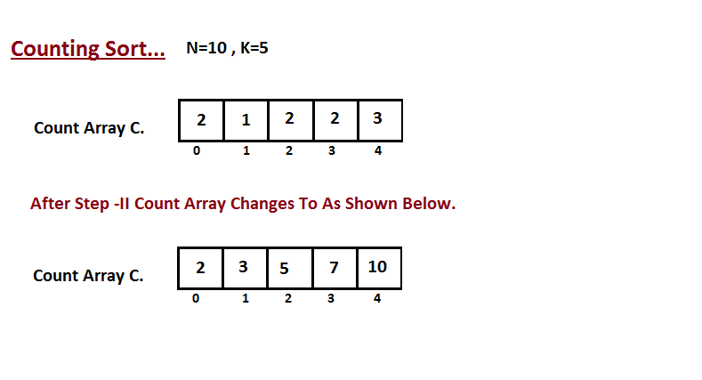
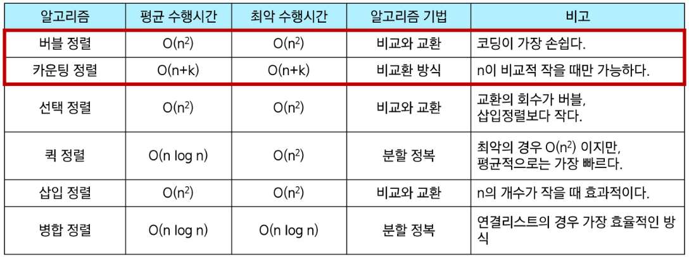

# 코드 리뷰

## 1208. flatten
### 접근 과정

1. 누적합을 활용
    
    누적 합 배열을 순회하면서, 이전 값과 차이가 발생하는 인덱스를 최소/최대값으로 설정하고 최대값은 -1, 최소값은 +1 한다.
    
    이 경우, 최소 인덱스의 값이 바뀌면, 최대 인덱스까지의 값들이 연쇄적으로 바뀌기 때문에 매번 배열 값을 갱신해줘야 한다. 
    
    ⇒ 너무 복잡할 듯.
    
2. 정렬
    
    각 상자의 높이를 오름차순으로 정렬하고, 최대값은 -1, 최소값은 +1 한다.
    
    이 경우, 평탄화를 진행할 때마다 값이 변하고 매번 정렬을 해야한다.
    
    ⇒ 불필요한 연산이 많이 쓰인다.
    
3. 카운팅 배열
    
    각 상자의 높이는 1 이상 100 이하로, 100개의 정수로 구성된다.
    
    상자의 높이를 인덱스로, 상자의 개수를 값으로 하는 카운트 배열을 생성한다.
    
    카운트 배열을 정방향/역방향으로 순회하면서 0이 아닌 값이 나오면 최소/최대로 설정하고,
    최대와 최소는 카운팅 배열의 값을 -1, (최대-1)과 (최소+1)의 값은 +1 한다.
    
    ⇒ 길이 101인 배열 하나만 사용. ok.

### 내 코드

```python
# 1208. flatten

# import sys
# sys.stdin = open("input.txt")

T = 10  # 테스트 케이스의 수

for test_case in range(1, T+1):
    dump = int(input())  # 덤프 횟수
    boxes = list(map(int, input().split()))  # 각 상자의 높이

    # 평탄화를 한다 = 최대값-1, 최소값+1
    # 상자의 총 개수는 변하지 않는다.

    # 카운팅 배열 생성
    counting_arr = [0] * (100+1)  # 상자의 높이는 1 이상 100 이하
    for box in boxes:
        counting_arr[box] += 1

    # 덤프 횟수동안 평탄화 과정을 반복한다.
    while dump >= 0:
        # 카운팅 배열을 정방향으로 순회하면서 0이 아닌 값이 나오면 최소값으로 입력
        min = 0
        while not counting_arr[min]:
            min += 1
        # 카운팅 배열을 역방향으로 순회하면서 0이 아닌 값이 나오면 최대값으로 입력
        max = 100
        while not counting_arr[max]:
            max -= 1

        # 종료 조건 1. 작업 횟수(덤프횟수)가 제한된다.
        if dump == 0:
            break

        # 종료 조건 2. 평탄화가 완료된다
        # 최대값, 최소값의 차이가 0 또는 1
        if max - min <= 1:
            break

        # 평탄화를 한다: 카운팅 배열에서 최대값과 최소값은 -1, (최대값-1)과 (최소값+1)은 +1 해준다.
        counting_arr[max] -= 1
        counting_arr[min] -= 1
        counting_arr[max-1] += 1
        counting_arr[min+1] += 1

        dump -= 1

    # 결과를 출력한다.
    print(f"#{test_case} {max - min}")
```

## 코드리뷰 피드백

변수명에 `min`, `max`, `sum` 쓰지 마!!!


## 6485. 삼성시의 버스 노선
### 접근 방법

**1. 각 정류장에 정차하는 버스의 수를 `num_of_buses` 에 카운팅한다.**
    1. 정류장은 총 5000개이므로 리스트의 길이는 5000+1
    2. 출발점 `Ai` 부터 `Bi`가 인덱스인 값을 +1 한다.
    3. 버스 정류장의 번호 `Ci`를 인덱스로 하는 값을 출력한다.
    
    ```python
    # 6485. 삼성시의 버스 노선
    
    # import sys
    # sys.stdin = open("s_input.txt")
    
    T = int(input())  # 테스트 케이스의 수
    
    # 1. 각 버스 정류장에 정차하는 버스의 수를 카운팅한다.
    for test_case in range(1, T+1):
        N = int(input())  # 버스 노선 개수
    
        # 정류장에 정차하는 버스의 수.(정류장은 총 5000개)
        num_of_buses = [0] * 5001
    
        # routes = [0] * N  # N개의 버스노선의 출발점과 도착점 리스트
        for _ in range(N):
            departure, arrival = map(int, input().split())
    
            # 출발점부터 도착점까지의 stops를 +1 한다.
            for i in range(departure, arrival + 1):
                num_of_buses[i] += 1
    
        P = int(input())  # 궁금한 버스 정류장의 수
        stations = [int(input()) for _ in range(P)]  # 궁금한 버스 정류장의 번호
    
        # 결과를 출력한다.
        print(f"#{test_case}", end=" ")
        for station in stations:
            print(num_of_buses[station], end=" ")
        print()
    ```
    
**2. Ci를 순회하면서 버스 노선에 포함되는지 계산**
    
    ```python
    for i in C_list:
    	for j in N_list(A, B):
    		if Aj <= Ci <= Bj:
    			num_of_buses[i] += 1
    ```
    
    이렇게 하면 최대 P(500) * N(500) 번 연산 (문제 제한사항은 4초, 가능)
    
    ```python
    # 6485. 삼성시의 버스 노선
    
    # import sys
    # sys.stdin = open("s_input.txt")
    
    T = int(input())  # 테스트 케이스의 수
    
    # 2. Ci를 순회하면서 버스 노선에 포함되는지 계산한다.
    for test_case in range(1, T+1):
        N = int(input())  # 버스 노선 개수
    
        routes = [0] * N  # N개의 버스노선의 출발점과 도착점 리스트
        for i in range(N):
            departure, arrival = map(int, input().split())
            routes[i] = [departure, arrival]
    
        P = int(input())  # 궁금한 버스 정류장의 수
        stations = [int(input()) for _ in range(P)]  # 궁금한 버스 정류장의 번호
    
        num_of_buses = [0] * P  # 정류장에 정차하는 버스의 수
        # 궁금한 정류장마다 각 버스 노선안에 포함되는지 확인한다.
        for i in range(P):
            for route in routes:
                # 포함되면 num_of_buses를 +1
                if route[0] <= stations[i] <= route[1]:
                    num_of_buses[i] += 1
    
        # 결과를 출력한다.
        print(f"#{test_case}", end=" ")
        for i in range(P):
            print(num_of_buses[i], end=" ")
        print()
    ```

<br><br>

# 수업 필기

## 카운팅 정렬 Counting Sort

각 원소의 **빈도수**를 이용하여 정렬하는 알고리즘

- 정수나 정수로 표현할 수 있는 자료에 대해서만 적용 가능하다.
    - 각 항목의 발생 회수를 기록하기 위해 정수 항목으로 인덱스되는 카운트들의 배열을 사용하기 때문
- 카운트를 위한 충분한 공간을 할당하려면 집합 내의 가장 큰 정수를 알아야 한다.
- 단순히 '크기'를 기준으로 정렬 → 실제 위치를 바꾸는 정렬 알고리즘과 다르게 개수만 카운트 해주면 되기 때문에 효율적 (데이터에 한번씩만 접근)

**시간 복잡도**: O(n+k)

- n은 리스트 길이, k는 정수의 최대 값

**정렬 과정**

1. 입력 배열 A와 배열 A의 길이(N) 최대 값 K를 인자로 받아 수행
2. 0부터 K 까지의 인덱스를 사용하는 카운팅 배열 C를 초기화
3. 입력 배열 A의 각 원소를 순회하면서 원소 빈도 수를 배열 C에 기록 `C[i] = i의 발생 횟수`
    
    
    
4. 누적 합 계산
카운팅 배열 C를 누적합 형태로 업데이트 `C[i] = C[i] + C[i-1]  # 누적한 원소 값`
→ 각 원소가 정렬된 배열에서 차지할 최종 위치를 결정하기 위해
→ 각 값 `i`에 대해, 0부터 `i`까지의 모든 값이 몇 번 등장했는지를 누적해서 계산
    
    → 이를 통해 정렬 결과에서 각 원소가 들어갈 위치(인덱스)를 결정할 수 있음
    
    
    
1. 결과 배열 생성 및 원소 배치
    1. 입력 배열 A와 동일한 크기의 결과 배열 B를 생성
    2. 생성된 카운트 배열 C의 도움을 받아 입력 배열 `A` 요소를 정렬된 위치에 배치
    즉, 두 번째 단계에서 구성한 것
    결과 배열 B를 사용하여 정렬된 요소를 저장
    0부터 시작하는 B의 인덱스를 처리
    
    
    

**배열을 활용한 카운팅 정렬**

```python
def counting_sort(input_arr, k):
    '''
    카운팅 정렬 함수
    input_arr : 정렬할 입력 배열 (각 원소는 0 이상 k 이하의 정수)
    k : 입력 배열 내 원소의 최대값 (데이터 범위를 의미)
    '''
    # 1. k+1 크기의 카운팅 배열을 0으로 초기화 (인덱스 0부터 k까지 사용)
    counting_arr = [0] * (k + 1)

    # 2. 입력 배열 내 각 원소의 빈도수를 counting_arr에 기록한다.
    for num in input_arr:
        counting_arr[num] += 1
    # counting_arr = [1, 3, 1, 1, 2]

    # 3. 누적 합을 계산하여 각 원소가 정렬된 배열 내에서 차지할 위치를 결정한다.
    for i in range(1, k + 1):
        counting_arr[i] += counting_arr[i - 1]    
    # counting_arr = [1, 4, 5, 6, 8]
    # 누적 합 배열의 마지막 값의 배열의 길이와 일치한다.

    # 4. 결과 배열 초기화: 입력 배열과 같은 크기로 생성한다.
    result_arr = [0] * len(input_arr)

    # 5. 입력 배열을 역순으로 순회하며, 각 원소를 결과 배열의 올바른 위치에 배치한다.
    #    (역순 순회는 정렬의 안정성을 보장하기 위한 기법입니다.)
    # 5.1 역순 reversed 버전
    for num in reversed(input_arr):
        counting_arr[num] -= 1  # 해당 원소의 위치 인덱스를 하나 감소시킨다.
        result_arr[counting_arr[num]] = num

    # 5.2 역순 index 버전
    # for i in range(len(input_arr) - 1, -1, -1):
    #     counting_arr[input_arr[i]] -= 1
    #     result_arr[counting_arr[input_arr[i]]] = input_arr[i]

    return result_arr

# 테스트 예시
arr = [0, 4, 1, 3, 1, 2, 4, 1]
print(
    '정렬 결과:', counting_sort(arr, 4)
)  # 정렬 결과: [0, 1, 1, 1, 2, 3, 4, 4]
```

### 정렬 알고리즘 비교

