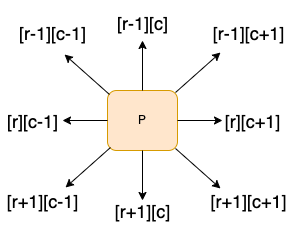
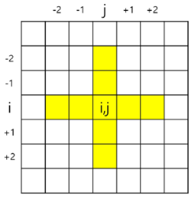
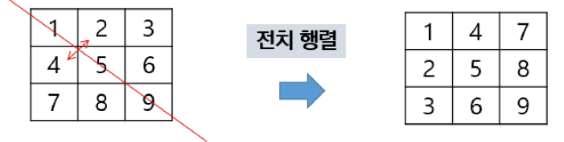
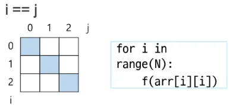
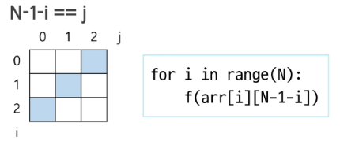

# 스스로 학습

## [전치행렬]

### zip 활용한 배열 회전

**1. 시계 방향으로 90도 회전**

```python
arr = [
    [1, 2, 3], 
    [4, 5, 6], 
    [7, 8, 9],
]

# 1. 행을 뒤집기: [[7, 8, 9], [4, 5, 6], [1, 2, 3]]
# 2. 전치하기
clockwise_90 = list(map(list, zip(*arr[::-1])))

# [[7, 4, 1],
#  [8, 5, 2],
#  [9, 6, 3]]
```

**2. 반시계 방향으로 90도 회전**

```python
arr = [
    [1, 2, 3], 
    [4, 5, 6], 
    [7, 8, 9],
]

# 1. 전치하기: [[1, 4, 7], [2, 5, 8], [3, 6, 9]]
# 2. 행을 뒤집기
clockwise_90 = list(map(list, zip(*arr)))[::-1]

# [[3, 6, 9],
#  [2, 5, 8],
#  [1, 4, 7]]
```


<br><br>

# 코드 리뷰

## [1954. snail]

### 내 코드 (델타, '벽' 만나면 회전)

```python
# 1954. 달팽이 숫자

# import sys
# sys.stdin = open("input.txt")

T = int(input())

for test_case in range(1, T+1):
    N = int(input())
    snail = [[0] * N for _ in range(N)]

    # 달팽이 모양으로 이동하기 위한 델타 배열 (우하좌상)
    dr = [0, 1, 0, -1]
    dc = [1, 0, -1, 0]

    r = 0
    c = 0
    number = 1
    snail[r][c] = number  # 첫 번째 숫자초기화
    
    # N*N 개의 숫자를 할당했다면 종료
    while number < N * N:
        # 이동할 방향을 설정하고 (우하좌상)
        for i in range(4):
            # 몇 번 이동할 지 설정 (최대 N번)
            for _ in range(N):
                nr = r + dr[i]
                nc = c + dc[i]
    
                # 배열의 범위 이내이면서 이동한 위치의 값이 0일때만 값을 할당한다.
                if 0 <= nr < N and 0 <= nc < N and snail[nr][nc] == 0:
                    number += 1
                    r, c = nr, nc  # 현재 위치 갱신
                    snail[r][c] = number
    
    # 결과 출력
    print(f'#{test_case}')
    for r in range(N):
        for c in range(N):
            print(snail[r][c], end=' ')
        print()
```

### 코드리뷰 피드백

1. `for _ in range(N):` 안에 `else: break` 탈출 조건 추가하면 좋을 듯

```python
# 수정한 코드
...					for _ in range(N):
                nr = r + dr[i]
                nc = c + dc[i]
    
                # 배열의 범위 이내이면서 이동한 위치의 값이 0일때만 값을 할당한다.
                if 0 <= nr < N and 0 <= nc < N and snail[nr][nc] == 0:
                    number += 1
                    r, c = nr, nc  # 현재 위치 갱신
                    snail[r][c] = number
                else:
		                break
...		                
```

2. 1차원 배열의 경우 리스트의 요소를 다중인자를 받아 언패킹하는 방법으로 간단하게 표기 가능
```python
# 결과 출력
    print(f'#{test_case}')
    for row in snail:
        # row 리스트의 각 정수 요소를 문자열로 변환 후 공백으로 연결
        print(*row)
```


### 다른 풀이 (테두리부터 채워나가는 레이어, '벽' 만나면 회전)
```python
# 1954. 달팽이 숫자

T = int(input())  # 테스트 케이스의 수

for test_case in range(1, T+1):
    N = int(input())  # 달팽이의 크기
    snail = [ [0] * N for _ in range(N) ]  # 달팽이 초기화

    x, y = 0, 0  # 탐색 위치 초기화
    number = 1  # 할당할 숫자 초기화
    snail[x][y] = number  # 첫 번째 숫자 할당하고 시작

    # 달팽이를 모두 채울 때까지 다음 4가지 패턴을 반복한다.
    while number < N * N:
        # 1. y값 증가
        for j in range(y+1, N):
            if snail[x][j] == 0:
                number += 1
                snail[x][j] = number
            # 현재 위치에 값이 할당되어 있다면 다음 패턴으로 넘어간다.
            else:
                y = j - 1
                break
        else:
            y = j

        # 2. x값 증가
        for i in range(x+1, N):
            if snail[i][y] == 0:
                number += 1
                snail[i][y] = number
            # 현재 위치에 값이 할당되어 있다면 다음 패턴으로 넘어간다.
            else:
                x = i - 1
                break
        else:
            x = i

        # 3. y값 감소
        for j in range(y-1, -1, -1):
            if snail[x][j] == 0:
                number += 1
                snail[x][j] = number
            # 현재 위치에 값이 할당되어 있다면 다음 패턴으로 넘어간다.
            else:
                y = j + 1
                break
        else:
            y = j

        # 4. x값 감소
        for i in range(x-1, -1, -1):
            if snail[i][y] == 0:
                number += 1
                snail[i][y] = number
            # 현재 위치에 값이 할당되어 있다면 다음 패턴으로 넘어간다.
            else:
                x = i + 1
                break
        else:
            x = i
    
    # 결과를 출력한다.
    print(f'#{test_case}')
    for i in range(N):
        for j in range(N):
            print(snail[i][j], end=" ")
        print()
```

<br><br>

# 수업 필기

## 인접한 칸 탐색

### 델타 (delta, 방향 벡터)

2차원 배열의 특정 위치에서 상하좌우 등 인접한 칸을 탐색할 때 유용한 기법



이동할 각 방향의 행과 열의 변화량을 미리 배열로 정의해두고, 반복문을 통해 인접 칸에 접근하는 방식

- 변화량 배열을 **‘델타(delta)’** 또는 **‘방향 벡터’**라고 부른다.
1. **4방향 델타 이동**

```python
# 상, 하, 좌, 우 순서로 방향 벡터(델타) 정의

# r(행)의 변화량
dr = [-1, 1, 0, 0]
# c(열)의 변화량
dc = [0, 0, -1, 1]

# 혹은 2차원 배열로 나타내도 괜찮음
drc = [[-1, 0], [1, 0], [0, -1], [0, 1]]
```

```python
# arr의 중앙값 5의 위치 (1, 1)에서 상하좌우 값을 출력해 봅시다.
arr = [[1, 2, 3], [4, 5, 6], [7, 8, 9]]

# 기준점
r = 1
c = 1

# 4방향 델타 정의 (상하좌우)
dr = [-1, 1, 0, 0]
dc = [0, 0, -1, 1]

# 4방향 확인 -> 총 반복도 4번
for i in range(4):
    # 새로운 위치로 이동
    # dr과 dc의 인덱스 값이 곧 방향이 된다.
    nr = r + dr[i]
    nc = c + dc[i]

    # 이동한 위치의 값을 출력
    print(arr[nr][nc], end=' ')  # 2 8 4 6 
```

2. **8방향 델타 이동**

```python
# 8방향 델타: 상, 하, 좌, 우, 좌상, 우상, 좌하, 우하

dr = [-1, 1, 0, 0, -1, -1, 1, 1]
dc = [0, 0, -1, 1, -1, 1, -1, 1]
```

### 경계(벽) 체크

델타 이동으로 새로운 좌표 `(nr, nc)`를 계산한 후에는, 해당 좌표가 2차원 배열의 **범위를 벗어나지 않는지 반드시 확인**해야 하는데, 이를 '경계 체크' 또는 '벽 체크'라고 한다.

1. **왜 경계 체크가 필수일까?**

파이썬은 음수 인덱스를 지원하여, `arr[-1]`과 같이 접근하면 오류 대신 리스트의 마지막 요소를 반환한다. 델타 이동 중 계산된 좌표가 `(-1, 0)`이 되었을 때, 오류 없이 마지막 행의 첫 번째 값을 가리키게 되어 논리적 오류를 유발할 수 있다.

2. **범위 안의 좌표만 처리하기**

```python
if 0 <= nr < N and 0 <= nc < M:
    # 여기에 유효한 좌표에 대한 로직을 작성
    print(arr[nr][nc])
```

3. **범위를 벗어나는 좌표는 건너뛰기**

```python
if nr < 0 or nr >= N or nc < 0 or nc >= M:
    continue

# 이 아래는 모두 유효한 좌표임이 보장됨
print(arr[nr][nc])
```

### **예제. 파리퇴치**

NxN 배열에서 각 원소를 중심으로 상하좌우 k칸의 합계 중 최대값 구하기 (`k=2`)



```python
max_v = 0
for i in range(N):
		for j in range(N):
				s = arr[i][j]  # 현재 값으로 초기화
				for di, dj in [[-1, 0], [1, 0], [0, -1], [0, 1]]:  # 상하좌우
						for c in range(1, k+1):  # 거리가 1부터 k까지
								ni = i + di * c
								nj = j + dj * c
								if 0 <= ni < N and 0 <= nj < N:
										s += arr[ni][nj]
										
				if max_v < s:  # 최대값 갱신
						max_v = s
```

### 전치행렬

행과 열을 변환한 행렬. `i=j` 선대칭



1. **반복문 활용**

```python
N = 3
arr = [[1, 2, 3], [4, 5, 6], [7, 8, 9]]

for i in range(N):
		for j in range(i):
				arr[i][j], arr[j][i] = arr[j][i], arr[i][j]
```

2. **zip 활용**

```python
# zip을 이용해 행과 열을 바꾼 뒤, 각 튜플을 다시 리스트로 변환
transposed_arr = list(map(list, zip(*arr)))

# [[1, 4, 7],
#  [2, 5, 8],
#  [3, 6, 9]]
```

### 대각선 연산





- 대각선 연산 시 `j`는 `i`와 관련되어 있기 때문에 단일 for문으로 충분히 가능하다.