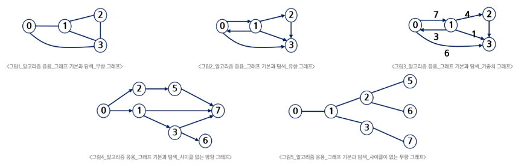
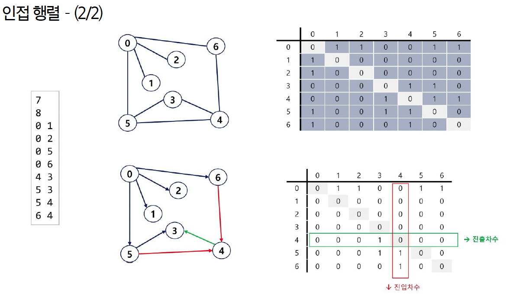
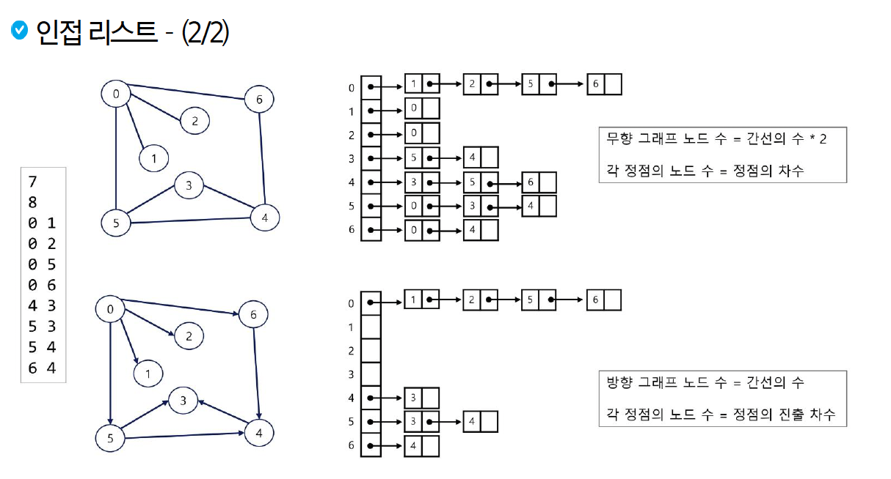

# 수업 필기

## 그래프 (Graph)

정점(vertex)과 그 정점을 연결하는 간선(edge)으로 구성된 자료구조

- 비선형
- M:N, 다대다 관계

### 용어

- 정점 (vertex / node): 데이터를 나타내는 지점
- 간선 (edge / link): 연결관계
- 인접 (adjacency): 두 정점이 간선으로 직접 연결된 상태
- 차수 (degree): 하나의 정점에 연결된 간선의 수
    - 방향 그래프에서는 진입 차수(in-degree)와 진출 차수(out-degree)로 구분
- 경로 (path): 한 정점에서 다른 정점으로 간선을 따라 이동할 수 있는 길
- 사이클 (cycle): 한 정점에서 출발하여 다시 자기 자신으로 돌아오는 경로

### 그래프의 종류



| 종류 | 설명 | 예시 |
| --- | --- | --- |
| **무향 그래프 (Undirected)** | 간선에 방향이 없어 양방향 이동 가능 | 친구 관계 (A와 B가 친구면, B와 A도 친구) |
| **유향 그래프 (Directed)** | 간선에 방향이 있어 한쪽으로만 이동 가능 | 웹페이지 링크 (A가 B로 링크해도, B는 A로 링크하지 않을 수 있음) |
| **가중치 그래프 (Weighted)** | 간선마다 비용(가중치)이 존재 | 도시 간 도로망 (도로마다 거리나 통행료가 다름) |
| **비순환 유향 그래프 (DAG)** | 방향이 있으면서 사이클은 없는 그래프 | 선수과목 구조 (자료구조를 들어야 알고리즘을 들을 수 있지만, 그 반대는 안됨) |
| 트리 | 사이클이 없는 무향 연결 그래프 |  |

## 그래프의 구현

### **1. 인접 행렬 (Adjacency Matrix)**



- V*V 크기의 2차원 배열을 통해, 정점 i와 j가 연결되어 있으면 `matrix[i][j] = 1`로 표시한다.
- 두 정점의 연결 여부를 $O(1)$에 빠르게 확인 가능
- 모든 정점 간 연결 정보를 저장하므로, 정점의 개수가 많아지면 메모리 낭비가 심하다. (`$O(V^2)$`)
    - 노드의 개수가 적거나, 그래프가 조밀(dense)할 때 사용하기 편리하다.

**코드 예시**

```python
# --- 그래프 구성 (인접 행렬) ---
# 정점과 간선의 개수를 입력 받기
V, E = map(int, input().split())

# 간선 정보를 리스트 하나로 입력 받기
edge_data = list(map(int, input().split()))

# 1. 빈 인접 행렬 만들기 
#    V+1 * V+1 크기의 2차원 리스트를 0으로 초기화
#    (0번 인덱스는 사용하지 않는다.)
adj_matrix = [[0] * (V + 1) for _ in range(V + 1)]

# 2. 간선 정보를 바탕으로 2개씩 짝지어서 인접 행렬에 표기
# 총 표기 회수는 간선의 개수(E)만큼
for i in range(E):
    # 정점의 번호르 저장 (인접 행렬의 인덱스 값으로 쓰임)
    n1, n2 = edge_data[i * 2], edge_data[i * 2 + 1]

    # 두 정점이 인접해있다는 것을 1로 표기
    adj_matrix[n1][n2] = 1
    # 무향 그래프이므로, 반대 방향도 연결되었음을 표기
    adj_matrix[n2][n1] = 1
```

```python
"""
7 8
1 2 1 3 2 4 2 5 4 6 5 6 6 7 3 7
"""

# --- 결과 확인 ---
[[0, 0, 0, 0, 0, 0, 0, 0],
 [0, 0, 1, 1, 0, 0, 0, 0],
 [0, 1, 0, 0, 1, 1, 0, 0],
 [0, 1, 0, 0, 0, 0, 0, 1],
 [0, 0, 1, 0, 0, 0, 1, 0],
 [0, 0, 1, 0, 0, 0, 1, 0],
 [0, 0, 0, 0, 1, 1, 0, 1],
 [0, 0, 0, 1, 0, 0, 1, 0]]
```

### **2. 인접 리스트 (Adjacency List) - 추천**



- 각 정점마다 해당 정점과 연결된 다른 정점들의 목록을 리스트로 저장한다.
    - 딕셔너리 예시: `adj_list1 = { 1: [2, 3], .. , }`
    - 리스트 예시: `adj_list2 = [ [], [2, 3], .. ]` (0번 인덱스는 사용하지 않는다.)
- 존재하는 간선의 정보만 저장하므로, 메모리 사용이 효율적이다. (`$O(V+E)$`)
    - 노드의 개수가 많지만 간선이 상대적으로 드문(sparse) 그래프에서 공간 절약 가능
- 두 정점의 연결 여부를 확인하려면 리스트를 탐색해야 하므로 인접 행렬보다 느릴 수 있다.

**코드 예시**

```python
# --- 그래프 구성 (인접 리스트) ---
# 정점과 간선의 개수를 입력 받기
V, E = map(int, input().split())

# 간선 정보를 리스트 하나로 입력 받기
edge_data = list(map(int, input().split()))

# V+1개의 빈 리스트를 가지는 리스트를 생성
adj_list = [[] for _ in range(V + 1)]
# pprint(adj_list)  # [[], [], [], [], [], [], [], []]

# 간선의 개수(E)만큼 반복하면서 2개씩 짝지어서 표기
for i in range(E):
    # 두 정점을 저장 (n1과 n2는 서로 인접한 두 정점을 의미)
    n1, n2 = edge_data[i * 2], edge_data[i * 2 + 1]
    
    # 정점 n1번 리스트에 n2 정점을 추가
    adj_list[n1].append(n2)
    # 무향 그래프이므로, 정점 n2번 리스트에도 n1 정점을 추가
    adj_list[n2].append(n1)
```

```python
"""
7 8
1 2 1 3 2 4 2 5 4 6 5 6 6 7 3 7
"""

# --- 결과 확인 ---
[[], [2, 3], [1, 4, 5], [1, 7], [2, 6], [2, 6], [4, 5, 7], [6, 3]]
```

### **3. (가중치 그래프) 간선 리스트 (Edge List)**

- 그래프의 모든 간선 정보를 `(출발 정점, 도착 정점, 가중치)` 형태의 튜플이나 리스트로 만들어, 하나의 큰 리스트에 모두 저장한다.
- **크루스칼(Kruskal)**이나 **프림(Prim)** 알고리즘처럼, 간선을 가중치 순서로 정렬하고 처리하는 **최소 신장 트리(MST)** 문제 등 특정 알고리즘에서 매우 유용하게 사용

```python
# (정점1, 정점2, 가중치) 형태의 튜플을 요소로 갖는 리스트
edges = [
    (1, 2, 3),  # 1번과 2번 정점이 가중치 3인 간선으로 연결됨
    (1, 3, 7),
    (2, 4, 5),
    (2, 5, 2),
    (3, 7, 8),
    (4, 6, 4),
    (5, 6, 6),
    (6, 7, 9),
]

# 가중치를 기준으로 간선들을 정렬할 때 편리
edges.sort(key=lambda x: x[2])
```

## 그래프의 탐색 (Graph Traversal)

그래프는 비선형 구조이기 때문에, 정점들을 빠짐없이 방문하기 위해 탐색(순회) 알고리즘이 필요하다.

- **DFS (깊이 우선 탐색, Depth-First Search)**
    - **전략:** 한 길을 최대한 깊게 파고드는 방식
    - **특징:** 재귀 또는 스택(Stack)을 사용하여 구현

- **BFS (너비 우선 탐색, Breadth-First Search)**
    - **전략:** 가까운 곳부터 점차 넓혀나가는 방식
    - **특징:** 큐(Queue)를 사용하여 구현