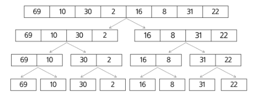
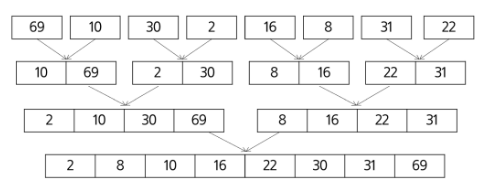

## 병합 정렬 (Merge Sort)

여러 개의 정렬된 자료의 집합을 병합하여 한 개의 정렬된 집합으로 만드는 정렬 방식

- top-down 방식
- **시간 복잡도**: **`$O(NlogN)$`**
    - 데이터를 계속 절반으로 나누는 과정이 `$O(logN)$` 만큼 걸리고, 각 단계에서 모든 데이터를 한 번씩 비교하며 병합하므로 `$O(N)$`이 걸린다.
- **공간 복잡도**: **`$O(N)$`**
    - 병합 과정에서 정렬된 결과를 담을 추가적인 배열이 필요하다.
- **안정 정렬 (Stable Sort)**
    - 값이 같은 원소들의 상대적인 순서가 정렬 후에도 유지된다.

### 병합 정렬의 단계

1. **분할 (Divide)**: 배열의 길이가 1이 될 때까지 계속해서 절반으로 나눈다.



2. **정복 및 병합 (Conquer & Merge)**: 길이가 1인 배열들은 이미 정렬된 상태. 이제 이들을 정렬하면서 다시 합쳐(병합) 올라온다.



**코드 구현 예시**

```python
def merge(left_arr, right_arr):
    """
    이미 정렬된 두 배열(left_arr, right_arr)을
    하나의 정렬된 배열로 '병합'하는 함수.
    """
    merged_arr = []
    # 두 배열을 가리킬 포인터(인덱스) 초기화
    left_idx, right_idx = 0, 0

    # 두 배열 중 하나라도 원소가 남아있는 동안 반복
    while left_idx < len(left_arr) and right_idx < len(right_arr):
        # 왼쪽 배열의 값이 더 작거나 같으면, 결과에 추가하고 왼쪽 포인터 이동
        if left_arr[left_idx] <= right_arr[right_idx]:
            merged_arr.append(left_arr[left_idx])
            left_idx += 1
        # 오른쪽 배열의 값이 더 작으면, 결과에 추가하고 오른쪽 포인터 이동
        else:
            merged_arr.append(right_arr[right_idx])
            right_idx += 1

    # 위 루프가 끝난 후, 아직 남아있는 원소들을 결과 뒤에 그대로 붙여줌
    # (한쪽 배열은 이미 모든 원소가 소진되었으므로, 둘 중 하나만 실행됨)
    merged_arr.extend(left_arr[left_idx:])
    merged_arr.extend(right_arr[right_idx:])

    return merged_arr

def merge_sort(arr):
    """
    병합 정렬을 재귀적으로 구현하는 '매니저' 함수.
    """
    # 기저 조건(Base Case): 배열의 길이가 1 이하면 이미 정렬된 상태이므로 그대로 반환
    if len(arr) <= 1:
        return arr

    # 1. 분할 (Divide): 배열을 절반으로 나눔
    mid = len(arr) // 2
    left_half = arr[:mid]
    right_half = arr[mid:]

    # 2. 정복 (Conquer): 각 절반을 재귀적으로 정렬
    # left_half와 right_half는 결국 정렬된 상태로 반환됨
    left_sorted = merge_sort(left_half)
    right_sorted = merge_sort(right_half)

    # 3. 통합 (Combine): 정렬된 두 부분을 병합하여 반환
    return merge(left_sorted, right_sorted)

```

```python
# --- 실행 코드 ---
data_array = [69, 10, 30, 2, 16, 8, 31, 22]
print(f"정렬 전: {data_array}")

sorted_array = merge_sort(data_array)
print(f"정렬 후: {sorted_array}")
```

```
정렬 전: [69, 10, 30, 2, 16, 8, 31, 22]
정렬 후: [2, 8, 10, 16, 22, 30, 31, 69]
```