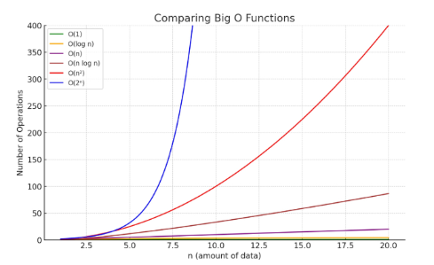

## 문제를 풀 때 어떤 순서로 풀까

1. 문제 이해
2. 설계 & 검증
    1. 설계: 자료구조, 알고리즘을 선택
    2. 시간, 공간 복잡도 → 검증
    - 1초당 3,000만 번으로 계산
3. 구현

### 시간 복잡도: 빅-오 표기법

| O(1) | 상수 시간 |
| --- | --- |
| O(logn) | 로그(대수) 시간 |
| O(n) | 선형 시간 |
| O(nlogn) | 로그 선형 시간 |
| O(n^2) | 제곱 시간 |



### 표준 입출력: `input.txt`

```jsx
import sys
sys.stdin = open("input.txt", "r")
```

- 시스템상 복사의 문제점 발견 가능
- 여러 가지 TC를 만들면서 테스트 가능
- 디버깅할 때도 TC와 output을 보면서 할 수 있다.

## 진법

### 2진수, 8진수, 10진수, 16진수

| 진수 | 계산기 사용 | 수의 표현 |
| --- | --- | --- |
| 2진수 | BIN | 0, 1 |
| 8진수 | OCT | 0 ~7 |
| 10진수 | DEC | 0 ~ 9 |
| 16진수 | HEX | 0 ~ 9, A ~ F |

### 진법 변환

**1. 다른 진법 문자열** ➡️ **10진수 정수**

 `int()`

- **`int(string, base)`**: `base` 진법으로 표현된 `string`을 10진수 정수로 변환합니다.
    
    ```python
    # 2진수 '1101'을 10진수로
    
    decimal_from_binary = int('1101', 2)
    print(decimal_from_binary)  # 13
    ```
    
    ```python
    # 16진수 'A7'을 10진수로 (접두어 '0x'는 있어도 되고 없어도 됨)
    
    decimal_from_hex = int('A7', 16)
    print(decimal_from_hex)     # 167
    print(int('0xA7', 16))      # 167
    ```
    
    ```python
    # 8진수 '15'를 10진수로
    
    decimal_from_octal = int('15', 8)
    print(decimal_from_octal)   # 13
    ```
    

**2. 10진수 정수** ➡️ **다른 진법 문자열**

- 원하는 진법의 수로 나눈 뒤, 나머지를 거꾸로 읽는다.

`bin` / `hex` / `oct`

- **`bin(number)`**: 10진수를 `0b` 접두어가 붙은 2진수 문자열로 변환합니다.
- **`hex(number)`**: 10진수를 `0x` 접두어가 붙은 16진수 문자열로 변환합니다.
- **`oct(number)`**: 10진수를 `0o` 접두어가 붙은 8진수 문자열로 변환합니다.
    
    ```python
    num = 167
    
    # 10진수 167을 각 진법으로 변환
    print(bin(num))  # '0b10100111'
    print(hex(num))  # '0xa7'
    print(oct(num))  # '0o247'
    ```
    
    ```python
    # 접두어를 제거하고 싶다면 슬라이싱을 활용
    print(bin(num)[2:]) # '10100111'
    ```
    

`format()`

- **`format(number, 'b/o/x')`**: **접두어 없이 순수한 진법 문자열**을 얻고 싶거나, **자릿수를 맞추고 싶을 때** 매우 유용합니다.
    
    ```python
    num = 13
    
    # 접두어 없는 순수한 진법 문자열
    print(format(num, 'b'))  # '1101'
    print(format(num, 'x'))  # 'd' (소문자)
    print(format(num, 'X'))  # 'D' (대문자)
    ```
    
    ```python
    # 8자리 2진수로 표현하고, 남는 공간은 0으로 채우기
    print(format(num, '08b')) # '00001101'
    ```
    

**3. 10진수 거쳐가기**
- **16진수 'A7'** ➡️ **10진수** ➡️ **2진수 변환 과정 예시**
    
    ```python
    # 1. 16진수 문자열 'A7'을 10진수 정수로 변환
    decimal_value = int('A7', 16)  # 167
    
    # 2. 10진수 정수 167을 2진수 문자열로 변환
    binary_string = bin(decimal_value)
    
    print(binary_string)      # '0b10100111'
    print(binary_string[2:])  # '10100111'
    ```