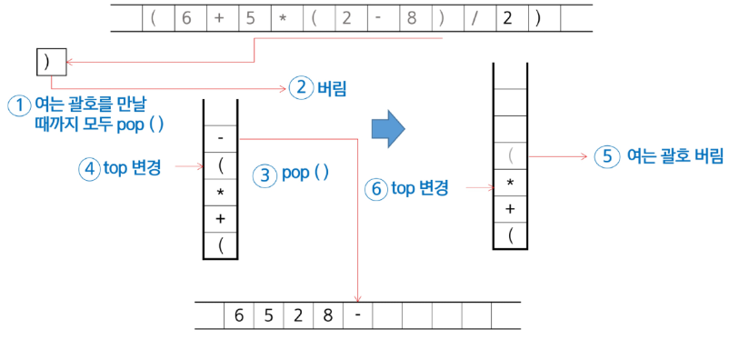
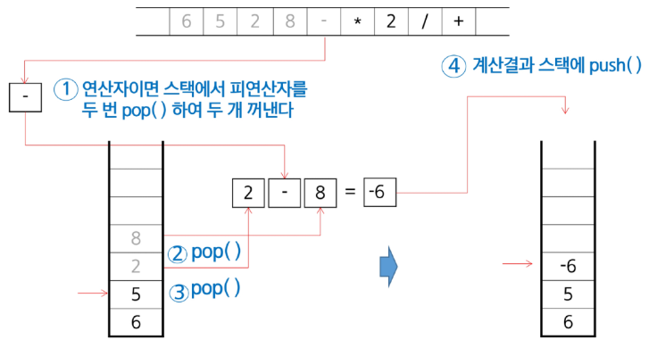

# 수업 필기

## 후위 표기법 (Postfix Notation)

### **연산자 우선순위**

- `isp` (In-Stack Priority)
    - 스택 안에 있는 연산자의 우선순위
- `icp` (In-Coming Priority)
    - 새로 들어오는(아직 스택에 push되지 않은) 연산자의 우선순위
    
    (숫자가 클수록 우선 순위가 높다)
    | 토큰 | isp | icp | 특징 |
    | --- | --- | --- | --- |
    | `(` | 0 | 4 | 스택 안에 있으면 우선순위를 가장 낮게, 
    **새로 들어오면(스택 밖) 가장 높게** |
    | `^` | 3 | 4 | 거듭제곱은 오른쪽 결합성을 고려해 icp를 더 높게 설정(옵션) |
    | `*` `/` | 2 | 2 |  |
    | `+` `-` | 1 | 1 |  |
    - `)` 는 특별 취급
        - 왼쪽 괄호 `‘(’`를 만나기 전까지 pop
    - 거듭제곱(`^`)은 오른쪽 결합성을 반영하기 위해, icp를 isp보다 **1 크게** 설정
        - 이미 스택 안에 `^`가 있어도, 같은 우선순위의 `^`가 들어오는 경우 pop하지 않고 push 함(오른쪽 결합성)

### 중위 표기법 → 후위 표기법 변환 (Stack 이용)



**알고리즘 개요**

1. 중위 표현식을 입력 받으면서 시작
2. **피연산자**(숫자, 변수 등)는 바로 출력(후위 표기법 결과에 추가)
3. **왼쪽 괄호**(`(`)는 무조건 스택에 push.
4. **오른쪽 괄호**(`)`)는 **왼쪽 괄호를 만나기 전까지** 스택에서 pop하여 출력. 
    - 단, 왼쪽 괄호(`(`)도 pop하되 출력은 하지 않음.
5. **연산자**(`+, -, *, /, ^` 등)는 스택의 top의 요소(isp)와 본인(icp)의 **우선순위**를 비교하여
    - 스택 top의 연산자가 현재 연산자보다 우선순위가 높거나 같으면(`isp ≥ icp`), 낮아질 때까지 스택에서 pop하여 출력.
    - 그렇지 않으면(본인 우선순위가 더 높다면, isp < icp) 스택에 push.
6. 모든 입력(중위 표기식)을 처리한 후, 스택에 남은 연산자를 모두 pop하여 출력.

**코드 예시**
```python
def infix_to_postfix(expression):
    # 딕셔너리 활용
    # precedence: 각 연산자의 우선순위를 딕셔너리로 정의
    precedence = {
        '+': 1,
        '-': 1,
        '*': 2,
        '/': 2,
    }

    # stack: 연산자를 임시로 저장할 스택 정의
    stack = []
    # result: 최종 후위 표기법 결과를 담을 리스트 정의
    result = []

    # 입력된 중위 표기법 식(expression)을 토큰 단위로 순회
    for token in expression:
        # 1. 피연산자(숫자, 문자)인 경우
        if token.isalnum():
            # 바로 결과 리스트에 추가
            result.append(token)

        # 2. 여는 괄호 '('인 경우
        elif token == '(':
            # 우선순위와 상관없이 무조건 스택에 push
            stack.append(token)

        # 3. 닫는 괄호 ')'인 경우
        elif token == ')':
            # 스택 top이 여는 괄호가 될 때까지 모든 연산자를 pop하여 결과에 추가
            # (스택이 비어있지 않고, top이 여는 괄호가 아닌 동안 반복)
            while stack and stack[-1] != '(':
                result.append(stack.pop())
            # 반복이 끝나면 스택 top은 '('이므로, 이를 pop하여 버림
            stack.pop()
        
        # 4. 연산자인 경우
        else:
            # 스택 top의 연산자 우선순위(isp)와 현재 연산자(token)의 우선순위(icp) 비교
            # isp가 icp보다 높거나 같으면 계속 pop하여 결과에 추가
            # (스택이 비어있지 않고, top이 여는 괄호가 아니며, isp가 icp보다 높거나 같은 동안 반복)
            while (
                stack
                and stack[-1] != '('
                and precedence.get(stack[-1], 0) >= precedence.get(token, 0)
            ):
                result.append(stack.pop())
            # 위 조건을 만족하지 않으면 (token보다 우선순위가 낮은 연산자를 만나면)
            # 현재 연산자(token)를 스택에 push
            stack.append(token)

    # 모든 토큰 처리가 끝난 후 스택에 남아있는 연산자 처리
    # (스택에 남아있는 값이 없을 때까지 반복)
    while stack:
        # 스택의 모든 연산자를 pop하여 결과에 추가
        result.append(stack.pop())

    # 결과 리스트에 있는 모든 요소를 하나의 문자열로 변환
    return ''.join(result)
```

### 후위 표기법 연산



**알고리즘 개요**

1. **후위 표기법 식**을 왼쪽부터 순회
2. **피연산자**(숫자 등)를 만나면 스택에 push
3. **연산자**를 만나면
    1. 스택에서 피연산자 두 개(또는 필요한 개수)를 pop하고, 먼저 꺼낸 피연산자는 오른쪽에 위치
    2. 해당 연산을 수행한 결과를 다시 스택에 push
4. 식이 끝나면, 스택에 하나 남은 값이 결과 값.

**코드 예시**

```python
def evaluate_postfix(expression):
    """
    후위 표기법으로 표현된 수식을 계산하여 결과를 반환하는 함수.

    Args:
        expression (str): 후위 표기법으로 작성된 문자열 (예: "53+2*")

    Returns:
        int or float: 수식의 최종 계산 결과
    """
    # stack: 피연산자를 임시로 저장할 스택
    stack = []

    # 후위표기법 수식을 왼쪽부터 순회
    for token in expression:
        # 1. 피연산자(숫자)인 경우
        if token.isdigit():
            # 스택에 push (문자를 정수로 변환)
            stack.append(int(token))

        # 2. 연산자인 경우
        else:
            # 스택에서 피연산자 2개를 pop
            # (중요) 먼저 꺼낸 피연산자가 연산의 오른쪽에 위치
            right = stack.pop()  # 두 번째 피연산자
            left = stack.pop()  # 첫 번째 피연산자
            
            # 토큰에 따라 적절한 연산을 수행
            if token == '+':
                result = left + right
            elif token == '-':
                result = left - right
            elif token == '*':
                result = left * right
            elif token == '/':
                # 나누기의 경우 0으로 나누는 상황(ZeroDivisionError)을 고려할 수도 있음 (여기서는 생략)
                result = left / right
            elif token == '^':
                result = left ** right
            else:
                # 정의되지 않은 연산자가 들어올 경우 처리
                raise ValueError('잘못된 연산자입니다.')
            
            # 연산을 수행한 결과(result)를 다시 스택에 push
            stack.append(result)

    # 모든 연산이 끝난 후, 스택에 마지막으로 남은 값 하나가 최종 결과
    return stack.pop()

```

### **실제 구현 시 고려사항**

1. 여러 자리 숫자 처리
    - 실제 구현에서는 `'12 3 +'`처럼 피연산자를 공백으로 구분하고, `.split()`을 이용해 토큰 리스트로 만들어 처리해야 함
2. 연산자 확장 및 결합성
    - 거듭제곱(`^`)처럼 오른쪽부터 연산하는 '오른쪽 결합성' 연산자를 추가할 경우, 우선순위 비교 규칙(isp, icp)을 더 정교하게 조정해야 함
3. 예외 처리 (Error Handling)
    - `'5 3 * +'`처럼 피연산자가 부족한 경우, `'/ 0'` 처럼 0으로 나누는 경우, 혹은 `'A B C'`처럼 유효하지 않은 토큰이 포함된 경우에 대한 오류 처리 로직이 반드시 필요