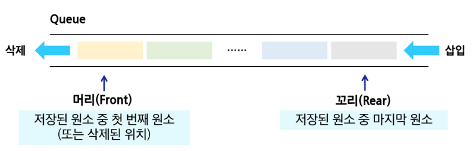
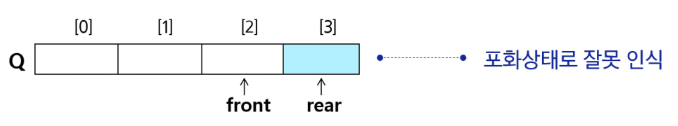
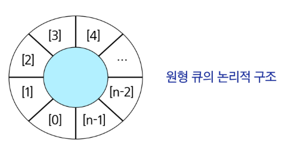

# 스스로 학습
## [선형 큐의 문제점: False Full]

### 포화 상태의 판단 기준

**질문**. `is_full()` 판단할 때, rear를 기준으로 하면 false full(가짜 포화상태) 문제가 발생한다. 그렇다면, `get_size() == capacity` 를 기준으로 하면 해결되지 않을까? 포화상태를 판단할 때 요소의 개수를 활용하지 않는 이유가 따로 있는가?

`get_size() == capacity`를 기준으로 포화 상태를 판단하면 False Full 문제는 해결할 수 있다. 하지만 큐의 효율적인 동작을 위해서는 $O(1)$의 시간 복잡도로 포화 상태를 판단하는 '원형 큐'를 구현하는 것이 더 낫다.

요소의 개수를 기준으로 포화 상태를 판단하지 않는 이유:
1. `get_size()`의 비효율성
2. 순환 큐(Circular Queue)의 필요성
3. 구조적 의미

<br><br>


# 수업 필기
## 큐 (Queue)

### 큐의 구조

먼저 들어온 데이터가 먼저 나가는 **선형** 자료구조

- **선입선출(FIFO**, First-In First-Out): 큐의 뒤에서는 삽입만 하고, 앞에서는 삭제만 이루어지는 구조



- `Front`: 저장된 원소 중 첫 번째 원소 (또는 삭제된 위치), dequeue
- `Rear`: 저장된 원소 중 마지막 원소, enqueue

### 큐의 기본 연산

| 연산 | 기능 | front, rear 변화 |
| --- | --- | --- |
| `enqueue(item)` | 큐의 뒤쪽(rear 다음)에 원소를 삽입 | `rear += 1` |
| `dequeue()` | 큐의 앞쪽(front)에서 원소를 삭제하고 반환 | `front += 1` |
| `create_queue()` | 공백 상태의 큐를 생성 | `front = rear = -1` |
| `is_empty()` | 큐가 공백 상태인지 확인 | `front == rear` |
| `is_full()` | 큐가 포화 상태인지 확인 | `rear == N - 1` |
| `qpeek()` | 큐의 앞쪽(front)에서 원소를 삭제 없이 반환 |  |
| `get_size()`  | 큐에 들어 있는 요소의 개수를 확인 |  |

## 선형 큐 (Linear Queue)

데이터를 일렬로 저장하며, 앞에서 꺼내고 뒤에 넣는 기본 큐 구조

- 배열이나 연결형 리스트로 구현할 수 있다.
- 초기 상태: `front = rear = -1`
- 공백 상태: `front == rear`
- 포화 상태: `rear == N - 1`

### front, rear 포인터를 이용한 구현

```python
class Queue:
    def __init__(self, capacity=10):
        # 큐의 최대 용량 설정
        self.capacity = capacity
        # 큐를 저장할 리스트 초기화
        self.items = [None] * capacity
        # 큐의 맨 앞 요소의 인덱스 (초기 값은 -1)
        self.front = -1
        # 큐의 맨 뒤 요소의 인덱스 (초기 값은 -1)
        self.rear = -1

    def is_empty(self):
        # front와 rear가 같으면 큐가 비어있음
        return self.front == self.rear

    def is_full(self):
        # rear가 큐의 마지막 인덱스(N-1)에 도달하면 큐가 가득 참
        return self.rear == self.capacity - 1

    def enqueue(self, item):
        # 삽입하기 전에 큐가 가득 찼는지 확인한다.
        if self.is_full():
            raise IndexError("큐가 가득 찼습니다.")
        # 포인터를 먼저 이동하고, 이동한 위치에 값을 추가한다.
        self.rear += 1
        self.items[self.rear] = item

    def dequeue(self):
        # 삭제하기 전에 큐가 비어 있는지 확인한다.
        if self.is_empty():
            raise IndexError("큐가 비었습니다.")
        # front가 가리키는 인덱스를 1 증가
        self.front += 1
        # front가 위치한 항목을 우선 변수에 담아둔다.
        item = self.items[self.front]
        # 해당 위치를 None으로 변경한다.(제거)
        self.items[self.front] = None
        return item  # front가 이동한 위치에 있던 기존 데이터 반환

    def peek(self):
        # 큐가 비어 있는지 확인한다.
        if self.is_empty():
            raise IndexError("큐가 비었습니다.")
        # 현재 큐의 맨 앞 요소를 반환(삭제하지 않는다.)
        return self.items[self.front + 1]

    def get_size(self):
        # 현재 큐에 있는 항목의 개수 계산
        # 두 개의 포인터의 차가 곧 요소의 개수
        return self.rear - self.front
```

```python
# --- 기본 동작 예시 코드 ---
print("--- 1. 기본 동작 확인 ---")
queue = Queue(5)  # 용량이 5인 큐 생성

# 1. Enqueue (데이터 삽입)
queue.enqueue(10)
queue.enqueue(20)
queue.enqueue(30)

print(f"큐의 현재 크기: {queue.get_size()}")  # 3
print(f"큐의 맨 앞 데이터 확인(peek): {queue.peek()}")  # 10
print(f"큐 내부 리스트 상태: {queue.items}\n")  # [10, 20, 30, None, None]

# 2. Dequeue (데이터 추출)
# 가장 먼저 넣은 10이 가장 먼저 나옴 (FIFO)
print(f"Dequeue: {queue.dequeue()}")  # 10
print(f"큐의 현재 크기: {queue.get_size()}")  # 2
print(f"큐의 맨 앞 데이터 확인(peek): {queue.peek()}")  # 20
print(f"큐 내부 리스트 상태: {queue.items}")  # [None, 20, 30, None, None]
```

### 적용 예시

```python
# 1. 공백 큐 생성
create_queue()  # Q = [None, None, None], front = rear = -1

# 2. 원소 A 삽입
enqueue(A)  # Q = [A, None, None], front = -1, rear = 0

# 3. 원소 B 삽입
enqueue(B)  # Q = [A, B, None], front = -1, rear = 1

# 4. 원소 반환/삭제
dequeue()  # Q = [None, B, None], front = 0, rear = 1

# 5. 원소 C 삽입
enqueue(C)  # Q = [None, B, C], front = 0, rear = 2

# 6. 원소 반환/삭제
dequeue()  # Q = [None, None, C], front = 1, rear = 2

# 7. 원소 반환/삭제
dequeue()  # Q = [None, None, None], front = 2, rear = 2
```

### 선형 큐의 문제점: False Full



- 배열 앞부분에 활용할 수 있는 공간이 있음에도 불구하고 포화상태(`rear == n-1`)로 인식하여 더 이상 삽입을 수행하지 않는다.
    
    ⇒ 원형 큐의 등장


## 원형 큐 (Circular Queue)

선형 큐의 문제점(잘못된 포화상태 인식)을 해결하기 위해 도입된, 배열의 처음과 끝이 연결된 큐 구조



- 배열의 처음과 끝이 논리적으로 연결되어 있다고 가정하고, **'원'처럼 공간을 순환하며 사용한다.**
- 공백 상태와 포화 상태 구분을 쉽게 하기 위해 `front`가 있는 자리는 사용하지 않고 **항상 비워둔다.**
    - 용량: `N`개의 데이터를 저장하고 싶다면, 실제 배열의 크기는 `N+1`로 만든다.
    - **공백 상태 (Empty):** `front`와 `rear` 포인터가 같은 위치를 가리킬 때
    - **포화 상태 (Full):** `rear` 포인터의 바로 다음 위치가 `front`일 때, 즉 `(rear + 1) % capacity == front` 일 때
- 배열의 순환을 위해 인덱스는 **나머지 연산자 `% (mod)`**를 사용하여 표기한다.
    - `rear = (rear + 1) % n` , `front = (front + 1) % n`
- BFS(너비 우선 탐색) 구현에 사용된다.

### 구현

```python
class CircularQueue:
    """
    고정 크기 리스트를 사용하여 원형 큐를 구현한 클래스입니다.
    front와 rear 포인터를 이용해 삽입과 삭제 연산을 O(1) 시간 복잡도로 수행합니다.
    """

    def __init__(self, capacity):
        """
        큐를 초기화합니다.
        capacity: 큐에 저장할 수 있는 최대 원소의 수
        """
        # [핵심] 큐가 비어있는 상태(front == rear)와 가득 찬 상태를 구분하기 위해
        # 요청된 용량(capacity)보다 1 크게 실제 리스트를 생성합니다.
        self.capacity = capacity + 1
        self.items = [None] * self.capacity
        self.front = 0
        self.rear = 0

    def is_empty(self):
        """큐가 비어있는지 확인합니다."""
        # front와 rear 포인터가 같은 위치를 가리키면 큐는 비어있습니다.
        return self.front == self.rear

    def is_full(self):
        """큐가 가득 찼는지 확인합니다."""
        # rear 포인터의 다음 위치가 front와 같다면, 큐는 가득 찬 것입니다.
        # 모듈러(%) 연산을 통해 리스트의 끝과 처음이 연결된 것처럼 동작합니다.
        return (self.rear + 1) % self.capacity == self.front

    def enqueue(self, item):
        """큐의 맨 뒤(rear)에 데이터를 추가합니다."""
        if self.is_full():
            # is_full()이 True이면, 예외를 발생시켜 프로그램에 오류를 알립니다.
            raise IndexError("Queue is full")

        # rear 포인터를 시계방향으로 한 칸 이동시킵니다.
        self.rear = (self.rear + 1) % self.capacity
        # 새로운 rear 위치에 데이터를 삽입합니다.
        self.items[self.rear] = item

    def dequeue(self):
        """큐의 맨 앞(front)에서 데이터를 꺼냅니다."""
        if self.is_empty():
            # 큐가 비어있으면 꺼낼 데이터가 없으므로 예외를 발생시킵니다.
            raise IndexError("Queue is empty")

        # front 포인터를 시계방향으로 한 칸 이동시켜, 가장 오래된 데이터를 가리키게 합니다.
        self.front = (self.front + 1) % self.capacity
        # 해당 위치의 데이터를 item 변수에 저장합니다.
        item = self.items[self.front]
        # (선택사항) 해당 위치의 데이터를 None으로 초기화하여 메모리를 관리합니다.
        self.items[self.front] = None
        # 저장해 둔 데이터를 반환합니다.
        return item

    def peek(self):
        """큐의 맨 앞에 있는 데이터를 삭제하지 않고 확인합니다."""
        if self.is_empty():
            raise IndexError("Queue is empty")
        # front의 '다음' 위치가 큐의 실제 시작점이므로, 해당 위치의 항목을 반환합니다.
        return self.items[(self.front + 1) % self.capacity]

    def get_size(self):
        """현재 큐에 저장된 데이터의 개수를 반환합니다."""
        # rear가 front보다 뒤에 있을 때(일반적인 경우): rear - front
        # rear가 front보다 앞에 있을 때(순환한 경우): rear - front + capacity
        # 이 두 경우를 모듈러 연산을 통해 하나의 식으로 처리할 수 있습니다.
        return (self.rear - self.front + self.capacity) % self.capacity
```

```python
queue = CircularQueue(3)
queue.enqueue('A')
queue.enqueue('B')
print(queue.dequeue())  # A

queue.enqueue('C')
queue.enqueue('D')
print(queue.items)  # ['D', None, 'B', 'C']
print(queue.get_size())  # 3

queue.enqueue('Z')  # IndexError: Queue is full
```

### 적용 예시

```python
# 1. 원형 큐 생성
create_queue()  # cq = [None, None, None, None], front = rear = 0

# 2. 새로운 원소 A 삽입
enqueue(A)  # cq = [A, None, None, None], front = 0, rear = 1

# 3. 새로운 원소 B 삽입
enqueue(B)  # cq = [A, B, None, None], front = 0, rear = 2

# 4. 원소 삭제/반환
dequeue()  # cq = [None, B, None, None], front = 1, rear = 2

# 5. 새로운 원소 C 삽입
enqueue(C)  # cq = [None, B, C, None], front = 1, rear = 3

# 6. 새로운 원소 D 삽입
enqueue(D)  # cq = [None, B, C, D], front = 1, rear = 0
```


### 큐의 활용

- **버퍼 (Buffer)**
    - 데이터를 한 곳에서 다른 한 곳으로 전송하는 동안 일시적으로 그 데이터를 보관하는 메모리의 영역
    - 버퍼링(buffering): 버퍼를 활용하는 방식 또는 버퍼를 채우는 동작
    - 순서대로 입력/출력/전달되어야 하므로 **FIFO** 방식의 자료구조인 큐가 활용된다
- **BFS (너비 우선 탐색)**