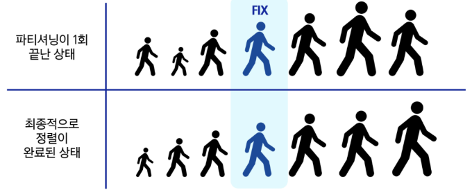

## 퀵 정렬 (Quick Sort)

기준값(pivot)을 중심으로 주어진 배열을 두 개로 분할하고, 각각을 정렬하여 전체 배열을 정렬하는 방식

- **시간 복잡도**
    - **평균: `$O(NlogN)$`**
        - 재귀의 깊이가 평균적으로 `$O(log N)$`이고, 각 깊이에서 `$O(N)$`의 비교를 수행한다.
    - **최악: `$O(N^2)$`**
        - 이미 정렬된 배열에서 항상 가장 크거나 작은 값을 피벗으로 선택하는 경우, 트리가 한쪽으로 치우쳐 분할이 비효율적으로 일어난다.
    - 데이터의 수가 많을수록 유리하다.
- **공간 복잡도**: **`$O(logN)$`**
    - 재귀 호출 스택의 깊이에 따라 공간이 필요하다.
- **제자리 정렬 (In-place Sort)**
    - 병합 정렬과 달리, 정렬 과정에서 추가적인 배열을 거의 사용하지 않아 메모리 면에서 효율적이다.

### 퀵 정렬의 단계 (Partitioning)

1. 작업 영역을 정한다.
2. Pivot(기준)을 설정한다.
    - Lomuto 파티션: **하나의 포인터(`j`)가 전체 배열을 순회**하며 피벗보다 작은 값들을 왼쪽으로 모으는 직관적인 방식
    - Hoare 파티션: **양쪽 끝에서 동시에 탐색**해오며 값을 교환하는 방식
3. Pivot을 기준으로
    1. 작은 수는 왼쪽에 배치한다.
    2. 큰 수는 오른쪽에 배치한다.

파티셔닝이 끝나고 Pivot의 위치는 확정된다. 최종적으로 정렬이 완료되었을 때에도 지금 위치 그대로 배정된다.



**슈도코드**

```python
def quickSort(A[], l, r):
		if l < r:
				s <- partition(A[], l, r)
				quickSort(A[], l, s - 1)
				quickSort(A[], s + 1, r)
```

### Lumoto 파티션

1. **피벗 선택:** 보통 배열의 **마지막 원소**를 피벗으로 설정한다.
2. **경계 포인터 설정:** 피벗보다 작은 값들의 경계를 나타낼 `i` 포인터를 `start - 1` 위치에 둔다.
3. **탐색 포인터 이동:** 
    - `j` 포인터가 `start`부터 `end - 1`(피벗 직전)까지 이동하며 다음을 반복한다.
    - 만약 `arr[j]`의 값이 **피벗보다 작다면**, `i`를 1 증가시킨 후 `arr[i]`와 `arr[j]`를 교환(swap)한다. 이 과정을 통해 `i`의 왼쪽에는 항상 피벗보다 작은 값들만 모이게 된다.
4. **피벗 교환:** 
    - 반복이 모두 끝나면, `i + 1` 위치가 피벗이 들어갈 최종 자리다.
    - `arr[i + 1]`과 피벗(`arr[end]`)을 교환한다.

**코드 구현**

```python
def partition(arr, start, end):
    """
    분할(Partition)을 담당하는 실무자 함수.
    - 가장 오른쪽 원소(arr[end])를 피벗으로 설정.
    - 피벗보다 작은 값들은 왼쪽으로, 큰 값들은 오른쪽으로 재배치.
    - 최종적으로 피벗이 있어야 할 올바른 위치의 인덱스를 반환.
    """
    # 피벗을 가장 오른쪽 원소로 설정
    pivot = arr[end]
    # 피벗보다 작은 원소들을 저장할 경계 인덱스 i
    i = start - 1

    # start부터 end-1까지 순회
    for j in range(start, end):
        # 현재 원소가 피벗보다 작으면,
        if arr[j] < pivot:
            # 작은 원소 그룹의 경계를 한 칸 오른쪽으로 이동
            i += 1
            # 경계(i)와 현재 원소(j)의 위치를 교환하여, 작은 원소를 왼쪽으로 보냄
            arr[i], arr[j] = arr[j], arr[i]

    # 모든 순회가 끝나면, i+1 위치가 피벗이 들어갈 자리.
    # 피벗(arr[end])과 경계 다음 위치(arr[i+1])의 값을 교환
    arr[i + 1], arr[end] = arr[end], arr[i + 1]

    # 피벗의 최종 위치 인덱스를 반환
    return i + 1

def quick_sort(arr, start, end):
    """
    퀵 정렬을 재귀적으로 지시하는 '매니저' 함수.
    """
    # 기저 조건: 정렬할 범위에 원소가 1개 이하일 때 (start >= end)
    if start < end:
        # 1. 분할: partition 함수를 호출하여 피벗의 최종 위치를 찾음
        pivot_idx = partition(arr, start, end)

        # 2. 정복 (재귀 호출)
        # 피벗을 기준으로 나뉜 왼쪽 부분을 재귀적으로 정렬
        quick_sort(arr, start, pivot_idx - 1)
        # 피벗을 기준으로 나뉜 오른쪽 부분을 재귀적으로 정렬
        quick_sort(arr, pivot_idx + 1, end)

# --- 실행 코드 ---
data_list = [3, 2, 4, 6, 9, 1, 8, 7, 5]
print(f"정렬 전: {data_list}")

quick_sort(data_list, 0, len(data_list) - 1)
print(f"정렬 후: {data_list}")

```

```
정렬 전: [3, 2, 4, 6, 9, 1, 8, 7, 5]
정렬 후: [1, 2, 3, 4, 5, 6, 7, 8, 9]
```

### Hoare 파티션

1. **피벗 선택:** 보통 배열의 **첫 번째 원소**를 피벗으로 설정한다.
2. **포인터 설정:** `left` 포인터는 배열의 시작에서, `right` 포인터는 배열의 끝에서 출발한다.
3. **포인터 이동:**
    - `left`는 피벗보다 **크거나 같은 값**을 만날 때까지 오른쪽으로 이동한다.
    - `right`는 피벗보다 **작거나 같은 값**을 만날 때까지 왼쪽으로 이동한다.
4. **교환 (Swap):**
    - 만약 `left`와 `right` 포인터가 아직 교차하지 않았다면(`left < right`), `arr[left]`와 `arr[right]`의 값을 교환한다.
    - 교차했다면(`left >= right`) 반복을 중단한다.
5. **피벗 교환:** 반복이 중단되면, **피벗(시작점)과 `arr[right]`의 값을 교환**한다. 이 `right` 인덱스가 이번 분할의 기준점이 된다.

**코드 구현**

```python
def partition_hoare(arr, start, end):
    """
    Hoare 파티션 방식
    - arr[start]를 피벗으로 사용
    - left, right 포인터가 교차할 때까지 값을 교환
    """
    pivot = arr[start]
    left = start + 1
    right = end

    while True:
        # left 포인터 이동: 피벗보다 큰 값을 찾을 때까지
        while left <= end and arr[left] < pivot:
            left += 1

        # right 포인터 이동: 피벗보다 작은 값을 찾을 때까지
        while left <= right and arr[right] > pivot:
            right -= 1

        # 포인터가 교차했다면 반복 종료
        if left > right:
            break

        # 교차 전이면 두 값의 위치를 교환
        arr[left], arr[right] = arr[right], arr[left]

    # 마지막으로 피벗과 right 포인터가 가리키는 값을 교환
    arr[start], arr[right] = arr[right], arr[start]

    # 피벗의 최종 위치인 right를 반환
    return right

def quick_sort_hoare(arr, start, end):
    if start < end:
        pivot_idx = partition_hoare(arr, start, end)

        # Hoare 파티션은 피벗의 왼쪽/오른쪽을 모두 포함하여 재귀 호출
        # (피벗이 최종 위치에 있다는 보장이 없기 때문)
        quick_sort_hoare(arr, start, pivot_idx - 1)
        quick_sort_hoare(arr, pivot_idx + 1, end)

# --- 실행 코드 ---
data_list = [3, 2, 4, 6, 9, 1, 8, 7, 5]
print(f"정렬 전: {data_list}")

quick_sort_hoare(data_list, 0, len(data_list) - 1)
print(f"정렬 후: {data_list}")

```

```
정렬 전: [3, 2, 4, 6, 9, 1, 8, 7, 5]
정렬 후: [1, 2, 3, 4, 5, 6, 7, 8, 9]
```

### **Lomuto vs. Hoare 파티션 비교**

| 구분 | **로무토 (Lomuto)** | **호어 (Hoare)** |
| --- | --- | --- |
| **피벗 (Pivot) 위치** | 주로 **마지막 원소** | 주로 **첫 번째 원소** |
| **핵심 동작** | 하나의 포인터(`j`)가 전체를 순회하며 피벗보다 작은 값들을 왼쪽으로 보냄 | 두 개의 포인터(`left`, `right`)가 **양 끝에서 중앙으로** 이동하며 교환 |
| **피벗의 최종 위치** | 파티션 종료 시, 피벗이 **자신의 최종 위치에 고정됨** | 파티션 종료 시, 피벗이 최종 위치에 있다고 **보장할 수 없음** |
| **재귀 호출 범위** | 피벗을 제외한 `[start, pivot-1]`, `[pivot+1, end]` | 피벗이 포함될 수 있는 `[start, pivot-1]`, `[pivot+1, end]` |
| **구현 난이도** | 코드가 더 단순하고 직관적 | 포인터 두 개를 제어해야 해서 조금 더 복잡함 |
| **성능** | Hoare 방식보다 비교 및 교환 횟수가 많은 경향이 있음 | **일반적으로 더 빠르고 효율적** (교환 횟수가 적음) |